# 02 Architektur

Dieses Kapitel beschreibt die Komponentenlandkarte einer DCS-Instanz:
welche Bausteine es gibt, welche Verantwortung sie tragen und wer mit wem
spricht. Die fachlichen Abläufe innerhalb der Komponenten behandeln die
Folgekapitel (03 bis 09), das Betriebsverhalten Kapitel 10, die
Installation der [Deployment-Leitfaden](../deployment-guide.md).

## Grundschnitt

Eine DCS-Instanz besteht aus drei selbst entwickelten Diensten
(**Backend**, **pdf-core**, **Frontend**) und einer Reihe von
Infrastruktur- und XFSC-Komponenten, die gemeinsam mit ihnen deployt
werden. Das Backend ist ein **modularer Monolith**: Alle Fachdomänen
laufen in einem Prozess und teilen sich eine PostgreSQL-Instanz, sind
aber über klare Modulgrenzen und einen internen Event-Bus (NATS,
CloudEvents) entkoppelt. Microservices sind es bewusst nicht. Die
Trennlinie zu eigenständigen Prozessen verläuft dort, wo eine andere
technische Verantwortung beginnt: Byte-Arbeit am PDF in pdf-core,
Orchestrierung und auslagerbare Prüfschritte in ORCE,
AdES-Signaturvalidierung in DSS.

Zwei Schnitte prägen die Architektur stärker als alles andere:

1. **Alle privaten Schlüssel der Instanz liegen im PKCS#11-Token, und nur
   das Backend greift darauf zu** (ADR-1). Jede Komponente, die eine
   Signatur braucht, holt sie über einen Backend-Endpunkt.
2. **Jedes dauerhaft gespeicherte Artefakt ist verschlüsselt, bevor es
   den Prozess verlässt** (ADR-28). Der Schlüssel ist an einen
   Löschbereich gebunden: pro Vertrag, pro Vorlage, oder instanzweit.

## Komponentenlandkarte

### Selbst entwickelte Dienste

| Komponente | Technologie | Verantwortung |
| --- | --- | --- |
| **Backend** | Go, Goa v3 (design-first) | Gesamte Fachlogik: Template- und Vertragslebenszyklus, Verhandlung, Signaturmanagement, Föderation, Audit-Trail, Authentifizierung, Semantic Hub, Schlüsselinventar. Bedient die HTTP-API |
| **pdf-core** | Go | Deterministischer PDF/A-3a-Compiler: JSON-LD zu byte-stabilem PDF mit eingebetteter kanonischer JSON-LD und C2PA-Provenance-Kette; Re-Rendering-Verifikation, inkrementelle Amendments, Provenance-Re-Anchor. Hält **kein** Schlüsselmaterial; C2PA-Signaturen werden per Callback vom Backend erzeugt |
| **Frontend** | Vue 3, Vite, Pinia | Browser-UI; spricht ausschließlich die Backend-API und wird von Login bis Signatur-Ceremony durch das Backend geführt. Wird vom Backend mit ausgeliefert |

Das Backend gliedert sich intern in Fachdomänen, die jeweils eine
API-Gruppe tragen: Template Repository, Contract Workflow Engine,
Signature Management, PDF Generation, Process Audit & Compliance,
Template Catalogue Integration, DCS-to-DCS (Föderation), Auth, Semantic
Hub, Contract Storage & Archive, Key Inventory sowie öffentliche
Auskunftsdienste (DID-Dokument, C2PA-Manifest-Store). Die vollständige
Endpunktübersicht liefert [Anhang A](anhang-a-schnittstellenreferenz.md).

### Fremd- und Infrastrukturkomponenten

| Komponente | Rolle im System |
| --- | --- |
| **PostgreSQL** | Transaktionale Persistenz aller Backend-Domänen (eine Datenbank, domänengetrennte Tabellen) plus separate Datenbanken für Hydra und den Federated Catalogue |
| **NATS** | Interner Event-Bus (CloudEvents). Trägt Domänenereignisse aus der transaktionalen Outbox an nachgelagerte Verbraucher: PDF-Regenerierung, Föderations-Versand, Webhook-Plattform, Auto-Deployment |
| **IPFS** (+ Document Manager) | Content-adressierter Speicher für alle Artefakte: Vertrags- und Vorlagen-PDFs, Archiv-Snapshots, Audit-Einträge, Checkpoints, Reports. Der Document Manager stellt eine mandantenfähige API davor. Das Backend legt dort ausschließlich Chiffrate ab |
| **Ory Hydra** | OAuth2/OIDC-Provider der Instanz. Stellt die Tokens aus, mit denen Frontend-Nutzer (nach OID4VP-Wallet-Login) und maschinelle Aufrufer die API aufrufen |
| **ORCE** | XFSC Orchestration Engine (Node-RED). Beherbergt die orchestrierbaren Randdienste: RFC-3161-TSA, Archiv-Notariat und Audit-Log-Senke, Trust-PDP, Checkpoint-Anker, Zielsystem-Anbindung, Event-Webhook-Verarbeitung, den externen Audit-Executor und die Workflow-Gate-Ausführung |
| **DSS** | EU Digital Signature Service (eSignature Building Block) als externer AdES-Validator. Ohne ihn nimmt der Signatur-Submit-Pfad keine Signatur an |
| **Federated Catalogue** (+ Keycloak, Fuseki, eigene PostgreSQL) | XFSC-Katalog, in dem freigegebene Templates als Self-Descriptions registriert und publiziert werden. Keycloak stellt die Service-Account-Tokens für den Katalogzugriff, Fuseki ist dessen Graph-Store |
| **Statuslist-Service** | XFSC Status List Service: führt den Widerrufsstatus der vom DCS ausgestellten Lifecycle-Credentials und wird außerdem bei jeder Credential-Prüfung konsultiert |
| **PKCS#11-Token (HSM)** | Hält sämtliche privaten Schlüssel der Instanz (DID-, VC-, OID4VP-JAR-, C2PA- und Schlüsselvereinbarungs-Schlüssel). Nur das Backend greift darauf zu |
| **Ingress** | Externe Erreichbarkeit der Instanz im Kubernetes-Deployment. Hinter ihm liegen die öffentlichen Auflösungspfade (DID-Dokument, Agreement Credential, C2PA-Manifeste) ebenso wie die authentifizierte API |

## Wer spricht mit wem

```mermaid
flowchart TB
    subgraph Aussen["Außenwelt"]
        Browser["Browser<br/>(Frontend, Vue 3)"]
        Wallet["EUDI / Test-Wallet<br/>(OID4VP)"]
        Peer["Peer-DCS-Instanz<br/>(andere Organisation)"]
        Verifier["Externe Verifier<br/>(did.json, C2PA-Manifest)"]
        Target["Contract Target System<br/>(Zielsystem)"]
    end

    subgraph Instanz["DCS-Instanz"]
        Backend["Backend<br/>(Go, modularer Monolith)"]
        PdfCore["pdf-core<br/>(deterministischer<br/>PDF/A-3a-Compiler)"]
        Hydra["Ory Hydra<br/>(OAuth2/OIDC)"]
        ORCE["ORCE (Node-RED)<br/>TSA · Notariat · Trust-PDP ·<br/>Audit-Executor · Workflow-Gates ·<br/>Zielsysteme · Webhooks"]
        DSS["DSS<br/>(AdES-Validator)"]
        FC["Federated Catalogue<br/>(+ Keycloak, Fuseki)"]
        SL["Statuslist-Service"]
        HSM[("PKCS#11 / HSM<br/>alle privaten Schlüssel")]
        PG[("PostgreSQL")]
        NATS[/"NATS<br/>(CloudEvents)"/]
        IPFS[("IPFS +<br/>Document Manager<br/>nur Chiffrate")]
    end

    Browser -->|"API (Bearer-Token)"| Backend
    Browser -.->|"OIDC-Flow"| Hydra
    Wallet -->|"Verifiable Presentation"| Backend
    Backend <-->|"Login/Consent, Client-Provisionierung,<br/>Token-Validierung"| Hydra
    Backend -->|"JSON-LD → PDF, Verify, Amend, Reanchor"| PdfCore
    PdfCore -->|"C2PA-Signatur-Callback"| Backend
    Backend --> HSM
    Backend --> PG
    Backend <--> NATS
    Backend -->|"verschlüsselte Artefakte"| IPFS
    Backend -->|"Zeitstempel, Notariat, Trust-PDP,<br/>Audit-Executor, Workflow-Gates"| ORCE
    Backend -->|"PAdES-/JAdES-Validierung"| DSS
    Backend -->|"Template-Self-Descriptions"| FC
    Backend -->|"Lifecycle-VC-Status"| SL
    Backend <-->|"POST /peer/contracts/pdf,<br/>POST /peer/contracts/erase"| Peer
    Verifier -->|"GET /.well-known/did.json,<br/>GET /c2pa/manifest/…"| Backend
    Backend -->|"Deployment des Vertrags"| Target
    Target -->|"Ack, Status, KPI-Callback"| Backend
```

### Die wichtigsten Beziehungen im Einzelnen

**Frontend → Backend.** Der Browser spricht ausschließlich die
Backend-API, authentifiziert per Hydra-Token. Der Login beginnt mit einer
OID4VP-Presentation-Anfrage (QR-Code oder Deep-Link an die Wallet). Nach
erfolgreicher Credential-Prüfung schließt das Backend den
Hydra-Login/Consent-Flow ab, und der Browser erhält seine OIDC-Session
(Kapitel 05).

**Backend ↔ pdf-core.** Das Backend erzeugt zu jeder relevanten
Vertragsänderung die JSON-LD-Repräsentation und lässt pdf-core daraus
das PDF/A-3a-Dokument kompilieren; eingehende Dokumente lässt es von
pdf-core verifizieren (Re-Rendering und Vergleich der Seiteninhalte).
Für die C2PA-Manifestsignatur ruft pdf-core seinerseits einen internen
Signatur-Endpunkt des Backends auf. pdf-core hält nie einen Signer, und
das Schlüsselmaterial verlässt den PKCS#11-Token nie.

**Backend intern: Outbox → Verankerung → NATS → Verbraucher.** Jede
fachliche Änderung schreibt ihr Domänenereignis in derselben Transaktion
in eine Outbox-Tabelle. Ein Hintergrundprozess publiziert die Ereignisse
auf NATS und verankert die audit-sichtbaren davon als
hash-verkettete, verschlüsselte Einträge in IPFS, gebündelt zu
zeitgestempelten Merkle-Checkpoints. Auf die publizierten Events
reagieren die PDF-Regenerierung, der Föderations-Versand, die
Webhook-Plattform und das Auto-Deployment (Kapitel 09 und 10).

**Backend ↔ Peer-Instanz (Föderation).** Zwischen Instanzen ist das
signierte PDF das Wire-Format: Es trägt die maschinenlesbare JSON-LD,
die C2PA-Provenance-Kette und etwaige Signaturen in sich. Versendet wird
in den Zuständen `OFFERED`, `NEGOTIATION`, `SIGNED` und `REVOKED`; eine
beiliegende JAdES macht die Sendung zur Signatur der Gegenseite. Der
Empfänger verifiziert den Absender über eine
did:web-Challenge-Response-Signatur und dessen Zertifikatskette,
konsultiert den Trust-PDP (fail-closed, ein- wie ausgehend) und baut
seine lokale Vertragskopie aus der eingebetteten JSON-LD auf. Interner
Workflow-Zustand, Tasks und RBAC überqueren die Instanzgrenze nicht;
jede Instanz führt ihren eigenen Prozess (Kapitel 08). Über denselben
Kanal läuft die Löschanforderung eines Vertrags. Fehlgeschlagene
Sendungen landen in einer Retry-Tabelle und werden periodisch erneut
versucht.

**Backend ↔ ORCE.** ORCE bündelt die orchestrierbaren Randdienste der
Instanz. Zwei davon sind harte Startabhängigkeiten, weil sie im Freigabe-
und Prüfpfad sitzen: der **Workflow-Gate-Executor**, der vor Angebot,
Einreichung, Freigabe, Signatur und Deployment über einen unveränderlichen
Vertragsschnappschuss entscheidet, und der **Audit-Executor**, der die
Auswertung eines Audit-Abrufs übernimmt. Daneben stellt ORCE die
RFC-3161-Zeitstempel, nimmt Archiv-Notariats- und Audit-Log-Meldungen
entgegen, beantwortet die Trust-PDP-Konsultationen der Föderation, holt
den Checkpoint-Head zur externen Verankerung ab und trägt die Flows für
Zielsystem-Übergabe und Event-Webhooks. Als Credential-Aussteller läuft
ORCE zusätzlich in eigenen Releases: einer je Instanz für die
Handlungsvollmacht (PoA), einer föderationsweit als dritter
Identitätsaussteller (PID, ADR-31).

**Backend ↔ Federated Catalogue / Statuslist.** Template-Publikation
läuft über Self-Descriptions gegen den Federated Catalogue
(Service-Account-Token aus dessen Keycloak; Trust-Modell in ADR-18). Ist
der Katalog konfiguriert, prüft das Backend beim Start seine
Erreichbarkeit funktional und synchronisiert die Katalog-Schemata; ein
konfigurierter, aber unerreichbarer Katalog verhindert den Start. Der
Statuslist-Service führt den Widerrufsstatus der Lifecycle-Credentials,
die die Instanz unter ihrer eigenen DID als Issuer ausstellt.

**Backend ↔ Zielsystem.** Ein vollständig signierter Vertrag wird an das
von ihm designierte Contract Target System übergeben. Dessen Bestätigung
kommt asynchron als Callback zurück und aktiviert den Vertrag. Das
Zielsystem authentifiziert sich dabei als sein eigener, ihm ausgestellter
OAuth2-Client (Kapitel 04 und 05).

**Öffentliche Auskunftsflächen.** Ohne Authentifizierung erreichbar
sind die Artefakte, die externe Verifier auflösen können müssen: das
DID-Dokument der Instanz (`/.well-known/did.json`), das
Föderations-Agreement-Credential und das Regelwerk, der
C2PA-Manifest-Store signierter Verträge (`/c2pa/manifest/{contract_did}`)
sowie die Semantic-Hub-Auflösungsendpunkte.

## Vertrauens- und Schlüsselarchitektur

Alle privaten Schlüssel der Instanz liegen in einem PKCS#11-Token, auf
den nur das Backend zugreift. Die Schlüssel sind nach Zweck getrennt:
Instanz-DID (did:web), VC-Ausstellung, OID4VP-Request-Signatur (JAR),
C2PA-Manifestsignatur und Schlüsselvereinbarung für die
Artefaktverschlüsselung. pdf-core, Frontend und alle Fremdkomponenten
sind gegenüber der Instanzidentität schlüssellos; wer eine Signatur
braucht, erhält sie über einen Backend-Endpunkt. Damit hat die Instanz
genau einen Ort, an dem Signaturerzeugung stattfindet, auditierbar und
HSM-gestützt (Details in Kapitel 05 und 06). Einen
Vertrags-Signaturschlüssel hält die Instanz bewusst nicht, den hält der
Signatar (Kapitel 06).

Die Vertrauensprüfung gegenüber Peers ruht auf unabhängigen Schichten:
Zertifikatskette der Peer-DID (regulatorischer Anker),
Challenge-Response-Signatur pro Request (Besitznachweis des privaten
did:web-Schlüssels), das Föderations-Trust-Gate aus Agreement-Credential
und lokalem Policy-Endpunkt (ADR-19) sowie die zweckgebundene Prüfung
der Handlungsvollmacht hinter jeder Signatur der Gegenseite (ADR-31).
Alle vier arbeiten fail-closed, in beide Richtungen (Kapitel 08).

## Betriebssicht

Alle Komponenten einer Instanz werden über ein gemeinsames Helm-Chart
deployt; zwei vollständige Instanzen lassen sich parallel betreiben, um
organisationsübergreifende Abläufe nachzustellen. Erforderliche externe
Abhängigkeiten prüft das Backend beim Start und schlägt hart fehl,
statt degradiert zu laufen. Betriebsverhalten, Probes und Signale
beschreibt [Kapitel 10](10-betrieb-und-monitoring.md); Installation,
Konfiguration und Upgrade der [Deployment-Leitfaden](../deployment-guide.md).
