# 02 Architektur

Dieses Kapitel beschreibt die Komponentenlandkarte einer DCS-Instanz:
welche Bausteine es gibt, welche Verantwortung sie tragen und wer mit wem
spricht. Die fachlichen Abläufe behandeln die Kapitel 03 bis 09, das
Betriebsverhalten Kapitel 10, die Installation der
[Deployment-Leitfaden](../deployment-guide.md).

## Grundschnitt

Eine DCS-Instanz besteht aus drei selbst entwickelten Diensten
(**Backend**, **pdf-core**, **Frontend**) und einer Reihe von
Infrastruktur- und XFSC-Komponenten im selben Deployment. Das Backend ist
ein **modularer Monolith**: Alle Fachdomänen laufen in einem Prozess,
teilen sich eine PostgreSQL-Instanz und sind über einen internen
Event-Bus (NATS, CloudEvents) entkoppelt. Eigene Prozesse existieren
dort, wo eine andere technische Verantwortung beginnt: Byte-Arbeit am PDF
in pdf-core, Orchestrierung und auslagerbare Prüfschritte in ORCE,
AdES-Signaturvalidierung in DSS.

Zwei Schnitte prägen die Architektur:

1. **Alle privaten Schlüssel der Instanz liegen im PKCS#11-Token, und nur
   das Backend greift darauf zu** (ADR-1). Wer eine Signatur braucht,
   erhält sie vom Backend.
2. **Jedes dauerhaft gespeicherte Artefakt ist verschlüsselt, bevor es
   den Prozess verlässt** (ADR-28). Der Schlüssel ist an einen
   Löschbereich gebunden: pro Vertrag, pro Vorlage oder instanzweit.

## Komponentenlandkarte

### Selbst entwickelte Dienste

| Komponente | Technologie | Verantwortung |
| --- | --- | --- |
| **Backend** | Go, Goa v3 (design-first) | Gesamte Fachlogik: Template- und Vertragslebenszyklus, Verhandlung, Signaturmanagement, Föderation, Audit-Trail, Authentifizierung, Semantic Hub, Schlüsselinventar. Bedient die HTTP-API |
| **pdf-core** | Go | Deterministischer PDF/A-3a-Compiler: JSON-LD zu byte-stabilem PDF mit eingebetteter kanonischer JSON-LD und C2PA-Provenance-Kette; Re-Rendering-Verifikation, inkrementelle Amendments, Provenance-Re-Anchor. Hält **kein** Schlüsselmaterial: Es liefert die zu signierenden C2PA-Strukturen an das Backend zurück |
| **Frontend** | Vue 3, Vite, Pinia | Browser-UI; spricht ausschließlich die Backend-API und wird vom Backend mit ausgeliefert |

Das Backend gliedert sich intern in Fachdomänen, die jeweils eine
API-Gruppe tragen; die Endpunktübersicht liefert
[Anhang A](anhang-a-schnittstellenreferenz.md).

### Fremd- und Infrastrukturkomponenten

| Komponente | Rolle im System |
| --- | --- |
| **PostgreSQL** | Transaktionale Persistenz aller Backend-Domänen plus separate Datenbanken für Hydra und den Federated Catalogue |
| **NATS** | Interner Event-Bus (CloudEvents). Trägt Domänenereignisse aus der transaktionalen Outbox an nachgelagerte Verbraucher |
| **IPFS** (+ Document Manager) | Content-adressierter Speicher für alle Artefakte; der Document Manager stellt eine mandantenfähige API davor. Das Backend legt dort ausschließlich Chiffrate ab |
| **Ory Hydra** | OAuth2/OIDC-Provider der Instanz: Tokens für Frontend-Nutzer (nach OID4VP-Login) und maschinelle Aufrufer |
| **ORCE** | XFSC Orchestration Engine (Node-RED): RFC-3161-TSA, Archiv-Notariat und Audit-Log-Senke, Trust-PDP, Checkpoint-Anker, Zielsystem-Anbindung, Event-Webhooks, Audit-Executor, Workflow-Gate-Ausführung |
| **DSS** | EU Digital Signature Service als externer AdES-Validator. Ohne ihn nimmt der Signatur-Submit-Pfad keine Signatur an |
| **Federated Catalogue** (+ Keycloak, Fuseki, eigene PostgreSQL) | XFSC-Katalog für die Veröffentlichung freigegebener Templates als Self-Descriptions; Keycloak stellt die Service-Account-Tokens |
| **Statuslist-Service** | Führt den Widerrufsstatus der vom DCS ausgestellten Lifecycle-Credentials. Die Statuslisten der Login-, Vollmachts- und PID-Credentials bedienen deren Aussteller selbst; eine unsignierte Statusliste wird nirgends akzeptiert (ADR-34) |
| **PKCS#11-Token (HSM)** | Hält sämtliche privaten Schlüssel der Instanz. Nur das Backend greift darauf zu |
| **Ingress** | Externe Erreichbarkeit; dahinter liegen die öffentlichen Auflösungspfade ebenso wie die authentifizierte API |

## Wer spricht mit wem

```mermaid
flowchart TB
    subgraph Aussen["Außenwelt"]
        Browser["Browser<br/>(Frontend, Vue 3)"]
        Wallet["EUDI / Test-Wallet<br/>(OID4VP)"]
        Peer["Peer-DCS-Instanz<br/>(andere Organisation)"]
        Verifier["Externe Verifier<br/>(did.json, C2PA-Manifest)"]
        Target["Contract Target System<br/>(Zielsystem)"]
    end

    subgraph Instanz["DCS-Instanz"]
        Backend["Backend<br/>(Go, modularer Monolith)"]
        PdfCore["pdf-core<br/>(deterministischer<br/>PDF/A-3a-Compiler)"]
        Hydra["Ory Hydra<br/>(OAuth2/OIDC)"]
        ORCE["ORCE (Node-RED)<br/>TSA · Notariat · Trust-PDP ·<br/>Audit-Executor · Workflow-Gates ·<br/>Zielsysteme · Webhooks"]
        DSS["DSS<br/>(AdES-Validator)"]
        FC["Federated Catalogue<br/>(+ Keycloak, Fuseki)"]
        SL["Statuslist-Service"]
        HSM[("PKCS#11 / HSM<br/>alle privaten Schlüssel")]
        PG[("PostgreSQL")]
        NATS[/"NATS<br/>(CloudEvents)"/]
        IPFS[("IPFS +<br/>Document Manager<br/>nur Chiffrate")]
    end

    Browser -->|"API (Bearer-Token)"| Backend
    Browser -.->|"OIDC-Flow"| Hydra
    Wallet -->|"Verifiable Presentation"| Backend
    Backend -->|"Admin-API: Login/Consent akzeptieren,<br/>Client-Provisionierung, Token-Validierung"| Hydra
    Backend -->|"JSON-LD → PDF, Verify, Amend, Reanchor;<br/>Antwort: PDF + zu signierende C2PA-Strukturen<br/>(pdf-core ruft nie zurück)"| PdfCore
    Backend --> HSM
    Backend --> PG
    Backend <--> NATS
    Backend -->|"verschlüsselte Artefakte"| IPFS
    Backend -->|"Zeitstempel, Notariat, Trust-PDP,<br/>Audit-Executor, Workflow-Gates"| ORCE
    Backend -->|"PAdES-/JAdES-Validierung"| DSS
    Backend -->|"Template-Self-Descriptions"| FC
    Backend -->|"Lifecycle-VC-Status"| SL
    Backend <-->|"POST /peer/contracts/pdf,<br/>POST /peer/contracts/erase"| Peer
    Verifier -->|"GET /.well-known/did.json,<br/>GET /c2pa/manifest/…"| Backend
    Backend -->|"Deployment des Vertrags"| Target
    Target -->|"Ack, Status, KPI-Callback"| Backend
```

Die wichtigsten Beziehungen:

- **Frontend → Backend:** Der Browser spricht ausschließlich die
  Backend-API, authentifiziert per Hydra-Token nach OID4VP-Wallet-Login
  (Kapitel 05).
- **Backend ↔ pdf-core:** Das Backend lässt zu jeder relevanten Änderung
  das PDF kompilieren und eingehende Dokumente per Re-Rendering
  verifizieren. Für die C2PA-Manifestsignatur liefert pdf-core die zu
  signierenden Strukturen mit dem gerenderten PDF zurück; das Backend
  signiert sie mit dem HSM und lässt sie in einem zweiten Aufruf
  einbetten. pdf-core hält nie einen Signer (Kapitel 07).
- **Outbox → NATS → Verbraucher:** Jede fachliche Änderung schreibt ihr
  Ereignis in derselben Transaktion in eine Outbox. Ein Hintergrundprozess
  publiziert auf NATS (PDF-Regenerierung, Föderations-Versand, Webhooks,
  Auto-Deployment) und verankert audit-sichtbare Ereignisse als
  Merkle-committete Audit-Einträge (Kapitel 09).
- **Backend ↔ Peer:** Das signierte PDF ist das Wire-Format der
  Föderation; versendet wird in `OFFERED`, `NEGOTIATION`, `SIGNED` und
  `REVOKED`, geschützt durch did:web-Challenge-Response und das
  fail-closed Trust Gate (Kapitel 08). Fehlversuche landen in einer
  Retry-Tabelle.
- **Backend ↔ ORCE:** Zwei Randdienste sind harte Startabhängigkeiten,
  weil sie im Prüfpfad sitzen: der Workflow-Gate-Executor (Kapitel 04)
  und der Audit-Executor (Kapitel 09). Als Credential-Aussteller läuft
  ORCE zusätzlich in eigenen Releases: einer je Instanz für die
  Handlungsvollmacht (PoA), einer föderationsweit als PID-Aussteller
  (ADR-31).
- **Backend ↔ Federated Catalogue / Statuslist:** Ein konfigurierter
  Katalog ist eine harte Startabhängigkeit: Das Backend prüft ihn beim
  Start funktional und synchronisiert die Schemata. Der
  Statuslist-Service führt den Widerruf der Lifecycle-Credentials.
- **Backend ↔ Zielsystem:** Übergabe nach Signaturabschluss; die
  Bestätigung kommt asynchron als Callback des Zielsystems, das sich als
  sein eigener OAuth2-Client authentifiziert (Kapitel 04).
- **Öffentliche Flächen:** Ohne Authentifizierung erreichbar sind
  DID-Dokument, Agreement Credential samt Regelwerk, der
  C2PA-Manifest-Store und die Semantic-Hub-Auflösung (Anhang A).

## Vertrauens- und Schlüsselarchitektur

Die Schlüssel im PKCS#11-Token sind nach Zweck getrennt: Instanz-DID,
VC-Ausstellung, OID4VP-Request-Signatur, C2PA-Manifestsignatur und
Schlüsselvereinbarung für die Artefaktverschlüsselung (Kapitel 05).
pdf-core, Frontend und alle Fremdkomponenten sind gegenüber der
Instanzidentität schlüssellos. Einen Vertrags-Signaturschlüssel hält die
Instanz bewusst nicht; den hält der Signatar (Kapitel 06).

Die Vertrauensprüfung gegenüber Peers ruht auf unabhängigen,
fail-closed arbeitenden Schichten: Zertifikatskette der Peer-DID,
Challenge-Response-Signatur pro Request, das Trust Gate aus
Agreement-Credential und lokalem Policy-Endpunkt (ADR-19) sowie die
Prüfung der Handlungsvollmacht hinter jeder Signatur der Gegenseite
(ADR-31, Kapitel 08).

## Betriebssicht

Alle Komponenten einer Instanz werden über ein gemeinsames Helm-Chart
deployt; zwei vollständige Instanzen lassen sich parallel betreiben.
Erforderliche externe Abhängigkeiten prüft das Backend beim Start und
schlägt hart fehl, statt degradiert zu laufen
([Kapitel 10](10-betrieb-und-monitoring.md)).
