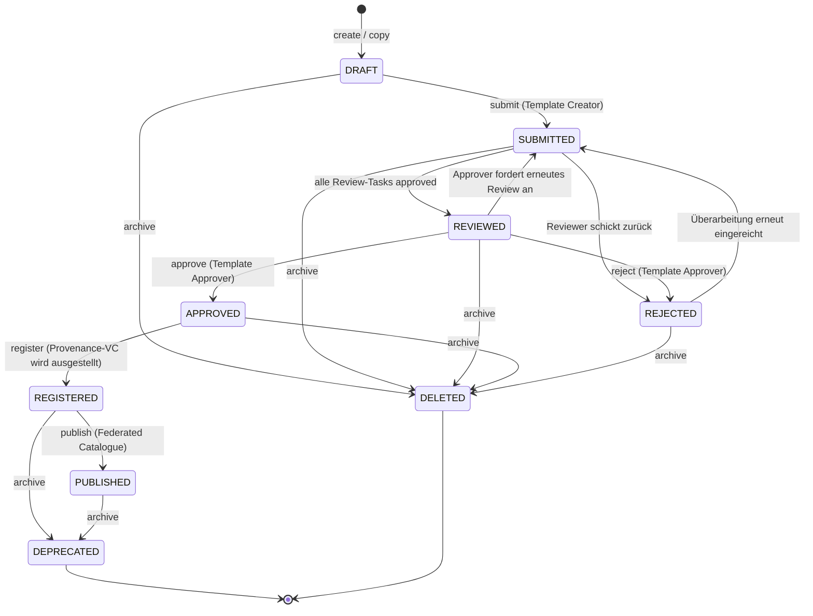

# 03 — Vorlagen und Vertragsinhalte

Dieses Kapitel beschreibt, wie Vertragsvorlagen im DCS entstehen, geprüft,
versioniert und veröffentlicht werden — und wie der Semantic Hub die
maschinenlesbare Bedeutung aller Vorlagen- und Vertragsinhalte definiert:
JSON-LD-Kontext, SHACL-Shapes, Domänenfeld-Katalog, ODRL-Profil und
Klausel-Katalog. Am Ende steht das Contract-Field-Modell, das erklärt, wie
ein Dokument Felddeklarationen, Geschäftsdaten, menschenlesbare Struktur
und ODRL-Regeln zu einem selbsttragenden Ganzen verbindet.

## 3.1 Beteiligte Komponenten

| Komponente | Verantwortung |
| --- | --- |
| Template Repository | Verwaltung der Vertragsvorlagen: Lifecycle, Review-/Approval-Tasks, Versionierung, Provenance |
| Semantic Hub | Versionierter Speicher und Auslieferungspunkt aller semantischen Artefakte |
| Federated Catalogue (XFSC FC) | Externer Katalog, in den registrierte Vorlagen als Self-Descriptions veröffentlicht werden |
| Template Catalogue Integration | Lesezugriff auf den Federated Catalogue — so beziehen andere Instanzen veröffentlichte Vorlagen |
| pdf-core | Deterministisches Rendering der Vorlagen-/Vertragsdokumente (Kapitel 07) |

## 3.2 Template-Lifecycle

Eine Vorlage durchläuft einen mehrstufigen Freigabeprozess mit
Vier-Augen-Prinzip, bevor sie für die Vertragserstellung nutzbar und im
Federated Catalogue sichtbar wird.

Die wesentlichen Stationen:

- **Erstellung und Bearbeitung (`DRAFT`).** Ein Template Creator legt eine
  Vorlage als kanonisches JSON-LD-Dokument an und bearbeitet sie, bis sie
  eingereicht wird. Jede schreibende Operation prüft per optimistischer
  Nebenläufigkeitskontrolle den mitgelieferten Zeitstempel gegen den
  Stand der Vorlage; ein veralteter Stand wird mit der Aufforderung zum
  Neuladen abgewiesen (Lost-Update-Schutz).
- **Einreichung (`SUBMITTED`).** Beim Submit werden Review- und
  Approval-Tasks geöffnet. Jeder Review-Task ist ein eigenes kleines
  Zustandsobjekt: Der Reviewer muss die Vorlage zunächst verifizieren
  (semantische Prüfung, siehe 3.3), bevor er sie freigeben kann. Erst
  wenn kein Review-Task mehr offen ist, wechselt die Vorlage nach
  `REVIEWED`. Schickt ein Reviewer die Vorlage zurück, landet sie in
  `REJECTED`, und alle Tasks werden für die nächste Runde wieder geöffnet.
- **Freigabe (`APPROVED`).** Ein Template Approver — der über den
  Approval-Task als zuständig ausgewiesen sein muss — trifft die finale
  Entscheidung: Freigabe oder Ablehnung mit Begründung. Rollenprüfung und
  Task-Zuständigkeit sind zwei getrennte Hürden: Die RBAC-Rolle erlaubt
  die Operation grundsätzlich, der Task bindet sie an die konkrete Vorlage.
- **Registrierung (`REGISTERED`).** Die Registrierung fixiert eine
  Version als die veröffentlichungsfähige. In diesem Moment stellt die
  Instanz ein Provenance-Verifiable-Credential über die Vorlagenversion
  aus, signiert mit dem VC-Schlüssel der Instanz — die Herkunftsaussage
  ist damit an genau diese Version gesiegelt.
- **Veröffentlichung (`PUBLISHED`).** Publish übermittelt die Vorlage als
  Self-Description an den Federated Catalogue. Als Aussteller tritt dabei
  die DCS-Instanz (deren `did:web`) auf, nicht der klickende Mitarbeiter —
  der Katalog kennt Organisationen, keine Einzelnutzer (ADR-18). Der
  Katalog-Aufruf läuft bewusst außerhalb der Datenbanktransaktion; meldet
  der Katalog ein Duplikat, gilt die Veröffentlichung als erfolgreich, so
  dass ein wiederholter Publish nach einem Teilfehler idempotent ist.
- **Ausmusterung.** `archive` wirkt zustandsabhängig: Eine registrierte
  oder veröffentlichte Vorlage wird `DEPRECATED` (bleibt referenzierbar,
  laufende Verträge zeigen den Deprecation-Hinweis), alle früheren
  Zustände werden `DELETED`.

Die Vorlagen-Lifecycle-Ereignisse — Anlegen, Freigabe, Aktualisierung,
Registrierung und Ausmusterung — erreichen registrierte externe
Abonnenten über die Webhook-Plattform (`template.created`,
`template.approved`, `template.updated`, `template.registered`,
`template.deprecated`); Nutzer einer Vorlage erfahren so von neuen
Versionen und von der Ablösung, ohne zu pollen.

### Versionierung durch Kopie

Vorlagen werden nicht in-place versioniert, sondern per Kopie: Der
Copy-Befehl dupliziert eine Vorlage unter neuer DID. Ist die Quelle noch
nicht registriert bzw. veröffentlicht, beginnt die Kopie eine neue
Versionslinie; ist sie es, wird die Kopie die nächste Version derselben
Linie. Ein einziger Mechanismus deckt damit sowohl „Entwurf duplizieren"
als auch „nächste Version einer veröffentlichten Vorlage erstellen" ab —
und jede neue Version durchläuft den vollen Freigabeprozess erneut.

### Rollen im Template-Lifecycle

| Rolle | Darf |
| --- | --- |
| Template Creator | Vorlagen anlegen, bearbeiten, kopieren, einreichen |
| Template Reviewer | Eingereichte Vorlagen verifizieren und reviewen |
| Template Approver | Reviewte Vorlagen freigeben oder ablehnen |
| Template Manager | Übergreifende Verwaltungsrechte über alle Stufen; einziger Rolleninhaber, der Semantic-Hub-Versionen registrieren darf |

Vorlagen werden — anders als Verträge — nicht direkt zwischen Instanzen
synchronisiert: Der Austauschweg für Vorlagen ist die Veröffentlichung in
den Federated Catalogue und der Lesezugriff anderer Instanzen über die
Catalogue-Integration.

## 3.3 Semantic Hub

Der Semantic Hub ist der versionierte Speicher für alles, wogegen das DCS
seine Dokumente erzeugt und prüft. Jeder Eintrag ist ein Paar aus Name und
Art (`kind`) mit monotoner, unveränderlicher Versionshistorie und genau
einer aktiven Version. Die mit dem Backend ausgelieferten Basisdokumente:

| Hub-Eintrag (Name / Art) | Inhalt und Wirkung |
| --- | --- |
| `facis-dcs` / context | Der JSON-LD-Kontext, den jedes Dokument als `@context` verankert; seine Präfix-zu-IRI-Zuordnungen werden auf jedem erzeugten Artefakt erzwungen |
| `facis-dcs` / shapes | SHACL-Shapes der kanonischen Dokumenthülle — der blockierende Validierungsgraph |
| `clause-catalog` / shapes | Typisierte Klausel-NodeShapes; zugleich die **Deklaration** ihrer Begriffe (3.4) |
| `facis-sla` / ontology | Der Domänenfeld-Katalog: `dcs:DomainField`-Einträge mit Wertebereichen und Taxonomie-Optionen. Wird als RDF-Konfiguration geparst, nicht als Axiomenmenge |
| `dcs-odrl-profile` / ontology | Das ODRL-Profil: unterstützte Constraint-Operatoren, Aktionen, Default-Aktion. Treibt den Bedingungs-Editor |
| `facis.sla.basic` / profile | Fachliche Validierungsregeln auf Statement-Ebene |
| beliebige Shape-Bibliotheken / shapes | Über den Hub registrierte externe SHACL-Vokabulare (z. B. Gaia-X-Klassen): Bausteine für typisierte Geschäftsobjekte in `dcs:contractData` (3.5) |

**Es gibt bewusst keine OWL-Ontologie der Dokumenthülle.** Was einen
Hüllen-Begriff einschränkt, sind die Shapes — der einzige Graph, gegen den
Dokumente validiert werden. Eine zweite, OWL-förmige Deklaration derselben
Begriffe könnte diese nur wiederholen oder ihr widersprechen; im System
läuft kein Reasoner, der sie auswerten würde. Die beiden Einträge der Art
`ontology` sind geparste RDF-Konfiguration: Der Domänenfeld-Katalog ist
der Index, aus dem der Feld-Picker seine Auswahl und die Prüfung ihre
Liste bekannter Feld-IRIs zieht; das ODRL-Profil ist das
Operator-Vokabular des Editors.

Die Wirkmechanik:

- **Seed beim Start.** Die ausgelieferten Basisdokumente werden beim Start
  in den Hub installiert. Fehlt ein Eintrag, wird er Version 1 (aktiv);
  weicht das ausgelieferte Dokument vom zuletzt gespeicherten ab, wird es
  als nächste Version registriert und aktiviert. Versionen sind
  unveränderlich — Aktualisierungen der Auslieferung erreichen laufende
  Deployments als gewöhnliche Versionssprünge, während auf ältere
  Versionen gepinnte Dokumente diese weiterhin auflösen können. Schlägt
  der Seed fehl, startet die Instanz nicht: Der Hub ist eine
  Pflichtabhängigkeit der Dokumentnormalisierung.
- **Pinning statt Mitwandern (ADR-8).** Ein neu erzeugtes Dokument
  verankert die jeweils aktive Version über versionsfeste URLs
  (`@context`, `sh:shapesGraph`, Profilverweis). Eine spätere Aktivierung
  einer neuen Version ändert, wogegen neue Dokumente validiert werden —
  bereits erzeugte Dokumente bleiben an ihre Version gebunden und dadurch
  dauerhaft reproduzierbar prüfbar. Für Korrekturen existiert ein
  expliziter Rollback auf eine ältere Version.
- **Öffentliche Auflösung.** Die Auflösungsendpunkte sind
  unauthentifiziert: Ein externer Prüfer muss die im Dokument verankerten
  Anker ohne DCS-Konto dereferenzieren können.

### Was wo geprüft wird

Die Prüfschichten haben unterschiedliche Reichweite; sie zu verwechseln
ist der häufigste Irrtum über das System.

| Schicht | Gegenstand | Wirkung |
| --- | --- | --- |
| **SHACL gegen den gepinnten Shapes-Graphen** | Struktur, Typen, Kardinalitäten, Node-Kinds der Hülle; zusätzlich die Wertbedingungen des Klausel-Katalogs und aller aktiven Shape-Bibliotheken | **Blockierend** bei Angebot, Einreichung und Signaturvorbereitung. Kanonische Shapes, Klausel-Katalog und registrierte Bibliotheken bilden einen gemeinsamen Graphen |
| **ODRL-Constraint-Auswertung** | Die im Vertrag inline getragenen Werte gegen die eigenen ODRL-Bedingungen | **Blockierend** bei Freigabe und Signaturvorbereitung (Kapitel 09) |
| **Abschluss-Prüfung** | Offene Pflichtfelder und von ODRL-Regeln referenzierte, unbelegte Werte | **Blockierend** bei Angebot, Freigabe und Signaturvorbereitung |
| **Validierungsprofil (Statement-Regeln)** | Fachliche Regeln über Aussagen im Dokument | Fließt als lokale Bewertung in das Workflow-Gate ein: ein Befund der Schwere „error" blockiert den Übergang, eine Warnung stellt ihn unter manuelle Prüfung (Kapitel 09) |
| **Wertbedingungen des Domänenfeld-Katalogs** (`dcs:pattern`, `dcs:minInclusive`, `dcs:allowedValue`) | Zulässige Werte eines Domänenfelds | **Nicht serverseitig durchgesetzt.** Sie erzeugen das passende Eingabefeld und die Auswahlliste im Editor und werden clientseitig geprüft. Wer eine Wertgrenze serverseitig erzwingen will, drückt sie als SHACL aus |

Bei der Signaturvorbereitung wird SHACL-Evidenz — die Shapes-Version und
ein Hash über die Befundliste — in das Signing-Summary-Credential
eingebettet, so dass externe Prüfer die Validierung gegen exakt die
gepinnten Shapes wiederholen können.

## 3.4 Klausel-Katalog

Der Klausel-Katalog ist ein eigenständig versionierter Shapes-Eintrag im
Hub: eine Sammlung typisierter Klausel-NodeShapes (SHACL) mit
Zielklassen, Datentypen, Wertelisten, Bereichsgrenzen und Mustern. Er
bedient zwei Konsumenten aus einer Quelle:

- **Vorlagen-Builder (Palette).** Der Klausel-Endpunkt liefert die Liste
  der verfügbaren Klauseltypen (Typ, Label, Shape-IRI), kompaktiert gegen
  die Präfixe des aktiven Kontexts. Die Formulargenerierung geschieht
  clientseitig aus dem rohen Turtle — der Server zählt auf, welche Shapes
  existieren (ADR-10).
- **Validierung.** Eingereichte Klausel-Instanzen werden serverseitig
  gegen denselben Shapes-Graphen validiert, aus dem die Formulare erzeugt
  wurden. Palette und Prüfung können damit nicht auseinanderlaufen.

Der Katalog ist zugleich die **Deklaration** seiner Begriffe: Eine
Property-Shape trägt Datentyp, zulässige Werte, Grenzen, Namen und
Beschreibung — alles, was eine separate Vokabulardatei über denselben
Begriff sagen würde. Das ist der Grund, warum es sie nicht gibt.

Eine Klausel im Dokument (`dcs:Clause`) trägt menschenlesbaren Inhalt —
eine Mischung aus Prosa und Feldreferenzen. Der Klausel-Katalog schränkt
darüber hinaus typisierte Geschäftsobjekte ein, die im Datengraphen des
Vertrags liegen (3.5).

## 3.5 Die kanonische Dokumenthülle und das Contract-Field-Modell

Jedes DCS-Dokument — Vorlage wie Vertrag — ist eine einzige kanonische
JSON-LD-Hülle (`dcs:ContractTemplate` bzw. `dcs:Contract`) mit klar
getrennten Ebenen:

| Ebene | Inhalt |
| --- | --- |
| `dcs:metadata` | Titel, Beschreibung, Vorlagentyp |
| `dcs:documentStructure` | Menschenlesbare Struktur: geordnete Blöcke (`dcs:Section`, `dcs:TextBlock`, `dcs:Clause`) und ein Layout-Baum |
| `dcs:contractFields` | Flache Liste der Felddeklarationen (`dcs:ContractField`) |
| `dcs:contractData` | Generischer Graph typisierter Geschäftsobjekte (z. B. `dcs:PaymentClause`, Gaia-X-Klassen) — Eigenschaften tragen Literale, Feldreferenzen oder Referenzen auf andere Objekte |
| `dcs:policies` | Genau eine umschließende ODRL-Policy |
| `dcs:signatureFields` | Die deklarierten Signaturfelder mit ihrem jeweils geforderten Signaturniveau (Kapitel 06) |

Das Contract-Field-Modell (ADR-22, erweitert durch ADR-23) trennt
Felddeklaration und Geschäftsdaten:

- Jedes `dcs:ContractField` deklariert `@id`, Label, Datentyp und
  Pflichtkennzeichen; optional eine Shape und — auf einem ausgefüllten
  Vertrag — den Laufzeitwert.
- `dcs:contractData` ist ein generischer Objektgraph: Jedes
  Geschäftsobjekt ist ein typisierter, über `@id` adressierbarer Knoten.
  Eine Eigenschaft trägt genau eines von dreien — ein **Literal** (beim
  Authoring fixierte Daten), eine **Referenz auf ein deklariertes Feld**
  (ein verhandelbares Blatt) oder eine **Referenz auf ein anderes
  Geschäftsobjekt** (Struktur, beliebige Tiefe). Jede Referenz muss sich
  im Dokument selbst auflösen; eingebettete Blank Nodes sind unzulässig,
  so dass Klausel-Prosa, ODRL-Operanden und KPI-Beobachtungen jeden Teil
  des Graphen per IRI benennen können.
- Die Dokumentstruktur referenziert dieselben Felder in Klauselinhalten;
  Layout-Kinder sind geordnete `@list`-Referenzen.
- Auch ODRL-Operanden referenzieren dieselben Feldbezeichner.

Das Dokument ist dadurch selbsttragend: Authoring, Validierung, Rendering
und Policy-Auswertung lösen ein Feld über seine `@id` auf, ohne einen
Vorlagen-Schnappschuss konsultieren zu müssen. Ein Vertrag ergänzt die
Hülle um Herkunft (die Vorlage, aus der er entstand) und die
Vertragsparteien.

**Offene Felder und das Abschluss-Gate.** Auf einer Vorlage darf ein
Feld offen sein — deklariert, aber ohne Wert. Offene Pflichtfelder werden
während Vertragserzeugung und Verhandlung gefüllt; Angebot, Freigabe und
Signaturvorbereitung weisen einen Vertrag zurück, der noch ein
ungefülltes Pflichtfeld oder einen von einer ODRL-Regel referenzierten,
leeren Wert trägt — keine Partei kann ein Dokument mit offenen
Bedingungen signieren (Kapitel 04).

**Hierarchie.** Ein Vertrag darf auf genau einen Elternvertrag verweisen;
die Verknüpfung zeigt ausschließlich vom Kind zum Elternteil (ADR-7).
Rückwärtsverweise auf Kindverträge werden beim Normalisieren abgewiesen —
sie wären ein Weg, aus einem Vertrag heraus auf Dokumente zu zeigen, die
der Leser nicht sehen darf.

**Shape-Bibliotheken treiben Editor und Validierung.** Beliebige über
den Hub registrierte SHACL-Bibliotheken treten dem aktiven
Validierungsgraphen bei. Der Vorlagen-Editor leitet daraus seine Palette
typisierter Datenobjekte ab: Jede NodeShape mit Zielklasse lässt sich per
Klick als typisiertes Geschäftsobjekt in `dcs:contractData` einfügen; die
Eingabefelder entstehen aus den Shape-Eigenschaften. Validiert wird gegen
eine feld-materialisierte Kopie des Dokuments: Referenzen auf gefüllte
Felder werden zu ihrem Wert dereferenziert, so dass eine gewöhnliche,
gegen einfache Instanzdaten geschriebene Bibliothek das lebende Dokument
direkt beschränkt, ohne die Feld-Indirektion zu kennen. Referenzen auf
ungefüllte Felder fehlen in der Kopie — die Kardinalitätsregeln der
Bibliothek benennen dann exakt, was die Verhandlung noch liefern muss.
Das gespeicherte Dokument selbst wird dabei nie umgeschrieben; seine
Shapes-Anker benennen die maßgeblichen Shapes (ADR-23).

**ODRL-Regeln.** Die Policy ist bis zur ersten Signatur ein `odrl:Offer`
und wird durch die Signatur in ein `odrl:Agreement` gesiegelt. Jede Regel
trägt Aktion, Assigner, Assignee, Ziel und die menschenlesbare Klausel,
die sie operationalisiert. Damit ist jede maschinenlesbare Bedingung an
ihre menschenlesbare Darstellung gebunden; die unabhängige Gegenprüfung
beider Repräsentationen beschreibt Kapitel 07.

Zur Laufzeit gilt: JSON-LD ist die Quelle der Wahrheit, und intern
existiert genau eine JSON-LD-Form — die expandierte, mit Expansion nur an
den Eingangskanten (ADR-14). RDF wird für Validierung und
Interoperabilität abgeleitet; OWL-Inferenz findet nicht statt und wird
nicht vorausgesetzt.

## 3.6 Betriebsverhalten

- Ohne konfigurierten Federated Catalogue schlägt `publish` mit einem
  eindeutigen Konfigurationsfehler fehl; alle vorgelagerten
  Lifecycle-Schritte funktionieren unabhängig davon.
- Ist ein Katalog konfiguriert, ist er eine harte Startabhängigkeit: Das
  Backend prüft ihn beim Start funktional und synchronisiert seine
  Schemata, bevor es bereit meldet.
- Schlägt nach erfolgreicher Katalog-Veröffentlichung die lokale
  Zustandsänderung fehl, heilt der nächste Publish-Aufruf den Zustand.
- Konkurrierende Bearbeitung wird über den Änderungszeitstempel erkannt
  und als Client-Fehler („bitte neu laden") beantwortet — kein stiller
  Überschreib.
- Jeder Lifecycle-Schritt erzeugt ein Audit-Ereignis in derselben
  Transaktion wie die Zustandsänderung (Kapitel 09).
