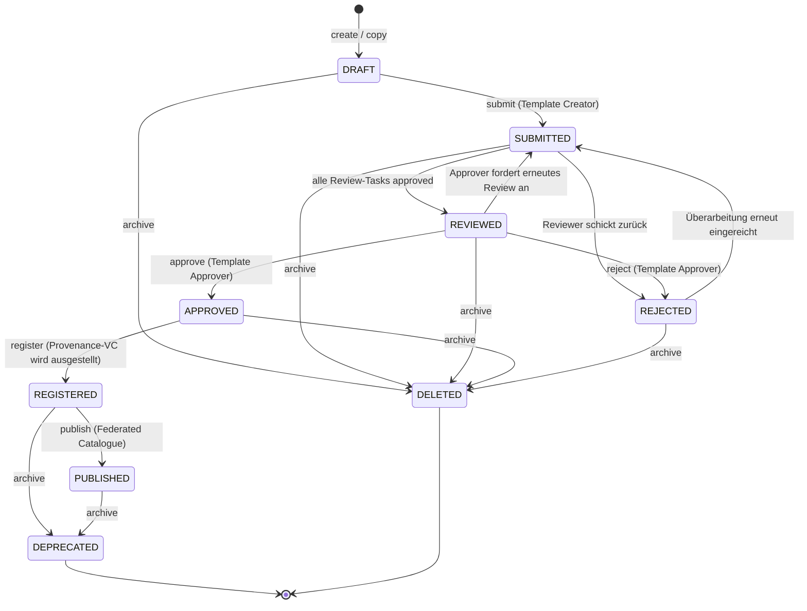

# 03 Vorlagen und Vertragsinhalte

Dieses Kapitel beschreibt, wie Vertragsvorlagen entstehen, geprüft,
versioniert und veröffentlicht werden, und wie der Semantic Hub die
maschinenlesbare Bedeutung aller Inhalte definiert: JSON-LD-Kontext,
SHACL-Shapes, Domänenfeld-Katalog, ODRL-Profil und Klausel-Katalog.

## 3.1 Beteiligte Komponenten

| Komponente | Verantwortung |
| --- | --- |
| Template Repository | Vorlagen-Lifecycle, Review-/Approval-Tasks, Versionierung, Provenance |
| Semantic Hub | Versionierter Speicher und Auslieferungspunkt aller semantischen Artefakte |
| Federated Catalogue (XFSC FC) | Externer Katalog, in den registrierte Vorlagen als Self-Descriptions veröffentlicht werden |
| Template Catalogue Integration | Lesezugriff auf den Katalog; so beziehen andere Instanzen veröffentlichte Vorlagen |
| pdf-core | Deterministisches Rendering der Dokumente (Kapitel 07) |

## 3.2 Template-Lifecycle

Eine Vorlage durchläuft einen mehrstufigen Freigabeprozess mit
Vier-Augen-Prinzip, bevor sie für die Vertragserstellung nutzbar und im
Federated Catalogue sichtbar wird.

Ergänzend zum Diagramm:

- Jede schreibende Operation prüft den mitgelieferten Zeitstempel gegen
  den Stand der Vorlage; ein veralteter Stand wird mit der Aufforderung
  zum Neuladen abgewiesen (Lost-Update-Schutz).
- Ein Reviewer muss die Vorlage erst semantisch verifizieren, bevor er
  sie freigeben kann. Rollenprüfung und Task-Zuständigkeit sind zwei
  getrennte Hürden: Die RBAC-Rolle erlaubt die Operation, der Task bindet
  sie an die konkrete Vorlage.
- Die Registrierung fixiert eine Version als die
  veröffentlichungsfähige; die Instanz stellt dabei ein
  Provenance-Verifiable-Credential über genau diese Version aus.
- Beim Publish tritt die DCS-Instanz (deren `did:web`) als Aussteller
  auf, nicht der klickende Mitarbeiter (ADR-18). Der Katalog-Aufruf läuft
  außerhalb der Datenbanktransaktion; ein vom Katalog gemeldetes Duplikat
  gilt als Erfolg, so dass ein wiederholter Publish nach einem
  Teilfehler idempotent ist.
- `archive` wirkt zustandsabhängig: registrierte oder veröffentlichte
  Vorlagen werden `DEPRECATED` (bleiben referenzierbar), alle früheren
  Zustände werden `DELETED`.

Die Lifecycle-Ereignisse erreichen registrierte externe Abonnenten über
die Webhook-Plattform (Anhang A).

**Versionierung durch Kopie.** Vorlagen werden nicht in-place
versioniert. Der Copy-Befehl dupliziert eine Vorlage unter neuer DID:
Eine unregistrierte Quelle beginnt eine neue Versionslinie, eine
registrierte oder veröffentlichte liefert die nächste Version derselben
Linie. Jede neue Version durchläuft den vollen Freigabeprozess erneut.

| Rolle | Darf |
| --- | --- |
| Template Creator | Vorlagen anlegen, bearbeiten, kopieren, einreichen |
| Template Reviewer | Eingereichte Vorlagen verifizieren und reviewen |
| Template Approver | Reviewte Vorlagen freigeben oder ablehnen |
| Template Manager | Übergreifende Verwaltungsrechte; einziger Rolleninhaber, der Semantic-Hub-Versionen registrieren darf |

Vorlagen werden nicht direkt zwischen Instanzen synchronisiert; der
Austauschweg ist die Veröffentlichung in den Katalog und der Lesezugriff
anderer Instanzen über die Catalogue-Integration. Der Katalog übergibt
dabei Inhalt, nie Autorität: Eine importierende Instanz registriert die
gefundene Vorlage als eigene neue Vorlage unter eigener DID in `DRAFT`
und führt sie durch ihren eigenen Freigabeprozess. Die ODRL-Semantik
reist unverändert mit und bindet die importierende Instanz wie die
Autorin: Dieselben Regeln, Bereichsgrenzen und Konsequenzen werden auf
beiden Instanzen mit demselben Ergebnis durchgesetzt.

## 3.3 Semantic Hub

Der Semantic Hub ist der versionierte Speicher für alles, wogegen das DCS
seine Dokumente erzeugt und prüft. Jeder Eintrag ist ein Paar aus Name
und Art (`kind`) mit unveränderlicher Versionshistorie und genau einer
aktiven Version. Die mit dem Backend ausgelieferten Basisdokumente:

| Hub-Eintrag (Name / Art) | Inhalt und Wirkung |
| --- | --- |
| `facis-dcs` / context | Der JSON-LD-Kontext, den jedes Dokument als `@context` verankert; seine Präfix-zu-IRI-Zuordnungen werden auf jedem Artefakt erzwungen |
| `facis-dcs` / shapes | SHACL-Shapes der kanonischen Dokumenthülle, der blockierende Validierungsgraph |
| `clause-catalog` / shapes | Typisierte Klausel-NodeShapes; zugleich die Deklaration ihrer Begriffe (3.4) |
| `facis-sla` / ontology | Der Domänenfeld-Katalog: `dcs:DomainField`-Einträge mit Wertebereichen und Taxonomie-Optionen; geparste RDF-Konfiguration |
| `dcs-odrl-profile` / ontology | Das ODRL-Profil: Constraint-Operatoren, Aktionen, Default-Aktion. Treibt den Bedingungs-Editor |
| `facis.sla.basic` / profile | Fachliche Validierungsregeln auf Statement-Ebene |
| beliebige Shape-Bibliotheken / shapes | Über den Hub registrierte externe SHACL-Vokabulare (z. B. Gaia-X-Klassen): Bausteine für typisierte Geschäftsobjekte in `dcs:contractData` |

Eine OWL-Ontologie der Dokumenthülle gibt es bewusst nicht: Maßgeblich
sind die Shapes, gegen die validiert wird; im System läuft kein Reasoner.

Die Wirkmechanik:

- **Seed beim Start.** Die Basisdokumente werden beim Start installiert;
  ein vom letzten Stand abweichendes Dokument wird nächste aktive
  Version. Versionen sind unveränderlich. Schlägt der Seed fehl, startet
  die Instanz nicht.
- **Pinning statt Mitwandern (ADR-8).** Ein neu erzeugtes Dokument
  verankert die aktive Version über versionsfeste URLs. Eine spätere
  Aktivierung ändert nur, wogegen neue Dokumente validiert werden;
  bestehende bleiben an ihre Version gebunden und dauerhaft
  reproduzierbar prüfbar. Für Korrekturen existiert ein expliziter
  Rollback.
- **Öffentliche Auflösung.** Die Auflösungsendpunkte sind
  unauthentifiziert, damit externe Prüfer die im Dokument verankerten
  Anker ohne DCS-Konto dereferenzieren können.
- **Hermetische Auflösung.** Ein Dokument darf externe Kontext-IRIs nur
  referenzieren, wenn sie unter ihrer Original-IRI im Hub registriert
  sind; validiert wird ausschließlich gegen den Hub-Bestand, nie über
  das Netz. Eine unregistrierte IRI wird bei der Erstellung abgewiesen.

### Was wo geprüft wird

| Schicht | Gegenstand | Wirkung |
| --- | --- | --- |
| **SHACL gegen den gepinnten Shapes-Graphen** | Struktur, Typen, Kardinalitäten der Hülle; Wertbedingungen des Klausel-Katalogs und aller aktiven Shape-Bibliotheken | **Blockierend** bei Angebot, Einreichung und Signaturvorbereitung |
| **ODRL-Constraint-Auswertung** | Die im Vertrag inline getragenen Werte gegen die eigenen ODRL-Bedingungen | **Blockierend** bei Freigabe und Signaturvorbereitung (Kapitel 09) |
| **Abschluss-Prüfung** | Offene Pflichtfelder und von ODRL-Regeln referenzierte, unbelegte Werte | **Blockierend** bei Angebot, Freigabe und Signaturvorbereitung |
| **Validierungsprofil (Statement-Regeln)** | Fachliche Regeln über Aussagen im Dokument | Fließt in das Workflow-Gate ein: „error" blockiert, eine Warnung stellt unter manuelle Prüfung (Kapitel 09) |
| **Wertbedingungen des Domänenfeld-Katalogs** | Zulässige Werte eines Domänenfelds | **Nicht serverseitig durchgesetzt**; sie treiben Editor und clientseitige Prüfung. Wer eine Wertgrenze erzwingen will, drückt sie als SHACL aus |

Bei der Signaturvorbereitung wird SHACL-Evidenz (Shapes-Version und ein
Hash über die Befundliste) in das Signing-Summary-Credential eingebettet,
so dass externe Prüfer die Validierung gegen exakt die gepinnten Shapes
wiederholen können.

## 3.4 Klausel-Katalog

Der Klausel-Katalog ist ein eigenständig versionierter Shapes-Eintrag im
Hub: typisierte Klausel-NodeShapes mit Zielklassen, Datentypen,
Wertelisten, Bereichsgrenzen und Mustern. Er bedient zwei Konsumenten aus
einer Quelle: Der Klausel-Endpunkt liefert dem Vorlagen-Builder die
Palette der Klauseltypen, die Formulare entstehen clientseitig aus dem
rohen Turtle (ADR-10); eingereichte Klausel-Instanzen werden serverseitig
gegen denselben Shapes-Graphen validiert. Palette und Prüfung können
damit nicht auseinanderlaufen. Der Katalog ist zugleich die Deklaration
seiner Begriffe; ein separates Vokabular existiert nicht.

## 3.5 Die kanonische Dokumenthülle und das Contract-Field-Modell

Jedes DCS-Dokument, Vorlage wie Vertrag, ist eine einzige kanonische
JSON-LD-Hülle (`dcs:ContractTemplate` bzw. `dcs:Contract`):

| Ebene | Inhalt |
| --- | --- |
| `dcs:metadata` | Titel, Beschreibung, Vorlagentyp |
| `dcs:documentStructure` | Menschenlesbare Struktur: geordnete Blöcke (`dcs:Section`, `dcs:TextBlock`, `dcs:Clause`) und ein Layout-Baum |
| `dcs:contractFields` | Flache Liste der Felddeklarationen (`dcs:ContractField`) |
| `dcs:contractData` | Generischer Graph typisierter Geschäftsobjekte; Eigenschaften tragen Literale, Feldreferenzen oder Objektreferenzen |
| `dcs:policies` | Genau eine umschließende ODRL-Policy |
| `dcs:signatureFields` | Die deklarierten Signaturfelder mit gefordertem Signaturniveau (Kapitel 06) |

Das Contract-Field-Modell (ADR-22, erweitert durch ADR-23) trennt
Felddeklaration und Geschäftsdaten: Jedes `dcs:ContractField` deklariert
`@id`, Label, Datentyp und Pflichtkennzeichen. Im Datengraphen trägt eine
Eigenschaft genau eines von dreien: ein Literal, eine Referenz auf ein
deklariertes Feld (ein verhandelbares Blatt) oder eine Referenz auf ein
anderes Geschäftsobjekt. Jede Referenz muss sich im Dokument selbst
auflösen; eingebettete Blank Nodes sind unzulässig. Klausel-Prosa,
Layout und ODRL-Operanden referenzieren dieselben Feld-IDs. Das Dokument
ist dadurch selbsttragend: Authoring, Validierung, Rendering und
Policy-Auswertung lösen ein Feld über seine `@id` auf, ohne einen
Vorlagen-Schnappschuss zu konsultieren.

**Offene Felder und das Abschluss-Gate.** Auf einer Vorlage darf ein
Feld deklariert, aber ohne Wert sein; gefüllt wird es bei
Vertragserzeugung und Verhandlung. Angebot, Freigabe und
Signaturvorbereitung weisen einen Vertrag mit ungefüllten Pflichtfeldern
oder von ODRL-Regeln referenzierten, leeren Werten zurück. Keine Partei
kann ein Dokument mit offenen Bedingungen signieren (Kapitel 04).

**Hierarchie.** Ein Vertrag darf auf genau einen Elternvertrag
verweisen; die Verknüpfung zeigt ausschließlich vom Kind zum Elternteil
(ADR-7). Rückwärtsverweise werden beim Normalisieren abgewiesen, weil
sie auf Dokumente zeigen könnten, die der Leser nicht sehen darf.

**Shape-Bibliotheken treiben Editor und Validierung.** Registrierte
SHACL-Bibliotheken treten dem aktiven Validierungsgraphen bei; der
Editor leitet daraus seine Palette typisierter Datenobjekte ab.
Validiert wird gegen eine feld-materialisierte Kopie des Dokuments:
Referenzen auf gefüllte Felder werden zu ihrem Wert dereferenziert, so
dass gewöhnliche, gegen Instanzdaten geschriebene Bibliotheken das
Dokument direkt beschränken. Referenzen auf ungefüllte Felder fehlen in
der Kopie; die Kardinalitätsregeln benennen dann, was die Verhandlung
noch liefern muss (ADR-23).

**ODRL-Regeln.** Die Policy ist bis zur ersten Signatur ein `odrl:Offer`
und wird durch die Signatur in ein `odrl:Agreement` gesiegelt. Jede
Regel trägt Aktion, Assigner, Assignee, Ziel und die menschenlesbare
Klausel, die sie operationalisiert; die unabhängige Gegenprüfung beider
Repräsentationen beschreibt Kapitel 07.

Zur Laufzeit gibt es genau **eine** interne Form, die kanonische
`dcs:`-präfixierte Hülle. Sie wird an den Eingangskanten erzwungen: Ein
Dokument, dessen `@context` einen Hub-Präfix auf eine andere IRI
umbiegt, wird abgewiesen. Ein von einer Peer-Instanz empfangenes
Dokument kommt bereits in dieser Form an, weil das PDF genau diese Bytes
als Anhang trägt (Kapitel 07). OWL-Inferenz findet nicht statt.

## 3.6 Betriebsverhalten

- Ohne konfigurierten Federated Catalogue schlägt `publish` mit einem
  eindeutigen Konfigurationsfehler fehl; alle vorgelagerten Schritte
  funktionieren unabhängig davon. Ein konfigurierter Katalog ist eine
  harte Startabhängigkeit (Kapitel 10).
- Schlägt nach erfolgreicher Katalog-Veröffentlichung die lokale
  Zustandsänderung fehl, heilt der nächste Publish-Aufruf den Zustand.
- Konkurrierende Bearbeitung wird über den Änderungszeitstempel erkannt
  und als Client-Fehler beantwortet; ein stiller Überschreib findet
  nicht statt.
- Jeder Lifecycle-Schritt erzeugt sein Audit-Ereignis in derselben
  Transaktion wie die Zustandsänderung (Kapitel 09).
