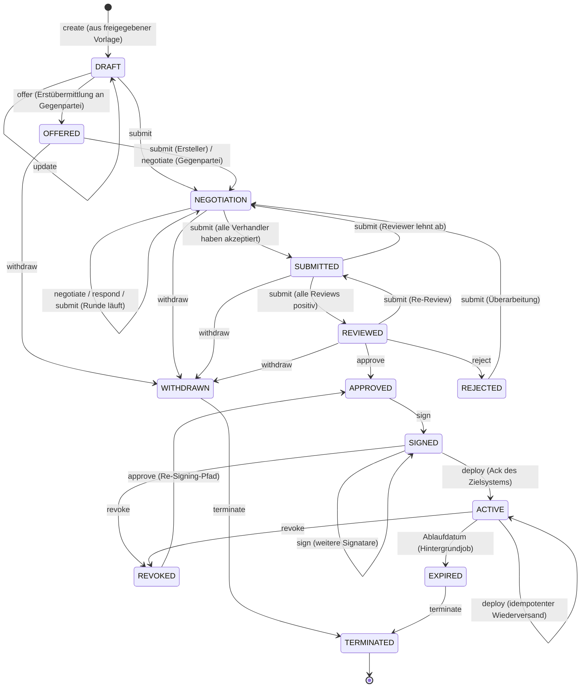
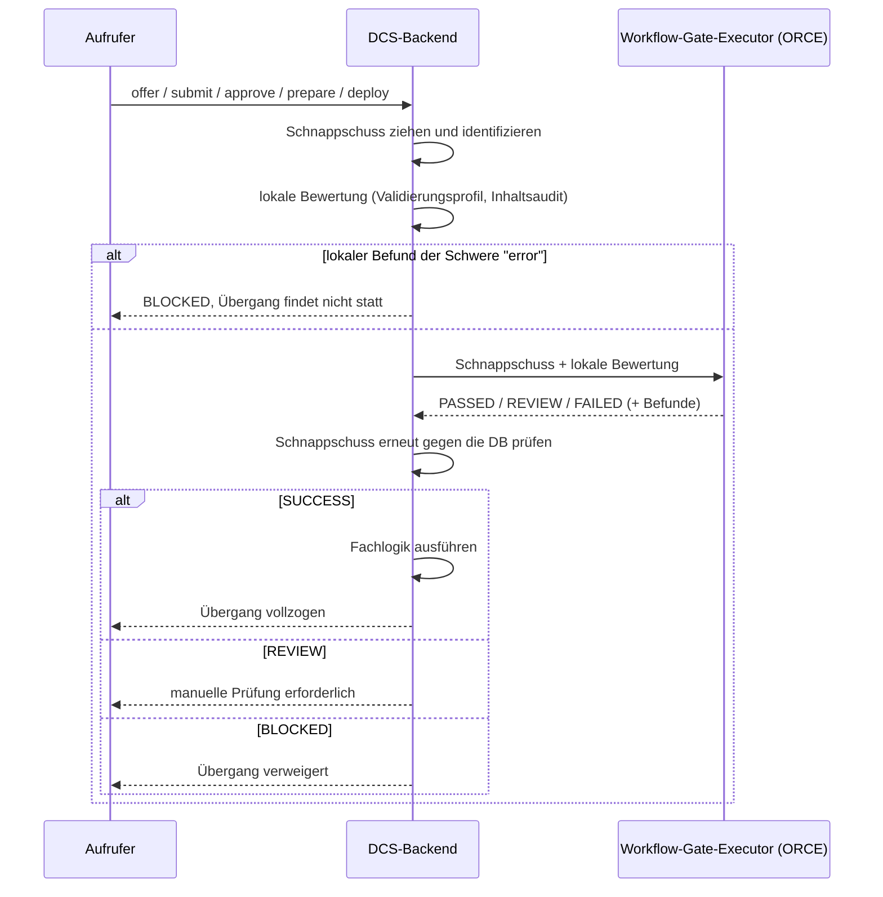
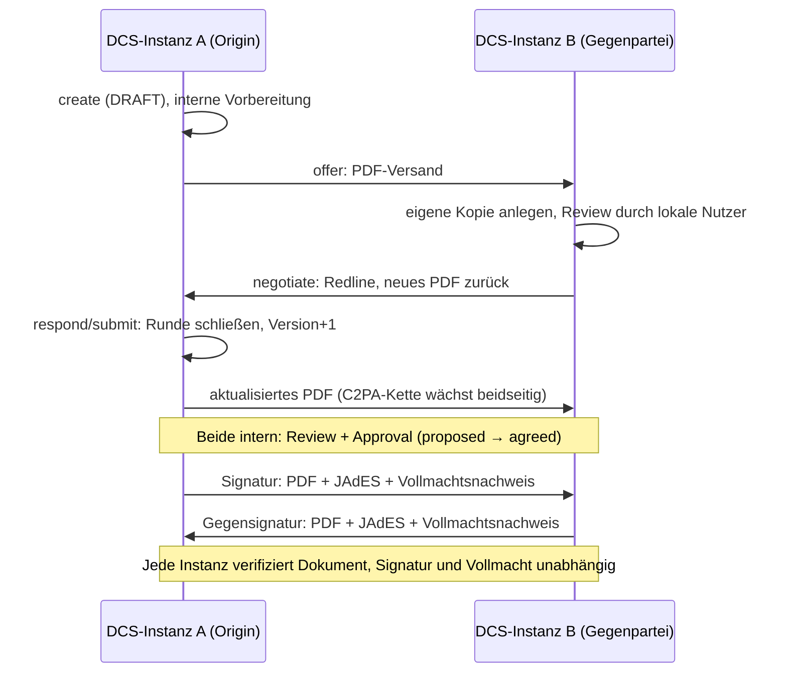

# 04 Vertragslebenszyklus

Dieses Kapitel beschreibt den Lebenszyklus eines Vertrags von der
Erstellung aus einer freigegebenen Vorlage über Verhandlung, Review und
Freigabe bis zu Signatur, Aktivierung, Beendigung und Löschung. Es
erklärt die zentrale State-Machine der Contract Workflow Engine, das
zweischichtige Berechtigungsmodell aus Rollen und Tasks, die
Workflow-Gates, den Verhandlungsmechanismus sowie den Unterschied
zwischen einem rein lokalen und einem instanzübergreifenden Vertrag.

## 4.1 Die State-Machine

Es gibt genau eine Vertrags-State-Machine im gesamten Backend (ADR-2).
Zulässige Übergänge sind als explizite Tabelle aus (Zustand × Ereignis →
Zielzustände) hinterlegt; jeder Command-Handler validiert gegen diese
Tabelle, bevor er seine Fachlogik ausführt. Ein unzulässiger Übergang
wird als Client-Fehler klassifiziert, nicht als interner Fehler.

Ergänzend zum Diagramm:

- **Terminate** ist aus jedem nicht-terminalen Zustand erreichbar (im
  Diagramm nur exemplarisch gezeigt) und führt immer nach `TERMINATED`.
- **Submit ist bewusst überladen:** Seine Wirkung hängt vom aktuellen
  Zustand ab (siehe 4.4). Die Übergangstabelle begrenzt lediglich, welche
  Ausgänge legal sind; welcher konkret eintritt, entscheidet die
  Task-Orchestrierung.
- **Withdraw** ist nur bis zur Freigabe möglich. Ein einmal freigegebener
  Vertrag lässt sich nur noch terminieren.
- **Deploy aus `ACTIVE`** ist ein idempotenter Wiederversand. Nach
  Signaturabschluss wird, sofern der Vertrag ein Zielsystem designiert
  hat (4.6), automatisch deployt und das Zielsystem bestätigt; ein
  manueller Deploy auf einen bereits aktivierten Vertrag bleibt gültig.
- **Expired** wird nicht durch einen API-Aufruf gesetzt, sondern von
  einem Hintergrundjob anhand des Ablaufdatums. Leser sehen den Zustand
  bereits vorher: Eine Datenbanksicht berechnet ihn zum Abfragezeitpunkt,
  der Job holt die physische Persistenz und das Ereignis nach. Mit dem
  Übergang wird `contract.expired` publiziert und erreicht registrierte
  Webhook-Abonnenten.
- **Renew** ist kein Zustandsübergang. Die Verlängerung erzeugt eine
  neue, verknüpfte Vertragsinstanz in `DRAFT` mit Rückreferenz auf
  Original-DID und -Version; das Original bleibt unverändert. Die
  Signatare der Vorperiode werden aus dem neuen Entwurf entfernt, denn
  ein ungezeichneter Entwurf darf niemanden als Unterzeichner ausweisen.

### Extrinsischer Lebenszyklus

Neben dem internen Zustand präsentiert jeder Vertrag über die
Instanzgrenze hinweg einen abgeleiteten, peer-gerichteten
Verhandlungslebenszyklus: Alle Formationszustände bis einschließlich
`REVIEWED` erscheinen als `proposed`, die beidseitige interne Freigabe
als `agreed` (hier öffnet sich das Signatur-Gate), ein Vertrag mit
vollständig vorliegenden Signaturen als `executed`. Maßgeblich für
`executed` ist, dass tatsächlich jede deklarierte Signatur vorliegt,
einschließlich der kryptographisch geprüften Signatur der Gegenseite;
die eigene erste Unterschrift genügt nicht. Beide Instanzen leiten
denselben Wert aus dem gemeinsamen Artefakt und ihrem eigenen Zustand
ab. Es wird kein Zustand über die Föderationsgrenze synchronisiert.

## 4.2 Rollen, Tasks und RBAC

Die Autorisierung hat zwei getrennte Schichten:

1. **Lokale RBAC-Rollen** bestimmen, welcher lokal authentifizierte
   Nutzer eine Operation grundsätzlich ausführen darf. Für Verträge sind
   das Contract Creator, Contract Reviewer, Contract Approver, Contract
   Negotiator, Contract Manager, Contract Signer und Contract Observer.
   Maschinelle Aufrufer treten in einer eigenen `Sys.`-Klasse auf, die
   nur einen Teil davon spiegelt: Anlegen, Prüfen, Freigeben, Verwalten
   und Signieren. Für Verhandeln und Beobachten gibt es kein maschinelles
   Pendant, und die maschinelle Signaturklasse trägt keine
   Signaturberechtigung (Kapitel 05 und 06). Audit-Lesezugriff haben
   Auditor, Archive Manager und Compliance Officer. Die
   Integrationsflächen verwaltet der Sys. Administrator; die
   Zielsystem-Registry zusätzlich der Integration Manager.
2. **Tasks binden Zuständigkeit an den konkreten Vertrag.** Bei der
   Vertragserstellung öffnet die Instanz ihre eigenen Review-,
   Verhandlungs- und Approval-Tasks für die benannten Zuständigen. Die
   Rolle erlaubt die Operation, der Task entscheidet, ob dieser Aufrufer
   für diesen Vertrag zuständig ist.

Die Tasks sind kleine Sub-State-Machines, die als Fan-in-Gates die großen
Übergänge steuern:

| Task | Zustände | Gate |
| --- | --- | --- |
| Negotiation-Task | offen → akzeptiert | Erst wenn kein Verhandler-Task mehr offen ist, kann `NEGOTIATION → SUBMITTED` erfolgen |
| Review-Task | offen → freigegeben / abgelehnt | Steuert `SUBMITTED → REVIEWED`; eine Ablehnung öffnet die Verhandlung erneut |
| Approval-Task | offen → freigegeben / abgelehnt | Steuert `REVIEWED → APPROVED` |

Jede DCS-Instanz erstellt und besitzt ausschließlich ihre eigenen Tasks;
Task-Zustände überqueren nie die Instanzgrenze. Die Gegenpartei eines
instanzübergreifenden Vertrags autorisiert sich über ihre Eigenschaft als
benannte Gegenpartei (siehe 4.5), nicht über lokale Tasks.

Für Lesezugriffe gilt zusätzlich eine Parteiprüfung: Das kanonische
Vertragsdokument und seine auflösbare Ressourcen-IRI sind nur für
autorisierte Parteien des Vertrags lesbar. Eine Verweigerung wird nicht
nur beantwortet, sondern als Audit-Artefakt festgehalten, bevor die
Ablehnung zurückgeht. Daraus speist sich das Compliance-Risiko
„unautorisierter Zugriff" (Kapitel 09).

## 4.3 Workflow-Gates: der auslagerbare Prüfschritt vor dem Übergang

Fünf Lebenszyklusübergänge laufen nicht direkt in die Fachlogik, sondern
zuerst durch ein **Workflow-Gate**: Angebot, Einreichung, Freigabe,
Signaturvorbereitung und Deployment. Ein Gate arbeitet auf einem
**unveränderlichen Schnappschuss** des Vertrags (Version, Zustand,
Inhalts-Hash, die gepinnten Shapes und die Profilversion) und läuft in
drei Schritten:

Wesentliche Eigenschaften:

- **Der Lauf ist Evidenz.** Jeder Gate-Lauf wird mit Korrelations-ID,
  Schnappschuss-Identität, Inhalts-Hash, wirksamen Shapes,
  Profilversion, Anfrage und Antwort persistiert und ist über die
  Compliance-API abrufbar. Zwei Läufe desselben Schnappschusses am
  selben Gate sind derselbe Lauf; die Ausführung ist idempotent.
- **Der Schnappschuss wird nach der Antwort erneut geprüft.** Hat sich
  der Vertrag zwischenzeitlich inhaltlich verändert, wird das Ergebnis
  verworfen und der Übergang blockiert. Rein technische Schreibvorgänge
  (PDF-Regeneration, Audit) verschieben zwar den Änderungszeitstempel,
  ändern aber den bewerteten Inhalt nicht und blockieren deshalb nicht.
- **`REVIEW` ist eine Wartestellung, kein Fehler.** Ein Compliance
  Officer entscheidet den Lauf mit Begründung; bei Freigabe wird genau
  der Übergang fortgesetzt, der angehalten wurde. Die dafür nötigen
  Angaben liegen am Lauf.
- **Fail-closed.** Ein nicht konfigurierter oder nicht erreichbarer
  Executor blockiert den Übergang; der Lauf wird trotzdem mit der
  Ursache festgehalten. Der Executor ist deshalb eine harte
  Startabhängigkeit der Instanz.

## 4.4 Verhandlung

Die Verhandlung findet im Zustand `NEGOTIATION` statt, oder auf einem
eingegangenen Angebot in `OFFERED`, und dreht sich um Change-Requests:

- **Vorschlagen.** Ein Verhandler reicht einen Change-Request ein. Der
  Request ist entweder Freitext (eine Anmerkung, die nur im
  Verhandlungs-Audit-Trail landet) oder ein strukturierter Redline auf
  die Vertragsdaten. Ein strukturierter Redline wird sofort auf die
  Vertragsdaten angewendet, dadurch rendert das Vertrags-PDF mit dem
  vorgeschlagenen Wert neu und wird über den PDF-Austausch an die
  Gegenpartei verschifft (4.5); die Gegenpartei begutachtet den Redline
  im empfangenen Dokument. Jeder Change-Request wird unabhängig davon
  für den Audit-Trail aufgezeichnet.
- **Entscheiden.** Jeder zuständige Verhandler akzeptiert oder lehnt
  einen konkreten Change-Request ab (Ablehnung mit Begründung).
- **Runde abschließen.** Submit ist der Rundenabschluss: Sind noch
  Verhandler-Tasks offen, bleibt der Vertrag in `NEGOTIATION`; sind alle
  Entscheidungen gefallen und akzeptierte Change-Requests zu mergen,
  werden sie zusammengeführt, die Vertragsversion zählt hoch, und eine
  neue Runde beginnt; ist nichts mehr zu mergen, wechselt der Vertrag
  nach `SUBMITTED` in das Review.

### Verhandlungs-Drafts

Getrennt vom Vorschlagen können Verhandler einen Change-Request
**vorbereiten**: Der Draft wird pro (Vertrag, Partei) gespeichert und von
allen autorisierten Verhandlern derselben Partei geteilt, so dass jeder
die gemeinsame Verhandlungsposition der Partei fortsetzt. Ein Draft
ändert keinen Vertragszustand, erhöht keine Version, erzeugt kein
Audit-Ereignis und verlässt die Instanz nicht. Erst das Vorschlagen macht
ihn zum Change-Request (und löscht ihn), Verwerfen löscht ihn ebenfalls.
Drafts sind nur speicherbar, solange der Vertrag verhandelbar ist.

## 4.5 Lokal vs. grenzüberschreitend

Ein Vertrag hat genau eine **Ursprungsinstanz** (Origin) und genau eine
**Gegenpartei**, ein Peer-DCS, identifiziert über `did:web`, das bei der
Vertragserstellung benannt wird. Daraus ergeben sich zwei Betriebsarten:

- **Lokal:** Origin und aufrufende Instanz sind identisch. Alle
  Zuständigkeiten sind lokale Tasks, nichts verlässt die Instanz (bis auf
  ein optionales Deployment an ein Zielsystem).
- **Grenzüberschreitend:** Zustandsverändernde Aufrufe auf der
  Nicht-Origin-Instanz werden an die Origin-Instanz weitergeleitet; die
  Origin führt die State-Machine. Beide Instanzen betreiben ihren eigenen
  Workflow und ihre eigene RBAC. Über die Grenze wandert ausschließlich
  das Vertragsdokument selbst (ADR-13).

**Das PDF ist das Wire-Format.** Zwischen den Instanzen wird bei jedem
relevanten Lebenszyklusschritt das Vertrags-PDF verschifft: Es trägt das
eingebettete maschinenlesbare JSON-LD, die C2PA-Provenance-Kette und
vorhandene Signaturen. Ein nacktes PDF ist ein Vorschlag (Angebot oder
Gegenvorschlag); ein PDF mit beigefügter JAdES-Signatur ist die Signatur
der Gegenseite. Der Empfänger authentifiziert den Absender über eine
did:web-Challenge-Response-Signatur, nicht per Session-Token, denn es gibt
keine gemeinsame Endnutzeridentität über Betreibergrenzen. Anschließend
prüft pdf-core, dass der Seiteninhalt der Re-Render der eingebetteten
Payload ist, extrahiert das JSON-LD, und die Instanz aktualisiert ihre
lokale Vertragskopie.

Die Autorisierung spiegelt die Rollenteilung: Auf der Origin-Instanz
verlangt das Verhandeln einen lokalen Verhandler-Task; auf der
Empfängerseite leitet sich das Recht, ein eingegangenes Angebot zu
verhandeln, aus der Eigenschaft als benannte Gegenpartei ab. Auch die
optimistische Nebenläufigkeitskontrolle unterscheidet die Fälle: Bei
einem veralteten Stand auf einem synchronisierten Vertrag lautet die
Antwort „Synchronisation erzwingen und neu laden".

Details zu Trust-Modell und Peer-Authentifizierung behandelt Kapitel 08,
die Signatur-Zeremonie Kapitel 06, die unabhängige Neu-Renderung und den
Abgleich der Repräsentationen Kapitel 07.

## 4.6 Nach der Signatur: Deployment, Widerruf, Beendigung

### Zielsystem-Registry und Designation (ADR-25)

Contract Target Systems sind eine administrierte Registry der Instanz mit
Name, Endpunkt, Beschreibung und Aktiv-Kennzeichen. Jeder Vertrag
**designiert** das Ziel, an das er deployt wird, mit derselben
Staleness-Prüfung wie jede andere Vertragsmutation; das designierte Ziel
wird in Vertragsliste und Einzelabruf mit Namen ausgewiesen. Ein
deaktiviertes Ziel kann nicht designiert werden, und ein Ziel, das noch
von Verträgen designiert wird, kann nicht gelöscht werden. Ein Vertrag
ohne designiertes Ziel deployt schlicht nicht, und das ist ein normaler
Ausgang: Der automatische Trigger nach Signaturabschluss tut dann nichts;
ein manuell angeforderter Deploy wird mit sprechender Begründung
abgewiesen, ebenso bei einem unbekannten oder deaktivierten Ziel.

### Deployment

Ein vollständig signierter Vertrag wird als maschinenlesbares
JSON-LD-Payload an das designierte Contract Target System übermittelt.
Ein manueller Deploy darf per Override an ein anderes registriertes Ziel
gerichtet werden, ohne die Designation des Vertrags zu ändern.

Das **Deploy-Gate** verlangt, dass jedes deklarierte Signaturfeld
tatsächlich signiert ist. Für die eigenen Felder ist der Nachweis die
lokal aufgezeichnete Signatur; für die Gegenseite ist es das
verifizierte JAdES-Artefakt, das der Peer mit seiner signierten Kopie
mitgeschickt hat. Ohne diesen Nachweis kommt keine Aktivierung zustande.
Eine Partei kann einen Vertrag nicht allein in die Ausführung bringen.
Die Instanz hält je Vertrag genau eine Gegenseiten-Signatur vor; ein
Vertrag mit drei oder mehr Parteien wird deshalb nicht deployt, statt
eine unvollständige Signaturlage als vollständig zu behandeln.

Der Deployment-Datensatz referenziert den Registry-Eintrag und hält
zusätzlich den Endpunkt fest, wie er beim Versand galt; eine spätere
Änderung des Eintrags schreibt die Historie nicht um. Der Versand erhält
eine Correlation-ID und einen Content-Hash über die kanonisierte
Payload, den das Zielsystem selbst nachrechnen kann. Ein fehlgeschlagener
Versand wird am Datensatz vermerkt und vom Compliance-Monitor als Risiko
gemeldet.

Die Bestätigung des Zielsystems kommt asynchron als Callback und
schaltet den Vertrag auf `ACTIVE`. Das Zielsystem authentifiziert sich
dabei als sein eigener, dem Registry-Eintrag ausgestellter OAuth2-Client:
Nur das Ziel, an das ein Deployment ging, kann es quittieren, und ein
kompromittiertes Ziel kann nicht für andere sprechen (ADR-27). Über
denselben Callback meldet das Zielsystem später KPI-Werte, die gegen die
vertraglichen Schwellen aus den ODRL-Constraints geprüft und am Vertrag
ausgewiesen werden (Kapitel 09).

### Widerruf, Beendigung, Ablauf

- **Widerruf.** Der Widerruf einer Signatur versetzt den Vertrag von
  `SIGNED`/`ACTIVE` nach `REVOKED`; von dort führt ein erneutes Approve
  zurück nach `APPROVED`, um Re-Signing zu ermöglichen. Bei einem
  grenzüberschreitenden Vertrag wird der Widerruf unmittelbar an die
  Gegenpartei verschickt. Er ist der einzige Peer-Zustand, den der
  Empfänger übernimmt (Kapitel 08).
- **Beendigung.** Terminate mit Begründung beendet den Vertrag endgültig.
- **Ablauf.** Der Hintergrundjob persistiert den `EXPIRED`-Zustand und
  publiziert das Ereignis. Die am Vertrag hinterlegte Expiration-Policy
  (Verlängerung, Archivierung, Beendigung) wird dabei **aufgezeichnet und
  im Ereignis mitgeführt, aber nicht automatisch ausgeführt**. Die
  Folgehandlung ist ein manueller oder über Webhooks orchestrierter
  Schritt. Ein Vertrag ohne hinterlegte Expiration-Policy wird vom Job
  übersprungen und protokolliert: Sein Zustand wird nicht persistiert und
  kein `contract.expired` publiziert, obwohl Lesesichten ihn bereits als
  `EXPIRED` zeigen.

### Archiv und Löschung

Abgeschlossene Verträge liegen mit ihrer Evidenz im Langzeitarchiv. Das
Archiv ist strukturiert durchsuchbar, neben Volltext, Name, Zustand und
Annotations-Tags auch nach Vertragspartei und Gültigkeitszeitraum. Das
Archiv-Dashboard weist Bestands- und Compliance-Statistiken sowie die
demnächst ablaufenden archivierten Verträge aus.

Die Löschung eines Archiveintrags ist ein begründungspflichtiger Vorgang
mit zwei Wirkungen:

1. Der Eintrag wird als gelöscht markiert und bleibt für Compliance- und
   Streitfälle nachweisbar; die zugehörigen archivierten Snapshots werden
   aus dem Speicher entfernt.
2. Die **Inhaltsschlüssel des Vertrags werden vernichtet** (ADR-28): Die
   Instanz zerstört ihre gewickelten Kopien des Vertragsschlüssels,
   schreibt dazu ein Zerstörungsereignis in den Audit-Trail und fordert
   jede Gegenpartei-Instanz auf, dasselbe zu tun. Danach sind Export,
   Verifikation und Bundle-Abruf dieses Vertrags dauerhaft nicht mehr
   möglich; Listen- und Metadatensichten funktionieren weiter. Eine nicht
   erreichbare Gegenseite blockiert die lokale Löschung nicht: Die
   Anforderung bleibt offen und wird periodisch erneut zugestellt. Der
   Fortschritt dieser Kette ist über eine eigene Statusabfrage sichtbar
   (Kapitel 09).

## 4.7 Betriebsverhalten

- **Optimistische Nebenläufigkeit:** Fast alle zustandsverändernden
  Endpunkte verlangen den Zeitstempel des Standes, den der Aufrufer
  gesehen hat; ein veralteter Stand wird mit „bitte neu laden" (bzw. bei
  synchronisierten Verträgen „Synchronisation erzwingen") abgewiesen.
  Verglichen wird gegen den Inhalts-Zeitstempel, so dass gutartige
  Hintergrundschreibvorgänge keine Fehlalarme auslösen.
- **Unzulässige Übergänge** werden von der Übergangstabelle abgefangen
  und als Client-Fehler mit sprechender Meldung beantwortet.
- **Semantische Validierung blockiert:** Angebot, Einreichung und
  Signaturvorbereitung scheitern bei SHACL-Fehlerbefunden gegen die
  gepinnten Hub-Shapes (Kapitel 03).
- **Abschluss-Gate:** Angebot, Freigabe und Signaturvorbereitung
  verlangen einen geschlossenen Vertrag. Jedes Pflichtfeld und jeder von
  der ODRL-Policy referenzierte Wert muss gefüllt sein; ein Vertrag mit
  offenen Bedingungen wird mit der Liste der ungelösten Felder
  abgewiesen.
- **Jede Zustandsänderung** schreibt ihr Audit-Ereignis in derselben
  Datenbanktransaktion; der Audit-Trail eines Vertrags ist damit
  lückenlos gegenüber seiner Zustandshistorie (Kapitel 09).
- **Lebenszyklus-Ereignisse für externe Systeme:** Domänenereignisse des
  Vertrags- und Vorlagen-Lebenszyklus werden vom internen Event-Bus über
  die Webhook-Plattform an registrierte Abonnenten zugestellt;
  Zustellungen sind über ein Delivery-Log nachvollziehbar und per
  Callback quittierbar (Anhang A).
- **Deployment-Vorgänge** sind über Correlation-IDs mit ihren Callbacks
  korrelierbar. Ein Versand, den das Zielsystem nie erhalten hat, ist von
  einem quittierten unterscheidbar: Der Zustellfehler steht am
  Deployment-Datensatz, und der Compliance-Monitor erzeugt dafür ein
  Risiko.
