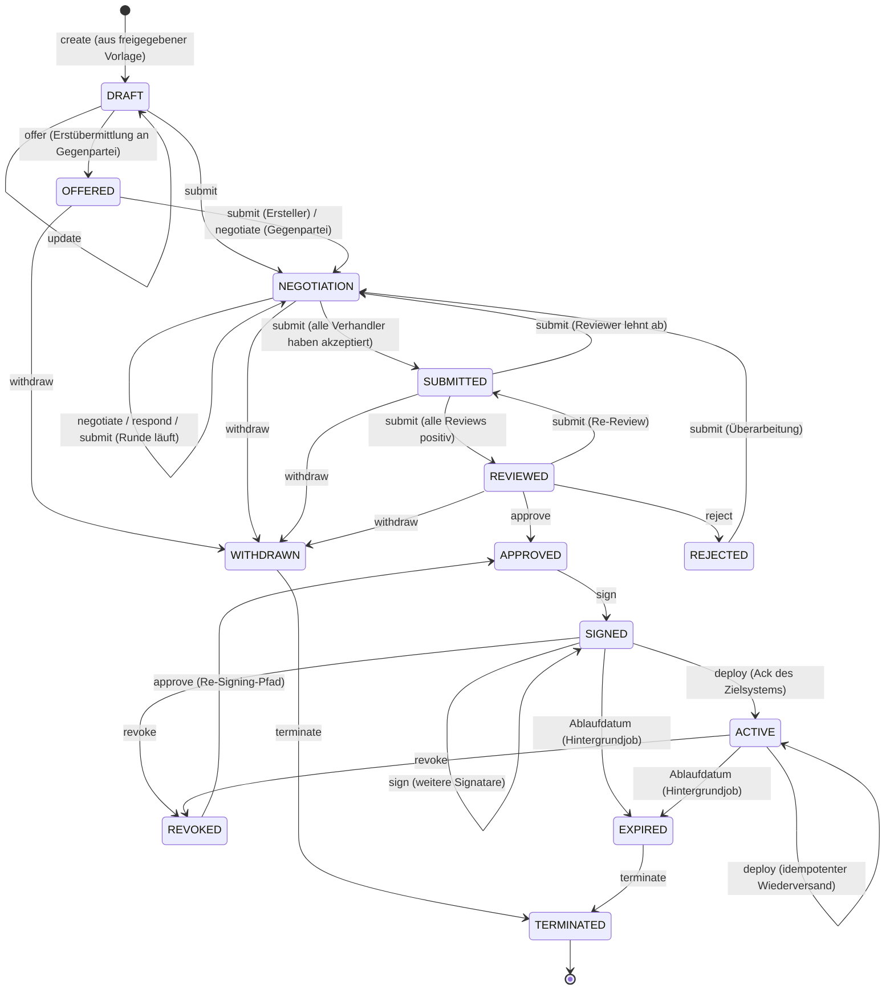
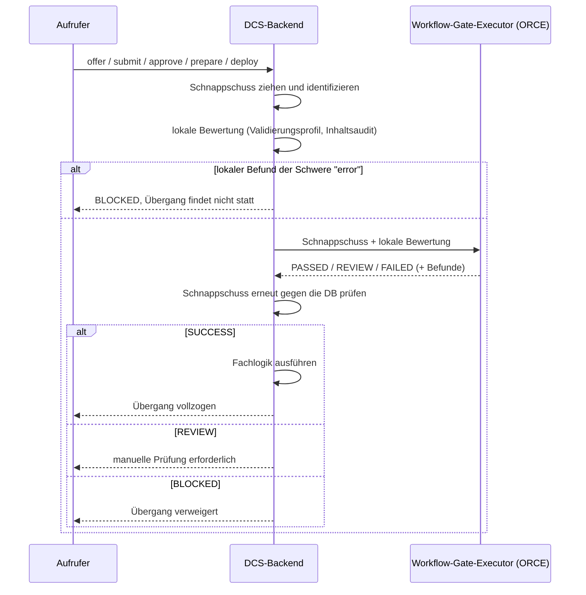
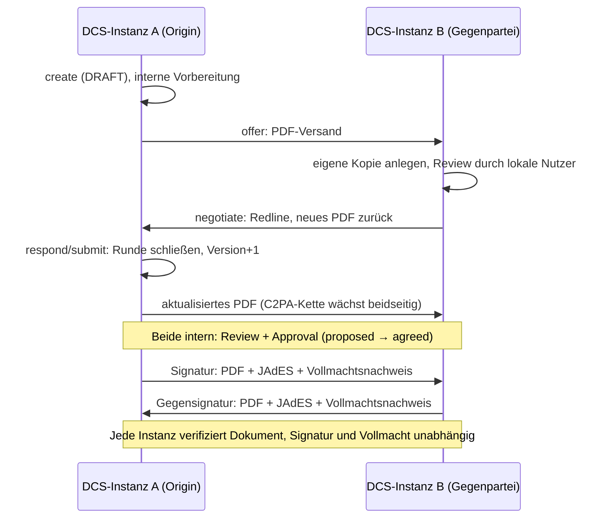

# 04 Vertragslebenszyklus

Dieses Kapitel beschreibt den Lebenszyklus eines Vertrags von der
Erstellung aus einer freigegebenen Vorlage über Verhandlung, Review und
Freigabe bis zu Signatur, Aktivierung, Beendigung und Löschung: die
zentrale State-Machine, das Berechtigungsmodell aus Rollen und Tasks,
die Workflow-Gates, die Verhandlung sowie den Unterschied zwischen einem
lokalen und einem instanzübergreifenden Vertrag.

## 4.1 Die State-Machine

Es gibt genau eine Vertrags-State-Machine im gesamten Backend (ADR-2).
Zulässige Übergänge sind als explizite Tabelle hinterlegt; jeder
Command-Handler validiert dagegen, bevor er seine Fachlogik ausführt.
Ein unzulässiger Übergang ist ein Client-Fehler, kein interner Fehler.

Ergänzend zum Diagramm:

- **Terminate** ist aus jedem nicht-terminalen Zustand erreichbar (im
  Diagramm nur exemplarisch gezeigt).
- **Submit ist bewusst überladen:** Seine Wirkung hängt vom Zustand ab
  (4.4). Die Übergangstabelle begrenzt die legalen Ausgänge; welcher
  eintritt, entscheidet die Task-Orchestrierung.
- **Withdraw** ist nur bis zur Freigabe möglich.
- **Expired** setzt ein Hintergrundjob anhand des Ablaufdatums, aus
  jedem laufenden Zustand vom Angebot bis `ACTIVE` (im Diagramm
  exemplarisch ab `SIGNED`); Entwürfe sowie abgelehnte, zurückgezogene
  und widerrufene Verträge lässt er unangetastet. Eine Datenbanksicht
  zeigt den Zustand schon vorher zum Abfragezeitpunkt. Mit dem Übergang
  wird `contract.expired` publiziert.
- **Renew** ist kein Zustandsübergang: Die Verlängerung erzeugt eine
  neue, verknüpfte Vertragsinstanz in `DRAFT` mit Rückreferenz auf das
  Original. Die Signatare der Vorperiode werden aus dem neuen Entwurf
  entfernt.

**Extrinsischer Lebenszyklus.** Über die Instanzgrenze präsentiert jeder
Vertrag einen abgeleiteten Verhandlungslebenszyklus: alle
Formationszustände bis `REVIEWED` als `proposed`, die beidseitige
interne Freigabe als `agreed` (hier öffnet sich das Signatur-Gate), ein
Vertrag mit vollständig vorliegenden Signaturen als `executed`. Für
`executed` muss jede deklarierte Signatur tatsächlich vorliegen,
einschließlich der kryptographisch geprüften Signatur der Gegenseite.
Beide Instanzen leiten denselben Wert aus dem gemeinsamen Artefakt ab;
es wird kein Zustand über die Föderationsgrenze synchronisiert.

## 4.2 Rollen, Tasks und RBAC

Die Autorisierung hat zwei getrennte Schichten:

1. **Lokale RBAC-Rollen** bestimmen, welcher Nutzer eine Operation
   grundsätzlich ausführen darf: Contract Creator, Reviewer, Approver,
   Negotiator, Manager, Signer und Observer. Maschinelle Aufrufer treten
   in einer eigenen `Sys.`-Klasse auf, die nur einen Teil davon
   spiegelt; für Verhandeln und Beobachten gibt es kein maschinelles
   Pendant, und die maschinelle Signaturklasse trägt keine
   Signaturberechtigung (Kapitel 05 und 06). Audit-Lesezugriff haben
   Auditor, Archive Manager und Compliance Officer.
2. **Tasks binden Zuständigkeit an den konkreten Vertrag.** Die Rolle
   erlaubt die Operation, der Task entscheidet, ob dieser Aufrufer für
   diesen Vertrag zuständig ist.

Die Tasks sind kleine Sub-State-Machines, die als Fan-in-Gates die
großen Übergänge steuern:

| Task | Zustände | Gate |
| --- | --- | --- |
| Negotiation-Task | offen → akzeptiert | Erst wenn kein Verhandler-Task mehr offen ist, kann `NEGOTIATION → SUBMITTED` erfolgen |
| Review-Task | offen → freigegeben / abgelehnt | Steuert `SUBMITTED → REVIEWED`; eine Ablehnung öffnet die Verhandlung erneut |
| Approval-Task | offen → freigegeben / abgelehnt | Steuert `REVIEWED → APPROVED` |

Jede Instanz erstellt und besitzt ausschließlich ihre eigenen Tasks;
Task-Zustände überqueren nie die Instanzgrenze (4.5).

**Der Lebenszyklus ist API-vollständig.** Jeder Schritt von der
Erstellung über Review und Freigabe bis zu Signatur und Archivierung
ist einzeln über die authentifizierte HTTP-API auslösbar und erzeugt
dieselben Zustands- und Evidenzketten wie die Bedienung über die
Oberfläche; das Frontend ist nur ein weiterer API-Client. Maschinelle
Aufrufer führen Verträge damit vollständig systemgesteuert
(Kapitel 05). Allein die Signatur bleibt eine persönliche
Wallet-Ceremony, die ebenfalls ohne Oberfläche über die API läuft
(Kapitel 06).

Für Lesezugriffe gilt zusätzlich eine Parteiprüfung: Das kanonische
Vertragsdokument ist nur für autorisierte Parteien lesbar. Eine
Verweigerung wird als Audit-Artefakt festgehalten, bevor die Ablehnung
zurückgeht; daraus speist sich das Compliance-Risiko „unautorisierter
Zugriff" (Kapitel 09).

## 4.3 Workflow-Gates: der auslagerbare Prüfschritt vor dem Übergang

Fünf Übergänge laufen zuerst durch ein **Workflow-Gate**: Angebot,
Einreichung, Freigabe, Signaturvorbereitung und Deployment. Ein Gate
arbeitet auf einem unveränderlichen Schnappschuss des Vertrags (Version,
Zustand, Inhalts-Hash, gepinnte Shapes, Profilversion):

- **Der Lauf ist Evidenz.** Jeder Gate-Lauf wird mit Korrelations-ID,
  Schnappschuss-Identität, Anfrage und Antwort persistiert und ist über
  die Compliance-API abrufbar. Zwei Läufe desselben Schnappschusses am
  selben Gate sind derselbe Lauf.
- **Der Schnappschuss wird nach der Antwort erneut geprüft.** Eine
  zwischenzeitliche inhaltliche Änderung verwirft das Ergebnis; rein
  technische Schreibvorgänge (PDF-Regeneration, Audit) blockieren nicht.
- **`REVIEW` ist eine Wartestellung, kein Fehler.** Ein Compliance
  Officer entscheidet den Lauf mit Begründung; bei Freigabe wird genau
  der angehaltene Übergang fortgesetzt.
- **Fail-closed.** Ein nicht konfigurierter oder nicht erreichbarer
  Executor blockiert; der Lauf wird trotzdem mit Ursache festgehalten.
  Der Executor ist deshalb eine harte Startabhängigkeit.

## 4.4 Verhandlung

Die Verhandlung findet in `NEGOTIATION` statt, oder auf einem
eingegangenen Angebot in `OFFERED`, und dreht sich um Change-Requests:

- **Vorschlagen.** Ein Change-Request ist entweder Freitext (eine
  Anmerkung nur für den Verhandlungs-Audit-Trail) oder ein
  strukturierter Redline auf die Vertragsdaten. Ein Redline wird sofort
  auf die Vertragsdaten angewendet; das PDF rendert mit dem
  vorgeschlagenen Wert neu und wird an die Gegenpartei verschifft (4.5),
  die den Redline im empfangenen Dokument begutachtet.
- **Entscheiden.** Jeder zuständige Verhandler akzeptiert oder lehnt
  einen Change-Request ab (Ablehnung mit Begründung).
- **Runde abschließen.** Submit ist der Rundenabschluss: Sind noch
  Verhandler-Tasks offen, bleibt der Vertrag in `NEGOTIATION`; sind
  akzeptierte Change-Requests zu mergen, werden sie zusammengeführt, die
  Version zählt hoch, und eine neue Runde beginnt; ist nichts mehr zu
  mergen, wechselt der Vertrag nach `SUBMITTED`.

**Verhandlungs-Drafts.** Ein Verhandler kann einen Change-Request
vorbereiten: Der Draft wird pro (Vertrag, Partei) gespeichert und von
allen Verhandlern derselben Partei geteilt. Er ändert keinen Zustand,
erzeugt kein Audit-Ereignis und verlässt die Instanz nicht; erst das
Vorschlagen macht ihn zum Change-Request und löscht ihn.

## 4.5 Lokal vs. grenzüberschreitend

Ein Vertrag hat genau eine **Ursprungsinstanz** (Origin) und genau eine
**Gegenpartei**, ein Peer-DCS, identifiziert über `did:web` und bei der
Vertragserstellung benannt. Lokal (Origin gleich aufrufende Instanz)
sind alle Zuständigkeiten lokale Tasks, und nichts verlässt die Instanz
außer einem optionalen Deployment.

Grenzüberschreitend führt **jede Instanz die State-Machine auf ihrer
eigenen Kopie**; Aufrufe werden nicht an die Origin weitergereicht. Über
die Grenze wandert ausschließlich das Vertragsdokument (ADR-13). Die
Autorisierung spiegelt das: Auf der Origin-Instanz verlangt das
Verhandeln einen lokalen Verhandler-Task; auf der Empfängerseite leitet
sich das Recht aus der Eigenschaft als benannte Gegenpartei ab. Das
Bearbeiten des Entwurfs (update) ist nur auf der Origin-Instanz
zulässig.

**Das PDF ist das Wire-Format.** Bei jedem versandpflichtigen Schritt
wird das Vertrags-PDF verschifft: mit eingebettetem JSON-LD,
C2PA-Provenance-Kette und vorhandenen Signaturen. Ein nacktes PDF ist
ein Vorschlag; ein PDF mit beigefügter JAdES ist die Signatur der
Gegenseite. Der Empfänger authentifiziert den Absender über eine
did:web-Challenge-Response-Signatur, lässt pdf-core prüfen, dass der
Seiteninhalt der Re-Render der eingebetteten Payload ist, und
aktualisiert seine lokale Kopie (Kapitel 07 und 08).

Trust-Modell und Peer-Authentifizierung behandelt Kapitel 08, die
Signatur-Zeremonie Kapitel 06.

## 4.6 Nach der Signatur: Deployment, Widerruf, Beendigung

### Zielsystem-Registry und Designation (ADR-25)

Contract Target Systems sind eine administrierte Registry der Instanz
mit Name, Endpunkt und Aktiv-Kennzeichen. Jeder Vertrag **designiert**
sein Deployment-Ziel. Ein deaktiviertes Ziel kann nicht designiert
werden; ein designiertes Ziel kann nicht gelöscht werden. Ein Vertrag
ohne designiertes Ziel deployt nicht, und das ist ein normaler Ausgang:
Der automatische Trigger nach Signaturabschluss tut dann nichts, ein
manueller Deploy wird mit Begründung abgewiesen.

### Deployment

Ein vollständig signierter Vertrag wird als JSON-LD-Payload mit
Vertrags-DID, Version, Content-Hash, Zeitstempel und der ODRL-Policy an
das designierte Ziel übermittelt; ein manueller Deploy darf per
Override an ein anderes registriertes Ziel gehen, ohne die Designation
zu ändern.

Das **Deploy-Gate** verlangt, dass jedes deklarierte Signaturfeld
signiert ist. Für die eigenen Felder zählt die lokal aufgezeichnete
Signatur, für die Gegenseite das verifizierte JAdES-Artefakt aus deren
signierter Sendung. Eine Partei kann einen Vertrag nicht allein in die
Ausführung bringen. Die Instanz hält je Vertrag genau eine
Gegenseiten-Signatur; ein Vertrag mit drei oder mehr Parteien wird
deshalb nicht deployt, statt eine unvollständige Signaturlage als
vollständig zu behandeln.

Der Deployment-Datensatz hält den Endpunkt fest, wie er beim Versand
galt; der Versand trägt eine Correlation-ID und einen nachrechenbaren
Content-Hash. Ein fehlgeschlagener Versand steht am Datensatz und wird
vom Compliance-Monitor als Risiko gemeldet. Die Bestätigung kommt
asynchron als Callback und schaltet den Vertrag auf `ACTIVE`; das
Zielsystem authentifiziert sich als sein eigener OAuth2-Client und kann
nur eigene Deployments quittieren (ADR-27). Die quittierte
Ausführungs-Evidenz erhält einen RFC-3161-Zeitstempel und steht am
Archiv-Eintrag. Über denselben Callback meldet das Zielsystem später
KPI-Beobachtungen samt seinem Urteil zur jeweiligen ODRL-Regel
(Kapitel 09).

### Widerruf, Beendigung, Ablauf

- **Widerruf** versetzt den Vertrag von `SIGNED`/`ACTIVE` nach
  `REVOKED`; ein erneutes Approve führt zurück nach `APPROVED`
  (Re-Signing). Bei einem grenzüberschreitenden Vertrag geht der
  Widerruf unmittelbar an die Gegenpartei und ist der einzige
  Peer-Zustand, den der Empfänger übernimmt (Kapitel 08).
- **Terminate** mit Begründung beendet den Vertrag endgültig.
- **Ablauf:** Der Hintergrundjob persistiert `EXPIRED` und publiziert
  das Ereignis. Die hinterlegte Expiration-Policy wird dabei
  **aufgezeichnet, aber nicht automatisch ausgeführt**; die
  Folgehandlung ist manuell oder über Webhooks orchestriert. Ein Vertrag
  ohne Expiration-Policy wird vom Job übersprungen und protokolliert.

### Archiv und Löschung

Abgeschlossene Verträge liegen mit ihrer Evidenz im Langzeitarchiv,
strukturiert durchsuchbar (Volltext, Name, Zustand, Partei, Zeitraum,
Tags), mit Dashboard für Bestands- und Compliance-Statistiken.

Die Löschung eines Archiveintrags ist begründungspflichtig und hat zwei
Wirkungen: Der Eintrag wird als gelöscht markiert und bleibt
nachweisbar, die archivierten Snapshots werden entfernt; und die
**Inhaltsschlüssel des Vertrags werden vernichtet** (ADR-28), lokal und
per Aufforderung an jede Gegenpartei-Instanz. Danach sind Export,
Verifikation und Bundle-Abruf dauerhaft nicht mehr möglich; Listen- und
Metadatensichten funktionieren weiter. Eine nicht erreichbare Gegenseite
blockiert nicht: Die Anforderung bleibt offen und wird periodisch erneut
zugestellt. Der Fortschritt ist über eine eigene Statusabfrage sichtbar
(Kapitel 09).

## 4.7 Betriebsverhalten

- **Optimistische Nebenläufigkeit:** Zustandsverändernde Endpunkte
  verlangen den Zeitstempel des gesehenen Standes; ein veralteter Stand
  wird mit „bitte neu laden" abgewiesen, bei synchronisierten Verträgen
  mit „Synchronisation erzwingen und neu laden". Verglichen wird gegen
  den Inhalts-Zeitstempel, so dass Hintergrundschreibvorgänge keine
  Fehlalarme auslösen.
- **Unzulässige Übergänge** fängt die Übergangstabelle als Client-Fehler
  mit sprechender Meldung ab.
- **Blockierende Prüfungen:** SHACL-Fehlerbefunde und offene
  Pflichtfelder oder ODRL-referenzierte leere Werte verhindern Angebot,
  Freigabe und Signaturvorbereitung (Kapitel 03).
- **Jede Zustandsänderung** schreibt ihr Audit-Ereignis in derselben
  Transaktion; der Audit-Trail ist lückenlos gegenüber der
  Zustandshistorie (Kapitel 09).
- **Lebenszyklus-Ereignisse** erreichen externe Abonnenten über die
  Webhook-Plattform mit Zustellprotokoll und Quittung (Anhang A).
- **Deployment-Vorgänge** sind über Correlation-IDs mit ihren Callbacks
  korrelierbar; ein nie zugestellter Versand ist von einem quittierten
  unterscheidbar.
