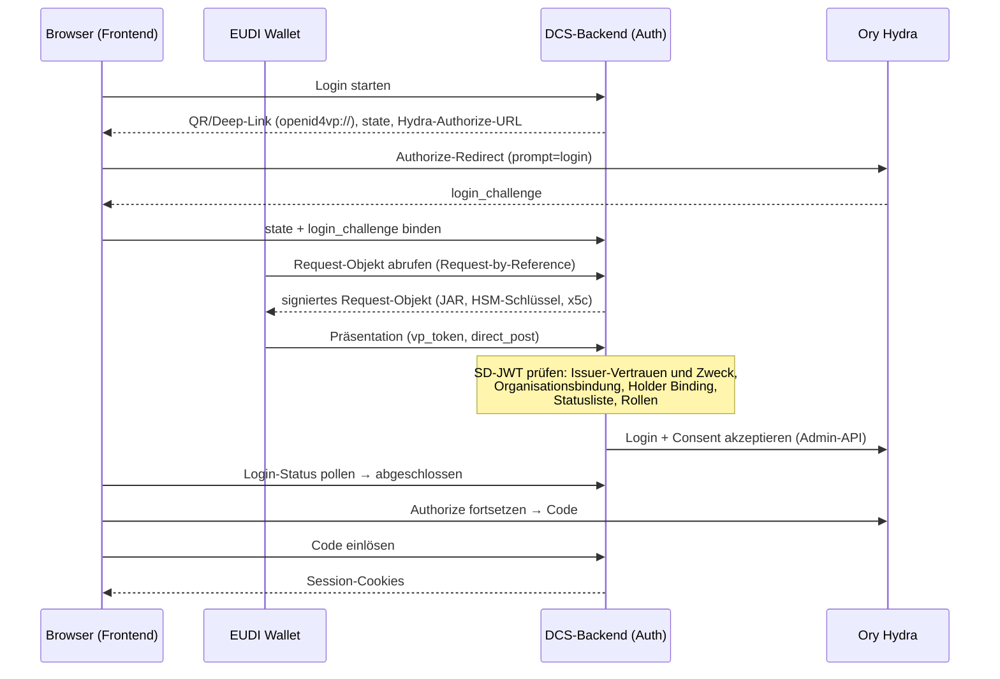

# 05 Identität und Authentifizierung

Das DCS kennt drei Identitätsebenen, die strikt getrennt gehalten werden:
**Endnutzer** (Menschen, die sich mit einer Wallet anmelden),
**Maschinen-Identitäten** (automatisierte Aufrufer mit eigenem
OAuth2-Client) und die **DCS-Instanz selbst** (eine `did:web`-Identität
mit HSM-gestütztem Schlüsselmaterial). Vertrauen entsteht auf jeder Ebene
kryptographisch, aus Verifiable Credentials, signierten Tokens und
verifizierbaren DID-Dokumenten; Netzwerkposition oder Konfigurationsnähe
begründen nichts (Zero-Trust-Modell, vgl. Kapitel 01).

Quer über alle drei Ebenen liegt eine vierte Frage, die dieses Kapitel
zuletzt behandelt: **Wem darf die Instanz als Aussteller von Credentials
glauben, und wofür?**

## 5.1 Endnutzer: Login per OID4VP und SD-JWT VC

### Beteiligte Komponenten

| Komponente | Rolle |
| --- | --- |
| EUDI Wallet (bzw. kompatible Wallet) | Hält die Credentials des Nutzers und legt sie per OpenID4VP vor |
| DCS-Backend (Auth-Domäne) | OID4VP-Verifier: baut das Presentation Request, prüft die Vorlage, entscheidet über den Login |
| Ory Hydra | OAuth2/OIDC-Provider: stellt Access-, Refresh- und ID-Token aus, verwaltet die Browser-Session |
| Frontend | Zeigt den QR-Code / Deep Link, pollt den Login-Status, führt den Browser durch den OIDC-Flow |

Hydra kennt selbst keine Nutzer und keine Passwörter. Die eigentliche
Authentifizierungsentscheidung trifft ausschließlich das DCS-Backend anhand
der verifizierten Wallet-Vorlage. Hydra dient als Token-Fabrik, deren
Login- und Consent-Challenges das Backend über die Hydra-Admin-API
akzeptiert und dabei die verifizierten Claims (Subjekt, Organisation,
Rollen) in die Token-Session übernimmt.

### Das Credential: Proof of Authority (PoA)

Für den Login verlangt das DCS ein **Proof-of-Authority-Credential** vom
Typ `urn:dcs:poa:v1` im Format `dc+sd-jwt` (SD-JWT VC mit selektiver
Offenlegung). Es trägt zwei entscheidende Claims: `organization`, die
Partei, für die der Nutzer handelt, und `roles`, die Rollen, die der
Aussteller dem Nutzer eingeräumt hat. Welche Credentials und Claims
angefragt werden, beschreibt eine DCQL-Query; die Standard-Query verlangt
kryptographisches Holder Binding und ist per Konfiguration vollständig
überschreibbar.

Die `organization` ist eine Parteikennung, nicht die Identität des
Deployments: Eine Instanz bedient legitimerweise mehrere Organisationen
gleichzeitig. Welcher Aussteller für welche Organisation sprechen darf,
entscheidet die Trust-Konfiguration (5.4).

### Ablauf

Das Request-Objekt (JAR) wird mit einem eigenen HSM-Schlüssel signiert und
trägt die Zertifikatskette der Instanz im Header. Der der Wallet
präsentierte Client-Identifier folgt dem Schema `x509_san_dns` und
entspricht dem SAN des Leaf-Zertifikats. Eine Wallet außerhalb einer
vorab vereinbarten Föderation lehnt einen unpräfixierten,
„pre-registered" gemeinten Identifier ab, bevor sie überhaupt ein
Credential ansieht; ein bloßer Schlüssel im Header würde nur Besitz
beweisen und an nichts verankern. Login-States sind zeitlich begrenzt und
verlängerbar, ohne den OIDC-State zu wechseln.

### Verifikation der Vorlage

Die eingehende Präsentation durchläuft eine feste Prüfkette. Jede Stufe
ist ein hartes Abbruchkriterium:

1. **Aussteller und Zweck.** Der Aussteller muss in der
   Trust-Konfiguration stehen und für den Zweck `login` zugelassen sein;
   sein Verifikationsschlüssel wird über den für ihn deklarierten
   Mechanismus aufgelöst (5.4). Der Credential-Typ muss zu den
   zugelassenen `vct`-Werten gehören.
2. **Organisationsbindung.** Die im Credential offengelegte
   `organization` muss zu den Organisationen gehören, für die dieser
   Aussteller sprechen darf.
3. **Holder Binding.** Der Bindungsschlüssel des Credentials ist
   maßgeblich: Das Subjekt muss dem daraus abgeleiteten Identifier
   entsprechen, und der Key-Binding-JWT muss mit genau diesem Schlüssel
   signiert sein sowie Audience, Nonce und den Hash der Offenlegungen der
   laufenden Präsentation tragen (Replay-Schutz).
4. **Statusliste.** Der Widerrufsstatus wird gegen die referenzierte
   Statusliste geprüft, auf jedem Pfad, für jeden Zweck, ohne Ausnahme.
   Unterstützt werden mehrere Mechanismen (IETF Token Status List, W3C
   Bitstring Status List in verschiedenen Proof-Formaten,
   XFSC-Statuslisten); auch die Statusliste selbst muss signiert und
   vertrauenswürdig sein. Eine nicht erreichbare Statusliste führt zur
   Ablehnung.
5. **Rollen.** Jede offengelegte Rolle muss eine gültige DCS-Rolle sein;
   ohne offengelegte Rollen wird der Login abgelehnt. Die gewährten Rollen
   landen im Access-Token und sind die Grundlage der endpunktweisen
   RBAC-Prüfung (Kapitel 04).

### PID-Präsentation

Neben dem PoA-Login gibt es einen eigenständigen, sessionlosen
PID-Präsentationsfluss für Fälle, in denen die natürliche Person selbst
nachgewiesen werden muss, insbesondere als Vorstufe der
Signatur-Ceremony (Kapitel 06). Die Verifikation folgt derselben Kette wie
beim Login, mit dem Zweck `pid` statt `login`; die Organisationsbindung
entfällt, weil ein Identitätsnachweis eine Person attestiert und keine
Organisation.

Welcher PID-Aussteller vertraut wird, ist reine Trust-Konfiguration. Ein
PID-Aussteller ist konstruktionsbedingt ein **Dritter**: Die Instanz darf
den Identitätsnachweis nicht ausstellen, den sie später als Beweis
akzeptiert, wer unterschrieben hat. Das wäre die vertrauende Partei, die
sich selbst attestiert (ADR-31).

### Schutzmechanismen und Audit

- **IP-Lockout:** Fehlgeschlagene Token-Validierungen werden je Quell-IP
  gezählt; nach fünf Fehlversuchen im Zeitfenster wird die IP für 15
  Minuten gesperrt. Eine gültige Anmeldung mit fehlender Rolle ist
  dagegen eine Autorisierungsentscheidung und zählt nicht zum Lockout;
  sie wird als authentifiziertes Zugriffsereignis auditiert.
- **Audit-Trail:** Zugriffs- und Präsentationsversuche, erfolgreiche wie
  fehlgeschlagene, werden persistiert und in den
  manipulationsnachweisbaren Audit-Trail eingespeist (Kapitel 09).
- **Anfragebudget je Credential:** Jede authentifizierte API-Anfrage wird
  gegen ein festes Ein-Minuten-Fenster je Credential gezählt; oberhalb des
  Budgets antwortet das DCS mit `429 Too Many Requests` und `Retry-After`.
  Unauthentifizierte Routen (Login, DID-Dokument, statische Assets,
  Probes) zählen nicht. Rohe Tokens werden dafür nie im Speicher
  gehalten; gezählt wird über einen gekürzten Hash des Credentials.

## 5.2 Maschinen-Identitäten: ausgestellte Credentials über Hydra

Maschinelle Aufrufer (Integrationen, Orchestrierungs-Flows,
Zielsysteme) authentifizieren sich mit dem **Client-Credentials-Grant**
direkt bei Hydra. Jeder Aufrufer erhält dafür einen **eigenen
OAuth2-Client**, den das DCS über die Hydra-Admin-API provisioniert
(ADR-27). Eine **Machine-Identity-Registry** verzeichnet je Identität den
OAuth2-Client, die Partei, der die Aktionen des Aufrufers zugerechnet
werden, die Rollen (typisch die `Sys.`-Rollenvarianten) und ob die
Identität aktiv ist.

Berechtigungen werden bei jeder Anfrage anhand der Client-ID aus der
Registry gelesen, nie aus Token-Claims: Ein Client-Credentials-Token
trägt keine Rollenangaben, und nichts, was ein Aufrufer vorlegt, kann
seine Rechte erweitern. Ohne Registry-Eintrag oder mit deaktiviertem
Eintrag wird kein maschineller Aufrufer akzeptiert.

Die Credentials sind **ausgestellt, nicht konfiguriert**: Beim Anlegen
einer Identität und bei jeder Rotation wird das Client-Secret genau
einmal in der Antwort angezeigt. Das DCS speichert es nie, Hydra hält
nur einen Hash und hat keine Schnittstelle, es zurückzulesen; „einmal
sichtbar" ist damit eine Eigenschaft des Systems, keine UI-Konvention.
Eine Rotation stellt ein neues Secret aus und invalidiert das alte
sofort; das Löschen einer Identität löscht auch ihren OAuth2-Client,
sodass kein Credential den Eintrag überlebt, der es rechtfertigt. Das
Deaktivieren weist die Identität bei der nächsten Anfrage ab, ohne auf
einen Secret-Ablauf zu warten. Verwaltet wird das als
Administrationsvorgang durch den Sys. Administrator; Ausstellen,
Rotieren und Widerrufen sind auditierte Betriebshandlungen und keine
Deployment-Schritte.

Die Deployment-Konfiguration `DCS_SYSTEM_CLIENTS` ist ein **Seed**: Ihre
Einträge werden beim Start in die Registry übernommen, weil ein Deployment
Aufrufer braucht, die existieren, bevor sich ein Mensch anmelden kann, um
sie anzulegen. Zur Laufzeit wird ausschließlich die Registry gelesen; es
gibt einen Auflösungspfad, nicht zwei. Eine ungültige Rolle in der
Deklaration lässt den Start scheitern.

**Contract Target Systems** sind keine allgemeinen Maschinen-Identitäten.
Die Rolle `Contract Target System` autorisiert ausschließlich den
Deployment-Callback, und dort nur Deployments, die an genau dieses Ziel
versandt wurden. Das Callback-Credential eines Ziels ist derselbe
Mechanismus (eigener OAuth2-Client, Secret einmal sichtbar, Rotation) und
ist an den Registry-Eintrag des Ziels gebunden; ein Ziel ohne
ausgestelltes Credential kann kein Deployment quittieren (Kapitel 04).

**Rollengrenze zwischen Mensch und Maschine.** Die `Sys.`-Rollen sind
bewusst nicht deckungsgleich mit den menschlichen. Der Katalogzugriff
etwa ist nur menschlichen Vertragsrollen zugänglich, und die Registrierung
neuer Semantic-Hub-Versionen verlangt den Template Manager, für den es
keine `Sys.`-Variante gibt. Diese Grenze zu weiten, um einen Ablauf ohne
Wallet-Login durchzuspielen, hebt eine bewusste Entscheidung auf.

**Der clusterinterne Dienst-Token.** Daneben existiert ein Pfad für den
ereignisgetriebenen PDF-Regenerator: Er trägt kein Nutzer-Token, sondern
ein im Deployment gesetztes Dienst-Credential und erhält damit exakt die
Scopes des jeweiligen Endpunkts. Dieser Abgleich findet **vor**
Token-Validierung, Rollenprüfung und Lockout statt: Wer den Wert
besitzt, ist auf jeder authentifizierten Route ein Aufrufer mit vollen
Rechten. Dass er den Cluster nicht verlässt, ist eine Eigenschaft der
vorgesehenen Aufrufer, nicht der Prüfung; der Wert ist entsprechend zu
behandeln. Das Chart erzwingt, dass ein Betreiber ihn setzt, und einen
mitgelieferten Vorgabewert gibt es nicht. Herkunft und Ablage beschreibt
der [Deployment-Leitfaden](../deployment-guide.md).

Wichtig für die Einordnung: Maschinelles Signieren ist im DCS **keine**
AES-Signatur einer Person (ADR-17). Maschinen-Identitäten handeln als
System, nicht als Signatar.

## 5.3 Instanz-Identität: did:web mit HSM-Schlüsseln

Jede DCS-Instanz besitzt eine eigene `did:web`-Identität. Das
DID-Dokument wird unter `/.well-known/did.json` ausgeliefert und
publiziert die öffentlichen Schlüssel der Instanz. Die Auflösung folgt
der did:web-Methode vollständig, auch für Identifier mit Pfadsegmenten:
ein bloßes `did:web:host` wird unter `/.well-known/did.json` aufgelöst,
ein `did:web:host:pfad:segment` unter `/pfad/segment/did.json`. So können
mehrere Instanzen einen Host teilen, ohne dass alle DIDs auf dasselbe
Dokument zeigen; auch der Föderationsversand adressiert einen Peer unter
dessen eigenem Pfadpräfix (Kapitel 08).

Die zugehörigen privaten Schlüssel liegen **ausschließlich** in einem
PKCS#11-Token und verlassen es nie (ADR-1). Es gibt bewusst keinen
Software-Fallback: Sind Modulpfad, Token-Label oder PIN falsch, wird der
Prozess nicht gesund. Ein fehlendes Token ist dabei von einer
Fehlkonfiguration unterschieden. Der Prozess wartet auf das Token, weil
bei einer frischen Installation die Provisionierung noch laufen kann
(Kapitel 10).

Die Schlüssel sind nach Zweck getrennt (alle ECDSA P-256):

| Standard-Label | Zweck |
| --- | --- |
| `dcs-did` | Instanz-Identität: JAdES-Signaturen der Föderation, DID-Challenge-Response |
| `dcs-vc` | Lifecycle-, Provenance- und Federation-Agreement-Credentials (bewusst vom Identitätsschlüssel getrennt) |
| `dcs-oid4vp-jar` | Signieren der OID4VP-Request-Objekte |
| `dcs-c2pa` | COSE-Signaturen der C2PA-Manifeste (Kapitel 07) |
| `dcs-ecdh` | Schlüsselvereinbarung: entpackt die Inhaltsschlüssel der Artefaktverschlüsselung (ADR-28) |

Der Schlüsselvereinbarungs-Schlüssel ist eine harte Startabhängigkeit.
Beim Start wickelt die Instanz einen Testschlüssel gegen den im
DID-Dokument publizierten `keyAgreement`-Eintrag und packt ihn mit dem
HSM wieder aus. Schlägt das fehl, passen publizierter und tatsächlicher
Schlüssel nicht zusammen oder dem Token fehlt die Ableitungsfähigkeit. In
beiden Fällen wäre kein gespeichertes Artefakt lesbar, und die Instanz
startet nicht.

Einen Vertrags-Signaturschlüssel hält die Instanz bewusst nicht:
Vertragssignaturen erzeugt ausschließlich der Signatar mit dem eigenen
Schlüssel (ADR-12/ADR-20, Kapitel 06).

Schlüsselrotation erfolgt über versionierte Labels; alte Versionen
bleiben im Token, damit historische Signaturen verifizierbar bleiben.
Welche Schlüssel die Instanz hält, mit welchem Zweck und in welcher
aktiven Version, ist über eine Inventar-Abfrage für den Sys.
Administrator sichtbar. Die Rotation selbst ist ein Betriebsverfahren,
keine API-Handlung (siehe [Key-Management-Konzept](../key-management-concept.md)
und den [Deployment-Leitfaden](../deployment-guide.md)).

Weil `pdf-core` nie einen Signer hält, liefert es nur die zu
signierenden Daten zurück; signiert wird ausschließlich im Backend.

## 5.4 Ausstellervertrauen: zweckgebunden, organisationsgebunden, mechanismusoffen

Ob ein Credential akzeptiert wird, entscheidet nicht eine einzige Frage
(„ist die Signatur dieses Ausstellers in Ordnung?"), sondern drei
getrennte (ADR-31):

**Zweck.** Jeder Aussteller wird für eine explizite Menge von Zwecken
zugelassen:

| Zweck | Bedeutung |
| --- | --- |
| `login` | Seine Credentials dürfen eine Session auf **dieser** Instanz begründen |
| `peer` | Seine Credentials werden in einer Signatur-Ceremony akzeptiert, und seine Aussage über die Vollmacht einer Gegenpartei wird geglaubt |
| `pid` | Er darf die Identität einer natürlichen Person attestieren |

Ein Eintrag ohne Zweckangabe wird beim Laden abgewiesen. Ihn
stillschweigend als „alle Zwecke" zu lesen wäre genau die Vermischung,
die diese Trennung beseitigt. Welche Aussteller welchen Zweck erhalten,
ist Betreiberentscheidung; in Produktion sind mehrere Login-Aussteller
normal.

**Organisation.** Ein Aussteller darf nur Organisationen attestieren, die
in seinem eigenen Eintrag stehen. Ein Credential, dessen `organization`
dort fehlt, wird unabhängig vom Zweck abgelehnt, so dass ein
vertrauenswürdiger Aussteller nicht für eine Partei sprechen kann, die
ihm niemand zugestanden hat. Ist ein Aussteller selbst die
Mandantenverwaltung seines Deployments, deklariert er einen expliziten
Platzhalter; eine fehlende Liste bedeutet niemals „beliebig".
PID-Aussteller sind ausgenommen, weil ein Identitätsnachweis eine Person
attestiert und keine Organisation.

**Mechanismus.** Jeder Aussteller deklariert, wie sein
Verifikationsschlüssel aufgelöst wird:

| Mechanismus | Auflösung |
| --- | --- |
| `jwks` | Im Eintrag hinterlegte Schlüssel, über die Schlüssel-ID zugeordnet |
| `x5c` | Zertifikatskette im Credential-Header, verifiziert gegen konfigurierte Vertrauensanker |
| `did:jwk` | Schlüssel aus dem Ausstellerbezeichner selbst dekodiert |
| `did:web` | Schlüssel aus dem DID-Dokument des Ausstellers geholt |
| `orce` | An einen konfigurierten ORCE-Flow delegiert |

Ein Mechanismus, den der laufende Stand nicht auflösen kann, wird **beim
Laden** abgewiesen. Ein Deployment erfährt von einer nicht unterstützten
Trust-Konfiguration beim Start, nicht wenn die erste Wallet ankommt. Neue
Registrierungsverfahren erreichen den Verifier über `orce` ohne
Codeänderung.

Der `x5c`-Pfad ist bewusst streng: Ohne konfigurierte Vertrauensanker
wird ein Credential mit Zertifikatskette **abgewiesen** und nie seinem
eigenen eingebetteten Zertifikat geglaubt. Eine gültige Kette allein
genügt außerdem nicht. Das Leaf-Zertifikat muss den Aussteller auch
benennen und darf kein für einen anderen Zweck ausgestelltes Zertifikat
sein, damit ein gewöhnliches TLS-Zertifikat desselben Hosts nicht
plötzlich Credentials signieren kann.

Über der Trust-Konfiguration liegt eine **Autorisierungs-Policy** als
eigenes Artefakt. Sie formuliert die Regeln, nach denen aus Zweck,
Organisation und Mechanismus eine Entscheidung wird. Eine Policy, die
sich nicht übersetzen lässt, stoppt den Prozess beim Start; eine, die
sich zur Laufzeit nicht auswerten lässt, verweigert. Sie rangiert über
dem Trust-Dokument: Eine Regel, die alles zulässt, hebt jeden Eintrag
darin auf. Deshalb werden beide von der Startup-Attestierung erfasst
(Kapitel 09).

## 5.5 Trust-Modell der Föderation im Überblick

Ob eine fremde DCS-Instanz als Peer akzeptiert wird, entscheidet der
**Federation Trust Gate** (ADR-19). Er wird auf beiden Pfaden konsultiert,
beim Versand eines Vertrags an einen Peer wie bei dessen Empfang, und
besteht aus zwei Schichten:

1. **Agreement-Credential.** Jede Instanz publiziert unter
   `/.well-known/dcs-agreement-credential.json` ein selbstsigniertes
   Verifiable Credential, dessen `termsOfUse`-Hash das im Binary
   eingebettete Föderationsregelwerk benennt (abrufbar unter
   `/.well-known/dcs-federation-rules.md`). Der Gate lädt das Credential
   des Peers, prüft dessen Signatur gegen den dedizierten VC-Schlüssel im
   DID-Dokument des Peers, verlangt, dass Aussteller-Hostname und
   Bezugsquelle übereinstimmen, und vergleicht den Regelwerk-Hash mit dem
   eigenen.
2. **Policy-Endpunkt.** Anschließend wird der lokale
   Policy-Decision-Point (`DCS_TRUST_PDP_URL`) mit Peer, Credential,
   Richtung und Zielzustand konsultiert. Er ist die alleinige
   Autorisierungsinstanz für Peers: Peer-Vertrauen ist Policy, keine
   Datenbanktabelle.

Der Gate arbeitet **fail-closed**. Ein nicht gesetzter, nicht erreichbarer
oder nicht mit 2xx antwortender Policy-Endpunkt verweigert genauso wie ein
explizites Deny. Jede Ablehnung wird als Incident im Audit- und
Compliance-Subsystem festgehalten. Den vollständigen Föderationsablauf
und die Prüfung der Handlungsvollmacht hinter einer Peer-Signatur
beschreibt Kapitel 08.
