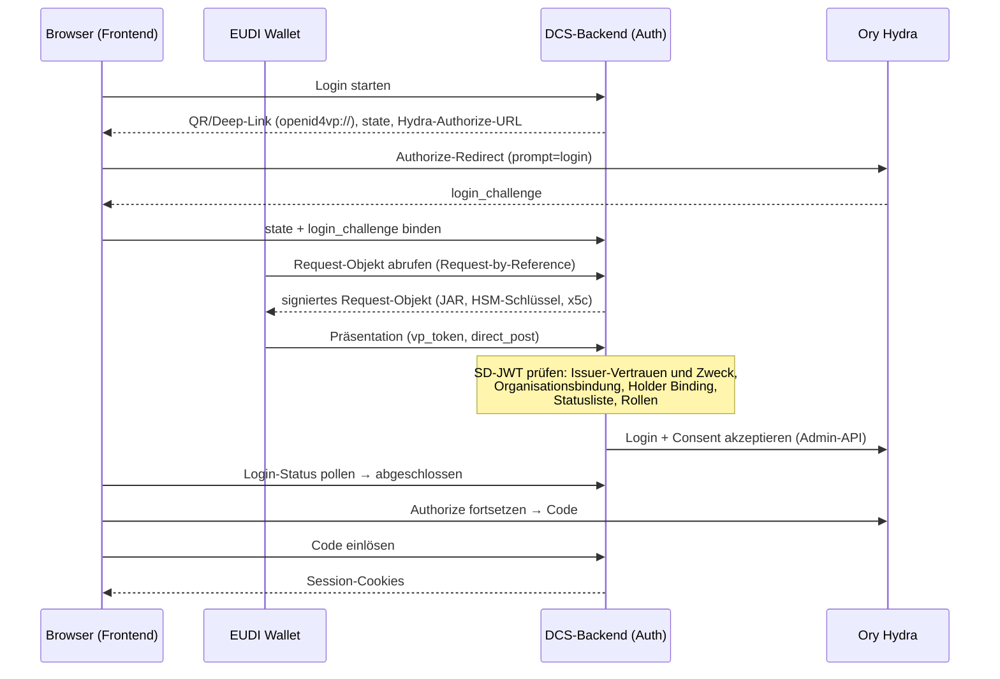

# 05 Identität und Authentifizierung

Das DCS kennt drei strikt getrennte Identitätsebenen: **Endnutzer**
(Menschen mit Wallet), **Maschinen-Identitäten** (automatisierte
Aufrufer mit eigenem OAuth2-Client) und die **DCS-Instanz selbst** (eine
`did:web`-Identität mit HSM-gestütztem Schlüsselmaterial). Quer darüber
liegt die Frage, wem die Instanz als Aussteller von Credentials glaubt,
und wofür (5.4).

## 5.1 Endnutzer: Login per OID4VP und SD-JWT VC

| Komponente | Rolle |
| --- | --- |
| EUDI Wallet (bzw. kompatible Wallet) | Hält die Credentials des Nutzers und legt sie per OpenID4VP vor |
| DCS-Backend (Auth-Domäne) | OID4VP-Verifier: baut das Presentation Request, prüft die Vorlage, entscheidet über den Login |
| Ory Hydra | OAuth2/OIDC-Provider: stellt die Tokens aus, verwaltet die Browser-Session |
| Frontend | Zeigt QR-Code / Deep Link, pollt den Login-Status, führt durch den OIDC-Flow |

Hydra kennt keine Nutzer und keine Passwörter. Die
Authentifizierungsentscheidung trifft das DCS-Backend anhand der
verifizierten Wallet-Vorlage; Hydra ist die Token-Fabrik, deren Login-
und Consent-Challenges das Backend über die Admin-API akzeptiert und
dabei die verifizierten Claims (Subjekt, Organisation, Rollen) in die
Session übernimmt.

**Das Credential: Proof of Authority (PoA).** Der Login verlangt ein
Credential vom Typ `urn:dcs:poa:v1` im Format `dc+sd-jwt` mit zwei
entscheidenden Claims: `organization`, die Partei, für die der Nutzer
handelt, und `roles`, die ihm eingeräumten Rollen. Die angefragten
Credentials beschreibt eine DCQL-Query; die Standard-Query verlangt
Holder Binding und ist per Konfiguration überschreibbar. Die
`organization` ist eine Parteikennung, nicht die Identität des
Deployments: Eine Instanz bedient legitimerweise mehrere Organisationen.

Das Request-Objekt (JAR) wird mit einem eigenen HSM-Schlüssel signiert
und trägt die Zertifikatskette der Instanz im Header; der der Wallet
präsentierte Client-Identifier folgt dem Schema `x509_san_dns` und
entspricht dem SAN des Leaf-Zertifikats. Login-States sind zeitlich
begrenzt und verlängerbar.

**Verifikation der Vorlage.** Jede Stufe ist ein hartes
Abbruchkriterium:

1. **Aussteller und Zweck:** Der Aussteller muss in der
   Trust-Konfiguration stehen und für `login` zugelassen sein; sein
   Schlüssel wird über den für ihn deklarierten Mechanismus aufgelöst
   (5.4). Der Credential-Typ muss zugelassen sein.
2. **Organisationsbindung:** Die offengelegte `organization` muss zu den
   Organisationen gehören, für die dieser Aussteller sprechen darf.
3. **Holder Binding:** Subjekt und Key-Binding-JWT müssen an den
   Bindungsschlüssel des Credentials sowie an Audience, Nonce und
   Offenlegungs-Hash der laufenden Präsentation gebunden sein
   (Replay-Schutz).
4. **Statusliste:** Widerrufsprüfung auf jedem Pfad, für jeden Zweck;
   auch die Statusliste selbst muss signiert und vertrauenswürdig sein.
   Eine nicht erreichbare Statusliste führt zur Ablehnung.
5. **Rollen:** Jede offengelegte Rolle muss eine gültige DCS-Rolle sein;
   ohne Rollen kein Login. Die Rollen landen im Access-Token und sind
   die Grundlage der RBAC-Prüfung (Kapitel 04).

**PID-Präsentation.** Daneben gibt es einen sessionlosen
PID-Präsentationsfluss für den Nachweis der natürlichen Person,
insbesondere als Vorstufe der Signatur-Ceremony (Kapitel 06). Die
Prüfkette ist dieselbe mit Zweck `pid`; die Organisationsbindung
entfällt. Ein PID-Aussteller ist konstruktionsbedingt ein Dritter: Die
Instanz darf den Identitätsnachweis nicht selbst ausstellen, den sie
später als Beweis akzeptiert (ADR-31).

**Schutzmechanismen:**

- **IP-Lockout:** Nach fünf fehlgeschlagenen Token-Validierungen im
  Zeitfenster wird die Quell-IP für 15 Minuten gesperrt. Eine gültige
  Anmeldung mit fehlender Rolle zählt nicht zum Lockout; sie wird als
  authentifiziertes Zugriffsereignis auditiert.
- **Audit-Trail:** Zugriffs- und Präsentationsversuche werden
  persistiert und in den Audit-Trail eingespeist (Kapitel 09).
- **Anfragebudget je Credential:** Oberhalb eines Ein-Minuten-Budgets
  antwortet das DCS mit `429` und `Retry-After`. Unauthentifizierte
  Routen zählen nicht; gezählt wird über einen gekürzten Hash des
  Credentials, nie über das rohe Token.

## 5.2 Maschinen-Identitäten: ausgestellte Credentials über Hydra

Maschinelle Aufrufer authentifizieren sich mit dem
Client-Credentials-Grant bei Hydra. Jeder Aufrufer erhält einen
**eigenen OAuth2-Client**, den das DCS über die Hydra-Admin-API
provisioniert (ADR-27). Eine **Machine-Identity-Registry** verzeichnet
je Identität den Client, die Partei, der die Aktionen zugerechnet
werden, die Rollen und das Aktiv-Kennzeichen. Berechtigungen werden bei
jeder Anfrage anhand der Client-ID aus der Registry gelesen, nie aus
Token-Claims; ohne aktiven Registry-Eintrag wird kein maschineller
Aufrufer akzeptiert.

Die Credentials sind **ausgestellt, nicht konfiguriert**: Das
Client-Secret erscheint genau einmal in der Antwort; das DCS speichert
es nie, Hydra hält nur einen Hash. Rotation invalidiert das alte Secret
sofort, Löschen entfernt auch den Client, Deaktivieren wirkt bei der
nächsten Anfrage; verwaltet wird das als auditiertes Betriebshandeln
durch den Sys. Administrator. Die Deployment-Konfiguration
`DCS_SYSTEM_CLIENTS` ist ein **Seed** für Aufrufer, die vor dem ersten
Login existieren müssen; zur Laufzeit wird ausschließlich die Registry
gelesen, und eine ungültige Rolle im Seed lässt den Start scheitern.

**Contract Target Systems** sind keine allgemeinen
Maschinen-Identitäten: Ihre Rolle autorisiert ausschließlich den
Deployment-Callback, und dort nur Deployments an genau dieses Ziel. Das
Callback-Credential folgt demselben Mechanismus (Kapitel 04).

**Rollengrenze Mensch/Maschine.** Die `Sys.`-Rollen sind bewusst nicht
deckungsgleich mit den menschlichen: kein maschinelles Verhandeln oder
Beobachten, keine Signaturberechtigung (maschinelles Signieren ist keine
AES einer Person, ADR-17), Katalogzugriff und die Registrierung neuer
Semantic-Hub-Versionen bleiben menschlichen Rollen vorbehalten.

**Der clusterinterne Dienst-Token.** Für den ereignisgetriebenen
PDF-Regenerator existiert ein im Deployment gesetztes Dienst-Credential.
Sein Abgleich findet **vor** Token-Validierung, Rollenprüfung und
Lockout statt: Wer den Wert besitzt, ist auf jeder authentifizierten
Route ein Aufrufer mit vollen Rechten. Der Wert ist entsprechend zu
behandeln; das Chart erzwingt, dass ein Betreiber ihn setzt, einen
Vorgabewert gibt es nicht. Herkunft und Ablage beschreibt der
[Deployment-Leitfaden](../deployment-guide.md).

## 5.3 Instanz-Identität: did:web mit HSM-Schlüsseln

Jede Instanz besitzt eine `did:web`-Identität; das DID-Dokument wird
unter `/.well-known/did.json` ausgeliefert. Die Auflösung folgt der
did:web-Methode vollständig, auch für Identifier mit Pfadsegmenten, so
dass mehrere Instanzen einen Host teilen können (Kapitel 08).

Die privaten Schlüssel liegen **ausschließlich** im PKCS#11-Token und
verlassen es nie (ADR-1). Einen Software-Fallback gibt es nicht: Bei
falschem Modulpfad, Token-Label oder PIN wird der Prozess nicht gesund.
Ein fehlendes Token ist davon unterschieden: Der Prozess wartet darauf,
weil bei einer frischen Installation die Provisionierung noch laufen
kann (Kapitel 10).

Die Schlüssel sind nach Zweck getrennt (alle ECDSA P-256):

| Standard-Label | Zweck |
| --- | --- |
| `dcs-did` | Instanz-Identität: JAdES-Signaturen der Föderation, DID-Challenge-Response |
| `dcs-vc` | Lifecycle-, Provenance- und Federation-Agreement-Credentials |
| `dcs-oid4vp-jar` | Signieren der OID4VP-Request-Objekte |
| `dcs-c2pa` | COSE-Signaturen der C2PA-Manifeste (Kapitel 07) |
| `dcs-ecdh` | Schlüsselvereinbarung: entpackt die Inhaltsschlüssel der Artefaktverschlüsselung (ADR-28) |

Der Schlüsselvereinbarungs-Schlüssel ist eine harte Startabhängigkeit:
Beim Start wickelt die Instanz einen Testschlüssel gegen den im
DID-Dokument publizierten `keyAgreement`-Eintrag und packt ihn mit dem
HSM wieder aus. Schlägt das fehl, wäre kein gespeichertes Artefakt
lesbar, und die Instanz startet nicht.

Einen Vertrags-Signaturschlüssel hält die Instanz bewusst nicht:
Vertragssignaturen erzeugt ausschließlich der Signatar mit dem eigenen
Schlüssel (ADR-12/ADR-20, Kapitel 06). pdf-core hält nie einen Signer;
es liefert nur zu signierende Daten zurück.

Schlüsselrotation erfolgt über versionierte Labels; alte Versionen
bleiben im Token, damit historische Signaturen verifizierbar bleiben.
Das Schlüsselinventar ist für den Sys. Administrator abfragbar; die
Rotation selbst ist ein Betriebsverfahren
([Key-Management-Konzept](../key-management-concept.md),
[Deployment-Leitfaden](../deployment-guide.md)).

## 5.4 Ausstellervertrauen: zweckgebunden, organisationsgebunden, mechanismusoffen

Ob ein Credential akzeptiert wird, entscheiden drei getrennte Fragen
(ADR-31):

**Zweck.** Jeder Aussteller wird für eine explizite Menge von Zwecken
zugelassen; ein Eintrag ohne Zweckangabe wird beim Laden abgewiesen.
Welche Aussteller welchen Zweck erhalten, ist Betreiberentscheidung.

| Zweck | Bedeutung |
| --- | --- |
| `login` | Seine Credentials dürfen eine Session auf dieser Instanz begründen |
| `peer` | Seine Credentials werden in einer Signatur-Ceremony akzeptiert, und seine Aussage über die Vollmacht einer Gegenpartei wird geglaubt |
| `pid` | Er darf die Identität einer natürlichen Person attestieren |

**Organisation.** Ein Aussteller darf nur Organisationen attestieren,
die in seinem eigenen Eintrag stehen; eine fehlende Liste bedeutet
niemals „beliebig". PID-Aussteller sind ausgenommen, weil ein
Identitätsnachweis eine Person attestiert und keine Organisation.

**Mechanismus.** Jeder Aussteller deklariert, wie sein
Verifikationsschlüssel aufgelöst wird:

| Mechanismus | Auflösung |
| --- | --- |
| `jwks` | Im Eintrag hinterlegte Schlüssel, über die Schlüssel-ID zugeordnet |
| `x5c` | Zertifikatskette im Credential-Header, verifiziert gegen konfigurierte Vertrauensanker |
| `did:jwk` | Schlüssel aus dem Ausstellerbezeichner dekodiert |
| `did:web` | Schlüssel aus dem DID-Dokument des Ausstellers |
| `orce` | An einen konfigurierten ORCE-Flow delegiert |

Ein nicht auflösbarer Mechanismus wird **beim Laden** abgewiesen: Ein
Deployment erfährt von einer nicht unterstützten Trust-Konfiguration
beim Start, nicht wenn die erste Wallet ankommt. Der `x5c`-Pfad ist
streng: Ohne konfigurierte Vertrauensanker wird ein Credential mit
Zertifikatskette abgewiesen, und das Leaf-Zertifikat muss den Aussteller
benennen und für diesen Zweck ausgestellt sein, damit ein gewöhnliches
TLS-Zertifikat desselben Hosts keine Credentials signieren kann.

Das Vertrauen ankert in dieser lokalen Konfiguration. Ob ein
zugelassener Aussteller seinerseits durch eine übergeordnete Stelle
legitimiert ist, etwa über eine Kettenprüfung bis zu einem
Ökosystem-Anker, prüft das DCS nicht; diese Legitimationskette ist
bewusst zurückgestellt.

Über der Trust-Konfiguration liegt eine **Autorisierungs-Policy** als
eigenes Artefakt. Eine Policy, die sich nicht übersetzen lässt, stoppt
den Start; eine, die sich zur Laufzeit nicht auswerten lässt,
verweigert. Sie rangiert über dem Trust-Dokument, weshalb beide von der
Startup-Attestierung erfasst werden (Kapitel 09).

## 5.5 Trust-Modell der Föderation im Überblick

Ob eine fremde Instanz als Peer akzeptiert wird, entscheidet das
**Federation Trust Gate** (ADR-19), konsultiert bei Versand und Empfang:
das Agreement-Credential des Peers (selbstsigniert, publiziert unter
`/.well-known/dcs-agreement-credential.json`, mit dem Hash des
einkompilierten Föderationsregelwerks) plus der lokale
Policy-Decision-Point (`DCS_TRUST_PDP_URL`) als alleinige
Autorisierungsinstanz. Das Gate arbeitet fail-closed; jede Ablehnung
wird als Incident festgehalten. Den vollständigen Ablauf beschreibt
Kapitel 08.
