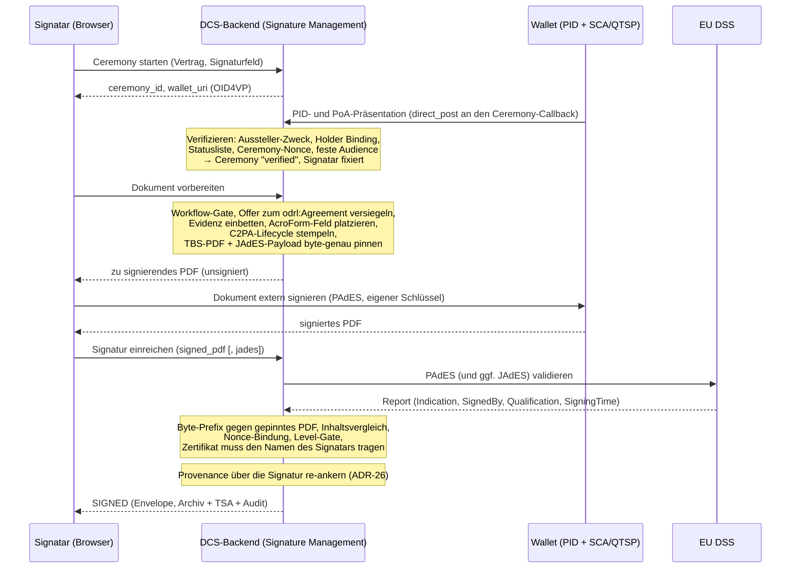

# 06 Signaturen

Dieses Kapitel beschreibt, wie ein Vertrag elektronisch signiert wird:
die wallet-getriebene Signatur-Ceremony, die Signaturniveaus, die
Formate PAdES (menschenlesbares PDF) und JAdES (maschinenlesbares
JSON-LD), die Validierung über den EU Digital Signature Service (DSS)
und die Zeitstempelung.

Das tragende Prinzip (ADR-12, ADR-3, ADR-20): **Das DCS signiert
Verträge nie selbst und hält keinen Vertrags-Signaturschlüssel.** Es
bereitet das Dokument vor, der Signatar signiert extern mit dem eigenen
Schlüssel, und das DCS validiert und finalisiert das Ergebnis. Nur so
ist die alleinige Kontrolle des Signatars über seinen Schlüssel (eIDAS
Art. 26) erfüllbar. Was das DCS akzeptiert, muss byte-genau auf dem
selbst vorbereiteten Dokument aufbauen, an die Ceremony gebunden sein
und ein Zertifikat tragen, das den verifizierten Signatar benennt.

## 6.1 Beteiligte Komponenten

| Komponente | Rolle |
| --- | --- |
| Signature Management (Backend) | Ceremony-Verwaltung, Dokumentvorbereitung, Annahme und Validierung externer Signaturen, Compliance-Sicht |
| Wallet + SCA/QTSP des Signatars | Legt das Identitätscredential vor, holt das Dokument, erzeugt die PAdES-Signatur mit dem Schlüssel des Signatars |
| pdf-core | Deterministisches Rendering des Basis-PDF, Inhaltsvergleich, Provenance-Re-Anchor; hält nie einen Signer (Kapitel 07) |
| EU DSS | Externer AdES-Validator (ETSI EN 319 102-1) für eingereichte PAdES- und JAdES-Signaturen |
| ORCE + TSA | RFC-3161-Zeitstempel für den Archiv-Eintrag; das Backend verifiziert die Antwort gegen das hinterlegte TSA-Zertifikat |
| Frontend (Signierliste, Secure Contract Viewer, Signature Compliance Viewer) | Führt den Signatar durch die Ceremony; zeigt Signaturstatus, Integritäts- und DSS-Befunde |

## 6.2 Die Signatur-Ceremony

Signieren darf nur, wer zuvor in einer **Ceremony** seine Identität als
natürliche Person nachgewiesen hat: eine OID4VP-Präsentation, gebunden
an den Vertrag und ein deklariertes Signaturfeld. Ohne abgeschlossene
Ceremony lehnt das DCS jede Dokumentvorbereitung und Signaturannahme ab.

Ergänzend zum Diagramm:

- Der Ceremony-Status ist pollbar (`pending`, `verified`, `expired`,
  `failed`); der Callback ist über die nicht erratbare Ceremony-ID
  autorisiert, und eine Präsentation an einer abgelaufenen Ceremony
  wird abgelehnt. Organisation und Rollen des Vollmachts-Credentials
  werden als Signaturevidenz aufbewahrt, weil die Gegenseite sie später
  nachprüft (Kapitel 08).
- Die Vorbereitung bettet die Signaturevidenz **innerhalb** des später
  signierten Byte-Bereichs ein (embed-then-sign, ADR-3) und **pinnt**
  die exakten zu signierenden Bytes (TBS-PDF und kanonische
  JAdES-Payload) an der Ceremony (ADR-20). Alle Seiteneffekte passieren
  genau einmal, hier.
- Die Einreichung ist ein reiner Validierungs- und
  Aufzeichnungsschritt (6.4). Die Finalisierung re-ankert die
  Provenance, erzeugt den Archiv-Eintrag mit Notarisierung und
  Zeitstempel und markiert den Verbrauch der Ceremony atomar, so dass
  zwei konkurrierende Einreichungen nicht beide finalisieren können.

**Signatur und Provenance-Re-Anchor (ADR-26).** C2PA-Hard-Binding und
PAdES-Signatur wollen beide „das Letzte im Dokument" sein. Das DCS löst
den Konflikt in fester Reihenfolge: Lifecycle-Manifest vor der Signatur
(die Signatur deckt die Provenance ab), nach der validierten Einreichung
ein reines Provenance-Update-Manifest als inkrementelles Update über den
signierten Bytes. Die Signatur bleibt unberührt und verifiziert weiter.
Der akzeptierte Preis: PDF-Reader und DSS melden das Dokument als „nach
der Signatur geändert". Das ist zutreffend, die einzige zulässige
Ursache ist dieser Re-Anchor, und die eigene Verifikation weist genau
das nach (Kapitel 07).

**Multi-Signer.** Deklariert ein Vertrag mehrere Signaturfelder, muss
für jedes Feld eine verifizierte Ceremony existieren, bevor die erste
Signatur angebracht wird: Die Evidenz aller Signatare muss im PDF
stecken, bevor eine PAdES-Signatur es einfriert. Ein bereits signiertes
Feld kann nicht erneut signiert werden.

**QR-/Deep-Link-Variante (OID4VP Document Retrieval).** Für vollständig
wallet-getriebenes Signieren publiziert die Ceremony ein signiertes
Request-Objekt nach dem EUDI-„walletdriven-signer"-Profil mit zwei
Dokumenten, dem zu signierenden PDF und der gepinnten JSON-LD-Payload,
so dass eine Ceremony PAdES und JAdES über denselben Inhalt liefert. Die
Wallet betreibt ihre eigene SCA/QTSP-Strecke und postet die signierten
Dokumente per `direct_post` an den Callback, der denselben
Validierungspfad durchläuft; die Antwort muss die frische Request-Nonce
der Ceremony binden (6.4).

## 6.3 Signaturniveaus und -formate

**Das geforderte Niveau ist eine Eigenschaft des Vertrags, nicht des
Aufrufers.** Jedes Signaturfeld deklariert es im Dokument; fehlt die
Angabe, gilt AES. Das Niveau wird bei der Vorbereitung gepinnt und bei
der Einreichung gegen das **tatsächlich erreichte** Niveau durchgesetzt:
Eine gültige AES auf einem QES-pflichtigen Feld wird abgelehnt, und
aufgezeichnet wird das erreichte Niveau (ADR-20). Verglichen wird auf
der Skala SES < AES < QES; wer eine Anforderung durchsetzen will,
fordert AES oder QES.

**v1-Leistungsumfang (ADR-24).** Die Architektur ist nicht AES-limitiert;
das erreichte Niveau bestimmen Credential und Vertrauensdienst. Mit den
testgradigen v1-Providern (projekteigene CA, Test-Wallet,
Demonstrations-TSA, DSS-Testinstanz) ist das Ergebnis eine
wallet-basierte AES. QES ist aus dem v1-Liefergegenstand ausgenommen;
Verträge mit gesetzlichem Schriftformerfordernis sind in v1 nicht
demonstrierbar. Der mitgelieferte Beispiel-PID-Aussteller führt keine
Identitätsprüfung der Person durch; sein Credential ist kein EUDI-PID
und darf nicht als solches behandelt werden (ADR-31).

**Die beiden Formate:**

- **PAdES** ist die Signatur des Signatars über das menschenlesbare PDF,
  sichtbar im AcroForm-Feld, extern erzeugt.
- **JAdES** (ETSI TS 119 182-1, Baseline-B) ist das Gegenstück über die
  maschinenlesbare Repräsentation: ein kompaktes JWS über die
  kanonisierte Form aus Vertrags-DID, Version und vollständigem
  JSON-LD-Dokument. Bei einer publizierten Wallet-Ceremony ist die
  JAdES des Signatars Pflicht, weil sie die Nonce-Bindung trägt; auf dem
  authentifizierten Einreichungspfad ist sie optional und wird, falls
  vorhanden, validiert.

Unabhängig davon signiert die **Instanz** jeden an Peers verschickten
Vertrag mit ihrem HSM-gestützten DID-Schlüssel als JAdES (Kapitel 08).
Diese Instanzsignatur ist eine Systemhandlung, keine AES einer Person
(ADR-17). Ein elektronisches **Siegel** einer Organisation ist als
Richtung entschieden, aber nicht implementiert (ADR-21).

## 6.4 Validierung: interne Prüfungen plus EU DSS

Eingereichte Signaturen durchlaufen eine mehrstufige Annahmeprüfung
(ADR-20); jede Stufe ist ein hartes Abbruchkriterium:

1. **Byte-Pinning.** Das eingereichte PDF muss byte-genau mit dem
   gepinnten TBS-PDF **beginnen**: Eine PAdES-Signatur ist ein
   inkrementelles Update, das nur Bytes anhängt. Die JAdES-Payload wird
   genauso gegen die gepinnte kanonische Payload geprüft.
2. **Inhaltsvergleich.** pdf-core vergleicht den sichtbaren Seiteninhalt
   des eingereichten Dokuments mit dem vorbereiteten; nichts wird neu
   gerendert.
3. **Nonce-Bindung.** Bei einer publizierten Wallet-Ceremony muss die
   JAdES im signaturgeschützten Header die frische Request-Nonce der
   Ceremony tragen. Wer nur die Ceremony-URL kennt, kann ohne den
   Schlüssel des Signatars keine annehmbare Antwort fälschen.
4. **Extern über DSS.** Der Report liefert die ETSI-Indication,
   Qualification, Format/Level, Zertifikats-Subject und Signierzeit, bei
   Mehrfachsignaturen der jüngsten Signatur zugeordnet. **Ohne
   konfigurierten DSS nimmt der Einreichungspfad keine Signatur an**;
   auf den Lesepfaden entfällt ohne DSS lediglich der Report.
5. **Level-Gate.** Für **AES** ist das Kriterium bewusst nicht
   `TOTAL-PASSED`, denn das verlangt zusätzlich eine qualifizierte
   EU-Trust-List-CA, also eine QES-Eigenschaft. Für AES genügen
   kryptographische Integrität und eindeutige Zuordnung; ein
   `INDETERMINATE` mit reiner Trust-Chain-Lücke wird akzeptiert, jeder
   Krypto- oder Integritätsfehler abgelehnt. Für **QES** gilt
   `TOTAL-PASSED` **und** die Qualification eines qualifizierten
   Zertifikats mit QSCD.
6. **Sole-Control-Gate.** Das Signaturzertifikat wird direkt aus der
   CMS-Struktur des eingereichten PDFs gelesen; sein Subject muss dem
   Namen der verifizierten Identität der Ceremony entsprechen. Für QES
   ist der Abgleich zwingend (eIDAS Annex I), für AES standardmäßig
   aktiv und nur als dokumentierte Betreiberentscheidung abschaltbar.
   Derselbe Signatar muss über alle eigenen Signaturen eines Vertrags
   dasselbe Zertifikat verwenden. Subject und Seriennummer werden für
   den Compliance Viewer aufgezeichnet.

Ein konfigurierter, aber nicht erreichbarer DSS ist ein Fehler, keine
übersprungene Prüfung. Eine ungültige JAdES wird abgelehnt, nie
stillschweigend mitaufgezeichnet.

**Nachträgliche Prüfung.** Ein signierter Vertrag lässt sich jederzeit
erneut prüfen. Die Prüfung liest die eingebetteten
Signing-Summary-Credentials und verifiziert sie zuerst gegen den
Schlüssel ihres Ausstellers. Darauf setzen auf: die
**Signatarbindung** (der pseudonyme Identifier aus der Evidenz gegen die
aufgezeichneten Signaturen), die **SHACL-Drift-Prüfung** (Wiederholung
der Validierung gegen exakt die Shapes-Version der Signatur und
Vergleich des Befund-Hashes; ein Hub-Versionssprung erzeugt keinen
Fehlalarm, ADR-8) und die **DSS-Bewertung**, sofern konfiguriert.

## 6.5 Zeitstempelung

Mit `SIGNED` entsteht der Archiv-Eintrag; dessen
Notarisierungs-Evidenz erhält einen RFC-3161-Zeitstempel. Die Anfrage
läuft über ORCE, das Backend verifiziert die Antwort gegen das
vertrauenswürdige TSA-Zertifikat. Ein TSA-Wechsel bedeutet deshalb
zweierlei: den Flow in ORCE umstellen und den Vertrauensanker
austauschen. Dieselbe Maschinerie nutzen die Audit-Checkpoints; eine
vorübergehend nicht erreichbare TSA wird nachgeholt (Kapitel 09).

## 6.6 Sichtbarkeit: Viewer, Verifikation, Widerruf

- **Signierliste:** ausstehende, abgeschlossene und widerrufene Verträge
  des Signatars; jede Signaturanwendung hinterlässt einen Audit-Eintrag.
- **Secure Contract Viewer:** Integritätsprüfung (Neuaufbau des
  Basis-PDF, Hash-Abgleich, C2PA- und Widerrufsprüfung) und Einstieg in
  die Ceremony; die C2PA-Kette ist über einen eigenen Abruf einsehbar.
- **Signature Compliance Viewer:** pro Signatur Signatar, Feld,
  gefordertes und erreichtes Niveau, Zertifikats-Subject und
  Seriennummer (Sole-Control-Evidenz), die kryptographischen Bindungen
  aus dem Signing-Summary-Credential sowie Integritätsbefunde und den
  DSS-Report.
- **Widerruf:** setzt eine Signatur auf `REVOKED`; der Envelope behält
  beide Zeitpunkte, der Vorgang ist auditiert. Bei einem
  grenzüberschreitenden Vertrag geht der Widerruf unmittelbar an die
  Gegenpartei, die den Zustand übernimmt (Kapitel 08).

## 6.7 Bekannte Grenzen

- **Extraktion des eingebetteten JSON-LD.** Der Abgleich löst das
  eingebettete Dokument über die letzte Definition des Anhangsobjekts im
  Dateiinhalt auf, nicht über das Querverweisverzeichnis. Ein gezielt
  präpariertes Dokument kann diese Auflösung von der eines PDF-Readers
  abweichen lassen.
- **Mehr als zwei Parteien.** Der Nachweis der Gegenseiten-Signatur wird
  je Vertrag vorgehalten, nicht je Signaturfeld. Verträge mit drei oder
  mehr Parteien werden deshalb nicht ausgerollt (Kapitel 04).
- **„Nach der Signatur geändert".** Prüfprogramme melden ein
  DCS-signiertes Dokument als nach der Signatur verändert. Die Signatur
  bleibt gültig; das Verhalten ist die bewusste Folge des
  Provenance-Re-Anchors (ADR-26) und wird von der eigenen Verifikation
  nachgewiesen (Kapitel 07).
