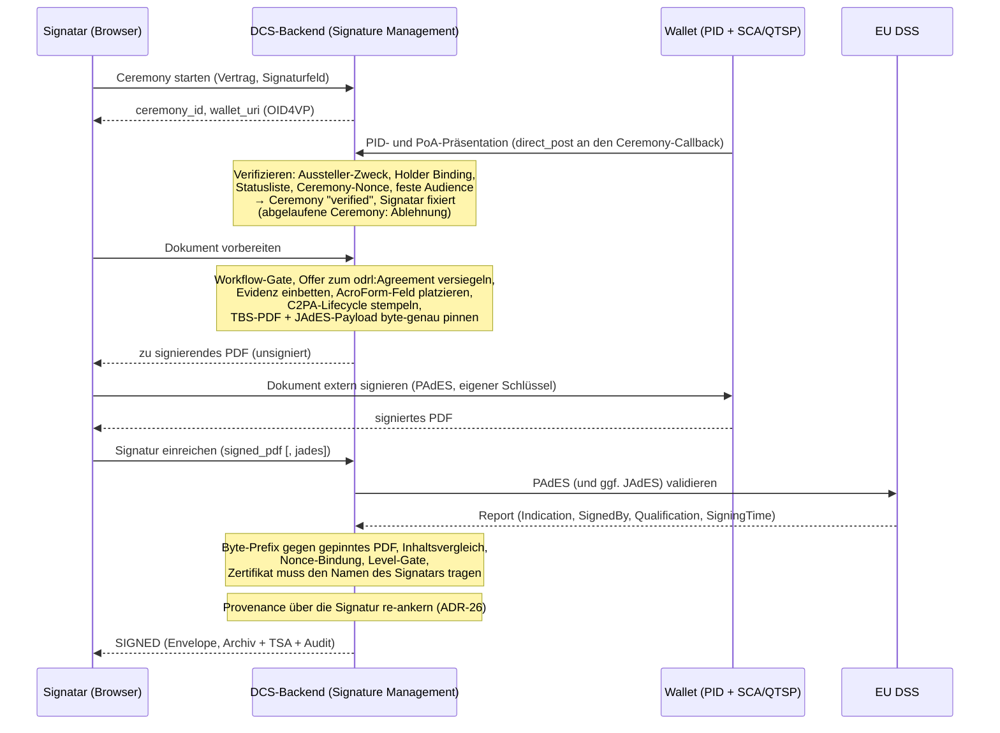

# 06 Signaturen

Dieses Kapitel beschreibt, wie ein Vertrag im DCS elektronisch signiert
wird: die wallet-getriebene Signatur-Ceremony, die Signaturniveaus, die
beiden Signaturformate PAdES (menschenlesbares PDF) und JAdES
(maschinenlesbares JSON-LD), die Validierung über den EU Digital
Signature Service (DSS) und die Zeitstempelung.

Das tragende Prinzip (ADR-12, ADR-3, ADR-20): **Das DCS signiert Verträge
nie selbst und hält keinen Vertrags-Signaturschlüssel des Signatars.** Es
bereitet das zu signierende Dokument vor, der Signatar signiert extern mit
dem eigenen Schlüssel, und das DCS validiert und finalisiert das Ergebnis.
Nur so ist die alleinige Kontrolle des Signatars über seinen Schlüssel
(eIDAS Art. 26) überhaupt erfüllbar. Der Annahmepfad ist gehärtet
(ADR-20): Was das DCS akzeptiert, muss byte-genau auf dem selbst
vorbereiteten Dokument aufbauen, an die Ceremony gebunden sein und ein
Zertifikat tragen, das den verifizierten Signatar benennt.

## 6.1 Beteiligte Komponenten

| Komponente | Rolle |
| --- | --- |
| Signature Management (Backend) | Ceremony-Verwaltung, Dokumentvorbereitung, Annahme und Validierung externer Signaturen, Compliance-Sicht |
| Wallet + SCA/QTSP des Signatars | Legt das Identitätscredential vor, holt das Dokument, erzeugt die PAdES-Signatur mit dem Schlüssel des Signatars |
| pdf-core | Deterministisches Rendering des Basis-PDF, Inhaltsvergleich, Provenance-Re-Anchor; hält nie einen Signer (Kapitel 07) |
| EU DSS | Externer AdES-Validator (ETSI EN 319 102-1) für eingereichte PAdES- und JAdES-Signaturen |
| ORCE + TSA | RFC-3161-Zeitstempel für den Archiv-Eintrag; das Backend verifiziert die Zeitstempel-Antwort gegen das hinterlegte TSA-Zertifikat |
| Frontend (Signierliste, Secure Contract Viewer, Signature Compliance Viewer) | Führt den Signatar durch die Ceremony; zeigt Signaturstatus, Integritäts- und DSS-Befunde |

## 6.2 Die Signatur-Ceremony

Signieren darf nur, wer zuvor in einer **Ceremony** seine Identität als
natürliche Person nachgewiesen hat: einer OID4VP-Präsentation, die an den
Vertrag und ein deklariertes Signaturfeld gebunden ist. Ohne
abgeschlossene Ceremony lehnt das DCS jede Dokumentvorbereitung und
Signaturannahme mit einem typisierten Fehler ab.

Die Schritte im Einzelnen:

1. **Ceremony starten.** Bindet Vertrag und Signaturfeld, liefert eine
   Ceremony-ID und eine Wallet-URI für die Präsentation. Der Status ist
   pollbar (`pending`, `verified`, `expired`, `failed`).
2. **Identitätsvorlage.** Die Wallet legt ihr Präsentationstoken mit
   Identitäts- **und** Vollmachts-Credential direkt am Callback der
   Ceremony vor, autorisiert über die nicht erratbare Ceremony-ID. Das
   Backend verifiziert die Präsentation vollständig (Aussteller und
   Zweck, Holder Binding, Statusliste, Bindung an die Nonce der Ceremony,
   feste Audience) und fixiert daraus den Signatar. Organisation und
   Rollen des Vollmachts-Credentials fließen als Signaturevidenz ein und
   werden an der Ceremony aufbewahrt, weil die Gegenseite sie später
   nachprüft (Kapitel 08). Die Ceremony-Frist wird am Callback
   durchgesetzt: Eine Präsentation an einer abgelaufenen Ceremony wird
   abgelehnt.
3. **Vorbereitung.** Das DCS durchläuft das Workflow-Gate (Kapitel 04),
   versiegelt das verhandelte Angebot zum `odrl:Agreement`, prüft
   Abschluss und SHACL-Konformität, wertet die ODRL-Bedingungen aus,
   bettet die Signaturevidenz **innerhalb** des Byte-Bereichs ein, den die
   spätere Signatur abdecken wird (embed-then-sign, ADR-3), stempelt die
   C2PA-Lifecycle-Assertion in das Basis-PDF und platziert das
   AcroForm-Signaturfeld. Die exakten zu signierenden Bytes, das
   TBS-PDF und die kanonische JAdES-Payload, werden zusammen mit den
   Finalisierungs-Metadaten (Content-Hash, Renderer-Version, gefordertes
   Signaturniveau des Felds) an der Ceremony **gepinnt** (ADR-20). Alle
   Seiteneffekte passieren genau einmal, hier. Der Inhalt, den der
   Signatar signiert, ist ab jetzt eingefroren.
4. **Externe Signatur.** Der Signatar signiert das PDF mit seinem eigenen
   Schlüssel, per Wallet/QTSP oder in einem Desktop-Signer im
   vorbereiteten Feld.
5. **Einreichung und Finalisierung.** Ein reiner Validierungs- und
   Aufzeichnungsschritt ohne erneute Vorbereitung. Das DCS prüft die
   Einreichung (6.4), **re-ankert die Provenance über die Signatur**,
   zeichnet den Signature-Envelope auf, erzeugt den Archiv-Eintrag mit
   Snapshot, Notarisierung und Zeitstempel und setzt den Vertrag auf
   `SIGNED`. Der Verbrauch der Ceremony wird **atomar** in derselben
   Transaktion wie die Finalisierung markiert, so dass zwei konkurrierende
   Einreichungen derselben Ceremony nicht beide finalisieren können
   (ADR-20).

**Signatur und Provenance-Re-Anchor (ADR-26).** C2PA-Hard-Binding und
PAdES-Signatur wollen beide „das Letzte im Dokument" sein: Das
Lifecycle-Manifest bindet die gesamte Datei, die Signatur bindet alles bis
zu ihrem eigenen Byte-Bereich. Das DCS löst den Konflikt in fester
Reihenfolge auf. Das Lifecycle-Manifest wird **vor** der Signatur
geschrieben, sodass die Signatur die Provenance mit abdeckt; nach der
validierten Einreichung hängt die Finalisierung ein **reines
Provenance-Update-Manifest** an, dessen Hard-Binding die signierten Bytes
abdeckt. Das ist ein inkrementelles Update: Der Byte-Bereich der
Signatur bleibt unberührt, die Signatur verifiziert weiter in externen
Werkzeugen. Archiviert und ausgeliefert wird das re-ankerte PDF. Der
akzeptierte Preis: PDF-Reader und der DSS melden das Dokument als „nach
der Signatur geändert". Das ist eine zutreffende Aussage, deren einzige
zulässige Ursache dieser Re-Anchor ist; die Verifikation weist genau das
nach (Kapitel 07). Die Rangfolge ist entschieden: **Signaturintegrität
geht dem C2PA-Hard-Binding vor.** Nichts darf je angehängt werden, was
den Byte-Bereich der Signatur bricht.

**Multi-Signer.** Deklariert ein Vertrag mehrere Signaturfelder, muss für
*jedes* Feld eine verifizierte Ceremony existieren, bevor die *erste*
Signatur angebracht wird: Die Evidenz aller Signatare muss im PDF
stecken, bevor eine PAdES-Signatur es einfriert, denn ein nachträglich
eingebetteter Anhang würde die standardkonforme Diff-Analyse verletzen.
Ein bereits signiertes Feld kann nicht erneut signiert werden; der
Wiederholungsschutz wird unter der Regenerierungssperre erneut geprüft,
nachdem die Signaturlage frisch gelesen wurde.

### QR-/Deep-Link-Variante: OID4VP Document Retrieval

Für vollständig wallet-getriebenes Signieren publiziert die Ceremony ein
signiertes Request-Objekt nach dem EUDI-„walletdriven-signer"-Profil:
Signatur-Antworttyp, Dokument-Hashes und Abruforte,
Signatur-Qualifier aus dem CSC-Vokabular. Angeboten werden **zwei**
Dokumente: das zu signierende PDF und die gepinnte kanonische
JSON-LD-Payload, sodass eine Ceremony beide Artefakte, PAdES und JAdES,
über denselben Inhalt liefert. Die Wallet holt das Request-Objekt und die
Dokumente, betreibt ihre eigene SCA/QTSP-Strecke und postet die
signierten Dokumente per `direct_post` an den Callback, der denselben
Validierungs- und Finalisierungspfad wie die direkte Einreichung
durchläuft. Der Callback ist über die nicht erratbare Ceremony-ID
autorisiert, denn der Aufrufer ist die Wallet des Signatars und keine
eingeloggte Session; zusätzlich muss die Antwort die frische
Request-Nonce der Ceremony binden (6.4). Das Request-Objekt trägt die
Zertifikatskette der Instanz im Header und einen DNS-gebundenen
Client-Identifier, der dem SAN dieses Zertifikats entspricht.

## 6.3 Signaturniveaus und -formate

**Das geforderte Niveau ist eine Eigenschaft des Vertrags, nicht des
Aufrufers.** Jedes Signaturfeld deklariert es im Dokument; fehlt die
Angabe oder ist das Feld nicht deklariert, gilt AES. Das Niveau wird bei
der Vorbereitung gepinnt und bei der Einreichung gegen das **tatsächlich
erreichte** Niveau durchgesetzt: Eine kryptographisch gültige AES auf
einem QES-pflichtigen Feld wird abgelehnt, und aufgezeichnet wird das
erreichte, nicht das angefragte Niveau (ADR-20). Der Vergleich läuft auf
der Skala SES < AES < QES; ein Wert, den das System nicht kennt, zählt
wie SES. Das ist die strikte Lesart für das *angebotene* Niveau. Für ein
*gefordertes* Niveau unterhalb von AES ist der Vergleich damit
wirkungslos; wer eine Anforderung durchsetzen will, fordert AES oder QES.

Die Compliance-Prüfung bewertet das erreichte Niveau eigenständig und
protokolliert das Ergebnis als Ereignis im Audit-Trail.

**v1-Leistungsumfang (ADR-24).** Die Signaturarchitektur ist nicht
AES-limitiert. Welches Niveau eine Signatur erreicht, bestimmen das
vorgelegte Credential und der dahinterstehende Vertrauensdienst. Mit den
testgradigen v1-Providern (projekteigene CA, Test-Wallet,
Demonstrations-TSA, DSS-Testinstanz) ist das Ergebnis eine
wallet-basierte AES. QES ist aus dem v1-Liefergegenstand ausgenommen,
weshalb Verträge mit gesetzlichem Schriftformerfordernis in v1 nicht
demonstrierbar sind. Die Anbindung eines qualifizierten
Vertrauensdiensteanbieters und einer produktiven Wallet hebt denselben
Fluss ohne Architekturänderung Richtung QES.

Was ein Signatur-Level tatsächlich aussagt, ist außerdem durch den
vertrauten PID-Aussteller begrenzt. Der als Beispiel-Flow mitgelieferte
PID-Aussteller läuft als eigenständiger Dritter mit eigener DID und
eigener CA, führt aber keine Identitätsprüfung der Person durch; sein
Credential ist folglich kein EUDI-PID und darf nicht als solches
behandelt werden. Kettenprüfung, Zweckbindung und Statuslistenprüfung
greifen unverändert (ADR-31).

**Die beiden Formate:**

- **PAdES** ist die Signatur des Signatars über das menschenlesbare PDF,
  sichtbar im AcroForm-Feld, extern erzeugt.
- **JAdES** (ETSI TS 119 182-1, Baseline-B) ist das Gegenstück über die
  maschinenlesbare Repräsentation: ein kompaktes JWS über die
  kanonisierte Form aus Vertrags-DID, Version und vollständigem
  JSON-LD-Dokument, mit Zertifikatskette und kritischem Signaturzeit-Header.
  Bei einer publizierten Wallet-Ceremony ist die JAdES des Signatars
  **Pflicht**, weil sie die Nonce-Bindung trägt; auf dem authentifizierten
  Einreichungspfad (Desktop-Signer) ist sie optional und wird, falls
  vorhanden, dennoch validiert.

Unabhängig davon signiert die **Instanz** jeden Vertrag, den sie an Peers
verschickt, mit ihrem HSM-gestützten DID-Schlüssel als JAdES; die
Empfängerinstanz verifiziert die Signatur und ihre Bindung an den
`did:web`-Schlüssel des Absenders, bevor sie den Vertrag akzeptiert
(Kapitel 08). Wichtig zur Abgrenzung: Diese Instanzsignatur ist eine
Systemhandlung, keine AES-Signatur einer Person (ADR-17). Ein
elektronisches **Siegel** einer Organisation ist als Richtung entschieden,
aber nicht implementiert (ADR-21); der Maschinen-Rollenklasse bleibt
jede Signaturfähigkeit verwehrt.

## 6.4 Validierung: interne Prüfungen plus EU DSS

Eingereichte Signaturen durchlaufen eine mehrstufige Annahmeprüfung
(ADR-20). Jede Stufe ist ein hartes Abbruchkriterium mit typisiertem
Fehler:

1. **Byte-Pinning.** Das eingereichte PDF muss byte-genau mit dem bei der
   Vorbereitung gepinnten TBS-PDF **beginnen**. Eine PAdES-Signatur ist
   ein inkrementelles Update, das nur Bytes anhängt, „dasselbe Dokument
   plus die eigene Signatur" ist also exakt eine Byte-Prefix-Beziehung.
   Manipulation am sichtbaren Inhalt scheitert hier, unabhängig davon, ob
   die Signatur selbst gültig wäre. Die JAdES-Payload wird genauso
   geprüft: Ihr Payload-Segment muss byte-gleich der gepinnten
   kanonischen Payload sein.
2. **Inhaltsvergleich.** Zusätzlich vergleicht pdf-core den sichtbaren
   Seiteninhalt des eingereichten Dokuments mit dem vorbereiteten. Beide
   Seiten sind Dokumente, die das Backend bereits hält; es wird nichts
   neu gerendert.
3. **Nonce-Bindung.** Bei einer publizierten Wallet-Ceremony muss die
   mitgelieferte JAdES im signaturgeschützten Header eine Nonce tragen,
   die der frischen Request-Nonce der Ceremony entspricht. Sie kann nicht
   entfernt oder ersetzt werden, ohne die JAdES selbst zu invalidieren.
   Wer nur die Ceremony-URL kennt, kann ohne den Schlüssel des Signatars
   keine annehmbare Antwort fälschen.
4. **Extern über DSS.** Das signierte PDF (und eine mitgelieferte JAdES)
   wird an die REST-Validierung des EU DSS übergeben. Der Report liefert
   die ETSI-Indication (`TOTAL-PASSED`, `INDETERMINATE`, `TOTAL-FAILED`),
   Sub-Indication, Qualification, das erkannte Format/Level, den
   Zertifikats-Subject und die Signierzeit, bei Mehrfachsignaturen
   bewusst der jüngsten, gerade eingereichten Signatur zugeordnet.
   **Ohne konfigurierten DSS nimmt der Einreichungspfad überhaupt keine
   Signatur an**; auf den Lesepfaden entfällt ohne DSS lediglich der
   DSS-Report.
5. **Level-Gate.** Das erreichte Niveau wird gegen das gepinnte
   geforderte Niveau des Felds gehalten. Für **AES** ist das Kriterium
   bewusst **nicht** `TOTAL-PASSED`, denn `TOTAL-PASSED` verlangt
   zusätzlich eine qualifizierte EU-Trust-List-CA, also eine
   QES-Eigenschaft. Für AES genügen kryptographische Integrität und die
   eindeutige Zuordnung zum Signatar; ein `INDETERMINATE` mit reiner
   Trust-Chain-Lücke wird akzeptiert, jeder Krypto- oder Integritätsfehler
   und jedes `TOTAL-FAILED` wird abgelehnt. Für **QES** kommt hinzu:
   `TOTAL-PASSED` **und** die DSS-Qualification eines qualifizierten
   Zertifikats mit QSCD.
6. **Sole-Control-Gate (Zertifikat ↔ Identität).** Das Signaturzertifikat
   wird direkt aus der CMS-Struktur des eingereichten PDFs gelesen. Das
   Byte-Pinning garantiert, dass es genau die eben eingereichte Signatur
   benennt, und sein Subject muss, normalisiert, dem Vor- und Nachnamen
   der verifizierten Identität der Ceremony entsprechen. Für QES ist
   dieser Abgleich zwingend (eIDAS Annex I); für AES ist er standardmäßig
   aktiv und abschaltbar nur als dokumentierte Betreiberentscheidung.
   Zusätzlich muss derselbe Signatar über alle eigenen Signaturen eines
   Vertrags hinweg dasselbe Zertifikat verwenden; ein Zertifikatswechsel
   mitten im Vertrag ist das Signal eines kompromittierten oder geteilten
   Schlüssels. Subject und Seriennummer des validierten Zertifikats
   werden für den Signature Compliance Viewer aufgezeichnet.

Ein konfigurierter, aber nicht erreichbarer DSS ist ein Fehler, keine
stillschweigend übersprungene Prüfung. Eine ungültige JAdES wird
abgelehnt, nie stillschweigend mitaufgezeichnet.

### Nachträgliche Prüfung eines signierten Vertrags

Unabhängig von der Annahme lässt sich ein signierter Vertrag jederzeit
erneut prüfen. Diese Prüfung liest die im PDF eingebettete
Signatur-Evidenz, die Signing-Summary-Credentials, und **verifiziert
sie zuerst gegen den Schlüssel, den ihr Aussteller für Aussagen
publiziert**, bevor irgendetwas aus ihnen verwendet wird. Darauf setzen
drei Auswertungen auf:

- **Signatarbindung:** Der pseudonyme Signatar-Identifier aus der
  verifizierten Evidenz wird gegen die aufgezeichneten Signaturen
  gehalten; eine Abweichung ist ein Befund. Der im Credential
  mitgeführte Hash der Wallet-Bindung wird ausgewiesen, aber nicht
  gegengerechnet.
- **SHACL-Drift:** Die Validierung wird gegen exakt die Shapes-Version
  wiederholt, unter der signiert wurde, und der Befund-Hash gegen den vom
  Aussteller versiegelten verglichen. Eine Abweichung bedeutet, dass sich
  die Vertragsdaten seit der Signatur verändert haben. Ein
  Versionssprung des Hubs erzeugt hier keinen Fehlalarm, weil die Evidenz
  an ihre Version gepinnt ist (ADR-8).
- **DSS-Bewertung** wie oben, sofern konfiguriert.

## 6.5 Zeitstempelung

Mit Erreichen von `SIGNED` entsteht der Archiv-Eintrag des Vertrags;
dessen Notarisierungs-Evidenz wird mit einem **RFC-3161-Zeitstempel**
versehen. Die Zeitstempelanfrage läuft über ORCE, das den eigentlichen
Austausch mit dem TSA-Anbieter abwickelt; das Backend verifiziert die
zurückkommende Antwort gegen das vertrauenswürdige TSA-Zertifikat. Ein
TSA-Wechsel bedeutet deshalb zweierlei: den TSA-Flow in ORCE umstellen
und den Vertrauensanker austauschen. Dieselbe Zeitstempel-Maschinerie
nutzen die Audit-Checkpoints; ist die TSA vorübergehend nicht erreichbar,
wird der Zeitstempel nachgeholt (Kapitel 09).

## 6.6 Sichtbarkeit: Viewer, Verifikation, Widerruf

- **Signierliste.** Listet für den Signatar ausstehende (`APPROVED`),
  abgeschlossene (`SIGNED`/`ACTIVE`) und widerrufene (`REVOKED`)
  Verträge. Ein widerrufener Vertrag verschwindet nicht aus der Liste,
  sein Status wird gezeigt. Jede Zeile klappt in die Signaturdetails auf.
  Jede Signaturanwendung hinterlässt zudem einen Audit-Eintrag mit
  Signatar, verwendetem Credential-Niveau und Zeitstempel.
- **Secure Contract Viewer.** Der Signatar öffnet den Vertrag aus der
  Signierliste, stößt die Integritätsprüfung an (Neuaufbau des Basis-PDF
  und Hash-Abgleich gegen den gespeicherten Stand, plus C2PA- und
  Widerrufsprüfung, die unabhängige Validierung aus Kapitel 01) und
  durchläuft anschließend die Ceremony. Die C2PA-Provenance-Kette ist
  über einen eigenen Abruf einsehbar.
- **Signature Compliance Viewer.** Pro Signatur: Signatar, Feld,
  gefordertes und erreichtes Credential-Niveau samt
  Qualified-Kennzeichen, Status und Zeitpunkte, Subject und Seriennummer
  des Signaturzertifikats (Sole-Control-Evidenz) sowie die
  kryptographischen Bindungen aus dem eingebetteten
  Signing-Summary-Credential (Content-Hash, PDF-Hash, Wallet-Bindungshash,
  Ceremony-ID) plus Integritätsbefunde und, falls konfiguriert, den
  DSS-Report.
- **Widerruf.** Setzt eine Signatur auf `REVOKED`; der Envelope behält
  Zeitpunkte von Signatur und Widerruf, der Vorgang ist auditiert. Bei
  einem grenzüberschreitenden Vertrag wird der Widerruf unmittelbar an
  die Gegenpartei verschickt, die den Zustand übernimmt (Kapitel 08).

## 6.7 Bekannte Grenzen

- **Extraktion des eingebetteten JSON-LD.** Der Abgleich zwischen
  sichtbarem Text und maschinenlesbarem Inhalt löst das eingebettete
  Dokument über die letzte Definition des Anhangsobjekts im Dateiinhalt
  auf, nicht über das Querverweisverzeichnis des PDFs. Ein gezielt
  präpariertes Dokument kann diese Auflösung von der Auflösung eines
  PDF-Readers abweichen lassen.
- **Mehr als zwei Parteien.** Der Nachweis der Gegenseiten-Signatur wird
  je Vertrag und nicht je Signaturfeld vorgehalten. Verträge mit drei
  oder mehr Parteien werden deshalb nicht ausgerollt: Das System
  verweigert die Ausführung, statt eine unvollständige Signaturlage als
  vollständig zu behandeln (Kapitel 04).
- **„Nach der Signatur geändert".** Prüfprogramme melden ein
  DCS-signiertes Dokument als nach der Signatur verändert. Die Signatur
  selbst bleibt gültig und unverändert prüfbar; das Verhalten ist die
  bewusste Folge des Provenance-Re-Anchors (ADR-26) und wird von der
  eigenen Verifikation nachgewiesen statt ignoriert (Kapitel 07).
