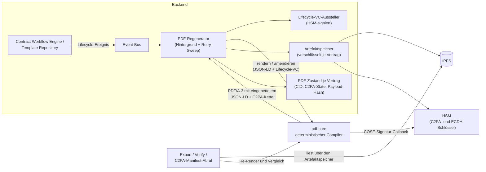

# 07 Dokumente und Provenance

Dieses Kapitel beschreibt, wie das DCS aus dem maschinenlesbaren Vertrag
(JSON-LD) das menschenlesbare Vertragsdokument (PDF/A-3) erzeugt, warum
dieses Rendering deterministisch ist, wie jede Instanz unabhängig prüfen
kann, dass beide Repräsentationen übereinstimmen, wie die Herkunft des
Dokuments über C2PA-Manifeste nachvollziehbar bleibt und wie die
Artefakte im Speicher geschützt und löschbar sind.

Der Leitgedanke: Das PDF ist kein Ausdruck des Vertrags, sondern eine
zweite, jederzeit gegen die maschinenlesbare Form verifizierbare
Repräsentation derselben Vereinbarung.

## 7.1 Beteiligte Komponenten

| Komponente | Rolle |
| --- | --- |
| `pdf-core` | Eigenständiger, zustandsloser Dienst; alleiniger Eigentümer aller Byte-Arbeit am PDF: deterministisches Kompilieren, inkrementelle Amendments, Provenance-Re-Anchor, Extraktion des eingebetteten JSON-LD, C2PA-Einbettung, Re-Render- und Inhaltsvergleich. Das Backend parst nie selbst PDF-Bytes |
| Backend / PDF-Generierung | Orchestriert: hört auf Lifecycle-Ereignisse, lässt pdf-core rendern bzw. amendieren, stellt Lifecycle-Credentials aus, legt das Ergebnis verschlüsselt ab und führt den PDF-Zustand je Vertrag/Vorlage (CID, Renderer-Version, C2PA-Zustand, Payload-Hash) |
| Artefaktspeicher | Verschlüsselnde Schicht über IPFS: jedes Artefakt wird vor dem Schreiben verschlüsselt, jeder Lesevorgang entschlüsselt authentifiziert |
| C2PA-Manifest-Dienst | Öffentlicher, unauthentifizierter Abruf des C2PA-Manifest-Stores eines Vertrags, das öffentliche Gegenstück zum DID-Dokument |
| HSM (über das Backend) | Signiert die COSE-Struktur der C2PA-Manifeste und entpackt die Inhaltsschlüssel. pdf-core hält kein Schlüsselmaterial: Es baut die zu signierende Struktur, das Backend signiert |
| Statuslist-Dienst | Wird bei der Verifikation für den Live-Widerrufsstatus der in den Manifesten eingebetteten Lifecycle-Credentials befragt |

## 7.2 Deterministisches Rendering

pdf-core garantiert: **Dieselbe JSON-LD-Payload erzeugt immer
byte-identischen Seiteninhalt.** Dafür sorgen mehrere bewusste
Entscheidungen:

- Der Render-Zeitpunkt ist eine feste Epoche, nicht die Wanduhr. Die
  vertrauenswürdige Vertragszeit ist der Zeitstempel der PAdES-Signatur
  (Kapitel 06).
- Die eingereichte Payload wird **verbatim** als Anhang in das
  PDF/A-3-Dokument eingebettet, exakt die übermittelten Bytes und nie
  eine re-kanonisierte Form. Der SHA-256 dieser Bytes ist die
  Content-Adresse des Dokuments; jeder Prüfer kann ihn aus dem Anhang
  nachrechnen.
- Die Schrift ist im Dokument eingebettet (PDF/A-Konformität), Layout und
  Struktur (Tagged PDF, Outline) sind vollständig aus der Payload
  abgeleitet.

Weil der sichtbare Seiteninhalt eine reine Funktion der eingebetteten
Payload ist, lässt sich die Übereinstimmung von menschen- und
maschinenlesbarer Form jederzeit beweisen: Payload extrahieren, neu
kompilieren, Seiteninhalte vergleichen.

### Compiler und Contract Fields

Der Compiler arbeitet auf dem kanonischen Vertragsmodell (Kapitel 03):

- `dcs:documentStructure` beschreibt die menschenlesbare Struktur, einen
  Layout-Baum über geordnete Blöcke, dessen Reihenfolge über
  JSON-LD-Listen stabil ist.
- `dcs:contractFields` ist die flache Liste der ausfüllbaren Felder.
  Klauseln, `dcs:contractData` und ODRL-Operanden referenzieren dieselben
  Feld-IDs. Authoring, Rendering und Policy-Auswertung lösen ein Feld
  ausschließlich über seine `@id` auf, ohne Vorlagen-Schnappschuss.
- `dcs:signatureFields` erzeugt AcroForm-Signaturfelder für die spätere
  PAdES-Signatur.
- Semantische Zusatzdaten, die nicht Teil der Dokumentstruktur sind (etwa
  ODRL-Policies), werden nicht gerendert, aber unverändert im
  eingebetteten JSON-LD mitgeführt. Die Maschinenlesbarkeit geht beim
  Rendern nie verloren.

Mehrfache Signaturen sind konstruktionsbedingt **sequenziell**: PDF/A-3
verlangt, dass jede Signatur alle vorherigen Bytes abdeckt. Ein
paralleles, reihenfolgeunabhängiges Signieren mit anschließendem
Zusammenführen ist mit dem Standard nicht vereinbar; Änderungen nach
einer Signatur erfolgen als inkrementelle Revisionen über den signierten
Bytes.

## 7.3 Der Rendering- und Provenance-Fluss

PDFs entstehen nie auf Zuruf im Request-Pfad, sondern **ereignisgetrieben
im Hintergrund**. Jedes Lifecycle-Ereignis eines Vertrags oder einer
Vorlage (Anlegen, inhaltliche Änderung, Zustandswechsel,
Verhandlungsschritt) läuft über den Event-Bus in den Regenerator. Der
stellt für den neuen Zustand ein Lifecycle-Verifiable-Credential aus,
lässt pdf-core das PDF rendern bzw. per Amendment fortschreiben (die
C2PA-Kette wächst, sie beginnt nie neu), legt das Ergebnis verschlüsselt
ab und aktualisiert den PDF-Zustand.

Der Export bedient sich immer aus diesem Bestand: Er liefert das aktuelle
PDF und **wartet**, wenn nach der letzten Änderung noch eine Regeneration
läuft. Er gibt nie einen veralteten Stand und rendert nie selbst. Ein
bereits PAdES-signiertes PDF ist **eingefroren**: Es wird unverändert
ausgeliefert, auch wenn der Lifecycle-Zustand danach weiterläuft. Die
letzte Lifecycle-Assertion vor der Signatur wird bereits vor dem
Signieren eingebettet, sodass die Signatur die Provenance mit abdeckt.
Die einzige Revision **nach** der Signatur ist der Provenance-Re-Anchor
der Signatur-Finalisierung (ADR-26, Kapitel 06): ein reines
C2PA-Update-Manifest, dessen Hard-Binding die signierten Bytes abdeckt,
angehängt als inkrementelles Update, das den Byte-Bereich der Signatur
unberührt lässt. Danach mutiert nichts mehr, denn jede weitere Änderung
gälte standardkonformen PAdES-Validatoren als unerklärte Manipulation.

## 7.4 C2PA-Manifeste

Jede erzeugte PDF-Version trägt einen C2PA-Manifest-Store (JUMBF), der den
gesamten sichtbaren Seiteninhalt abdeckt. Die Manifeste **stapeln** sich
über den Lebenszyklus: Jeder Zustandswechsel hängt eine
Lifecycle-Assertion an (Zustände wie `draft`, `active`, `amended`,
`suspended`, `terminated`, `expired`), zusammen mit einem
Verifiable Credential der Instanz, das den Zustandswechsel, den
Asset-Hash und den Zeitpunkt bezeugt und über eine Statusliste widerrufbar
ist. Die COSE-Signatur jedes Manifests entsteht über den
Signatur-Callback im Backend mit dem HSM-gehaltenen C2PA-Schlüssel der
Instanz; die zugehörige Zertifikatskette ist konfiguriert und wird
pdf-core als öffentliches Material bereitgestellt.

Ein signierter Vertrag trägt ein Manifest mehr als ein unsignierter: das
Lifecycle-Manifest, auf das sich die Signatur festlegt, und das
Re-Anchor-Manifest, das sich auf die Signatur festlegt (ADR-26). Die
Kette liest sich in genau dieser Reihenfolge.

Die Manifestkette ist öffentlich abrufbar: Der C2PA-Endpunkt liefert die
rohen Manifest-Store-Bytes, auf Wunsch eine JSON-Aufzählung der Kette mit
Manifest-Labels und Lifecycle-Assertions. Der Endpunkt ist bewusst
unauthentifiziert, denn ein externer Prüfer muss die Herkunftskette eines
signierten Vertrags ohne Konto auflösen können. Damit hängt die
Sichtbarkeit einer Kette zugleich an der Verfügbarkeit ihres
Inhaltsschlüssels (7.6).

Ausgeliefert wird die Provenance doppelt (ADR-4): eingebettet als JUMBF
im PDF und über diesen Remote-Endpunkt.

## 7.5 Unabhängige Validierung: menschen- vs. maschinenlesbar

Die Konsistenz zwischen maschinen- und menschenlesbarer Form wird an drei
Stellen erzwungen bzw. prüfbar gemacht:

1. **Auf Abruf** über die Verify-Endpunkte: Das gespeicherte PDF wird
   geladen, sein eingebettetes JSON-LD extrahiert, mit demselben
   deterministischen Compiler neu gerendert und der Seiteninhalt gegen
   den gespeicherten Stand verglichen. Zusätzlich werden C2PA-Signatur,
   das eingebettete Lifecycle-Credential und dessen Live-Widerrufsstatus
   geprüft.
2. **Beim Empfang eines Peer-PDFs** (Kapitel 08): Bevor eine Instanz
   einen von einer anderen Instanz verschickten Vertrag übernimmt,
   verlangt sie, dass dessen Seiteninhalt exakt der Re-Render seiner
   eigenen eingebetteten Payload ist. Der Vergleich betrachtet nur die
   Seiteninhalte, sodass legitime C2PA-, Signatur- und
   Amendment-Schichten des Absenders nicht anschlagen. Echte Divergenz
   zwischen Text und Daten führt zur Ablehnung.
3. **Bei der Signaturannahme** (Kapitel 06): Das eingereichte Dokument
   wird gegen das vorbereitete inhaltlich verglichen.

Damit ist keine Instanz auf die Aussage der ausstellenden Instanz
angewiesen. Jede Partei rechnet die Übereinstimmung selbst nach.

Bei einem PDF mit angehängten Revisionen spielt die Verifikation jede
Revision deterministisch nach und unterscheidet dabei, **welche Art**
Revision sie vor sich hat: Eine Revision, die ein neues
Lifecycle-Credential trägt, wird als Amendment reproduziert; eine
Revision mit unveränderter Payload und ohne neues Credential ist der
Provenance-Re-Anchor nach der Signatur und wird genauso reproduziert, wie
sie erzeugt wurde. Ein signiertes PDF gilt daher nur dann als gut, wenn
das einzige nach der Signatur Angehängte byte-genau die Provenance ist,
die diese Instanz selbst produziert hat. Die „nach der Signatur
geändert"-Meldung der PDF-Reader wird nachgewiesen, nicht ignoriert.

**Das Verifikationsergebnis ist bewusst ehrlich geschnitten.** Der
Text/Daten-Abgleich und der C2PA-Check sind unabhängig benannte
Prüfungen. Trägt das PDF (noch) keine PAdES-Signatur oder prüft dieser
Pfad sie nicht kryptographisch nach, meldet das Ergebnis für die
PDF-Signatur ausdrücklich „nicht verfügbar" statt einer scheinbar
bestandenen Prüfung; die kryptographische PAdES/JAdES-Validierung ist
Gegenstand der Signaturverwaltung (Kapitel 06). Zusätzlich benennt das
Ergebnis seine **Fehlerklasse** direkt, statt sie den Aufrufer aus
Kombinationen von Ja/Nein-Feldern erraten zu lassen (ADR-30):

| Klasse | Bedeutung |
| --- | --- |
| `content_hash_mismatch` | Manifest vorhanden, aber der Inhalt weicht vom eingebetteten JSON-LD ab |
| `artifact_not_authentic` | Die gespeicherten Bytes haben die authentifizierte Entschlüsselung nicht bestanden; sie sind nicht die, die diese Instanz geschrieben hat |
| `verification_failed` | Eine andere Prüfung ist fehlgeschlagen |
| *(leer)* | Die Prüfung ist bestanden |

## 7.6 Speicherung: Verschlüsselung, Manipulationsnachweis, Löschung

Jedes Artefakt wird **vor** dem Schreiben verschlüsselt (ADR-28). Der
Inhaltsschlüssel ist pro **Löschbereich** zufällig gezogen: einer je
Vertrag (dessen PDFs, Archiv-Snapshot und Audit-Ereignisrümpfe), einer je
Vorlage, einer instanzweit für Checkpoints und instanzbezogene Reports.
Der Bereichsbezeichner geht als zusätzliche authentifizierte Angabe in
das Chiffrat ein, sodass ein Artefakt nicht unbemerkt einem anderen
Bereich untergeschoben werden kann.

Der Inhaltsschlüssel existiert im Ruhezustand **nur gewickelt**: Jede
haltende Instanz wickelt ihn gegen den eigenen, im DID-Dokument
publizierten Schlüsselvereinbarungs-Schlüssel; der passende private
Schlüssel ist im PKCS#11-Token nicht extrahierbar. Auspacken erfordert
also das HSM genau dieser Instanz. Bei jeder Vertragssendung an einen
Peer reist zusätzlich eine für dessen publizierten Schlüssel gewickelte
Kopie mit. Der Empfänger übernimmt sie einmal, packt sie aus, wickelt sie
gegen den eigenen Schlüssel neu und ignoriert die Kopie bei allen
späteren Sendungen. Beide Instanzen halten danach denselben
Inhaltsschlüssel, jede Kopie nur vom eigenen HSM zu öffnen.

Drei Folgen sind für das Verständnis wichtig:

- **Manipulation am Speicher ist ein Prüfergebnis, kein Serverfehler
  (ADR-30).** Scheitert die authentifizierte Entschlüsselung, kann das
  keine Schlüsselverwaltungsstörung sein, denn Schlüssel und
  Bereichsangabe stammen aus dem eigenen Bestand. Es bedeutet, dass die
  gespeicherten Bytes nicht die geschriebenen sind. Genau das ist die
  Antwort auf die Frage „ist dieses Artefakt unversehrt?", und sie lautet
  „nein". Was genau verändert wurde, ist dabei nicht ermittelbar:
  Klartext wird nie aus unauthentifiziertem Chiffrat abgeleitet.
- **CIDs zweier Instanzen unterscheiden sich** für denselben Vertrag,
  weil jede Seite dasselbe PDF unter eigenem Zufallswert verschlüsselt.
  Das ist folgenlos: Über die Peer-Schnittstelle wandert nie eine CID,
  Verträge reisen als rohe Bytes, und jede Seite adressiert nur ihren
  eigenen Speicher.
- **Löschung ist Schlüsselvernichtung.** Erasure zerstört die gewickelten
  Kopien und behält die Zeile als Zerstörungsnachweis (Kapitel 04 und
  09). Danach liefern Export, Verifikation und Bundle-Abruf dieses
  Vertrags eine definierte „Inhalt gelöscht"-Antwort, als Nicht-gefunden
  und nie als interner Fehler; Listen- und Metadatensichten arbeiten
  weiter.

**Bekannte Grenze.** Die Schlüsselvernichtung entfernt die
Vertrags-Chiffrate nicht aus dem IPFS-Knoten; entfernt werden lediglich
die Archiv-Snapshots. Solange eine Datenbanksicherung existiert, die vor
der Vernichtung liegt, und der Schlüsselvereinbarungs-Schlüssel im HSM
weiterlebt, ließe sich aus dieser Sicherung wieder ein lesbarer Schlüssel
gewinnen. Die Löschzusage reicht damit genau so weit wie das
Aufbewahrungsfenster der Sicherungen; das Nachziehen der
Löschmarkierungen nach einer Wiederherstellung ist Bestandteil des
[Backup-Leitfadens](../backup-integration-guide.md).

## 7.7 Schnittstellen und Artefakte

Backend (authentifiziert, rollenbasiert; vgl. Anhang A):

| Endpunkt | Zweck |
| --- | --- |
| `GET /pdf/export/contract/{did}`, `GET /pdf/export/template/{did}` | Aktuelles PDF (PDF/A-3, eingebettetes JSON-LD, C2PA-Kette) |
| `GET /pdf/verify/contract/{did}`, `GET /pdf/verify/template/{did}` | Text/Daten- und Provenance-Verifikation inklusive Fehlerklasse |
| `GET /contract/export/{did}` | ZIP-Bundle: JSON-LD, signiertes PDF, C2PA-Store, Credentials, Signaturzustände, Manifest mit Hash je Eintrag, Eltern-Kette und lokal bekannte Hierarchie-Verwandte |
| `GET /template/export/{did}` | ZIP-Bundle einer Vorlage |
| `GET /c2pa/manifest/{contract_did}` | Öffentlicher C2PA-Manifest-Store; optional die Kettenaufzählung |

pdf-core (intern, vom Backend angesprochen):

| Endpunkt | Zweck |
| --- | --- |
| `POST /render` | JSON-LD zu PDF/A-3 kompilieren |
| `POST /render/amendment` | Bestehendes PDF inkrementell fortschreiben (neue Payload + Lifecycle-Credential) |
| `POST /render/reanchor` | Reines Provenance-Update-Manifest über die aktuellen (signierten) Bytes anhängen; Payload unverändert, Signatur unberührt (ADR-26) |
| `POST /verify` | Re-Render-Verifikation gegen die eingebettete Payload |
| `POST /verify/content` | Seiteninhalt gegen den Re-Render der eingebetteten Payload (Empfangsprüfung für Peer-PDFs) |
| `POST /verify/content-match` | Seiteninhalt zweier vorliegender PDFs vergleichen (Signaturannahme) |
| `POST /claim` | Externe Payload gegen ein vorgelegtes PDF binden |
| `POST /payload/extract` | Eingebettetes JSON-LD extrahieren |
| `POST /manifest/extract`, `POST /manifest/chain` | C2PA-Store bzw. Kettenaufzählung extrahieren |
| `POST /c2pa/embed` | Vom Backend erzeugte COSE-Signaturen in den Manifest-Store einsetzen |
| `POST /evidence/embed`, `POST /evidence/extract` | Signatur-Evidenz als Anhang ein-/auslesen |
| `GET /version` | Renderer-Version (Teil des persistierten PDF-Zustands) |
| `GET /ontology/dcs-pdf-core`, `GET /ontology/dcs-pdf-core.shacl` | Die vom Renderer verwendeten Schema-Artefakte |

Die Verbindungsdaten von pdf-core (Adresse, Ontologie-Basis-IRI,
Signatur-Callback, Zertifikatskette) sind Deployment-Konfiguration und
im [Deployment-Leitfaden](../deployment-guide.md) beschrieben.

## 7.8 Betriebsverhalten

- **Export wartet statt zu lügen.** Läuft nach der letzten Änderung noch
  eine Regeneration, pollt der Export und bricht nach seinem Zeitfenster
  mit einem klaren Fehler ab („wird gerade regeneriert, gleich erneut
  versuchen"); die blockierende Bedingung steht im Log.
- **Verify setzt einen vorhandenen Bestand voraus.** Ohne mindestens
  einen vorherigen Export existiert kein gespeichertes PDF, und die
  Verifikation schlägt mit entsprechender Meldung fehl. Ist der
  Lifecycle-Zustand seit dem letzten Stand fortgeschritten, regeneriert
  die Verifikation transparent, ein Lese-Endpunkt mit Schreibpfad.
- **Verlorene Regenerationen holt ein Sweep nach.** Ein Lifecycle-Ereignis
  wird höchstens einmal zugestellt; scheitert die Regeneration, wäre die
  Entität sonst dauerhaft weder exportierbar noch verschiffbar. Ein
  periodischer Durchlauf sucht deshalb Entitäten, deren gespeichertes PDF
  nicht dem aktuellen Dokument entspricht, arbeitet sie in begrenzten
  Stapeln ab und wiederholt jede Entität nur begrenzt oft mit wachsendem
  Abstand. So blockiert ein dauerhaft unrenderbarer Vertrag nicht die
  heilbaren hinter ihm.
- **IPFS ist eventual consistent.** Frisch geschriebene CIDs sind nicht
  immer sofort lesbar; der Client wiederholt Lesezugriffe mit Backoff.
- **Bundle-Exporte verweigern statt unvollständig zu liefern.** Fehlt
  eine referenzierte Komponente, antwortet der Export mit einer
  maschinenlesbaren Befundliste statt eines lückenhaften Archivs.
- **Ein Amendment ohne inhaltliche Änderung** wird von pdf-core
  abgelehnt; identischer Inhalt erzeugt keine neue Revision. Die
  bewusste Ausnahme ist der Provenance-Re-Anchor nach der Signatur: Er
  trägt konstruktionsbedingt eine unveränderte Payload und läuft deshalb
  über einen eigenen Endpunkt.
- **Ein fehlerhaftes Peer-PDF ist ein Ablehnungsgrund, kein Absturz.**
  Die Verarbeitung eingehender Dokumente ist in Größe und Aufwand
  begrenzt; überschreitet ein Dokument diese Grenzen, wird es abgewiesen,
  bevor eine inhaltliche Prüfung stattfindet.
