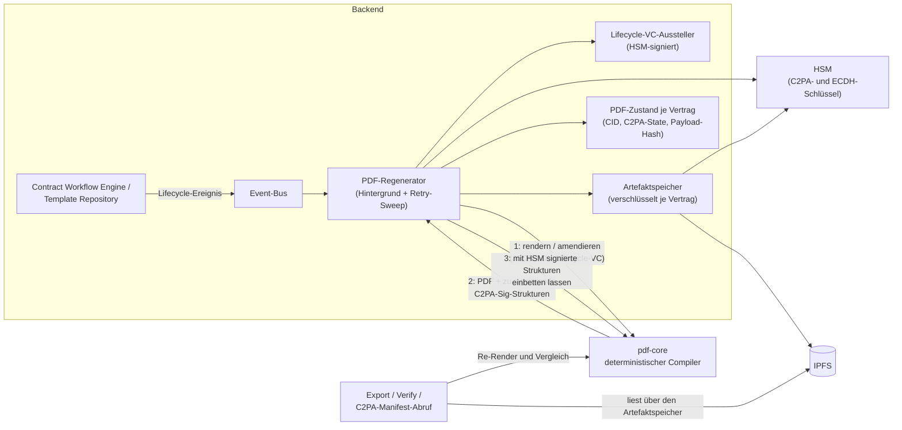

# 07 Dokumente und Provenance

Dieses Kapitel beschreibt, wie aus dem maschinenlesbaren Vertrag
(JSON-LD) das menschenlesbare Vertragsdokument (PDF/A-3) entsteht, warum
das Rendering deterministisch ist, wie jede Instanz unabhängig prüft,
dass beide Repräsentationen übereinstimmen, wie die Herkunft über
C2PA-Manifeste nachvollziehbar bleibt und wie Artefakte gespeichert und
gelöscht werden. Das PDF ist kein Ausdruck des Vertrags, sondern eine
zweite, jederzeit gegen die maschinenlesbare Form verifizierbare
Repräsentation derselben Vereinbarung.

## 7.1 Beteiligte Komponenten

| Komponente | Rolle |
| --- | --- |
| `pdf-core` | Eigenständiger, zustandsloser Dienst; alleiniger Eigentümer aller Byte-Arbeit am PDF: deterministisches Kompilieren, inkrementelle Amendments, Provenance-Re-Anchor, Extraktion des eingebetteten JSON-LD, C2PA-Einbettung, Re-Render- und Inhaltsvergleich. Das Backend parst nie selbst PDF-Bytes |
| Backend / PDF-Generierung | Orchestriert: hört auf Lifecycle-Ereignisse, lässt pdf-core rendern bzw. amendieren, stellt Lifecycle-Credentials aus, signiert die C2PA-Strukturen, legt das Ergebnis verschlüsselt ab und führt den PDF-Zustand je Vertrag/Vorlage (CID, Renderer-Version, C2PA-Zustand, Payload-Hash) |
| Artefaktspeicher | Verschlüsselnde Schicht über IPFS: jedes Artefakt wird vor dem Schreiben verschlüsselt, jeder Lesevorgang entschlüsselt authentifiziert |
| C2PA-Manifest-Dienst | Öffentlicher, unauthentifizierter Abruf des C2PA-Manifest-Stores eines Vertrags |
| HSM (über das Backend) | Signiert die COSE-Strukturen der C2PA-Manifeste und entpackt die Inhaltsschlüssel. pdf-core hält kein Schlüsselmaterial: Es baut die zu signierende Struktur, das Backend signiert |
| Statuslist-Dienst | Liefert bei der Verifikation den Live-Widerrufsstatus der in den Manifesten eingebetteten Lifecycle-Credentials |

## 7.2 Deterministisches Rendering

pdf-core garantiert: **Dieselbe JSON-LD-Payload erzeugt immer
byte-identischen Seiteninhalt.**

- Der Render-Zeitpunkt ist eine feste Epoche, nicht die Wanduhr; die
  vertrauenswürdige Vertragszeit ist der Zeitstempel der
  PAdES-Signatur (Kapitel 06).
- Die eingereichte Payload wird **verbatim** als Anhang eingebettet,
  exakt die übermittelten Bytes. Ihr SHA-256 ist die Content-Adresse des
  Dokuments, für jeden Prüfer aus dem Anhang nachrechenbar.
- Schrift ist eingebettet (PDF/A-Konformität); Layout und Struktur sind
  vollständig aus der Payload abgeleitet. Semantische Zusatzdaten, die
  nicht gerendert werden (etwa ODRL-Policies), bleiben unverändert im
  eingebetteten JSON-LD erhalten.

Weil der Seiteninhalt eine reine Funktion der Payload ist, lässt sich
die Übereinstimmung von menschen- und maschinenlesbarer Form jederzeit
beweisen: Payload extrahieren, neu kompilieren, Seiteninhalte
vergleichen.

Mehrfache Signaturen sind konstruktionsbedingt **sequenziell**: PDF/A-3
verlangt, dass jede Signatur alle vorherigen Bytes abdeckt. Änderungen
nach einer Signatur erfolgen als inkrementelle Revisionen über den
signierten Bytes.

## 7.3 Der Rendering- und Provenance-Fluss

PDFs entstehen nie auf Zuruf im Request-Pfad, sondern ereignisgetrieben
im Hintergrund. Jedes Lifecycle-Ereignis läuft über den Event-Bus in den
Regenerator: Der stellt ein Lifecycle-Verifiable-Credential aus, lässt
pdf-core rendern bzw. amendieren (die C2PA-Kette wächst, sie beginnt nie
neu), signiert die zurückgelieferten C2PA-Strukturen mit dem HSM und
lässt sie einbetten, legt das Ergebnis verschlüsselt ab und aktualisiert
den PDF-Zustand.

Der Export bedient sich immer aus diesem Bestand: Er liefert das
aktuelle PDF und wartet, wenn nach der letzten Änderung noch eine
Regeneration läuft. Er gibt nie einen veralteten Stand und rendert nie
selbst. Ein bereits PAdES-signiertes PDF ist **eingefroren**: Es wird
unverändert ausgeliefert, auch wenn der Lifecycle-Zustand weiterläuft.
Die einzige Revision nach der Signatur ist der Provenance-Re-Anchor der
Signatur-Finalisierung (ADR-26, Kapitel 06); danach mutiert nichts mehr.

## 7.4 C2PA-Manifeste

Jede PDF-Version trägt einen C2PA-Manifest-Store (JUMBF), der den
gesamten sichtbaren Seiteninhalt abdeckt. Die Manifeste **stapeln** sich
über den Lebenszyklus: Jeder Zustandswechsel hängt eine
Lifecycle-Assertion an, zusammen mit einem Verifiable Credential der
Instanz, das den Wechsel, den Asset-Hash und den Zeitpunkt bezeugt und
über eine Statusliste widerrufbar ist. Die COSE-Signatur jedes Manifests
erzeugt das Backend mit dem HSM-gehaltenen C2PA-Schlüssel; die
Zertifikatskette ist konfiguriert und wird pdf-core als öffentliches
Material bereitgestellt.

Ein signierter Vertrag trägt ein Manifest mehr als ein unsignierter: das
Lifecycle-Manifest, auf das sich die Signatur festlegt, und das
Re-Anchor-Manifest, das sich auf die Signatur festlegt (ADR-26).

Ausgeliefert wird die Provenance doppelt (ADR-4): eingebettet als JUMBF
im PDF und über den öffentlichen C2PA-Endpunkt, denn ein externer Prüfer
muss die Herkunftskette ohne Konto auflösen können. Damit hängt die
Sichtbarkeit einer Kette zugleich an der Verfügbarkeit ihres
Inhaltsschlüssels (7.6).

## 7.5 Unabhängige Validierung: menschen- vs. maschinenlesbar

Die Konsistenz beider Repräsentationen wird an drei Stellen erzwungen:

1. **Auf Abruf** über die Verify-Endpunkte: eingebettetes JSON-LD
   extrahieren, neu rendern, Seiteninhalt gegen den gespeicherten Stand
   vergleichen; zusätzlich C2PA-Signatur, Lifecycle-Credential und
   dessen Live-Widerrufsstatus prüfen.
2. **Beim Empfang eines Peer-PDFs** (Kapitel 08): Der Seiteninhalt muss
   exakt der Re-Render der eigenen eingebetteten Payload sein. Der
   Vergleich betrachtet nur die Seiteninhalte, so dass legitime C2PA-,
   Signatur- und Amendment-Schichten des Absenders nicht anschlagen.
3. **Bei der Signaturannahme** (Kapitel 06): eingereichtes gegen
   vorbereitetes Dokument.

Bei einem PDF mit angehängten Revisionen spielt die Verifikation jede
Revision deterministisch nach: eine Revision mit neuem
Lifecycle-Credential als Amendment, eine Revision mit unveränderter
Payload als Provenance-Re-Anchor. Ein signiertes PDF gilt nur dann als
gut, wenn das einzige nach der Signatur Angehängte byte-genau die
Provenance ist, die diese Instanz selbst produziert hat. Die „nach der
Signatur geändert"-Meldung der PDF-Reader wird nachgewiesen, nicht
ignoriert.

**Das Verifikationsergebnis ist ehrlich geschnitten.** Trägt das PDF
keine PAdES-Signatur oder prüft dieser Pfad sie nicht kryptographisch,
meldet das Ergebnis für die PDF-Signatur „nicht verfügbar" statt einer
scheinbar bestandenen Prüfung. Zusätzlich benennt es seine Fehlerklasse
direkt (ADR-30):

| Klasse | Bedeutung |
| --- | --- |
| `content_hash_mismatch` | Manifest vorhanden, aber der Inhalt weicht vom eingebetteten JSON-LD ab |
| `artifact_not_authentic` | Die gespeicherten Bytes haben die authentifizierte Entschlüsselung nicht bestanden; sie sind nicht die, die diese Instanz geschrieben hat |
| `verification_failed` | Eine andere Prüfung ist fehlgeschlagen |
| *(leer)* | Die Prüfung ist bestanden |

## 7.6 Speicherung: Verschlüsselung, Manipulationsnachweis, Löschung

Jedes Artefakt wird **vor** dem Schreiben verschlüsselt (ADR-28). Der
Inhaltsschlüssel ist pro **Löschbereich** zufällig gezogen: je Vertrag,
je Vorlage, und instanzweit für Checkpoints und instanzbezogene Reports.
Der Bereichsbezeichner geht als authentifizierte Angabe in das Chiffrat
ein, so dass ein Artefakt nicht unbemerkt einem anderen Bereich
untergeschoben werden kann.

Der Inhaltsschlüssel existiert im Ruhezustand **nur gewickelt** gegen
den im DID-Dokument publizierten Schlüsselvereinbarungs-Schlüssel;
Auspacken erfordert das HSM genau dieser Instanz. Bei jeder
Vertragssendung reist eine für den Peer gewickelte Kopie mit; der
Empfänger übernimmt sie einmal und wickelt sie gegen den eigenen
Schlüssel neu. Beide Instanzen halten danach denselben Inhaltsschlüssel,
jede Kopie nur vom eigenen HSM zu öffnen.

Drei Folgen:

- **Manipulation am Speicher ist ein Prüfergebnis, kein Serverfehler
  (ADR-30).** Scheitert die authentifizierte Entschlüsselung, sind die
  gespeicherten Bytes nicht die geschriebenen; genau das meldet die
  Verifikation. Klartext wird nie aus unauthentifiziertem Chiffrat
  abgeleitet.
- **CIDs zweier Instanzen unterscheiden sich** für denselben Vertrag,
  weil jede Seite unter eigenem Zufallswert verschlüsselt. Das ist
  folgenlos: Über die Peer-Schnittstelle wandert nie eine CID.
- **Löschung ist Schlüsselvernichtung.** Erasure zerstört die
  gewickelten Kopien und behält die Zeile als Zerstörungsnachweis
  (Kapitel 04 und 09). Export, Verifikation und Bundle-Abruf liefern
  danach eine definierte „Inhalt gelöscht"-Antwort; Listen- und
  Metadatensichten arbeiten weiter.

**Bekannte Grenze.** Die Schlüsselvernichtung entfernt die Chiffrate
nicht aus dem IPFS-Knoten. Solange eine Datenbanksicherung von vor der
Vernichtung existiert und der Schlüsselvereinbarungs-Schlüssel im HSM
weiterlebt, ließe sich daraus wieder ein lesbarer Schlüssel gewinnen.
Die Löschzusage reicht so weit wie das Aufbewahrungsfenster der
Sicherungen; das Nachziehen der Löschmarkierungen nach einer
Wiederherstellung beschreibt der
[Backup-Leitfaden](../backup-integration-guide.md).

## 7.7 Schnittstellen und Artefakte

Backend (authentifiziert, rollenbasiert; vgl. Anhang A):

| Endpunkt | Zweck |
| --- | --- |
| `GET /pdf/export/contract/{did}`, `GET /pdf/export/template/{did}` | Aktuelles PDF (PDF/A-3, eingebettetes JSON-LD, C2PA-Kette) |
| `GET /pdf/verify/contract/{did}`, `GET /pdf/verify/template/{did}` | Text/Daten- und Provenance-Verifikation inklusive Fehlerklasse |
| `GET /contract/export/{did}` | ZIP-Bundle: JSON-LD, signiertes PDF, C2PA-Store, Credentials, Signaturzustände, Manifest mit Hash je Eintrag, Hierarchie-Verwandte |
| `GET /template/export/{did}` | ZIP-Bundle einer Vorlage |
| `GET /c2pa/manifest/{contract_did}` | Öffentlicher C2PA-Manifest-Store; optional die Kettenaufzählung |

pdf-core (intern, ausschließlich vom Backend angesprochen), nach
Aufgabengruppen:

| Gruppe | Endpunkte | Zweck |
| --- | --- | --- |
| Rendern | `POST /render`, `/render/amendment`, `/render/reanchor` | Kompilieren, inkrementell fortschreiben, Provenance-Re-Anchor (ADR-26) |
| Prüfen | `POST /verify`, `/verify/content`, `/verify/content-match` | Re-Render-Verifikation; Empfangsprüfung für Peer-PDFs; Vergleich zweier PDFs bei der Signaturannahme |
| Extrahieren und Binden | `POST /payload/extract`, `/manifest/extract`, `/manifest/chain`, `/claim` | Eingebettetes JSON-LD, C2PA-Store und Kettenaufzählung auslesen; externe Payload gegen ein PDF binden |
| Einbetten | `POST /c2pa/embed`, `/evidence/embed`, `/evidence/extract` | Vom Backend signierte COSE-Strukturen einsetzen; Signatur-Evidenz ein- und auslesen |
| Meta | `GET /version`, `GET /ontology/…` | Renderer-Version (Teil des persistierten PDF-Zustands) und Schema-Artefakte des Renderers |

Die Verbindungsdaten von pdf-core sind Deployment-Konfiguration
([Deployment-Leitfaden](../deployment-guide.md)).

## 7.8 Betriebsverhalten

- **Export wartet statt zu lügen:** Läuft noch eine Regeneration, pollt
  der Export und bricht nach seinem Zeitfenster mit einem klaren Fehler
  ab; die blockierende Bedingung steht im Log.
- **Verify setzt einen vorhandenen Bestand voraus:** Ohne vorherigen
  Export schlägt die Verifikation mit entsprechender Meldung fehl. Ist
  der Lifecycle-Zustand fortgeschritten, regeneriert sie transparent.
- **Verlorene Regenerationen holt ein Sweep nach:** Ein periodischer
  Durchlauf findet Entitäten, deren gespeichertes PDF nicht dem
  aktuellen Dokument entspricht, arbeitet sie in begrenzten Stapeln ab
  und wiederholt jede nur begrenzt oft mit wachsendem Abstand. Ein
  dauerhaft unrenderbarer Vertrag blockiert die heilbaren nicht.
- **IPFS ist eventual consistent:** Frisch geschriebene CIDs sind nicht
  immer sofort lesbar; der Client wiederholt mit Backoff.
- **Bundle-Exporte verweigern statt unvollständig zu liefern:** Fehlt
  eine referenzierte Komponente, antwortet der Export mit einer
  Befundliste statt eines lückenhaften Archivs.
- **Ein Amendment ohne inhaltliche Änderung** wird abgelehnt; die
  bewusste Ausnahme ist der Provenance-Re-Anchor mit seinem eigenen
  Endpunkt.
- **Ein fehlerhaftes Peer-PDF ist ein Ablehnungsgrund, kein Absturz:**
  Die Verarbeitung eingehender Dokumente ist in Größe und Aufwand
  begrenzt.
