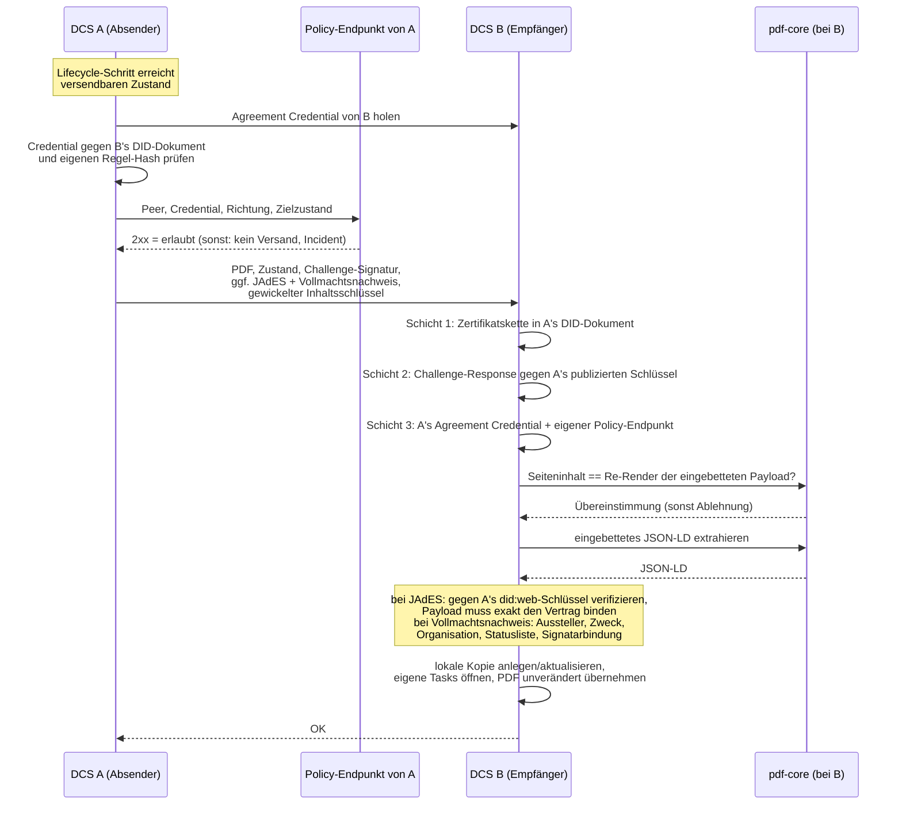

# 08 Föderation

Dieses Kapitel beschreibt, wie zwei unabhängige DCS-Instanzen Verträge
austauschen und verhandeln, welches Trust-Modell jede Interaktion
absichert und wie Vorlagen über den XFSC Federated Catalogue auffindbar
werden. Das Grundprinzip: Über die Instanzgrenze wandern **Artefakte,
kein Zustand**. Jede Instanz führt ihren eigenen Workflow, ihre eigene
RBAC und ihre eigene Kopie des Vertrags (ADR-13).

## 8.1 Beteiligte Komponenten

| Komponente | Rolle |
| --- | --- |
| DCS-to-DCS-Synchronizer | Ausgehende Seite: hört auf Lifecycle-Ereignisse und verschickt das Vertrags-PDF; Fehlversuche landen in einer Retry-Tabelle |
| Peer-Endpunkte | Eingehende Seite: authentifizieren den Absender, prüfen das PDF (und bei signierten Sendungen JAdES und Vollmachtsnachweis), übernehmen es als lokale Kopie; nehmen Löschanforderungen entgegen |
| Trust Gate | Vertrauensschicht vor jeder Interaktion, in beide Richtungen: Agreement Credential des Peers und lokaler Policy-Endpunkt (fail-closed) |
| Counterparty-PoA-Gate | Prüft die Handlungsvollmacht hinter jeder Signatur, die eine Gegenpartei mitschickt (ADR-31) |
| did:web-Identität + HSM | Instanzidentität mit Zertifikatskette; private Schlüssel im HSM (Kapitel 05) |
| pdf-core | Prüft beim Empfang, dass der Seiteninhalt der Re-Render der eingebetteten Payload ist, und extrahiert das JSON-LD (Kapitel 07) |
| Audit-Trail | Jede Trust-Gate-Ablehnung wird als Incident erfasst (Kapitel 09) |
| Federated Catalogue | Instanzübergreifende Vorlagen-Discovery |

## 8.2 Instanz-zu-Instanz-Austausch: das PDF ist das Wire-Format

Ausgetauscht werden das **Vertrags-PDF pro sichtbarem
Lebenszyklusschritt**, die **JAdES-Signatur nach dem Signieren** und der
**Nachweis der Handlungsvollmacht** hinter dieser Signatur. Das PDF ist
selbsttragend: Es enthält das JSON-LD, die C2PA-Kette und etwaige
Signaturen. Ein bloßes PDF ist ein Vorschlag, ein PDF mit JAdES die
Signatur der Gegenseite. Zusätzlich reist der für den Peer gewickelte
Inhaltsschlüssel mit (ADR-28, Kapitel 07).

Verschickt wird nur, was die Gegenseite sehen muss: die Zustände
`OFFERED`, `NEGOTIATION`, `SIGNED` und `REVOKED`. Interne Zustände
(Entwurf, Review, Freigabe, Aktivierung, Terminierung) bleiben lokal.
Die Verhandlung verläuft in drei Phasen: verhandeln (Gegenvorschläge als
neue PDF-Versionen), einigen (beide Seiten bestätigen dieselbe Version)
und erst danach signieren; ein einseitig signierter, noch nicht
geeinigter Vertrag wäre ein disputables Artefakt.

Beim **ersten Empfang** entsteht die lokale Kopie im Zustand `OFFERED`,
mit dem Absender als Origin; die eigenen Review-, Freigabe- und
Verhandlungs-Tasks werden lokal geöffnet. Ein **erneuter Empfang**
aktualisiert den Inhalt und erhöht die lokale Version, ohne den eigenen
Workflow-Fortschritt zu überschreiben. Der vom Absender deklarierte
Zustand ist rein informativ, mit genau einer Ausnahme: Meldet die
authentifizierte Gegenpartei `REVOKED`, übernimmt der Empfänger diesen
Zustand, denn der Widerruf entwertet die Vereinbarung.

Das empfangene PDF wird **exakt so, wie es kam**, als eigene Kopie
gespeichert. Ein Neu-Rendern würde die C2PA-Kette der Gegenseite
zerstören; spätere eigene Änderungen amendieren diese Basis, so dass die
Kette über beide Instanzen hinweg wächst.

**Transport folgt der Identität.** Der Peer wird aus seinem
`did:web`-Identifier aufgelöst, einschließlich Pfadsegmenten, so dass
mehrere Instanzen einen Host teilen können. Die Auflösung ist
HTTPS-only; die einzigen Ausnahmen sind Loopback-Hosts und Hosts, die
ein Deployment ausdrücklich als unsicher benennt (clusterinterne
Identitäten). Ausgehende Abrufe folgen keinen Weiterleitungen, wählen
keine Adressen, an denen eine publizierte Identität nie liegt, und sind
mit Timeouts begrenzt. Authentifiziert wird nicht auf Transportebene,
sondern per Challenge-Response-Signatur im Request selbst.

## 8.3 Trust-Modell zwischen Instanzen

Vertrauen entsteht ausschließlich aus verifizierbaren Schichten:

| Schicht | Frage | Mechanismus | Anker |
| --- | --- | --- | --- |
| 1: Identität | Wer bist du? | `did:web` mit Zertifikatskette, optional gegen den EU-Trust-Pool geprüft | EU-Vertrauenslisten / QTSP |
| 2: Besitznachweis | Sprichst gerade du? | Challenge-Response pro Request: Zufallswert, mit dem HSM-Schlüssel des Absenders signiert, verifiziert gegen dessen publizierten Schlüssel | Schicht 1 |
| 3a: Regelakzeptanz | Spielst du nach den Regeln? | Selbstsigniertes Agreement Credential unter `/.well-known/dcs-agreement-credential.json`, dessen `termsOfUse`-Hash das Föderationsregelwerk benennt | In die Binärdatei einkompiliertes Regelwerk; der Hash muss dem eigenen entsprechen |
| 3b: Policy | Darf **diese** Interaktion stattfinden? | Eigener lokaler Policy-Endpunkt (`DCS_TRUST_PDP_URL`): 2xx erlaubt, alles andere verweigert | Was auch immer der Endpunkt konsultiert (Allowlist, Trust-Listen, Clearing House, …) |
| 3c: Vollmacht | Durfte der Unterzeichner für diese Partei handeln? | Mitgeschickter Vollmachtsnachweis, geprüft gegen einen für `peer` zugelassenen Aussteller mit Organisationsberechtigung, inklusive Statusliste (ADR-31) | Ausstellervertrauen der empfangenden Instanz |
| 4: Rechtswirkung | Bindet der Vertrag? | AES/QES auf dem Dokument (PAdES/JAdES, Kapitel 06) | eIDAS |

Die Schichten 3a/3b bilden das **Trust Gate** (ADR-19), konsultiert vor
jedem Versand und bei jedem Empfang:

- **Fail-closed.** Ein nicht konfigurierter, nicht erreichbarer oder
  nicht antwortender Policy-Endpunkt verweigert wie ein explizites Deny.
  Ohne konfigurierten Policy-Endpunkt ist Föderation wirksam
  abgeschaltet.
- **Regelakzeptanz ist an die Softwareversion gebunden.** Das Regelwerk
  ist einkompiliert und unter `/.well-known/dcs-federation-rules.md`
  abrufbar; Regeländerungen sind Software-Releases.
- **Das Credential muss vom Peer selbst stammen.** Aussteller und
  Bezugsquelle müssen auf dasselbe Auflösungsziel zeigen, und der Proof
  muss einen Assertion-Schlüssel des Peer-DID-Dokuments referenzieren.
- **Kein „Phone home".** Jede Instanz befragt ausschließlich ihren
  eigenen Policy-Endpunkt. Die Standard-Auslieferung enthält einen
  minimalen Flow, den Betreiber erweitern.
- **Jede Ablehnung ist auditierbar.** Auf dem Versandpfad wird eine
  Agreement-Credential-Ablehnung erneut versucht; eine
  Policy-Endpunkt-Ablehnung ist terminal: kein Retry, genau ein Incident
  pro Versuch, dedupliziert pro Vertrag, Peer und Richtung.

**Provenance und Vollmacht des Gegenseiten-Artefakts.** Die JAdES eines
signierten Versands wird vor der Annahme vollständig verifiziert: gegen
die eigene Zertifikatskette, mit dem publizierten
`did:web`-Assertion-Schlüssel des Absenders als Leaf, und die signierte
Payload muss exakt den im PDF eingebetteten Vertrag binden. Die
Challenge-Response authentifiziert nur die Sitzung; die JAdES bindet den
Vertrags**inhalt** an den Schlüssel des Absenders und bleibt als
unabhängig nachprüfbarer Nachweis abrufbar.

Der mitgeschickte Vollmachtsnachweis (ADR-31) wird geprüft, bevor etwas
persistiert wird: für `peer` zugelassener Aussteller mit Berechtigung
für diese Organisation, gültige Signatur und Frist, nicht widerrufen,
autorisiert genau die Partei, die signiert hat, und gehalten von genau
dem ausgewiesenen Unterzeichner. Was die Prüfung feststellt, ist eine
Attestierung von Vollmacht; wer der Mensch ist, hat die Instanz
festgestellt, auf der die Ceremony lief. Das Fehlerverhalten ist bewusst
asymmetrisch: Ein **vorhandener, nicht verifizierbarer** Nachweis
verweigert die Sendung und erzeugt einen Incident; ein **fehlender**
nicht, denn ein Peer ohne aufbewahrte Nachweise muss weiter föderieren
können, und eine Partei ohne Vollmacht weist der Compliance Viewer aus.
Läuft ein Vollmachts-Credential nach der Signatur ab oder wird es
widerrufen, scheitern spätere Sendungen desselben Vertrags; die
Lebensdauer einer Vollmacht muss den Austausch überdauern.

## 8.4 Löschung über die Instanzgrenze

Der Löschpfad ist ein eigener Peer-Aufruf mit derselben
did:web-Challenge-Response wie der PDF-Austausch:

1. Die anfragende Instanz vernichtet ihre eigenen gewickelten
   Inhaltsschlüssel und schreibt ein Zerstörungsereignis in den
   Audit-Trail. Scheitert dieser lokale Schritt, ist das ein harter
   Fehler.
2. Sie fordert jede Gegenpartei-Instanz auf, dasselbe zu tun. Eine nicht
   erreichbare Gegenseite blockiert nicht: Die Anforderung bleibt offen
   und wird periodisch erneut zugestellt.
3. Beide Seiten emittieren dasselbe Zerstörungsereignis, mit Akteur,
   Vertrag, Bereich und Grund, nie mit Inhalt.

Ein vernichteter Bereich ist endgültig: Weder ein lokaler Schreibvorgang
noch ein vom Peer mitgeschickter Schlüssel erzeugt einen neuen. Der
Fortschritt der Kette ist über eine Statusabfrage sichtbar (Kapitel 09);
die Grenzen der Zusage beschreibt Kapitel 07.

## 8.5 Federated-Catalogue-Integration

Der Federated Catalogue dient der Vorlagen-Discovery, nicht der
Geschäftsdatenhaltung: Er verifiziert und speichert Self-Descriptions
und macht sie abfragbar; mehrere FC-Instanzen können sich
synchronisieren. Das Datenmodell verknüpft die Vorlage (Resource) mit
dem Participant und einem ServiceOffering, das die Endpunkt-URL der
betreibenden DCS-Instanz trägt. Von einer gefundenen Vorlage lässt sich
so zum zuständigen DCS navigieren; die übliche Übernahme ist die
Registrierung als eigene Vorlage in das eigene Repository mit eigenem
Freigabeprozess (Kapitel 03).

Zur Authentifizierung verwendet die Instanz einen
Keycloak-Service-Account, der sämtliche funktionalen Katalogrollen
einschließlich der administrativen hält (ADR-18). Daraus folgt eine
harte Betriebsgrenze: Ein Katalog darf nicht von mehreren
DCS-Deployments geteilt werden, die sich nicht vollständig vertrauen.
Das Deployment erzwingt das: Eine Katalog-Integration gegen einen
entfernten, nicht mitdeployten Katalog schlägt fehl, solange der
Betreiber die gemeinsame administrative Vertrauensgrenze nicht
ausdrücklich bestätigt.

Betriebsdetails der Katalog-Kopplung sammelt der
[FC-Integrationsleitfaden](../fc-integration/fc-integration-guide.md);
das Deployment beschreibt der
[Deployment-Leitfaden](../deployment-guide.md).

## 8.6 Betriebsverhalten

- **Versand ist ereignisgetrieben und idempotent nachholbar.** Ein
  fehlgeschlagener Versand hinterlässt einen Retry-Eintrag, den ein
  Scheduler periodisch erneut versucht; ein Erfolg räumt ihn auf. Diese
  Zustellung ist datenbankgestützt und übersteht verlorene
  Event-Bus-Nachrichten.
- **Ein Angebot vor fertigem PDF wird nie stillschweigend verworfen:**
  Der Versand wird explizit in die Retry-Queue gestellt, bis das PDF
  vorliegt.
- **Terminale Policy-Denials verlassen die Retry-Queue** atomar mit dem
  Incident; sie würden sonst endlos erneut anlaufen.
- **Was der Betreiber sieht:** Trust-Gate-Incidents im Audit-Trail mit
  Peer-DID, Richtung und Begründung; Versand- und Empfangsfehler in den
  Logs; bei einem Inhalts-Mismatch eine Diagnose mit der divergierenden
  Stelle; offene Löschanforderungen in der Erasure-Statusabfrage.
