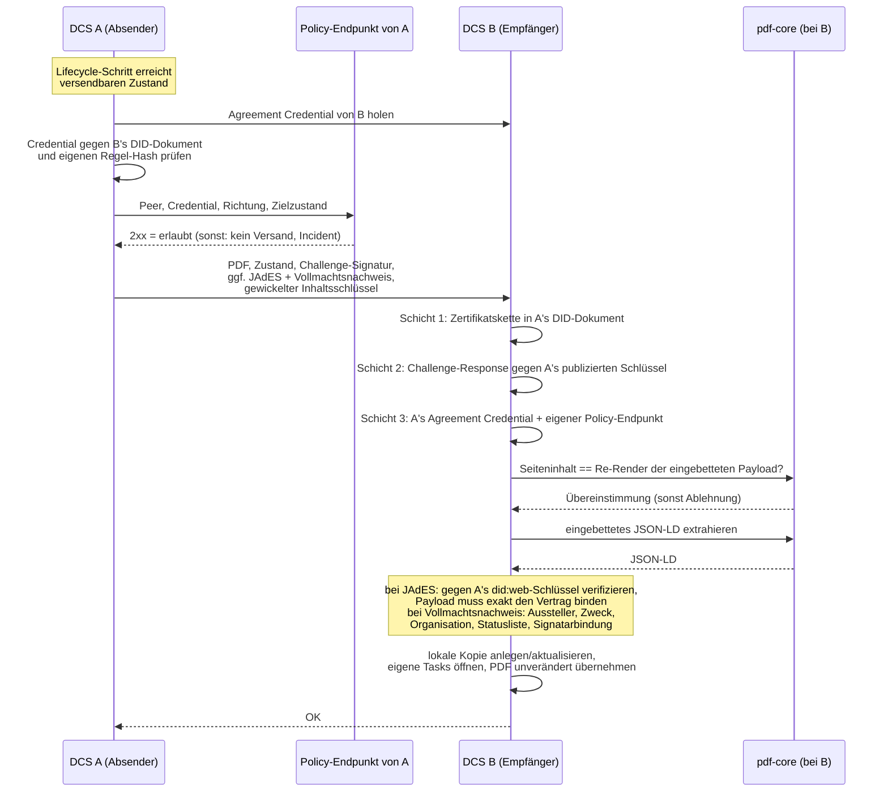

# 08 — Föderation

Dieses Kapitel beschreibt, wie zwei unabhängige DCS-Instanzen — betrieben
von verschiedenen Organisationen — Verträge austauschen und verhandeln,
welches Trust-Modell jede Interaktion absichert und wie Vorlagen über den
XFSC Federated Catalogue instanzübergreifend auffindbar werden. Das
Grundprinzip: Über die Instanzgrenze wandern **Artefakte, kein Zustand** —
jede Instanz führt ihren eigenen Workflow, ihre eigene RBAC und ihre
eigene Kopie des Vertrags (ADR-13).

## 8.1 Beteiligte Komponenten

| Komponente | Rolle |
| --- | --- |
| DCS-to-DCS-Synchronizer | Ausgehende Seite: hört auf Lifecycle-Ereignisse und verschickt das Vertrags-PDF an die Gegenpartei; Fehlversuche landen in einer Retry-Tabelle |
| Peer-Endpunkte | Eingehende Seite: authentifizieren den Absender, prüfen das PDF (und bei signierten Sendungen JAdES und Vollmachtsnachweis) und übernehmen es als lokale Kopie; nehmen außerdem Löschanforderungen entgegen |
| Trust Gate | Vertrauensschicht vor jeder Interaktion, in beide Richtungen: Agreement Credential des Peers und lokaler Policy-Endpunkt (fail-closed) |
| Counterparty-PoA-Gate | Prüft die Handlungsvollmacht hinter jeder Signatur, die eine Gegenpartei mitschickt (ADR-31) |
| did:web-Identität + HSM | Instanzidentität mit Zertifikatskette; private Schlüssel im HSM (Kapitel 05) |
| pdf-core | Prüft beim Empfang, dass der Seiteninhalt des Peer-PDFs der Re-Render seiner eingebetteten Payload ist, und extrahiert das JSON-LD (Kapitel 07) |
| Audit-Trail | Jede Trust-Gate-Ablehnung wird als Incident erfasst (Kapitel 09) |
| Federated Catalogue | Instanzübergreifende Vorlagen-Discovery |

## 8.2 Instanz-zu-Instanz-Austausch: das PDF ist das Wire-Format

Zwei DCS-Instanzen tauschen im Vertragsablauf drei Dinge aus: **das
Vertrags-PDF pro sichtbarem Lebenszyklusschritt**, **die JAdES-Signatur
nach dem Signieren** und **den Nachweis der Handlungsvollmacht hinter
dieser Signatur**. Das PDF ist selbsttragend — es enthält das
maschinenlesbare JSON-LD, die C2PA-Provenance-Kette und etwaige
Signaturen (Kapitel 07). Ein bloßes PDF ist ein Vorschlag (Angebot oder
Verhandlungs-Gegenvorschlag); ein PDF mit JAdES ist die Signatur der
Gegenseite. Zusätzlich reist der für den Peer gewickelte
Inhaltsschlüssel mit, damit beide Seiten dieselben Artefakte lesen können
(ADR-28, Kapitel 07).

Verschickt wird nur, was die Gegenseite sehen muss: die Zustände
`OFFERED`, `NEGOTIATION`, `SIGNED` und `REVOKED` — der Widerruf einer
angebrachten Signatur muss die Gegenpartei unmittelbar erreichen, weil er
die Vereinbarung entwertet. Interne Zustände (Entwurf, Review, Freigabe,
Aktivierung, Terminierung) bleiben lokal — Review- und Freigabeprozesse
der einen Organisation sind für die andere unsichtbar.

Die Verhandlung verläuft in drei getrennten Phasen: **verhandeln**
(Gegenvorschläge als neue PDF-Versionen), **einigen** (beide Seiten
bestätigen dieselbe Version; nachweisbar aus der Provenance des
Artefakts) und erst danach **signieren**. Ein einseitig signierter, noch
nicht beidseitig geeinigter Vertrag wäre ein disputables Artefakt —
deshalb ist die Phasentrennung Teil des Protokolls.

### Der Ablauf

Beim **ersten Empfang** entsteht die lokale Kopie im Zustand `OFFERED`
(ein Angebot auf dem eigenen Tisch), mit dem Absender als Origin und den
eigenen Nutzern in den lokalen Rollen; die eigenen Review-, Freigabe- und
Verhandlungs-Tasks werden lokal geöffnet. Ein **erneuter Empfang**
aktualisiert den Inhalt und erhöht die lokale Version, ohne den eigenen
Workflow-Fortschritt zu überschreiben. Der vom Absender deklarierte
Vertragszustand ist dabei rein informativ — mit genau einer Ausnahme:
Meldet die authentifizierte Gegenpartei `REVOKED`, übernimmt der
Empfänger diesen Zustand, denn der Widerruf der Signatur der Gegenseite
entwertet die Vereinbarung; kein anderer Peer-Zustand überschreibt je den
lokalen Workflow.

Das empfangene PDF wird **exakt so, wie es kam**, als eigene Kopie
gespeichert — ein Neu-Rendern würde die C2PA-Provenance-Kette der
Gegenseite zerstören; spätere eigene Änderungen amendieren diese Basis,
sodass die Kette über beide Instanzen hinweg wächst.

### Transport folgt der Identität, nicht der Netztopologie

Der Peer wird aus seinem `did:web`-Identifier aufgelöst — einschließlich
etwaiger Pfadsegmente, sodass mehrere Instanzen einen Host teilen können
und jede unter ihrem eigenen Pfadpräfix angesprochen wird (Kapitel 05).

**Die Auflösung ist HTTPS-only.** Ein Rückfall auf Klartext ließe einen
Angreifer auf dem Pfad sowohl das DID-Dokument mit dem Schlüssel des
Peers als auch das dagegen geprüfte Agreement Credential ausliefern — das
Föderations-Gate wäre wertlos. Zwei eng gefasste Ausnahmen gibt es:
Loopback-Hosts, weil Entwicklungs- und CI-Stacks sich so gegenseitig
auflösen, und Hosts, die ein Deployment ausdrücklich benennt, weil eine
clusterinterne Identität hinter einem Service-Namen liegt, der weder
Loopback ist noch TLS terminiert. Die Ausnahme ist damit explizit und
pro Deployment sichtbar, nicht ein stiller Fallback.

Ergänzend gilt für jeden ausgehenden Abruf: keine Weiterleitungen (eine
Weiterleitung ließe die Gegenstelle das Ziel nach der Prüfung wechseln)
und keine Verbindungen zu Adressen, an denen eine publizierte Identität
nie liegt. Jeder Abruf ist mit einem Timeout begrenzt, damit „stumm"
nicht „hängend" bedeutet.

Authentifiziert wird der Versand nicht auf Transportebene, sondern per
Challenge-Response-Signatur im Request selbst.

## 8.3 Trust-Modell zwischen Instanzen

Zwischen Instanzen gibt es keine gemeinsame Nutzeridentität und keine
Netzwerk-Vertrauensstellung; Vertrauen entsteht ausschließlich aus
verifizierbaren Schichten:

| Schicht | Frage | Mechanismus | Anker |
| --- | --- | --- | --- |
| 1 — Identität | Wer bist du? | `did:web` mit Zertifikatskette, optional gegen den EU-Trust-Pool geprüft | EU-Vertrauenslisten / QTSP |
| 2 — Besitznachweis | Sprichst gerade du? | Challenge-Response pro Request: Zufallswert, mit dem HSM-Schlüssel des Absenders signiert, verifiziert gegen dessen publizierten Schlüssel | Schicht 1 |
| 3a — Regelakzeptanz | Spielst du nach den Regeln? | Selbstsigniertes Agreement Credential unter `/.well-known/dcs-agreement-credential.json`, signiert mit dem dedizierten VC-Schlüssel aus dem eigenen DID-Dokument, dessen `termsOfUse`-Hash das Föderationsregelwerk benennt | In die Binärdatei einkompiliertes Regelwerk — der Hash muss dem eigenen entsprechen |
| 3b — Policy | Darf **diese** Interaktion stattfinden? | Eigener lokaler Policy-Endpunkt (`DCS_TRUST_PDP_URL`): 2xx erlaubt, alles andere verweigert | Was auch immer der Endpunkt konsultiert (Allowlist, Trust-Listen, Clearing House, …) |
| 3c — Vollmacht | Durfte der, der unterschrieben hat, für diese Partei handeln? | Mitgeschickter Vollmachtsnachweis, geprüft gegen einen für `peer` zugelassenen Aussteller mit Organisationsberechtigung, inklusive Statusliste (ADR-31) | Ausstellervertrauen der empfangenden Instanz |
| 4 — Rechtswirkung | Bindet der Vertrag? | AES/QES auf dem Dokument (PAdES/JAdES, Kapitel 06) | eIDAS |

Die Schichten 3a/3b bilden zusammen das **Trust Gate** (ADR-19), das auf
beiden Pfaden konsultiert wird — vor jedem Versand und bei jedem Empfang.
Kernentscheidungen:

- **Fail-closed.** Ein nicht konfigurierter, nicht erreichbarer oder
  nicht antwortender Policy-Endpunkt verweigert genauso wie ein
  explizites Deny. Ohne konfigurierten Policy-Endpunkt ist Föderation
  wirksam abgeschaltet.
- **Regelakzeptanz ist an die Softwareversion gebunden.** Das Regelwerk
  ist einkompiliert und unter `/.well-known/dcs-federation-rules.md`
  abrufbar; sein Hash steht im Agreement Credential. Zwei Instanzen
  derselben Version stimmen automatisch überein, abweichende Regelwerke
  scheitern laut am Hash-Vergleich — Regeländerungen sind
  Software-Releases.
- **Das Credential muss vom Peer selbst stammen.** Aussteller-Hostname
  und Bezugsquelle müssen übereinstimmen, und der Proof muss den
  dedizierten VC-Eintrag des Peer-DID-Dokuments referenzieren — ein
  fremdes, zufällig verifizierbares Credential kann nicht untergeschoben
  werden.
- **Kein „Phone home".** Jede Instanz befragt ausschließlich ihren
  eigenen Policy-Endpunkt; die Gegenseite ruft ihn nie auf. Die
  Standard-Auslieferung enthält einen minimalen Flow, den Betreiber um
  dataspace-spezifische Prüfungen erweitern.
- **Jede Ablehnung ist auditierbar.** Trust-Gate-Denials landen als
  Incident im Audit-Trail; auf dem Versandpfad wird eine
  Agreement-Credential-Ablehnung erneut versucht, eine
  Policy-Endpunkt-Ablehnung ist dagegen terminal — kein Retry, genau ein
  Incident pro Versuch, dedupliziert pro Vertrag, Peer und Richtung.

### Provenance und Vollmacht des Gegenseiten-Artefakts

Ein signierter Versand trägt zusätzlich die JAdES-Signatur des Absenders
über dem Vertragsinhalt. Der Empfänger nimmt sie nicht auf Zuruf
entgegen, sondern verifiziert sie vollständig, bevor er die Sendung
akzeptiert: Das kompakte JWS muss gegen seine eigene Zertifikatskette
verifizieren, der Leaf-Schlüssel muss der publizierte
`did:web`-Schlüssel des Absenders sein, und die signierte Payload muss
exakt die Kanonisierung aus Vertrags-DID, Version und dem im verschickten
PDF eingebetteten Vertragsdokument sein — die Challenge-Response-Signatur
authentifiziert nur die Sitzung, die JAdES bindet den Vertrags**inhalt**
an den Schlüssel des Absenders. Das verifizierte Artefakt wird
persistiert und bleibt als unabhängig nachprüfbarer Nachweis abrufbar.

**Zusätzlich reist die Handlungsvollmacht mit (ADR-31).** Bisher
behauptete eine Instanz die Vollmacht ihres Unterzeichners, und die
Gegenseite hatte nichts, wogegen sie das hätte prüfen können. Die
Signatur-Ceremony bewahrt deshalb das Vollmachts-Credential auf, das der
Signatar vorgelegt hat, und der Synchronizer schickt es mit, sobald der
Vertrag Signaturen trägt. Der Empfänger prüft, bevor er etwas von der
Sendung persistiert:

- Der Aussteller ist für den Zweck `peer` zugelassen und berechtigt,
  diese Organisation zu attestieren.
- Credential-Typ, Signatur und Gültigkeitsfenster halten.
- Die Statusliste sagt, dass das Credential nicht widerrufen ist.
- Das Credential autorisiert genau die Partei, die signiert hat, und wird
  von genau dem Unterzeichner gehalten, den der Knoten dieser Partei
  ausweist.
- Ein Peer darf nur für **seine eigene** Partei Nachweise schicken.

Was diese Prüfung feststellt, ist präzise begrenzt: **eine Attestierung
von Vollmacht.** Ein Aussteller, dem diese Instanz vertraut und der für
diese Organisation sprechen darf, sagt, dass der Inhaber für sie handeln
darf, und hat das nicht widerrufen. Sie stellt **nicht** fest, wer der
Mensch ist — die Identitätsprüfung fand auf der Instanz statt, auf der
die Ceremony lief, gegen deren Vertrauensanker. Auch Frische und Bindung
an genau diesen Vertrag lassen sich nicht feststellen: Dieselbe
Präsentation verifiziert für einen anderen Vertrag zwischen denselben
Parteien identisch, bis sie abläuft oder widerrufen wird.

Das Verhalten bei Fehlern ist bewusst asymmetrisch: Ein Nachweis, der
**vorhanden ist und nicht verifiziert**, verweigert die Sendung und
erzeugt einen Trust-Gate-Incident. Ein Nachweis, der **fehlt**, tut das
nicht — ein Peer, der keine Nachweise aufbewahrt, muss weiter
föderieren können, und eine Partei ohne hinterlegte Vollmacht ist etwas,
das der Signature Compliance Viewer ohnehin ausweist. Das hebt den Boden
an (wer Nachweise schickt, kann keine falschen schicken), erzwingt aber
niemanden zum Nachweis.

Ein weiterer Nebeneffekt ist zu kennen: Läuft ein Vollmachts-Credential
nach der Signatur ab oder wird es widerrufen, scheitern spätere Sendungen
desselben Vertrags — die Lebensdauer einer Vollmacht muss den Austausch
überdauern.

## 8.4 Löschung über die Instanzgrenze

Ein Vertrag existiert auf zwei Instanzen, jede mit eigenen Artefakten.
Eine Löschung, die nur auf der anfragenden Instanz wirkt, ist keine
Löschung. Der Löschpfad ist deshalb ein eigener Peer-Aufruf, mit derselben
did:web-Challenge-Response authentifiziert wie der PDF-Austausch:

1. Die anfragende Instanz vernichtet ihre eigenen gewickelten
   Inhaltsschlüssel des Vertrags und schreibt dazu ein
   Zerstörungsereignis in den Audit-Trail. Dieser lokale Schritt ist ein
   harter Fehler, wenn er scheitert.
2. Sie fordert jede Gegenpartei-Instanz auf, dasselbe zu tun. Eine nicht
   erreichbare Gegenseite blockiert nicht: Die Anforderung bleibt als
   offener Eintrag stehen und wird periodisch erneut zugestellt.
3. Beide Seiten emittieren dasselbe Zerstörungsereignis — mit Akteur,
   Vertrag, Bereich und Grund, nie mit Inhalt.

Ein einmal vernichteter Bereich ist endgültig: Weder ein lokaler
Schreibvorgang noch ein vom Peer mitgeschickter Schlüssel erzeugt für ihn
einen neuen. Der Fortschritt der Kette ist über eine eigene Statusabfrage
sichtbar (Kapitel 09). Die Grenzen dieser Zusage beschreibt Kapitel 07.

## 8.5 Federated-Catalogue-Integration

Der Federated Catalogue dient der **Vorlagen-Discovery, nicht der
Geschäftsdatenhaltung**: Er verifiziert und speichert Self-Descriptions
(JSON-LD) und macht sie abfragbar; mehrere FC-Instanzen können sich
untereinander synchronisieren, wodurch Vorlagen föderationsweit auffindbar
werden.

Das Datenmodell verknüpft drei Self-Description-Typen: Die Vorlage
(Resource) verweist auf den Participant, das ServiceOffering auf denselben
Participant und trägt die Endpunkt-URL der betreibenden DCS-Instanz. So
lässt sich von einer gefundenen Vorlage zum zuständigen DCS-Endpunkt
navigieren, an dem eine Verhandlung beginnen kann.

Aus DCS-Sicht:

| Schnittstelle | Zweck |
| --- | --- |
| Publish einer Vorlage (Kapitel 03) | Eine registrierte Vorlage wird als Self-Description an den Katalog übermittelt. Aussteller ist die **Instanz-DID**, nicht der einzelne Mitarbeiter — der Participant ist eine Organisation, kein Endnutzer (ADR-18) |
| Katalog-Lesezugriff | Vorlagenliste abrufen, einzelne Vorlage per DID/Version auflösen, Metadaten durchsuchen |

Zur Authentifizierung gegenüber dem Katalog verwendet die Instanz einen
Keycloak-Service-Account. Dieser hält derzeit sämtliche funktionalen
Katalogrollen einschließlich der administrativen — eine ausdrücklich als
Übergangslösung dokumentierte Stellung (ADR-18): Solange sie besteht,
darf ein Katalog **nicht** von mehreren DCS-Deployments geteilt werden,
die sich nicht vollständig vertrauen, da jede Instanz sonst
Katalogeinträge anderer Mandanten ändern könnte. Der Zielzustand ist ein
Client pro Deployment mit auf die eigene Participant-ID gebundenem Claim
und rein funktionalen Rollen. Das Deployment erzwingt diese Grenze:
Wird die Katalog-Integration gegen einen entfernten, nicht mitdeployten
Katalog konfiguriert, schlägt das Rendering fehl, solange der Betreiber
die gemeinsame administrative Vertrauensgrenze nicht ausdrücklich
bestätigt.

Betriebsdetails der Katalog-Kopplung (Realm-Provisionierung, bekannte
Upstream-Eigenheiten, Beispiel-Self-Descriptions) sammelt der
[FC-Integrationsleitfaden](../fc-integration/fc-integration-guide.md);
das Deployment beschreibt der [Deployment-Leitfaden](../deployment-guide.md).

## 8.6 Betriebsverhalten

- **Versand ist ereignisgetrieben und idempotent nachholbar.** Ein
  fehlgeschlagener Versand (Peer nicht erreichbar, PDF noch nicht
  regeneriert, Agreement-Credential-Ablehnung) hinterlässt einen
  Retry-Eintrag; ein Scheduler versucht ihn in konfigurierbarem Intervall
  erneut. Ein erfolgreicher Versand räumt den Eintrag auf. Diese
  Zustellung ist datenbankgestützt und deshalb unabhängig davon, ob eine
  Event-Bus-Nachricht verloren geht.
- **Ein Angebot vor fertigem PDF wird nie stillschweigend verworfen:**
  Ist der Vertrag versendbar, aber das PDF noch nicht verfügbar, wird der
  Versand explizit in die Retry-Queue gestellt.
- **Terminale Policy-Denials verlassen die Retry-Queue.** Eine Ablehnung
  durch den eigenen Policy-Endpunkt erzeugt einen Incident und entfernt
  einen etwaigen Retry-Eintrag atomar — sie würde sonst endlos erneut
  anlaufen, obwohl die Entscheidung terminal ist.
- **Was der Betreiber sieht:** Trust-Gate-Incidents im Audit-Trail mit
  Peer-DID, Richtung und Begründung; Versand- und Empfangsfehler in den
  Logs; bei einem Inhalts-Mismatch eines empfangenen PDFs eine Diagnose
  mit der divergierenden Stelle und dem Hash der eingebetteten Payload;
  offene Löschanforderungen als Einträge der Erasure-Statusabfrage.
