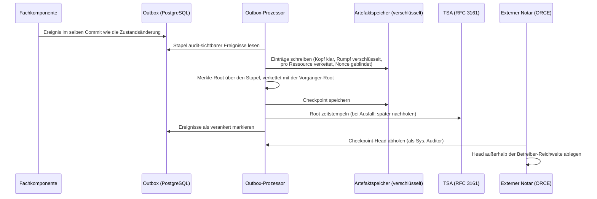

# 09 Audit und Compliance

Das DCS behandelt Nachvollziehbarkeit als kryptographische Eigenschaft,
nicht als Log-Konvention: Jedes fachlich relevante Ereignis wird in einem
manipulationsnachweisbaren Audit-Trail verankert, dessen Integrität über
Hash-Verkettung, Merkle-Checkpoints und vertrauenswürdige Zeitstempel
unabhängig prüfbar ist. Dieses Kapitel beschreibt den Audit-Trail, die
Auswertungs- und Report-Funktionen, die Workflow-Gate-Evidenz, das
kontinuierliche Compliance-Monitoring mit Incident-Erfassung sowie das
Policy-Enforcement über ODRL und OPA.

## 9.1 Beteiligte Komponenten

| Komponente | Rolle |
| --- | --- |
| Fachkomponenten | Schreiben ihre Ereignisse transaktional in eine Outbox-Tabelle, im selben Datenbank-Commit wie die fachliche Zustandsänderung |
| Outbox-Prozessor | Hintergrundprozess im Backend; publiziert Ereignisse auf dem Event-Bus und verankert audit-sichtbare Ereignisse als Audit-Einträge |
| Artefaktspeicher über IPFS | Hält die Audit-Einträge und Checkpoints content-adressiert; die CIDs sind die eigentliche Autorität des Trails |
| PostgreSQL | Index über den Trail: Kettenköpfe pro Ressource, Checkpoint-Tabellen, ausstehende Zeitstempel, Dead-Letter-Status, Risiko-Register, Workflow-Gate-Läufe |
| TSA (RFC 3161, über einen ORCE-Flow) | Stellt den vertrauenswürdigen Zeitstempel über jede Checkpoint-Root aus |
| ORCE, externer Notar | Holt periodisch den Checkpoint-Head ab und trägt ihn aus der Reichweite des Betreibers hinaus |
| ORCE, Audit-Executor | Bewertet einen Audit-Abruf: Das DCS sammelt die Evidenz, der Executor bildet die Befunde |
| ORCE, Workflow-Gate-Executor | Entscheidet vor jedem gate-pflichtigen Lebenszyklusübergang über den Vertragsschnappschuss (Kapitel 04) |
| OPA (eingebettet) | Wertet ODRL-Constraints als Rego-Policies aus; die Ergebnisse fließen als Policy-Findings in den Audit-Trail |
| `pacmonitor` (CronJob) | Führt den Compliance-Sweep planmäßig aus, ohne dass jemand fragt (ADR-32) |
| Process Audit & Compliance (API) | Audits, Reports, Monitoring, Incident-Reports, Checkpoint-Head und Inklusionsbeweise, Workflow-Gate-Läufe |

## 9.2 Der Audit-Trail

### Vom Ereignis zum verankerten Eintrag

Jede fachliche Operation schreibt ihr Ereignis in dieselbe
Datenbank-Transaktion wie die Zustandsänderung (Outbox-Muster). Ein
Ereignis kann daher nie verloren gehen, ohne dass auch die
Zustandsänderung fehlt. Der Outbox-Prozessor arbeitet die Einträge
anschließend in drei entkoppelten Schleifen ab:

1. **Publizieren.** Ereignisse werden auf dem Event-Bus republiziert,
   damit Abonnenten (Webhooks, PDF-Generierung, Auto-Deployment)
   reagieren können. Diese Schleife ist bewusst vom Verankern getrennt
   und läuft deutlich häufiger: Konsumenten brauchen nur die
   Ereignis-Payload, nie einen Anker-Wert, und sollen nicht hinter
   TSA- und Speicher-Roundtrips warten.
2. **Verankern.** Audit-sichtbare Ereignisse werden stapelweise als
   Audit-Einträge geschrieben und durch einen Merkle-Checkpoint
   committet. Reine Lookup-Ereignisse (Abruf- und Suchoperationen) werden
   als verarbeitet markiert, ohne verankert zu werden; sie würden sonst
   die Stapel dominieren und echte Audit-Ereignisse verdrängen.
3. **Nach-Zeitstempeln.** Checkpoints, die während einer TSA-Störung ohne
   Zeitstempel verankert wurden, erhalten ihn in einem Wiederholungslauf.

### Hash-Verkettung pro Ressource

Jeder Audit-Eintrag verweist per CID auf seinen Vorgänger derselben
Ressource. Die Historie eines Vertrags oder einer Vorlage ist damit eine
strikte Hash-Kette: Ein nachträglich veränderter Eintrag hätte eine andere
CID, und alle Nachfolger würden ins Leere zeigen. Ketten verschiedener
Ressourcen sind voneinander unabhängig und werden nebenläufig
geschrieben, so dass eine gestörte Ressource die übrigen nicht blockiert.
Ein Audit-Lesevorgang läuft die Kette von ihrem Kopf rückwärts durch und
rekonstruiert so die vollständige Historie.

### Öffentlicher Kopf, privater Rumpf

Ein Audit-Eintrag zerfällt in zwei Teile (ADR-28):

- **Kopf im Klartext:** Komponente, Ereignistyp, DID, Zeitstempel,
  Vorgänger-CID und die Blinding-Nonce, also alles, was die Kette und die
  Beweise tragen.
- **Rumpf verschlüsselt:** Die Ereignis-Payload liegt unter dem
  Inhaltsschlüssel des jeweiligen Vertrags oder der Vorlage. Ereignisse
  ohne Ressourcenbezug (Checkpoints, instanzweite Reports und die
  Löschnachweise selbst) liegen unter dem instanzweiten Schlüssel, den
  keine Löschanforderung zerstört. Ein Löschnachweis, der sich selbst
  löschen könnte, würde nichts beweisen.

Leaf-Hashes und Checkpoints werden über das gespeicherte Objekt gebildet,
wie es ist. Deshalb macht eine Schlüsselvernichtung die Rümpfe dauerhaft
unlesbar, während **jeder Inklusionsbeweis weiter verifiziert**:
Manipulationsnachweis und Löschbarkeit koexistieren, weil der Beweis nie
davon abhing, den Klartext zu lesen.

### Merkle-Checkpoints und Zeitstempel

Übergreifende Manipulationssicherheit stellt nicht ein globaler Link pro
Ereignis her, sondern ein **Merkle-Checkpoint pro Verankerungs-Stapel**
(ADR-16):

- Über alle Einträge des Stapels, in Outbox-Reihenfolge, wird eine
  Merkle-Root berechnet, mit Domänentrennung zwischen Blatt- und
  Knoten-Hashing.
- Jede Root verkettet sich mit der Root des vorherigen Checkpoints. Eine
  einzige veröffentlichte Root committet dadurch transitiv den gesamten
  Log davor und beweist zusätzlich dessen Append-only-Eigenschaft.
- Die Root wird **einmal pro Stapel** von der TSA nach RFC 3161
  zeitgestempelt, statt einmal pro Ereignis. Ist die TSA nicht
  erreichbar, wird der Checkpoint trotzdem verankert und der Zeitstempel
  später nachgereicht: Ein TSA-Ausfall verzögert die Evidenz, blockiert
  aber nie den Trail.
- Jeder Eintrag trägt eine zufällige **Blinding-Nonce**, die in seinen
  Blatt-Hash eingeht. Audit-Einträge sind hochgradig erratbar
  (Komponente, Ereignistyp, DID, Zeitstempel); ohne Nonce ließe sich ein
  Blatt-Hash per Brute-Force bestätigen. Mit Nonce sind Inklusionsbeweise
  gefahrlos publizierbar. Den Inhalt rekonstruieren kann nur, wer den
  Eintrag samt Nonce bereits besitzt.

### Was publizierbar ist

| Publizierbar | Nie publiziert |
| --- | --- |
| Sequenznummer, Root, Vorgänger-Root, Blattanzahl, Erstellzeit, RFC-3161-Token | Blatt-CIDs (Abruffähigkeiten in den eigenen Speicher) |
| Inklusionsbeweise (ausschließlich Hashes) | Die Einträge selbst (enthalten DIDs, Identitäten, Workflow-Payloads) |

Der Head-Abruf liefert nur den Kopf; der Beweis-Abruf liefert Blatt-Hash,
Blatt-Index, Geschwister-Hashes und den zugehörigen Head, nie den
Eintrag. Der Beweis wird vor der Herausgabe intern gegen die gespeicherte
Root verifiziert, sodass ein korrupter Index im System auffällt und nicht
erst beim Auditor. Ein einzelner Checkpoint ist zusätzlich über seine
Sequenznummer abrufbar.

### Externe Verankerung und unabhängige Verifikation

Ein Trail, den nur der Betreiber hält, beweist nichts **gegen** den
Betreiber. Deshalb holt ein ORCE-Flow den Checkpoint-Head periodisch ab
und reicht ihn an eine externe Senke weiter. Der Flow authentifiziert sich
als Maschinen-Identität mit der Rolle **Sys. Auditor**; Rollen und
Zurechnung liest das Backend anhand der Client-ID aus der Registry, nie
aus Token-Claims (Kapitel 05). Diese Rolle darf ausschließlich den
Checkpoint-Head lesen, keinen Vertragsinhalt und keinen Schreibpfad. Der
Inklusionsbeweis-Endpunkt bleibt der menschlichen Auditor-Rolle
vorbehalten.

Ein Dritter verifiziert einen Eintrag mit genau drei Zutaten: den
Eintrags-Bytes samt Nonce (die er selbst erhalten hat), dem
Inklusionsbeweis und einem Head, den er **vom externen Anker bezieht,
nicht vom Betreiber**. Welche Senke der Flow beliefert (Notariat, Chain,
Gegenpartei), bestimmt der Betreiber. Ohne konfigurierte Senke findet
keine externe Verankerung statt, und der Trail bleibt vollständig in der
Reichweite des Betreibers.

## 9.3 Audits und Reports

### Audit-Abruf

Auditoren (Rollen `Auditor`, `Archive Manager`) fordern die Audit-Trails
eines **Scopes** an: Templates, Verträge, Archiv oder Signaturen,
optional gefiltert auf eine einzelne Ressourcen-DID. Jede Anfrage
erfordert eine **Begründung**; der Abruf selbst wird als Audit-Ereignis in
den Trail geschrieben, auch das Auditieren ist auditierbar. Ein Archive
Manager ohne Auditor-Rolle darf ausschließlich den Archiv-Scope einsehen.

Der Abruf ist zweistufig: Das DCS **sammelt die Evidenz**, also die
Hash-Ketten der Ressourcen des Scopes, ergänzt um die frisch berechneten
Inhalts- und Policy-Prüfungen, und übergibt sie an den externen
**Audit-Executor**. Der bildet daraus die Befunde und liefert sie mit
Executor-Identität, -Version und Ausführungszeitpunkt zurück; Anfrage,
Antwort und Rohantwort werden persistiert. Damit ist die
Auditbewertung austauschbar, ohne den Evidenzpfad zu berühren, und ihr
Ergebnis nachträglich zuordenbar. Ist kein Executor konfiguriert oder
erreichbar, antwortet der Abruf mit einem eigenen Fehler; ein stilles
Ausweichen auf eine interne Bewertung gibt es nicht.

Bei einem vertragsbezogenen Abruf wird die Kette der Audit- und
Compliance-Komponente mitgelesen, damit ein Befund, der am Vertrag
hängt, aber der Compliance-Domäne gehört (etwa eine abgelehnte
Föderationssignatur), im Audit auftaucht statt nur die Workflow-Ereignisse.

### Reports

Aus demselben Datenbestand erzeugt der Report-Pfad Reports in JSON, CSV
oder PDF. Ein Report gliedert sich in Zusammenfassung, Ressourcenliste,
Lebenszyklus-Ereignisse und Compliance-Findings. Jeder Report erhält eine
deterministische Report-ID und einen Content-Hash; die Report-Bytes werden
zusätzlich abgelegt, und die Erzeugung selbst wird mit Hash, CID und
Begründung als Ereignis im Audit-Trail festgehalten. Ein einmal
ausgehändigter Report ist damit später gegen den Trail verifizierbar.

### Workflow-Gate-Läufe als Evidenz

Jeder Lauf eines Workflow-Gates (Kapitel 04) ist selbst ein
Compliance-Artefakt: Er hält Korrelations-ID, Schnappschuss-Identität,
Vertrag und Version, Zustand, Inhalts-Hash, die wirksamen Shapes, die
Profilversion, die lokale Bewertung und die Executor-Antwort fest. Ein
Compliance Officer kann einen Lauf einsehen und einen Lauf im Zustand
`REVIEW` mit Begründung entscheiden; die Entscheidung wird mit
Entscheider und Zeitpunkt persistiert und setzt genau den angehaltenen
Übergang fort.

## 9.4 Kontinuierliches Monitoring und Incidents

### Die vier Risikoklassen

Der Compliance-Sweep meldet vier Klassen:

- **`MISSING_APPROVAL`**: Verträge, die in einem freigabepflichtigen
  Zustand auf eine noch ausstehende, erforderliche Freigabe warten (ein
  Risiko je Vertrag-Freigeber-Paar).
- **`CONTRACT_UNDERPERFORMANCE`**: laufende Verträge, deren vom
  Zielsystem zurückgemeldete KPI-Werte die eigenen ODRL-Verpflichtungen
  verletzen. Die Bewertung passiert bereits beim Eintreffen der
  Rückmeldung: Der Deployment-Callback prüft jeden gemeldeten Wert gegen
  die ODRL-Policies des Vertrags und persistiert das Urteil mit dem Wert.
  Die Verletzung wird als Alert gemeldet und nicht als Request-Fehler
  abgewiesen, denn der Vertrag ist in Kraft und der Verstoß ist ein zu
  dokumentierender Fakt. Der Sweep liest dieses Urteil zurück und benennt
  Metrik, beobachteten Wert und Beobachtungszeitpunkt, statt eine zweite,
  möglicherweise abweichende Bewertung vorzunehmen.
- **`CONTRACT_DEPLOYMENT_FAILED`**: Deployments, deren Versand an das
  designierte Zielsystem gescheitert ist. Der Vertrag ist auf dieser Seite
  in Kraft, beim Zielsystem aber nie angekommen; genau das ist der zu
  meldende Zustand.
- **`UNAUTHORIZED_ACCESS`**: Verträge mit persistierten
  Zugriffsverweigerungen: Weist die Parteiprüfung einen Abruf ab, wird die
  Verweigerung als Audit-Artefakt festgehalten, bevor die Ablehnung
  zurückgeht; der Sweep flaggt daraus ein Risiko je Vertrag-Akteur-Paar.

### Geplanter Sweep statt Nachfrage (ADR-32)

Ein Abruf auf Anfrage erfüllt „auf Nachfrage überwachen", nicht
„kontinuierlich überwachen": Eine Verletzung existierte erst ab dem
Moment, in dem jemand zufällig fragt. Deshalb läuft dieselbe
Erkennungslogik zusätzlich als **planmäßiger Sweep**:

- Ein eigenes Kommando (`pacmonitor`) führt genau einen Sweep aus und
  endet. Es öffnet nur die Datenbank; insbesondere durchläuft es nicht
  die Startprüfungen des Servers, damit das Compliance-Monitoring genau
  dann weiterarbeitet, wenn eine Nachbarkomponente gestört ist. Es tritt
  auch dem Event-Bus nicht bei: Erkennungen gehen in die transaktionale
  Outbox, und der laufende Server verankert sie und verteilt sie an die
  Webhook-Abonnenten.
- Ein **CronJob** ruft es in festem Takt auf, mit unterbundener
  Nebenläufigkeit. Er ist im Auslieferungszustand aktiv; ihn
  abzuschalten bedeutet, dass Risiken nur noch gefunden werden, wenn
  jemand fragt.
- Ein **Risiko-Register** (`compliance_risk_findings`) hält eine Zeile je
  offener Verletzung, geschlüsselt über Vertrag, Risikoklasse und einen
  Hash des Detailtexts. Ein Risiko alarmiert, wenn es zuerst erkannt
  wird, und erneut, wenn es nach einer Behebung wiederkehrt, nie auf den
  Sweeps dazwischen. Ohne dieses Register würde derselbe Verstoß bei
  jedem Lauf neu gemeldet: ein Alarm-Sturm und ein Audit-Trail, in dem
  eine Verletzung hundertfach auftaucht und der Moment ihrer Erkennung
  darin untergeht.
- Der Detailschlüssel ist Teil des Schlüssels, weil ein Vertrag mehrere
  Risiken derselben Klasse gleichzeitig tragen kann: eine je
  ausstehendem Freigeber, eine je abgewiesenem Akteur, eine je
  verletzter Metrik. Nur über Vertrag und Klasse geschlüsselt würde ein
  zweiter abgewiesener Akteur stillschweigend als „schon gemeldet"
  verschluckt.
- Der Zeitpunkt der Ersterkennung wird bei einem Wiederauftreten
  zurückgesetzt: Eine wiederkehrende Verletzung ist ein neuer Vorfall,
  und die daran gemessene Erkennungszeit muss diesen Vorfall beschreiben.
  Die abgelösten Vorfälle sind nicht verloren, denn jede Erkennung ist im
  Audit-Trail verankert.
- Ein erkanntes Risiko ist **kein Job-Fehlschlag**: Der Sweep meldet
  Risiken auf der Standardausgabe und endet erfolgreich. Ein Fehlschlag
  bedeutet, dass der Sweep nicht laufen konnte, und das ist der einzige
  Zustand, der einen Betreiber wecken sollte.

Die Antwort des Abrufs auf Anfrage bleibt unverändert vollständig: Sie
listet jedes aktuell zutreffende Risiko, weil sie die Frage „was ist
gerade falsch?" beantwortet. Die Deduplikation steuert nur das
Alarmieren.

Jeder Sweep wird selbst als Ereignis verankert, inklusive der gefundenen
Risiken, und jedes Risiko zusätzlich in der Audit-Kette des betroffenen
Vertrags.

**Latenz.** Die zeitbasierten Regeln (fehlende Freigaben, Abläufe) sind
mit dem Standardtakt gut bedient; die ereignisgetriebenen
(unautorisierter Zugriff, gescheitertes Deployment) werden entsprechend
verzögert gemeldet. Wo Sekundenlatenz gefordert ist, ist der Weg ein
Event-Bus-Abonnent **neben** dem Sweep und kein engerer Takt: Die
zugrundeliegenden Ereignisse fließen bereits über den Bus, und das
Risiko-Register macht beide Quellen kombinierbar, weil alarmiert, wer
zuerst beobachtet.

### Alerts an externe Subscriber

Die Webhook-Plattform liefert benannte Ereignisse aktiv aus. Neben den
Lebenszyklus-Ereignissen gehört dazu `compliance.risk_detected`, das
genau bei der Ersterkennung eines Risikos ausgelöst wird. Jede Zustellung
wird mit Ergebnis protokolliert und ist per Callback quittierbar
(Anhang A).

### Incident-Reports

Non-Compliance-Befunde, die außerhalb des automatischen Monitorings
entstehen (etwa aus einer manuellen Untersuchung), reicht der Compliance
Officer als Incident-Report ein: eine Liste von Findings aus Risikoklasse
und Beschreibung, verpflichtend verknüpft mit der DID des betroffenen
Vertrags oder Templates. Jedes Finding wird als eigenes Ereignis in der
Audit-Kette dieser Ressource verankert; ein späterer Audit-Abruf beweist,
dass und wann der Befund erfasst wurde.

### Startup-Attestierung der Konfiguration

Beim Start hasht das Backend die sicherheitskritischen, als Datei
gemounteten Konfigurationsartefakte (das DID-Dokument, das
Issuer-Trust-Dokument, die Zertifikats-Vertrauensanker und die
Autorisierungs-Policy des Issuer-Vertrauens) und verankert die Hashes
als Attestierungsereignis im Audit-Trail: das
Konfigurations-Integritätsprotokoll der Instanz. Pinnt der Betreiber
erwartete Hashes, wird aus der Attestierung eine erzwungene
Authentisierung der Konfiguration: Eine gepinnte Datei, die fehlt oder
vom Pin abweicht, bricht den Start ab, ebenso eine syntaktisch
fehlerhafte Pin-Liste, damit ein Deployment nie mit stillschweigend
unwirksamen Pins läuft. Dass die Policy mit attestiert wird, ist kein
Detail: Sie rangiert über dem Trust-Dokument, und eine gepinnte Datei
unter einer ungepinnten Regel wäre wirkungslos (Kapitel 05).

### Löschnachweise

Die Vernichtung der Inhaltsschlüssel eines Vertrags (Kapitel 04 und 07)
erzeugt auf jeder beteiligten Instanz ein eigenes Ereignis mit Akteur,
Vertrag, Bereich und Grund, nie mit Inhalt. Diese Ereignisse liegen
unter dem instanzweiten Schlüssel und überleben damit jede Löschung, die
sie dokumentieren. Der Fortschritt der Löschkette über die Instanzgrenze
ist über eine eigene Statusabfrage sichtbar: welche gewickelten
Schlüsselzeilen zerstört sind, wann und durch wen, und welche
Peer-Anforderungen noch offen sind.

## 9.5 Policy-Enforcement: ODRL auf OPA

Vertragsbedingungen sind als ODRL 2.0 unter einem DCS-Profil formalisiert
(ADR-6). Ausgewertet werden sie durch **Open Policy Agent**, eingebettet
als Bibliothek (ADR-11). Die Operator-Semantik ist als Rego-Modul
formuliert (Vergleichsoperatoren mit case-insensitivem String-Vergleich,
numerischer Koerzierung mit Toleranz und RFC-3339-Zeitvergleich), und
jede Auswertung ist eine In-Process-Abfrage: kein Sidecar, keine
zusätzliche Latenz auf dem Freigabe- und Signaturpfad. Die
Übereinstimmung mit der Referenzsemantik ist durch ein
Paritäts-Testorakel abgesichert.

Was das Rego-Modul beantwortet, ist bewusst klein: die Wahrheit **einer**
Bedingung. Die deontische Logik darüber (Verbot verletzt, wenn erfüllt;
`and`/`or`/`xone`; Pflichten und ihre Konsequenzen; die Behandlung von
Operanden, die erst zur Nutzungszeit bekannt sind) liegt im
auswertenden Code, nicht in Rego.

Zwei Enforcement-Momente teilen sich denselben Evaluator und dieselben
Policies; nur die Quelle des Weltzustands unterscheidet sich:

| Moment | Weltzustand | Wirkung |
| --- | --- | --- |
| Vor der Signatur (Freigabe, Signaturvorbereitung) | Die im Vertrag inline getragenen Feldwerte | Serverseitige Ablehnung constraint-verletzender Werte; Findings im Trail |
| Ausführung / KPI-Monitoring | Extern zurückgemeldete Laufzeit-KPI-Werte | Violation-Erkennung gegen dieselben Policies beim Eintreffen jeder Rückmeldung; das persistierte Urteil speist die Underperformance-Risiken |

**Grenzen, die man kennen muss.** Bedingungen, deren linker Operand ein
Nutzungskontext ist (Zeitpunkt, Ort, Menge, Empfänger …), können vor der
Signatur nicht entschieden werden; sie erscheinen als Hinweisbefund
„wird zur Nutzungszeit durchgesetzt". Der einzige Kanal, der diese
Nutzungszeit tatsächlich beobachtet, ist die KPI-Rückmeldung des
Zielsystems. Ein Vertrag, dessen Bedingungen überwiegend Kontextoperanden
tragen, ist damit vor der Signatur formal geprüft, aber inhaltlich erst
im Betrieb überwachbar, und nur soweit ein Zielsystem die passenden
Werte meldet.

Ergänzend zu den vertragsindividuellen ODRL-Policies definieren zwei
versionierte **Policy-Sets** unter `docs/policies/` die instanzweiten
Prüfregeln: ein Template-Policy-Set (kanonische JSON-LD-Struktur,
deklarierte Vertragsfelder, Policy-Operanden referenzieren deklarierte
Felder, Lebenszyklus- und Domänenfeld-Regeln) und ein
Contract-Content-Policy-Set (kanonische Shapes und Validierungsprofil).
Jede Regel trägt eine stabile Rule-ID, einen Schweregrad und den
betroffenen Ontologie-Begriff; jedes Finding (Regel, Operator,
Erwartungs- und Ist-Wert, Feld-IRI) wird als Audit-Ereignis festgehalten
und erscheint in Audits und Reports. Ein Befund der Schwere „error" aus
diesem Satz blockiert zusätzlich den zugehörigen Workflow-Gate-Übergang
(Kapitel 04).

Eine Präzisierung, die häufig missverstanden wird: Diese Regeln prüfen
**Struktur und Vorhandensein** deklarierter Felder, nicht deren Werte.
Wertgrenzen werden dort durchgesetzt, wo sie als SHACL formuliert sind,
im Klausel-Katalog und in registrierten Shape-Bibliotheken (Kapitel 03).

## 9.6 Schnittstellen

| Endpunkt | Zweck | Rollen |
| --- | --- | --- |
| `POST /pac/audit` | Audit-Trail eines Scopes abrufen und extern bewerten lassen (Begründung Pflicht, Abruf wird auditiert) | Auditor, Archive Manager |
| `GET /pac/report` | Audit-Report erzeugen (JSON/CSV/PDF; Hash und CID im Trail) | Auditor, Archive Manager |
| `POST /pac/report` | Incident-Report: Non-Compliance-Findings zu einer Ressource erfassen | Compliance Officer |
| `GET /pac/monitor` | Compliance-Sweep auf Anfrage; auch ein Lauf ohne Befund wird auditiert | Compliance Officer |
| `GET /pac/audit/checkpoint/head` | Neuester Checkpoint-Head (nur Hashes, Zählwerte, Zeitstempel, publizierbar) | Auditor, Archive Manager, Sys. Auditor |
| `GET /pac/audit/checkpoint/{seq}` | Ein bestimmter Checkpoint | Auditor, Archive Manager, Sys. Auditor |
| `GET /pac/audit/checkpoint/proof/{entry_cid}` | Merkle-Inklusionsbeweis für einen verankerten Eintrag | Auditor |
| `GET /pac/workflow-gates/{run_id}` | Persistierten Workflow-Gate-Lauf und seinen Prüfzustand lesen | Compliance Officer |
| `POST /pac/workflow-gates/review` | Entscheidung zu einem Lauf im Zustand `REVIEW` festhalten | Compliance Officer |
| `GET /archive/erasure-status` | Stand der Schlüsselvernichtung eines Vertrags, lokal und je Peer | Archive Manager, Auditor |

## 9.7 Betriebsverhalten

- **Transiente Anker-Fehler** (Speicher oder TSA kurz nicht erreichbar)
  werden pro Ereignis gezählt und im nächsten Tick erneut versucht; der
  betroffene Eintrag fällt lediglich aus dem aktuellen Checkpoint und
  wandert in den nächsten. Sein fachlicher Zeitstempel bleibt
  unverändert, so dass der Trail zwischen „wann geschah es" und „bis wann
  war seine Existenz bewiesen" unterscheidet.
- **Dead-Lettering:** Nach 50 fehlgeschlagenen Verankerungsversuchen wird
  ein Ereignis totgelegt, deutlich geloggt und nicht mehr angefasst.
  Dead-Letter-Ereignisse sind Lücken im Trail und brauchen einen
  Operator; sie sind in der Outbox-Tabelle an ihrer Dead-Letter-Markierung
  samt letztem Fehler auffindbar.
- **TSA-Ausfall:** Checkpoints werden ohne Zeitstempel verankert und
  regelmäßig nachgestempelt; im Head ist der Zustand am fehlenden
  Zeitstempel sichtbar.
- **Volumen-Leck:** Publizierte Heads verraten Stapelgröße und Takt, also
  Aktivitätsvolumen. Das ist eine bewusste, akzeptierte Abwägung (ADR-16).
- **Lese-Grenzen:** Ein Voll-Trail-Read läuft maximal 500 Checkpoints
  rückwärts; komponentenweite Audits lesen die unabhängigen
  Ressourcen-Ketten parallel, damit der Abruf innerhalb der
  Request-Deadline bleibt.
- **Gelöschte Verträge im Audit:** Die Kette eines Vertrags, dessen
  Schlüssel vernichtet wurden, bleibt vorhanden und beweisbar, ihre Rümpfe
  sind unlesbar. Integritätsprüfungen des Archivs schließen Einträge aus,
  die diese Instanz gelöscht hat; deren Audit-Kette dokumentiert die
  Löschung weiterhin.
