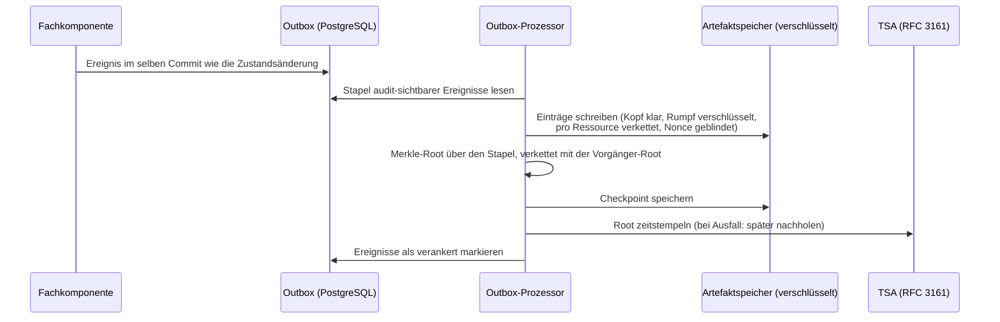

# 09 Audit und Compliance

Das DCS behandelt Nachvollziehbarkeit als kryptographische Eigenschaft:
Jedes fachlich relevante Ereignis wird in einem
manipulationsnachweisbaren Audit-Trail verankert, dessen Integrität über
Hash-Verkettung, Merkle-Checkpoints und vertrauenswürdige Zeitstempel
unabhängig prüfbar ist. Dieses Kapitel beschreibt den Audit-Trail,
Audits und Reports, das kontinuierliche Compliance-Monitoring und das
Policy-Enforcement über ODRL und OPA.

## 9.1 Beteiligte Komponenten

| Komponente | Rolle |
| --- | --- |
| Fachkomponenten | Schreiben ihre Ereignisse transaktional in eine Outbox-Tabelle, im selben Datenbank-Commit wie die fachliche Zustandsänderung |
| Outbox-Prozessor | Publiziert Ereignisse auf dem Event-Bus und verankert audit-sichtbare Ereignisse als Audit-Einträge |
| Artefaktspeicher über IPFS | Hält Audit-Einträge und Checkpoints content-adressiert; die CIDs sind die Autorität des Trails |
| PostgreSQL | Index über den Trail: Kettenköpfe, Checkpoints, ausstehende Zeitstempel, Dead-Letter-Status, Risiko-Register, Workflow-Gate-Läufe |
| TSA (RFC 3161, über einen ORCE-Flow) | Zeitstempel über jede Checkpoint-Root |
| ORCE, externer Notar | Publiziert die Checkpoints sequenziell an eine externe Senke außerhalb der Reichweite des Betreibers |
| ORCE, Audit-Executor | Bewertet einen Audit-Abruf: Das DCS sammelt die Evidenz, der Executor bildet die Befunde |
| ORCE, Workflow-Gate-Executor | Entscheidet vor jedem gate-pflichtigen Übergang über den Vertragsschnappschuss (Kapitel 04) |
| OPA (eingebettet) | Wertet ODRL-Constraints als Rego-Policies aus |
| `pacmonitor` (CronJob) | Führt den Compliance-Sweep planmäßig aus (ADR-32) |
| Process Audit & Compliance (API) | Audits, Reports, Monitoring, Incident-Reports, Checkpoint-Head und Inklusionsbeweise, Workflow-Gate-Läufe |

## 9.2 Der Audit-Trail

Jede fachliche Operation schreibt ihr Ereignis in dieselbe Transaktion
wie die Zustandsänderung (Outbox-Muster); ein Ereignis kann nicht
verloren gehen, ohne dass auch die Zustandsänderung fehlt. Der
Outbox-Prozessor arbeitet in drei entkoppelten Schleifen: **publizieren**
(Ereignisse auf den Event-Bus, hoher Takt, wartet nie auf TSA- oder
Speicher-Roundtrips), **verankern** (audit-sichtbare Ereignisse
stapelweise als Audit-Einträge plus Merkle-Checkpoint; reine
Lookup-Ereignisse werden nicht verankert) und **nach-zeitstempeln**
(Checkpoints, die während einer TSA-Störung ohne Zeitstempel verankert
wurden).

**Hash-Verkettung pro Ressource.** Jeder Audit-Eintrag verweist per CID
auf seinen Vorgänger derselben Ressource. Ein nachträglich veränderter
Eintrag hätte eine andere CID, und alle Nachfolger zeigten ins Leere.
Ketten verschiedener Ressourcen sind unabhängig und werden nebenläufig
geschrieben; ein Audit-Lesevorgang läuft die Kette vom Kopf rückwärts.

**Öffentlicher Kopf, privater Rumpf (ADR-28).** Der Kopf eines Eintrags
(Komponente, Ereignistyp, DID, Zeitstempel, Vorgänger-CID,
Blinding-Nonce) liegt im Klartext; der Rumpf mit der Ereignis-Payload
liegt unter dem Inhaltsschlüssel des jeweiligen Vertrags oder der
Vorlage. Ereignisse ohne Ressourcenbezug, einschließlich der
Löschnachweise selbst, liegen unter dem instanzweiten Schlüssel, den
keine Löschanforderung zerstört. Leaf-Hashes und Checkpoints werden über
das gespeicherte Objekt gebildet, wie es ist: Eine Schlüsselvernichtung
macht die Rümpfe unlesbar, während jeder Inklusionsbeweis weiter
verifiziert. Manipulationsnachweis und Löschbarkeit koexistieren.

**Merkle-Checkpoints und Zeitstempel (ADR-16).** Pro Verankerungs-Stapel
wird eine Merkle-Root berechnet (mit Domänentrennung zwischen Blatt- und
Knoten-Hashing), verkettet mit der Root des vorherigen Checkpoints: Eine
einzige veröffentlichte Root committet transitiv den gesamten Log davor
und beweist dessen Append-only-Eigenschaft. Die Root wird einmal pro
Stapel zeitgestempelt; bei TSA-Ausfall wird der Checkpoint trotzdem
verankert und der Zeitstempel nachgereicht. Jeder Eintrag trägt eine
zufällige **Blinding-Nonce** in seinem Blatt-Hash, denn Audit-Einträge
sind hochgradig erratbar; mit Nonce sind Inklusionsbeweise gefahrlos
publizierbar.

**Was publizierbar ist:**

| Publizierbar | Nie publiziert |
| --- | --- |
| Sequenznummer, Root, Vorgänger-Root, Blattanzahl, Erstellzeit, RFC-3161-Token | Blatt-CIDs (Abruffähigkeiten in den eigenen Speicher) |
| Inklusionsbeweise (ausschließlich Hashes) | Die Einträge selbst (enthalten DIDs, Identitäten, Workflow-Payloads) |

Der Beweis-Abruf liefert Blatt-Hash, Blatt-Index, Geschwister-Hashes und
den zugehörigen Head, nie den Eintrag, und wird vor der Herausgabe
intern gegen die gespeicherte Root verifiziert.

**Externe Verankerung.** Ein Trail, den nur der Betreiber hält, beweist
nichts gegen den Betreiber. Ein ORCE-Flow liest deshalb periodisch die
Checkpoints über die Compliance-API (als Maschinen-Identität mit der
Rolle **Sys. Auditor**, die nur die Checkpoint-Sicht erreicht) und
publiziert die öffentliche Projektion jedes Checkpoints in strikter
Sequenz an eine konfigurierte, authentifizierte HTTPS-Senke: lückenlos,
mit Idempotenzschlüssel und persistiertem Bestätigungsstand, so dass
eine verlorene Antwort oder ein Neustart keinen Checkpoint doppelt
anhängt. Meldet die Senke eine Sequenzlücke oder eine abweichende
Vorgänger-Root, stoppt die Publikation sichtbar, statt eine gebrochene
externe Kette fortzuschreiben. Ein Dritter verifiziert einen Eintrag
mit den Eintrags-Bytes samt Nonce, dem Inklusionsbeweis und einem
Checkpoint, den er von der externen Senke bezieht, nicht vom Betreiber.
Ohne konfigurierte Senke findet keine externe Verankerung statt.

## 9.3 Audits und Reports

**Audit-Abruf.** Auditoren fordern die Audit-Trails eines Scopes an
(Templates, Verträge, Archiv, Signaturen; optional auf eine DID
gefiltert). Jede Anfrage erfordert eine Begründung, und der Abruf selbst
wird als Audit-Ereignis in den Trail geschrieben. Der Abruf ist
zweistufig: Das DCS sammelt die Evidenz (Hash-Ketten plus frisch
berechnete Inhalts- und Policy-Prüfungen) und übergibt sie an den
externen **Audit-Executor**, der die Befunde bildet; Anfrage, Antwort
und Rohantwort werden persistiert. Ist kein Executor konfiguriert oder
erreichbar, antwortet der Abruf mit einem eigenen Fehler; ein stilles
Ausweichen auf eine interne Bewertung gibt es nicht.

**Reports.** Der Report-Pfad erzeugt Reports in JSON, CSV oder PDF mit
deterministischer Report-ID und Content-Hash; die Erzeugung wird mit
Hash, CID und Begründung im Trail festgehalten. Ein ausgehändigter
Report ist damit später gegen den Trail verifizierbar.

**Workflow-Gate-Läufe als Evidenz.** Jeder Gate-Lauf (Kapitel 04) ist
selbst ein Compliance-Artefakt mit Schnappschuss-Identität, lokaler
Bewertung und Executor-Antwort. Ein Compliance Officer kann einen Lauf
im Zustand `REVIEW` mit Begründung entscheiden; die Entscheidung setzt
genau den angehaltenen Übergang fort.

## 9.4 Kontinuierliches Monitoring und Incidents

Der Compliance-Sweep meldet vier Risikoklassen:

- **`MISSING_APPROVAL`**: Verträge, die auf eine ausstehende
  erforderliche Freigabe warten (ein Risiko je Vertrag-Freigeber-Paar).
- **`CONTRACT_UNDERPERFORMANCE`**: laufende Verträge, für die das
  Zielsystem über den Deployment-Callback eine Regelverletzung gemeldet
  hat (9.5). Die Verletzung wird als Alert gemeldet, nicht als
  Request-Fehler abgewiesen, denn der Vertrag ist in Kraft und der
  Verstoß ein zu dokumentierender Fakt.
- **`CONTRACT_DEPLOYMENT_FAILED`**: Deployments, deren Versand an das
  designierte Zielsystem gescheitert ist.
- **`UNAUTHORIZED_ACCESS`**: Verträge mit persistierten
  Zugriffsverweigerungen aus der Parteiprüfung (Kapitel 04), ein Risiko
  je Vertrag-Akteur-Paar.

**Geplanter Sweep statt Nachfrage (ADR-32).** Dieselbe Erkennungslogik
läuft zusätzlich planmäßig: Ein eigenes Kommando (`pacmonitor`) führt
genau einen Sweep aus und endet. Es öffnet nur die Datenbank und
durchläuft nicht die Startprüfungen des Servers, damit das Monitoring
genau dann weiterarbeitet, wenn eine Nachbarkomponente gestört ist;
Erkennungen gehen in die Outbox, der laufende Server verankert und
verteilt sie. Ein **CronJob** ruft das Kommando in festem Takt auf und
ist im Auslieferungszustand aktiv; ihn abzuschalten bedeutet, dass
Risiken nur noch auf Nachfrage gefunden werden.

Ein **Risiko-Register** hält eine Zeile je offener Verletzung,
geschlüsselt über Vertrag, Risikoklasse und einen Hash des Detailtexts
(ein Vertrag kann mehrere Risiken derselben Klasse tragen). Ein Risiko
alarmiert bei der Ersterkennung und erneut, wenn es nach einer Behebung
wiederkehrt, nie auf den Sweeps dazwischen. Ein erkanntes Risiko ist
**kein Job-Fehlschlag**: Der Sweep endet erfolgreich; ein Fehlschlag
bedeutet, dass der Sweep nicht laufen konnte. Jeder Sweep wird selbst
als Ereignis verankert, jedes Risiko zusätzlich in der Audit-Kette des
betroffenen Vertrags. Die Antwort des Abrufs auf Anfrage bleibt
vollständig; die Deduplikation steuert nur das Alarmieren. Wo
Sekundenlatenz gefordert ist, ist der Weg ein Event-Bus-Abonnent neben
dem Sweep, kein engerer Takt.

**Alerts an externe Subscriber.** Die Webhook-Plattform liefert neben
den Lebenszyklus-Ereignissen `compliance.risk_detected` bei der
Ersterkennung eines Risikos aus; Zustellungen sind protokolliert und
quittierbar (Anhang A).

**Incident-Reports.** Befunde außerhalb des automatischen Monitorings
reicht der Compliance Officer als Incident-Report ein: Findings aus
Risikoklasse und Beschreibung, verknüpft mit der DID der betroffenen
Ressource. Jedes Finding wird als eigenes Ereignis in deren Audit-Kette
verankert.

**Startup-Attestierung der Konfiguration.** Beim Start hasht das Backend
die sicherheitskritischen gemounteten Konfigurationsartefakte
(DID-Dokument, Issuer-Trust-Dokument, Zertifikats-Vertrauensanker,
Autorisierungs-Policy) und verankert die Hashes als
Attestierungsereignis im Trail. Pinnt der Betreiber erwartete Hashes,
bricht eine fehlende oder abweichende gepinnte Datei den Start ab,
ebenso eine syntaktisch fehlerhafte Pin-Liste. Die Policy wird
mit attestiert, weil sie über dem Trust-Dokument rangiert (Kapitel 05).

**Löschnachweise.** Die Vernichtung der Inhaltsschlüssel eines Vertrags
erzeugt auf jeder beteiligten Instanz ein Ereignis mit Akteur, Vertrag,
Bereich und Grund, nie mit Inhalt, abgelegt unter dem instanzweiten
Schlüssel. Der Fortschritt der Löschkette über die Instanzgrenze ist
über eine eigene Statusabfrage sichtbar.

## 9.5 Policy-Enforcement: ODRL auf OPA

Vertragsbedingungen sind ODRL 2.0 unter einem DCS-Profil (ADR-6),
ausgewertet durch Open Policy Agent, eingebettet als Bibliothek
(ADR-11): kein Sidecar, keine zusätzliche Latenz auf dem Freigabe- und
Signaturpfad. Das Rego-Modul beantwortet die Wahrheit **einer**
Bedingung; die deontische Logik darüber (Verbote, `and`/`or`/`xone`,
Pflichten, Operanden der Nutzungszeit) liegt im auswertenden Code.

Das Enforcement ist zwischen DCS und Zielsystem geteilt (ADR-33):

| Moment | Wer entscheidet | Wirkung |
| --- | --- | --- |
| Vor der Signatur (Freigabe, Signaturvorbereitung) | Das DCS wertet die im Vertrag inline getragenen Feldwerte gegen die eigenen Bedingungen aus | Serverseitige Ablehnung constraint-verletzender Werte; Findings im Trail |
| Ausführung / KPI-Monitoring | Das Zielsystem, das die Regeln vollstreckt; das DCS zeichnet dessen Urteil auf | Gemeldete Urteile speisen das Risiko-Register und die Audit-Kette des Vertrags |

**Das Zielsystem klassifiziert, das DCS protokolliert (ADR-33).**
Bedingungen, deren Eingaben erst zur Nutzungszeit entstehen (Zeitpunkt,
Ort, Menge, erbrachte Leistung), kann nur der vollstreckende Enforcer
entscheiden: Das DCS hält die Bedingungen, das Zielsystem die
Ereignisse. Eine KPI-Rückmeldung trägt deshalb neben Messwert und
Zeitpunkt das Urteil des Zielsystems (`satisfied`, `violated`,
`not_evaluated`) und die `@id` der ODRL-Regel, auf die es sich bezieht,
wörtlich aus der Policy des Deployment-Umschlags. Das DCS prüft die
Zurechenbarkeit und zeichnet auf, statt nachzurechnen: Ein Urteil zu
einer Regel, die dieser Vertrag nie ausgerollt hat, wird als
Client-Fehler abgewiesen; eine Rückmeldung ohne Urteil wird als
`not_evaluated` festgehalten, nie als Erfüllung. Vor der Signatur
erscheinen solche Bedingungen als zurückgestellter Befund, nicht als
bestandene Prüfung; ein Zielsystem, das nichts meldet, lässt den
Vertrag unbeobachtet, und genau das sagt das DCS.

Ergänzend definieren zwei versionierte **Policy-Sets** unter
`docs/policies/` die instanzweiten Prüfregeln (Template- und
Contract-Content-Set). Jede Regel trägt eine stabile Rule-ID und einen
Schweregrad; jedes Finding wird als Audit-Ereignis festgehalten, und ein
Befund der Schwere „error" blockiert den zugehörigen
Workflow-Gate-Übergang (Kapitel 04). Diese Regeln prüfen **Struktur und
Vorhandensein** deklarierter Felder, nicht deren Werte; Wertgrenzen
werden dort durchgesetzt, wo sie als SHACL formuliert sind (Kapitel 03).

## 9.6 Schnittstellen

| Endpunkt | Zweck | Rollen |
| --- | --- | --- |
| `POST /pac/audit` | Audit-Trail eines Scopes abrufen und extern bewerten lassen (Begründung Pflicht, Abruf wird auditiert) | Auditor, Archive Manager |
| `GET /pac/report` | Audit-Report erzeugen (JSON/CSV/PDF; Hash und CID im Trail) | Auditor, Archive Manager |
| `POST /pac/report` | Incident-Report: Non-Compliance-Findings zu einer Ressource erfassen | Compliance Officer |
| `GET /pac/monitor` | Compliance-Sweep auf Anfrage; auch ein Lauf ohne Befund wird auditiert | Compliance Officer |
| `GET /pac/audit/checkpoint/head` | Neuester Checkpoint-Head (nur Hashes, Zählwerte, Zeitstempel) | Auditor, Archive Manager, Sys. Auditor |
| `GET /pac/audit/checkpoint/{seq}` | Ein bestimmter Checkpoint | Auditor, Archive Manager, Sys. Auditor |
| `GET /pac/audit/checkpoint/proof/{entry_cid}` | Merkle-Inklusionsbeweis für einen verankerten Eintrag | Auditor |
| `GET /pac/workflow-gates/{run_id}` | Persistierten Workflow-Gate-Lauf lesen | Compliance Officer |
| `POST /pac/workflow-gates/review` | Entscheidung zu einem Lauf im Zustand `REVIEW` festhalten | Compliance Officer |
| `GET /archive/erasure-status` | Stand der Schlüsselvernichtung eines Vertrags, lokal und je Peer | Archive Manager, Auditor |

## 9.7 Betriebsverhalten

- **Transiente Anker-Fehler** werden pro Ereignis gezählt und im
  nächsten Tick erneut versucht; der Eintrag wandert in den nächsten
  Checkpoint. Sein fachlicher Zeitstempel bleibt unverändert.
- **Dead-Lettering:** Nach 50 fehlgeschlagenen Verankerungsversuchen
  wird ein Ereignis totgelegt und deutlich geloggt. Dead-Letter-Ereignisse
  sind Lücken im Trail und brauchen einen Operator; sie sind in der
  Outbox-Tabelle an ihrer Markierung samt letztem Fehler auffindbar.
- **TSA-Ausfall:** Checkpoints werden ohne Zeitstempel verankert und
  nachgestempelt; im Head ist der Zustand sichtbar.
- **Volumen-Leck:** Publizierte Heads verraten Stapelgröße und Takt,
  also Aktivitätsvolumen. Das ist eine bewusste Abwägung (ADR-16).
- **Lese-Grenzen:** Ein Voll-Trail-Read läuft maximal 500 Checkpoints
  rückwärts; komponentenweite Audits lesen die Ressourcen-Ketten
  parallel.
- **Gelöschte Verträge im Audit:** Die Kette bleibt vorhanden und
  beweisbar, ihre Rümpfe sind unlesbar; die Audit-Kette dokumentiert die
  Löschung weiterhin.
