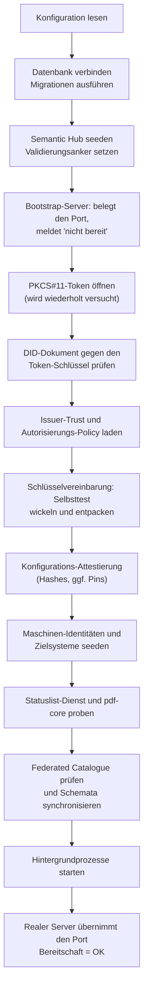

# 10 — Betrieb und Monitoring

Dieses Kapitel beschreibt, wie sich eine DCS-Instanz im Betrieb verhält:
was beim Start passiert, welche Hintergrundprozesse dauerhaft laufen,
welche Signale es gibt, wie ein Fehlerfall sichtbar wird und woran der
Betreiber ihn erkennt.

**Es enthält bewusst keine Befehle, Werte oder Prozeduren.** Installation,
Konfigurationsreferenz, Umgebungsmatrix, Upgrade und Rollback stehen im
[Deployment-Leitfaden](../deployment-guide.md); Sicherung und
Wiederherstellung im
[Backup-Leitfaden](../backup-integration-guide.md). Wo dieses Kapitel
einen konkreten Wert bräuchte, verweist es dorthin — damit derselbe Wert
nicht an zwei Stellen steht und auseinanderläuft.

## 10.1 Startverhalten: fail fast, aber geduldig an einer Stelle

Das Backend prüft seine harten Abhängigkeiten selbst und läuft nie
degradiert weiter. Der Start verläuft in einer festen Reihenfolge, und an
jeder Stufe entscheidet sich, ob der Prozess gesund wird:

Wesentliche Eigenschaften:

- **Der Port ist von Anfang an belegt.** Ein Bootstrap-Server beantwortet
  den Bereitschaftsendpunkt mit „nicht bereit", solange die
  Initialisierung läuft. Dadurch unterscheidet Kubernetes einen
  startenden Prozess von einem betriebsbereiten DCS, statt einen
  Verbindungsabbruch zu sehen.
- **Genau eine Stufe wartet statt abzubrechen:** das Öffnen des
  PKCS#11-Tokens. Bei einer frischen Installation kann die
  Token-Provisionierung noch laufen; deshalb wird das Öffnen wiederholt
  versucht und der Wartezustand geloggt. Alles danach — insbesondere das
  Laden einzelner Schlüssel — ist hart, weil ein vorhandenes Token alle
  Schlüssel in einem Zug bekommt.
- **Passt das DID-Dokument nicht zum Token-Schlüssel, startet die Instanz
  nicht.** Das ist die häufigste Folge einer Neu-Provisionierung des
  Tokens ohne Neuerzeugung des Dokuments.
- **Der Selbsttest der Schlüsselvereinbarung ist neu und
  entscheidungsrelevant:** Er beweist, dass der im DID-Dokument
  publizierte Schlüssel und der Token-Schlüssel zusammenpassen und dass
  das Token die nötige Ableitung beherrscht. Schlägt er fehl, wäre kein
  gespeichertes Artefakt lesbar — die Instanz startet nicht (Kapitel 07).
- **Statuslist-Dienst und pdf-core werden per HTTP geprobt**, mit
  Wiederholungen über ein begrenztes Fenster, damit eine lediglich
  langsam startende Abhängigkeit keinen Crash-Loop auslöst; bleibt sie
  unerreichbar, beendet sich der Prozess mit klarer Meldung.
- **Ein konfigurierter Federated Catalogue ist eine harte Abhängigkeit.**
  Ist er unvollständig konfiguriert oder nicht funktional erreichbar,
  startet die Instanz nicht; ist er gar nicht konfiguriert, läuft die
  Instanz ohne Katalogfunktionen.
- **Der Audit- und der Workflow-Gate-Executor sind Pflicht.** Fehlt ihre
  Adresse, startet die Instanz nicht — sie säßen sonst als
  fail-closed-Gates in jedem Lebenszyklusübergang und würden jeden
  blockieren (Kapitel 04 und 09).
- **Ungültige Deklarationen brechen den Start ab**, statt still zu
  wirken: eine unbekannte Rolle im Seed der Maschinen-Identitäten, eine
  fehlerhafte Zielsystem-Deklaration, eine nicht übersetzbare
  Autorisierungs-Policy, eine syntaktisch falsche Pin-Liste, ein
  Trust-Eintrag mit einem Mechanismus, den dieser Stand nicht auflösen
  kann.

## 10.2 Probes und Bereitschaft

| Signal | Bedeutung |
| --- | --- |
| Bereitschaftsendpunkt antwortet mit „nicht bereit" | Der Prozess läuft, die Initialisierung ist nicht abgeschlossen. Normal während Installation und Neustart; dauerhaft ist es ein Symptom (10.6) |
| Bereitschaftsendpunkt antwortet mit OK | Alle Startprüfungen sind durchlaufen, der reale Server bedient die API |
| Prozess beendet sich mit Fehlermeldung | Eine harte Startabhängigkeit fehlt oder ist falsch. Die Meldung benennt sie; der Orchestrator startet den Container neu |

**Bereitschaft ist bewusst von Prozess-Lebendigkeit getrennt.** Der
Bereitschaftsendpunkt bleibt so lange negativ, bis die Initialisierung
einschließlich Katalog-Gate und Schema-Synchronisation abgeschlossen ist.
Im Auslieferungszustand ist für das Backend **nur eine
Bereitschaftsprüfung** konfiguriert; ein Liveness-Signal wird nicht
abgefragt. Das ist eine Folge des Bootstrap-Verhaltens: Ein Liveness-Check
gegen denselben Endpunkt würde einen Prozess töten, der korrekt auf eine
noch nicht provisionierte Abhängigkeit wartet. Wer eine Lebendigkeitsprobe
will, muss sie bewusst hinzufügen — der [Deployment-Leitfaden](../deployment-guide.md)
beschreibt, wo.

pdf-core wird über seinen eigenen Endpunkt geprobt und hat sowohl
Bereitschafts- als auch Lebendigkeitsprüfung. Die mitgelieferten
Begleitdienste bringen ihre eigenen Probes mit.

## 10.3 Was dauerhaft im Hintergrund läuft

Eine laufende Instanz betreibt eine Reihe von Schleifen. Sie zu kennen
erklärt fast jedes Verhalten, das von außen „verzögert" aussieht.

| Prozess | Aufgabe | Verhalten bei Störung |
| --- | --- | --- |
| Outbox-Publikation | Ereignisse auf den Event-Bus stellen | Hoher Takt; ein nicht erreichbarer Bus verzögert Abonnenten, nicht die Fachlogik |
| Outbox-Verankerung | Audit-Einträge schreiben, Merkle-Checkpoints bilden, Roots zeitstempeln | Zählt Fehlversuche je Ereignis; nach 50 Versuchen Dead-Letter mit deutlichem Log |
| Zeitstempel-Nachlauf | Checkpoints ohne Zeitstempel nachträglich stempeln | Läuft, bis die TSA wieder antwortet |
| PDF-Regenerierung | Auf Lifecycle-Ereignisse hin rendern/amendieren, Ergebnis ablegen | Ein Ereignis wird höchstens einmal zugestellt; Fehlschläge fängt der Retry-Sweep |
| Regenerations-Retry-Sweep | Entitäten finden, deren gespeichertes PDF nicht dem aktuellen Dokument entspricht | Begrenzte Stapel, begrenzte Versuche je Entität, wachsender Abstand — ein dauerhaft unrenderbarer Vertrag blockiert die heilbaren nicht |
| Föderations-Versand | Vertrags-PDFs an Peers ausliefern | Fehlschläge landen in der Retry-Tabelle; ein Scheduler versucht sie erneut |
| Löschungs-Retry | Offene Peer-Löschanforderungen erneut zustellen | Eigene Warteschlange, gleicher Takt wie der Föderations-Retry |
| Statuslisten-Publikation | Widerrufseinträge der Lifecycle-Credentials veröffentlichen | Eigener Arbeiter, unabhängig vom Request-Pfad |
| Ablauf-Job | Verträge nach Ablaufdatum auf `EXPIRED` setzen und das Ereignis publizieren | Loggt Fehler je Vertrag und macht weiter |
| Webhook-Zustellung | Ereignisse an registrierte Abonnenten liefern | Zustellungen werden protokolliert und sind quittierbar |
| Compliance-Sweep (CronJob) | Compliance-Risiken planmäßig erkennen (ADR-32) | Eigenes Kommando, eigener Pod; ein erkanntes Risiko ist **kein** Job-Fehlschlag |

Der Compliance-Sweep ist bewusst als eigener geplanter Job und nicht als
Schleife im Server gebaut: Ein fehlgeschlagener Lauf ist damit ein
sichtbares Objekt im Orchestrator statt einer Logzeile, der Takt lässt
sich ohne Neustart der Instanz ändern, und Mehrfachläufe sind strukturell
ausgeschlossen. Er öffnet nur die Datenbank und läuft deshalb weiter,
wenn eine Nachbarkomponente gestört ist — genau dann, wenn er gebraucht
wird (Kapitel 09).

## 10.4 Metriken

Das Backend exponiert einen Prometheus-Endpunkt mit zwei
HTTP-Basismetriken: Anzahl und Dauer der Requests, jeweils nach Methode,
Pfad und Statuscode. Damit sind Fehlerraten, Latenzverteilungen und
Lastprofile pro Endpunkt auswertbar — insbesondere die typischen
Sättigungssignale (Anteil 429 aus dem Anfragebudget, Anteil 5xx, Latenz
der PDF-Export- und Signatur-Pfade).

Der Endpunkt liegt außerhalb der authentifizierten API und außerhalb des
Anfragebudgets. Ein Prometheus-Stack ist als Begleitkomponente
mitgeliefert, und das Abgreifen des Endpunkts ist konfigurierbar — beides
ist im Auslieferungszustand **nicht** aktiviert. Es einzuschalten ist eine
bewusste Betreiberhandlung
([Deployment-Leitfaden](../deployment-guide.md)).

Anwendungsfachliche Metriken (Anzahl verankerter Checkpoints, Länge der
Retry-Warteschlangen, Zahl offener Compliance-Risiken) exportiert das
Backend derzeit **nicht** als Prometheus-Zeitreihen. Die entsprechenden
Beobachtungen laufen über Logs, über die Compliance-API und über die
Datenbank (10.5).

## 10.5 Was der Betreiber sieht

### Logs

Die Meldungen, auf die es ankommt:

- **Jeder verankerte Checkpoint** mit Sequenz, Eintragszahl, Root und
  Zeitstempel-Status. Bleiben diese Meldungen aus, während das System
  Ereignisse produziert, steht die Verankerung.
- **Jede fehlgeschlagene Verankerung** mit Wiederholungshinweis.
- **Jedes dead-letterte Audit-Ereignis**, unübersehbar formuliert. Ein
  solches Ereignis ist **nicht** im Audit-Trail und braucht einen
  Operator — es ist der einzige Weg, auf dem der Trail eine Lücke
  bekommt.
- **Wartemeldungen des Token-Öffnens** beim Start.
- **Wiederholversuche des Föderations-Versands** und des
  Regenerations-Sweeps.
- **Nachgeholte TSA-Zeitstempel.**
- **Diagnose bei einem Inhalts-Mismatch** eines empfangenen Peer-PDFs:
  die divergierende Stelle und der Hash der eingebetteten Payload.

### Zustände in der Datenbank

Drei Tabellenbereiche sind Betriebssicht, nicht nur Fachdaten:

| Bereich | Frage, die er beantwortet |
| --- | --- |
| Outbox mit Dead-Letter-Markierung | Gibt es Ereignisse, die nie in den Trail gelangt sind, und warum? |
| Retry-Tabellen für Föderationsversand und Peer-Löschung | Welche Sendungen bzw. Löschanforderungen hängen, seit wann und mit welchem Fehler? |
| Risiko-Register des Compliance-Monitorings | Welche Verstöße sind offen, seit wann sind sie bekannt, welche wurden geschlossen? |

### API-Sichten

- **Checkpoint-Head** — die publizierbare Spitze des Audit-Trails;
  fehlender Zeitstempel zeigt eine TSA-Störung.
- **Compliance-Sweep auf Anfrage** — was gerade falsch ist,
  unabhängig davon, was zuletzt alarmiert wurde.
- **Workflow-Gate-Läufe** — warum ein Lebenszyklusübergang blockiert
  wurde oder auf eine Prüfentscheidung wartet.
- **Erasure-Status** — wie weit eine Löschung über die Instanzgrenze
  gediehen ist.
- **Schlüsselinventar** — welche Schlüssel die Instanz hält, mit Zweck
  und aktiver Version.
- **Webhook-Zustellprotokoll** — ob ein Abonnent seine Ereignisse
  bekommen und quittiert hat.

### Ereignisse für externe Systeme

Registrierte Abonnenten erhalten benannte Lebenszyklus-Ereignisse
(Vertrag angelegt, eingereicht, freigegeben, abgelehnt, verhandelt,
beendet, abgelaufen; Vorlage angelegt, freigegeben, aktualisiert,
registriert, ausgemustert) sowie den Compliance-Alarm bei der
Ersterkennung eines Risikos. **Subscriptions und Zustellprotokoll liegen
im Prozessspeicher**: Sie überleben keinen Neustart und werden zwischen
mehreren Replikaten nicht geteilt. Wer dauerhafte Zustellung braucht,
registriert seine Subscriptions nach jedem Neustart neu — oder betreibt
die Instanz mit einem Replikat.

## 10.6 Fehlerbilder

Die folgenden Bilder sind aus dem Verhalten der Artefakte abgeleitet bzw.
im Betrieb der Demonstrationsumgebung beobachtet worden. Konkrete
Behebungsschritte stehen im [Deployment-Leitfaden](../deployment-guide.md).

| Symptom | Ursache | Richtung der Behebung |
| --- | --- | --- |
| Pod läuft, Bereitschaft bleibt dauerhaft negativ, Log wiederholt Wartemeldungen zum PKCS#11-Token | Das Token ist nicht provisioniert oder nicht gemountet; die Provisionierung ist nicht gelaufen oder fehlgeschlagen | Provisionierungs-Job und Token-Volume prüfen |
| Prozess beendet sich sofort mit einer Meldung zum DID-Dokument | Das ausgelieferte DID-Dokument passt nicht zum Schlüssel im Token — typisch nach einer Neu-Provisionierung ohne Neuerzeugung des Dokuments | DID-Dokument aus dem Token neu ableiten |
| Prozess beendet sich mit einer Meldung zur Schlüsselvereinbarung | Der publizierte `keyAgreement`-Schlüssel und der Token-Schlüssel passen nicht zusammen, oder das Token kann die Ableitung nicht | Dokument und Token abgleichen; bei einem produktiven HSM die Ableitungsfähigkeit für die verwendete Kurve prüfen |
| Prozess beendet sich mit einer Meldung zum Federated Catalogue | Katalog unvollständig konfiguriert oder nicht funktional erreichbar | Katalog-Konfiguration vervollständigen oder Katalog abschalten |
| Prozess beendet sich mit einer Meldung zu einer gepinnten Konfigurationsdatei | Eine attestierte Datei fehlt oder weicht vom Pin ab; oder die Pin-Liste ist syntaktisch falsch | Datei oder Pin korrigieren (Kapitel 09) |
| Jeder Lebenszyklusübergang wird blockiert, obwohl der Vertrag korrekt ist | Der Workflow-Gate-Executor ist nicht erreichbar; das Gate ist fail-closed | Executor-Flow prüfen; der Gate-Lauf nennt die Ursache |
| Ein Audit-Abruf antwortet mit einem Executor-Fehler | Der Audit-Executor ist nicht erreichbar oder antwortet nicht verwertbar | Executor-Flow prüfen |
| Ein Vertrag ist nicht exportierbar und wird nicht an den Peer verschickt | Die PDF-Regeneration ist fehlgeschlagen | Der Retry-Sweep holt es nach; die Ursache steht im Log des Regenerators |
| Export antwortet mit „wird gerade regeneriert" | Eine Regeneration lief länger als das Wartefenster des Exports | Erneut abrufen; anhaltend deutet es auf eine pdf-core- oder Speicherstörung |
| Verifikation meldet „Artefakt nicht authentisch" | Die gespeicherten Bytes sind nicht die geschriebenen — Manipulation oder Substitution im Speicher | Als Sicherheitsvorfall behandeln; die Merkle-Beweise bleiben gültig und erlauben den Abgleich (Kapitel 07, 09) |
| Export, Verifikation oder Bundle eines Vertrags antworten „Inhalt gelöscht" | Die Inhaltsschlüssel des Vertrags wurden vernichtet | Erwartetes Verhalten nach einer Löschung; Erasure-Status zeigt Zeitpunkt und Akteur |
| Peer-Versand hängt in der Retry-Tabelle | Peer nicht erreichbar, DID-Auflösung scheitert oder das Agreement Credential wird abgelehnt | Peer-Erreichbarkeit und DID-Auflösung prüfen; Details im Log und im Retry-Eintrag |
| Föderation ist abgeschaltet, obwohl konfiguriert | Der Trust-PDP ist nicht gesetzt oder nicht erreichbar — der Gate ist fail-closed | Policy-Endpunkt prüfen; jede Ablehnung liegt als Incident im Trail |
| Eine Sendung einer Gegenseite wird abgelehnt, obwohl der Peer bekannt ist | Der mitgeschickte Vollmachtsnachweis verifiziert nicht: Aussteller nicht für `peer` zugelassen, Organisation nicht zugestanden, Credential abgelaufen oder widerrufen | Issuer-Vertrauen der empfangenden Instanz prüfen (Kapitel 05, 08) |
| Ein Wallet-Login schlägt reproduzierbar fehl | Aussteller nicht für `login` zugelassen, Organisation nicht zugestanden, Statusliste nicht erreichbar, oder Zertifikatskette ohne konfigurierte Vertrauensanker | Trust-Konfiguration prüfen; der Fehler benennt die Stufe |
| Antworten mit `429` | Das Anfragebudget je Credential ist ausgeschöpft | Aufrufverhalten prüfen; Budget ist konfigurierbar |
| Webhook-Abonnenten erhalten nach einem Neustart nichts mehr | Subscriptions liegen im Prozessspeicher | Neu registrieren |
| Signatur-Einreichung wird abgelehnt, obwohl das Dokument gültig signiert ist | Kein DSS konfiguriert oder nicht erreichbar; oder das Byte-Prefix stimmt nicht, weil ein anderes als das vorbereitete Dokument signiert wurde | DSS prüfen; Signatar muss exakt das vorbereitete Dokument signieren (Kapitel 06) |
| Externe PDF-Prüfprogramme melden „nach der Signatur geändert" | Der Provenance-Re-Anchor nach der Signatur (ADR-26) | Erwartetes Verhalten; die eigene Verifikation weist genau diese eine Revision nach (Kapitel 07) |

## 10.7 Kapazitäts- und Betriebsgrenzen, die man kennen muss

- **Ein Replikat pro Instanz.** Die Webhook-Subscriptions liegen im
  Prozessspeicher; mehrere Replikate hätten unterschiedliche Sichten. Die
  Skalierung liegt heute in der Vertikalen.
- **Die Verankerung ist strikt sequenziell.** Sie hängt an
  TSA- und Speicher-Roundtrips. Große Ereignis-Rückstände arbeiten sich
  in Stapeln ab, nicht sprunghaft.
- **Ein Voll-Trail-Read ist begrenzt** (maximal 500 Checkpoints
  rückwärts), damit ein Audit-Abruf innerhalb seiner Frist bleibt.
- **Sicherungen verzögern die Vollendung einer Löschung.** Ein heute
  vernichteter Schlüssel existiert in der gestrigen Datenbanksicherung
  weiter; die Löschzusage reicht so weit wie das Aufbewahrungsfenster,
  und nach einer Wiederherstellung müssen die seither erfolgten
  Löschungen nachgezogen werden
  ([Backup-Leitfaden](../backup-integration-guide.md)).
- **Die Schlüsselvernichtung entfernt keine Chiffrate aus dem
  Speicher.** Entfernt werden die Archiv-Snapshots; die verschlüsselten
  Vertragsartefakte bleiben unlesbar liegen (Kapitel 07).
