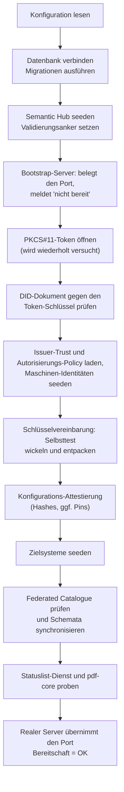

# 10 Betrieb und Monitoring

Dieses Kapitel beschreibt, wie sich eine DCS-Instanz im Betrieb verhält:
was beim Start passiert, welche Hintergrundprozesse laufen, welche
Signale es gibt und woran der Betreiber einen Fehlerfall erkennt.

Es enthält bewusst keine Befehle, Werte oder Prozeduren. Installation,
Konfigurationsreferenz, Umgebungsmatrix, Upgrade und Rollback stehen im
[Deployment-Leitfaden](../deployment-guide.md); Sicherung und
Wiederherstellung im [Backup-Leitfaden](../backup-integration-guide.md).

## 10.1 Startverhalten: fail fast, aber geduldig an einer Stelle

Das Backend prüft seine harten Abhängigkeiten selbst und läuft nie
degradiert weiter:

Die Hintergrundprozesse (10.3) starten schrittweise während dieser
Initialisierung, nicht an einem einzelnen Punkt; bereit meldet sich die
Instanz erst nach der letzten Stufe. Wesentliche Eigenschaften:

- **Der Port ist von Anfang an belegt.** Ein Bootstrap-Server
  beantwortet den Bereitschaftsendpunkt mit „nicht bereit", solange die
  Initialisierung läuft. Kubernetes unterscheidet so einen startenden
  Prozess von einem betriebsbereiten DCS.
- **Genau eine Stufe wartet statt abzubrechen:** das Öffnen des
  PKCS#11-Tokens, weil bei einer frischen Installation die
  Token-Provisionierung noch laufen kann. Alles danach ist hart.
- **Passt das DID-Dokument nicht zum Token-Schlüssel, startet die
  Instanz nicht.** Das ist die häufigste Folge einer Neu-Provisionierung
  des Tokens ohne Neuerzeugung des Dokuments.
- **Der Selbsttest der Schlüsselvereinbarung ist entscheidungsrelevant:**
  Schlägt er fehl, wäre kein gespeichertes Artefakt lesbar, und die
  Instanz startet nicht (Kapitel 07).
- **Ein konfigurierter Federated Catalogue ist eine harte Abhängigkeit:**
  unvollständig konfiguriert oder nicht funktional erreichbar heißt kein
  Start; gar nicht konfiguriert heißt Betrieb ohne Katalogfunktionen.
- **Statuslist-Dienst und pdf-core werden per HTTP geprobt**, mit
  Wiederholungen über ein begrenztes Fenster; bleiben sie unerreichbar,
  beendet sich der Prozess mit klarer Meldung.
- **Der Audit- und der Workflow-Gate-Executor sind Pflicht:** Fehlt ihre
  Adresse, startet die Instanz nicht. Sie säßen sonst als
  fail-closed-Gates in jedem Lebenszyklusübergang (Kapitel 04 und 09).
- **Ungültige Deklarationen brechen den Start ab**, statt still zu
  wirken: eine unbekannte Rolle im Maschinen-Identitäten-Seed, eine
  fehlerhafte Zielsystem-Deklaration, eine nicht übersetzbare
  Autorisierungs-Policy, eine syntaktisch falsche Pin-Liste, ein
  Trust-Eintrag mit nicht auflösbarem Mechanismus.

## 10.2 Probes und Bereitschaft

| Signal | Bedeutung |
| --- | --- |
| Bereitschaftsendpunkt antwortet mit „nicht bereit" | Der Prozess läuft, die Initialisierung ist nicht abgeschlossen. Normal während Installation und Neustart; dauerhaft ist es ein Symptom (10.6) |
| Bereitschaftsendpunkt antwortet mit OK | Alle Startprüfungen sind durchlaufen, der reale Server bedient die API |
| Prozess beendet sich mit Fehlermeldung | Eine harte Startabhängigkeit fehlt oder ist falsch. Die Meldung benennt sie; der Orchestrator startet den Container neu |

**Der Backend-Container wird ausschließlich auf Bereitschaft geprüft;
ein Liveness-Signal wird nicht abgefragt.** Ein Prozess, der zwar läuft,
aber nicht mehr arbeitet, wird deshalb nie automatisch neu gestartet;
antwortet er weiter auf dem Bereitschaftsendpunkt, nimmt er sogar
Anfragen entgegen. Das folgt aus dem Bootstrap-Verhalten: Eine
Lebendigkeitsprobe gegen denselben Endpunkt würde einen Prozess töten,
der korrekt auf eine noch nicht provisionierte Abhängigkeit wartet. Wer
eine Lebendigkeitsprobe will, fügt sie bewusst hinzu und muss den
Startfall abdecken.

pdf-core hat sowohl Bereitschafts- als auch Lebendigkeitsprüfung; die
mitgelieferten Begleitdienste bringen ihre eigenen Probes mit.

## 10.3 Was dauerhaft im Hintergrund läuft

Diese Schleifen zu kennen erklärt fast jedes Verhalten, das von außen
„verzögert" aussieht.

| Prozess | Aufgabe | Verhalten bei Störung |
| --- | --- | --- |
| Outbox-Publikation | Ereignisse auf den Event-Bus stellen | Hoher Takt; ein nicht erreichbarer Bus verzögert Abonnenten, nicht die Fachlogik |
| Outbox-Verankerung | Audit-Einträge schreiben, Merkle-Checkpoints bilden, Roots zeitstempeln | Zählt Fehlversuche je Ereignis; nach 50 Versuchen Dead-Letter mit deutlichem Log |
| Zeitstempel-Nachlauf | Checkpoints ohne Zeitstempel nachträglich stempeln | Läuft, bis die TSA wieder antwortet |
| PDF-Regenerierung | Auf Lifecycle-Ereignisse hin rendern/amendieren | Ein Ereignis wird höchstens einmal zugestellt; Fehlschläge fängt der Retry-Sweep |
| Regenerations-Retry-Sweep | Entitäten finden, deren gespeichertes PDF nicht dem aktuellen Dokument entspricht | Begrenzte Stapel, begrenzte Versuche, wachsender Abstand |
| Föderations-Versand | Vertrags-PDFs an Peers ausliefern | Fehlschläge landen in der Retry-Tabelle; ein Scheduler versucht sie erneut |
| Löschungs-Retry | Offene Peer-Löschanforderungen erneut zustellen | Eigene Warteschlange, gleicher Takt wie der Föderations-Retry |
| Statuslisten-Publikation | Widerrufseinträge der Lifecycle-Credentials veröffentlichen | Eigener Arbeiter, unabhängig vom Request-Pfad |
| Ablauf-Job | Verträge nach Ablaufdatum auf `EXPIRED` setzen | Loggt Fehler je Vertrag und macht weiter; ohne Expiration-Policy wird übersprungen (Kapitel 04) |
| Webhook-Zustellung | Ereignisse an registrierte Abonnenten liefern | Zustellungen werden protokolliert und sind quittierbar |
| Compliance-Sweep (CronJob) | Compliance-Risiken planmäßig erkennen (ADR-32) | Eigenes Kommando, eigener Pod; ein erkanntes Risiko ist **kein** Job-Fehlschlag |

Der Compliance-Sweep ist bewusst ein eigener geplanter Job: Ein
fehlgeschlagener Lauf ist ein sichtbares Objekt im Orchestrator, der
Takt ist ohne Neustart änderbar, und er läuft weiter, wenn eine
Nachbarkomponente gestört ist (Kapitel 09).

## 10.4 Metriken

Das Backend exponiert einen Prometheus-Endpunkt mit zwei
HTTP-Basismetriken: Anzahl und Dauer der Requests nach Methode, Pfad und
Statuscode. Damit sind Fehlerraten, Latenzverteilungen und Lastprofile
pro Endpunkt auswertbar (Anteil 429 aus dem Anfragebudget, Anteil 5xx,
Latenz der Export- und Signatur-Pfade). Der Endpunkt liegt außerhalb der
authentifizierten API und des Anfragebudgets; das Einsammeln richtet der
Betreiber in seiner eigenen Monitoring-Infrastruktur ein.

Anwendungsfachliche Metriken (verankerte Checkpoints, Länge der
Retry-Warteschlangen, offene Risiken) exportiert das Backend **nicht**
als Zeitreihen; diese Beobachtungen laufen über Logs, Compliance-API und
Datenbank (10.5).

## 10.5 Was der Betreiber sieht

**Logs**, auf die es ankommt:

- jeder verankerte Checkpoint mit Sequenz, Eintragszahl, Root und
  Zeitstempel-Status; bleiben diese Meldungen aus, während das System
  Ereignisse produziert, steht die Verankerung
- jedes dead-letterte Audit-Ereignis, unübersehbar formuliert; es ist
  der einzige Weg, auf dem der Trail eine Lücke bekommt, und braucht
  einen Operator
- Wartemeldungen des Token-Öffnens beim Start
- Wiederholversuche des Föderations-Versands und des
  Regenerations-Sweeps; nachgeholte TSA-Zeitstempel
- die Diagnose bei einem Inhalts-Mismatch eines empfangenen Peer-PDFs

**Zustände in der Datenbank:**

| Bereich | Frage, die er beantwortet |
| --- | --- |
| Outbox mit Dead-Letter-Markierung | Gibt es Ereignisse, die nie in den Trail gelangt sind, und warum? |
| Retry-Tabellen für Föderationsversand und Peer-Löschung | Welche Sendungen bzw. Löschanforderungen hängen, seit wann und mit welchem Fehler? |
| Risiko-Register des Compliance-Monitorings | Welche Verstöße sind offen, seit wann, welche wurden geschlossen? |

**API-Sichten:** Checkpoint-Head (fehlender Zeitstempel zeigt eine
TSA-Störung), Compliance-Sweep auf Anfrage, Workflow-Gate-Läufe (warum
ein Übergang blockiert wurde oder wartet), Erasure-Status,
Schlüsselinventar, Webhook-Zustellprotokoll.

**Ereignisse für externe Systeme:** Registrierte Abonnenten erhalten
benannte Lebenszyklus-Ereignisse und den Compliance-Alarm bei
Ersterkennung eines Risikos (Anhang A). **Subscriptions und
Zustellprotokoll liegen im Prozessspeicher**: Sie überleben keinen
Neustart und werden zwischen Replikaten nicht geteilt. Wer dauerhafte
Zustellung braucht, registriert nach jedem Neustart neu.

## 10.6 Fehlerbilder

Die folgenden Bilder sind aus dem Verhalten der Artefakte abgeleitet
bzw. im Betrieb der Demonstrationsumgebung beobachtet. Konkrete
Behebungsschritte stehen im
[Deployment-Leitfaden](../deployment-guide.md).

| Symptom | Ursache | Richtung der Behebung |
| --- | --- | --- |
| Pod läuft, Bereitschaft bleibt dauerhaft negativ, Log wiederholt Wartemeldungen zum PKCS#11-Token | Das Token ist nicht provisioniert oder nicht gemountet | Provisionierungs-Job und Token-Volume prüfen |
| Prozess beendet sich sofort mit einer Meldung zum DID-Dokument | Das DID-Dokument passt nicht zum Schlüssel im Token, typisch nach Neu-Provisionierung ohne Neuerzeugung des Dokuments | DID-Dokument aus dem Token neu ableiten |
| Prozess beendet sich mit einer Meldung zur Schlüsselvereinbarung | Publizierter `keyAgreement`-Schlüssel und Token-Schlüssel passen nicht zusammen, oder das Token kann die Ableitung nicht | Dokument und Token abgleichen; bei einem produktiven HSM die Ableitungsfähigkeit für die Kurve prüfen |
| Prozess beendet sich mit einer Meldung zum Federated Catalogue | Katalog unvollständig konfiguriert oder nicht funktional erreichbar | Katalog-Konfiguration vervollständigen oder Katalog abschalten |
| Prozess beendet sich mit einer Meldung zu einer gepinnten Konfigurationsdatei | Eine attestierte Datei fehlt oder weicht vom Pin ab; oder die Pin-Liste ist syntaktisch falsch | Datei oder Pin korrigieren (Kapitel 09) |
| Jeder Lebenszyklusübergang wird blockiert, obwohl der Vertrag korrekt ist | Der Workflow-Gate-Executor ist nicht erreichbar; das Gate ist fail-closed | Executor-Flow prüfen; der Gate-Lauf nennt die Ursache |
| Ein Audit-Abruf antwortet mit einem Executor-Fehler | Der Audit-Executor ist nicht erreichbar oder antwortet nicht verwertbar | Executor-Flow prüfen |
| Ein Vertrag ist nicht exportierbar und wird nicht an den Peer verschickt | Die PDF-Regeneration ist fehlgeschlagen | Der Retry-Sweep holt es nach; die Ursache steht im Log des Regenerators |
| Export antwortet mit „wird gerade regeneriert" | Eine Regeneration lief länger als das Wartefenster des Exports | Erneut abrufen; anhaltend deutet es auf eine pdf-core- oder Speicherstörung |
| Verifikation meldet „Artefakt nicht authentisch" | Die gespeicherten Bytes sind nicht die geschriebenen: Manipulation oder Substitution im Speicher | Als Sicherheitsvorfall behandeln; die Merkle-Beweise bleiben gültig (Kapitel 07, 09) |
| Export, Verifikation oder Bundle antworten „Inhalt gelöscht" | Die Inhaltsschlüssel des Vertrags wurden vernichtet | Erwartetes Verhalten nach einer Löschung; Erasure-Status zeigt Zeitpunkt und Akteur |
| Peer-Versand hängt in der Retry-Tabelle | Peer nicht erreichbar, DID-Auflösung scheitert oder das Agreement Credential wird abgelehnt | Peer-Erreichbarkeit und DID-Auflösung prüfen; Details im Log und im Retry-Eintrag |
| Föderation ist abgeschaltet, obwohl konfiguriert | Der Trust-PDP ist nicht gesetzt oder nicht erreichbar; das Gate ist fail-closed | Policy-Endpunkt prüfen; jede Ablehnung liegt als Incident im Trail |
| Eine Sendung einer Gegenseite wird abgelehnt, obwohl der Peer bekannt ist | Der mitgeschickte Vollmachtsnachweis verifiziert nicht: Aussteller nicht für `peer` zugelassen, Organisation nicht zugestanden, Credential abgelaufen oder widerrufen | Issuer-Vertrauen der empfangenden Instanz prüfen (Kapitel 05, 08) |
| Ein Wallet-Login schlägt reproduzierbar fehl | Aussteller nicht für `login` zugelassen, Organisation nicht zugestanden, Statusliste nicht erreichbar, oder Zertifikatskette ohne konfigurierte Vertrauensanker | Trust-Konfiguration prüfen; der Fehler benennt die Stufe |
| Antworten mit `429` | Das Anfragebudget je Credential ist ausgeschöpft | Aufrufverhalten prüfen; das Budget ist konfigurierbar |
| Webhook-Abonnenten erhalten nach einem Neustart nichts mehr | Subscriptions liegen im Prozessspeicher | Neu registrieren |
| Signatur-Einreichung wird abgelehnt, obwohl das Dokument gültig signiert ist | Kein DSS konfiguriert oder nicht erreichbar; oder das Byte-Prefix stimmt nicht, weil ein anderes als das vorbereitete Dokument signiert wurde | DSS prüfen; der Signatar muss exakt das vorbereitete Dokument signieren (Kapitel 06) |
| Externe PDF-Prüfprogramme melden „nach der Signatur geändert" | Der Provenance-Re-Anchor nach der Signatur (ADR-26) | Erwartetes Verhalten; die eigene Verifikation weist genau diese eine Revision nach (Kapitel 07) |

## 10.7 Kapazitäts- und Betriebsgrenzen, die man kennen muss

- **Ein Replikat pro Instanz.** Die Webhook-Subscriptions liegen im
  Prozessspeicher; mehrere Replikate hätten unterschiedliche Sichten.
  Die Skalierung liegt in der Vertikalen.
- **Die Verankerung ist strikt sequenziell** und hängt an TSA- und
  Speicher-Roundtrips; große Rückstände arbeiten sich in Stapeln ab.
- **Ein Voll-Trail-Read ist begrenzt** (maximal 500 Checkpoints
  rückwärts), damit ein Audit-Abruf innerhalb seiner Frist bleibt.
- **Sicherungen verzögern die Vollendung einer Löschung.** Ein heute
  vernichteter Schlüssel existiert in der gestrigen Sicherung weiter;
  nach einer Wiederherstellung müssen die seither erfolgten Löschungen
  nachgezogen werden ([Backup-Leitfaden](../backup-integration-guide.md)).
- **Die Schlüsselvernichtung entfernt keine Chiffrate aus dem
  Speicher**; entfernt werden die Archiv-Snapshots (Kapitel 07).
