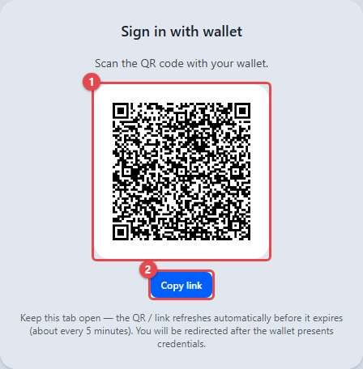
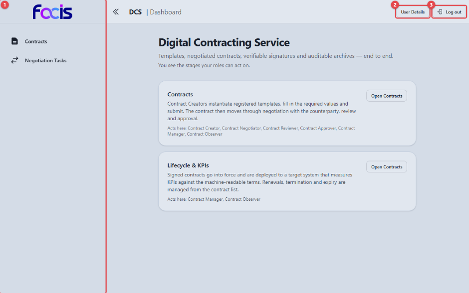

# Anmeldung und Navigation

## Anmeldung mit der Wallet

Der DCS kennt keine Benutzernamen und Passwörter. Sie melden sich mit Ihrer
digitalen Wallet an.

Beim Aufruf der Anwendung erscheint die Anmeldeseite **Sign in with wallet**.

1. Scannen Sie den QR-Code **(1)** mit Ihrer Wallet. Alternativ überträgt
   **Copy link** **(2)** denselben Anmeldelink in die Zwischenablage, wenn Sie
   ihn von Hand in die Wallet übernehmen wollen.
2. Legen Sie in der Wallet Ihre Nachweise vor — Ihre Identität und Ihre
   Rollen. Anschließend werden Sie automatisch in die Anwendung
   weitergeleitet.

Der Hinweis unter dem Code erklärt, dass sich QR-Code und Link selbstständig
erneuern, solange die Seite geöffnet bleibt (etwa alle fünf Minuten). Lassen
Sie den Reiter geöffnet, bis die Weiterleitung erfolgt ist.

Welche Bereiche Sie danach sehen, bestimmen ausschließlich die Rollen aus den
vorgelegten Nachweisen — es gibt keine Rolleneinstellung in der Anwendung.

## Startseite

Nach der Anmeldung landen Sie auf der Startseite.

Die Startseite erklärt in kurzen Abschnitten die Stationen des
Vertragslebenszyklus und zeigt zu jeder Station, welche Rollen dort tätig
werden („Acts here: …"). Eine Schaltfläche führt jeweils direkt in den
zugehörigen Arbeitsbereich (z. B. **Open Contracts**). Sie sehen nur die
Stationen, an denen Ihre eigenen Rollen mitwirken.

1. Die Seitennavigation **(1)** links enthält ausschließlich die Bereiche
   Ihrer Rollen — im Beispiel die eines Contract Creators mit **Contracts**
   und **Negotiation Tasks**.
2. **User Details** **(2)** zeigt Ihre angemeldete Identität und Ihre Rollen.
3. **Log out** **(3)** meldet Sie ab.

Mit dem Doppelpfeil links oben klappen Sie die Seitenleiste ein und wieder
aus.

## Seitennavigation

Die linke Seitenleiste ist der zentrale Einstieg. Je nach Rollen erscheinen
dort folgende Einträge:

| Eintrag | Sichtbar für |
| --- | --- |
| **Templates** | Template Creator, Template Reviewer, Template Approver, Template Manager |
| **Contracts** | Contract Creator, Contract Negotiator, Contract Reviewer, Contract Approver, Contract Manager, Contract Observer |
| **Review Tasks** | Template Reviewer, Contract Reviewer |
| **Approval Tasks** | Template Approver, Contract Approver |
| **Negotiation Tasks** | Contract Creator, Contract Negotiator, Contract Reviewer |
| **Template Catalogue** | Template Manager |
| **Audit** | Auditor, Archive Manager |
| **Archive** | Auditor, Archive Manager |
| **Signing** | Contract Signer, Contract Manager, Contract Observer |
| **Compliance Viewer** | Auditor, Compliance Officer, Contract Manager |
| **Non-Compliance Investigation** | Compliance Officer |
| **Semantic Hub** | Template Manager |
| **Target Systems** | Sys. Administrator, Integration Manager |
| **System Users** | Sys. Administrator |
| **Key Inventory** | Sys. Administrator |

## Listen bedienen

Die Übersichten für Vorlagen, Verträge und Aufgaben sind gleich aufgebaut:

- Ein **Suchfeld** mit vorangestelltem Umschalter. Voreingestellt ist die
  Suche nach der eindeutigen Kennung (**DID**); über den Umschalter wechseln
  Sie auf **Name** und suchen dann nach der Bezeichnung. **Search** löst die
  Suche aus.
- **Filter** grenzt die Liste nach Status ein (z. B. nur **DRAFT** oder nur
  **APPROVED**). Ein erneuter Klick auf denselben Status hebt die Einschränkung
  wieder auf.
- **Sort by** ändert Sortierfeld und -richtung.
- Unter der Liste stellen Sie die Seitengröße ein und blättern durch die
  Seiten.

## Zugriffsschutz

Rufen Sie eine Ansicht auf, für die Ihnen die Rolle fehlt, leitet die
Anwendung Sie ohne weitere Meldung auf die Startseite zurück. Zusätzlich prüft
der Server jede einzelne Aktion: Ein abgewiesener Aufruf erscheint als rote
Hinweismeldung (z. B. „insufficient permissions: requires one of […]"). Die
Sichtbarkeit eines Bedienelements allein verschafft also keine Berechtigung.
