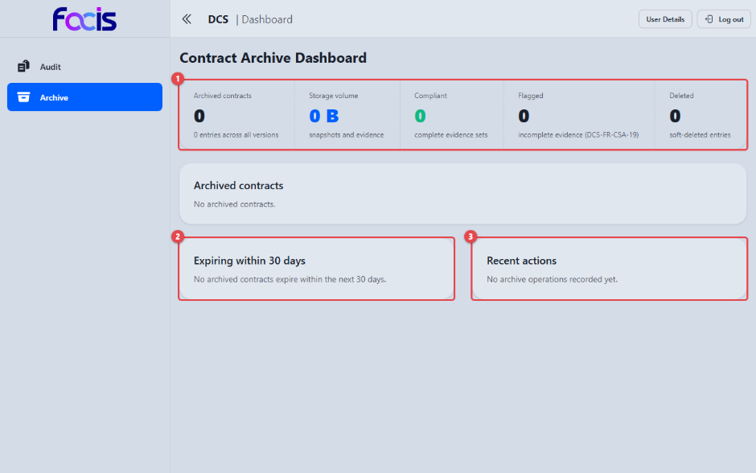
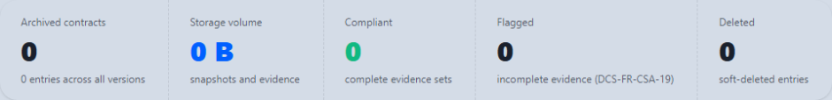

# Archiv verwalten und Verträge abrufen (Archive Manager)

Sobald ein Vertrag signiert ist, wird er automatisch archiviert, zusammen mit
einer Momentaufnahme des Dokuments, den Signaturangaben, einer Prüfsumme des
Inhalts und einem Zeitstempelnachweis. Als Archive Manager überblicken Sie
diesen Bestand, rufen archivierte Verträge samt ihrer Nachweiskette ab und
führen Löschersuchen aus.

**Voraussetzungen:** Sie sind mit der Rolle Archive Manager angemeldet. In der
Seitennavigation sehen Sie **Archive** und **Audit**. Auditoren sehen
dieselben Bereiche (siehe [Audits durchführen](auditor.md)).

## Das Archiv-Dashboard

Öffnen Sie **Archive** in der Seitennavigation.

Die Ansicht **Contract Archive Dashboard** gliedert sich in vier Bereiche:

- Die Statistikleiste **(1)** mit **Archived contracts** (Zahl der
  archivierten Verträge), **Storage volume** (belegtes Speichervolumen),
  **Compliant** (Einträge mit vollständigen Nachweisen), **Flagged**
  (Einträge mit unvollständigen Nachweisen) und **Deleted** (Einträge, deren
  Inhalt gelöscht wurde).
- **Archived contracts**, die Liste der Archiveinträge. Sie steht nur der
  Rolle Archive Manager zur Verfügung und führt je Eintrag die Spalten
  **Contract**, **Version**, **State**, **Encryption** und die Aktion
  **Delete**. Liegt kein Eintrag vor, steht dort „No archived contracts.".
- **Expiring within 30 days** **(2)**, die Verträge, deren Gültigkeit
  demnächst endet, mit Name und Ablaufzeitpunkt. Welcher Zeitraum als
  „demnächst" gilt, ist systemseitig einstellbar; Verträge außerhalb des
  Fensters werden nicht als auslaufend geführt.
- **Recent actions** **(3)**, die jüngsten Archivvorgänge mit Zeitpunkt
  (**When**), Vorgang (**Operation**), auslösender Identität (**Actor**) und
  dem betroffenen Vertrag (**Contract**) als Verweis.

Die Abbildung zeigt das Dashboard einer Installation ohne Archivbestand. So
sehen Sie die leeren Zustände, die die Ansicht beim Namen nennt, statt eine
leere Tabelle zu zeigen.

Die Statistikleiste im Detail. Unter jeder Zahl steht, worauf sie sich
bezieht, etwa „complete evidence sets" unter **Compliant**.

<!-- Screenshot fehlt: Archiv-Dashboard mit Einträgen (Liste, Löschstatus-Abzeichen, letzte Aktionen). Grund: auf der bereitgestellten Instanz lässt sich kein Signaturvorgang abschließen, weil das Hochladen des signierten Dokuments von der automatischen Regelprüfung abgewiesen wird; daher wird dort nichts archiviert und das Archiv bleibt leer. Der Ablauf ist durch die End-to-End-Tests belegt. -->

## Einen archivierten Vertrag abrufen

Ein Archiveintrag wird über den Audit-Arbeitsplatz abgerufen. Dort erhalten
Sie den Vertrag samt seiner vollständigen, prüfbaren Archivhistorie.

1. Klicken Sie im Dashboard auf den Namen des gewünschten Vertrags, in der
   Liste **Archived contracts**, unter **Expiring within 30 days** oder unter
   **Recent actions**. Die Anwendung wechselt in den Audit-Arbeitsplatz und
   stellt dort bereits alles ein: **Scope** steht auf **Archive**, das Feld
   **DID (optional)** enthält die Kennung des Vertrags.
2. Tragen Sie unter **Audit justification** die Begründung Ihres Abrufs ein.
3. **Execute Audit** ruft die Archivhistorie des Vertrags ab.

<!-- Screenshot fehlt: Archivhistorie eines Vertrags im Audit-Arbeitsplatz. Grund: der Prüfdienst der bereitgestellten Instanz liefert inzwischen Ergebnisse, es existiert dort aber kein einziger Archiveintrag, dessen Historie abgerufen werden könnte (es wird nichts archiviert, siehe oben). Der Ablauf ist durch die automatisierten Abnahmetests belegt. -->

Das Ergebnis erscheint als Liste **Findings**: je Zeile eine Feststellung zum
Archiveintrag mit Bewertung, Kennung und Kurzbeschreibung. Ein Klick auf eine
Zeile öffnet rechts unter **Finding Details** den vollständigen Nachweis dazu,
etwa die geprüfte Aussage, die angewendete Regel und die beteiligte
Komponente. Über **JSON**, **CSV** und **PDF** exportieren Sie den Nachweis;
der Export verlangt eine eigene Begründung.

Kennen Sie die Kennung des Vertrags bereits, können Sie den Audit-Arbeitsplatz
auch direkt öffnen, **Scope** auf **Archive** stellen und die Kennung
eintragen. Der Weg über das Dashboard erspart Ihnen das Abtippen.

## Der Löschstatus eines Vertrags

Jeder Archiveintrag trägt in der Spalte **Encryption** ein Abzeichen, das den
Zustand seiner Verschlüsselung anzeigt:

- **Keys live:** die Inhalte des Vertrags sind abrufbar.
- **Keys destroyed:** die Schlüssel wurden vernichtet; die Inhalte sind
  dauerhaft nicht mehr lesbar.

Ein Klick auf das Abzeichen klappt unter der Zeile die Einzelheiten auf: bei
einer Vernichtung Zeitpunkt, auslösende Identität und Begründung, dazu eine
Tabelle der beteiligten Partnerinstanzen mit **Peer**, **Status**,
**Requested**, **Confirmed** und **Retries**.

Denselben Zustand zeigt der Audit-Arbeitsplatz. Sobald **Scope** auf
**Archive** steht und eine Kennung eingetragen ist, erscheint dort der
Abschnitt **Encryption keys** mit demselben Abzeichen; unter **Erasure
details** listet er auf, welche Partnerorganisationen die Löschung bestätigt
haben.

## Einen Vertragsinhalt löschen

Ein Löschersuchen (z. B. nach Art. 17 DSGVO) wird umgesetzt, indem die
Schlüssel des Vertragsinhalts vernichtet werden. Das ist **endgültig**: Der
Inhalt kann danach von niemandem mehr entschlüsselt werden, auch nicht vom
Betreiber.

1. Wählen Sie in der Zeile des Archiveintrags **Delete**.
2. Der Bestätigungsdialog nennt den betroffenen Vertrag und weist darauf hin,
   dass eine Begründung verlangt und mit der Löschung aufgezeichnet wird. Die
   Folge steht im Klartext daneben: „Encryption keys will be destroyed on both
   instances (irreversible)".

<!-- Screenshot fehlt: Bestätigungsdialog der Archivlöschung mit Begründungsfeld, Unwiderruflichkeits-Häkchen und Bestätigungsschaltfläche. Grund: auf der bereitgestellten Instanz existiert kein Archiveintrag, an dem sich die Löschaktion aufrufen ließe, weil dort kein Signaturvorgang abgeschlossen werden kann. Der Ablauf ist durch die End-to-End-Tests belegt. -->

3. Tragen Sie im Feld **Justification** die Begründung des Löschersuchens ein.
4. Setzen Sie das Bestätigungshäkchen. Erst dann wird die
   Bestätigungsschaltfläche aktiv. Ohne Begründung und ohne ausdrückliche
   Bestätigung führt der Dialog nichts aus.
5. Nach der Ausführung meldet die Ansicht, dass der Archiveintrag gelöscht und
   die Verschlüsselungsschlüssel vernichtet wurden; der Eintrag verschwindet
   aus der Liste, und die Statistikleiste wird neu berechnet.

Bei einem Vertrag mit einer Partnerorganisation werden die Schlüssel auf
beiden Seiten vernichtet. Der Audit-Arbeitsplatz zeigt anschließend den
Zustand **Keys destroyed** und unter **Erasure details** die Bestätigung der
Gegenseite.

### Was nach der Löschung bleibt

- Der Vertrag bleibt in der Vertragsübersicht mit seinen Stammdaten (Name,
  Version, Status) sichtbar. Gelöscht werden die Inhalte, nicht der
  Verwaltungseintrag.
- Ein Versuch, das Vertragsdokument zu exportieren, endet mit einer klaren
  Meldung, dass der Inhalt gelöscht und die Schlüssel vernichtet wurden. Die
  Ansicht bleibt bedienbar.
- Die Löschung selbst ist ein protokolliertes Ereignis und im
  Audit-Arbeitsplatz nachweisbar.
