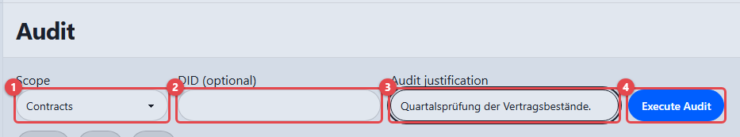
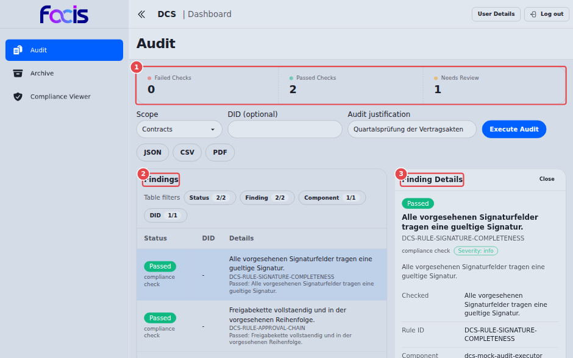
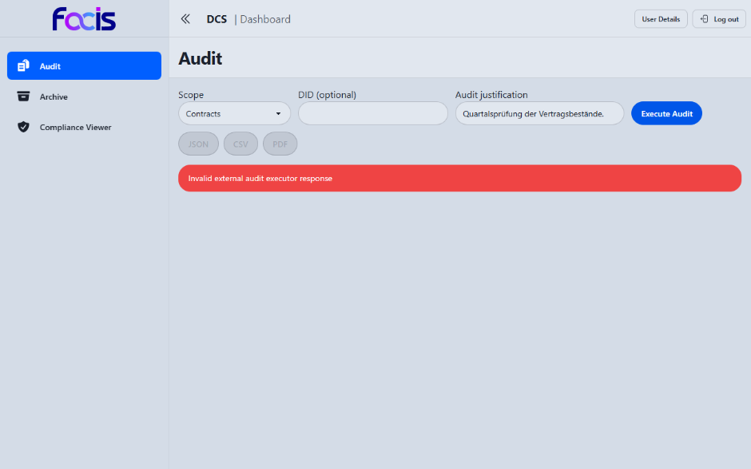

# Audits durchführen (Auditor)

Als Auditor führen Sie nachvollziehbare Prüfungen über den Datenbestand des
DCS aus, wahlweise über Vorlagen, Verträge, Signaturen oder Archivvorgänge.
Jede Prüfung erfordert eine Begründung und wird ihrerseits protokolliert.

**Voraussetzungen:** Sie sind mit der Rolle Auditor angemeldet. In der
Seitennavigation sehen Sie **Audit**, **Archive** und **Compliance Viewer**.
Für eine auf ein einzelnes Objekt begrenzte Prüfung benötigen Sie dessen
Kennung (DID).

Ein **Archive Manager** sieht dieselben Bereiche, kann im Audit-Arbeitsplatz
aber ausschließlich den Bereich **Archive** prüfen (siehe
[Archiv verwalten und Verträge abrufen](archive-manager.md)).

## Der Audit-Arbeitsplatz

Öffnen Sie **Audit** in der Seitennavigation.

1. Wählen Sie unter **Scope** **(1)** den Prüfumfang: **Templates**,
   **Contracts**, **Signatures** oder **Archive**.
2. Tragen Sie unter **DID (optional)** **(2)** die Kennung eines einzelnen
   Objekts ein, um die Prüfung gezielt darauf zu beschränken. Ohne Angabe
   wird der gesamte Bestand des gewählten Umfangs geprüft.
3. Geben Sie unter **Audit justification** **(3)** die Begründung der Prüfung
   an; sie wird mit dem Audit gespeichert. Ohne Begründung bleibt **Execute
   Audit** gesperrt.
4. **Execute Audit** **(4)** führt die Prüfung aus. Währenddessen meldet die
   Ansicht „Executing audit...".

Die Prüfung wird genau einmal an den eingerichteten Prüfdienst übergeben. Bei
einem technischen Fehler erfolgt kein automatischer Wiederholungsversuch, und
es werden keine ersatzweise erzeugten Feststellungen angezeigt. Starten Sie
einen neuen Lauf erst, wenn die Ursache behoben ist.

Bei Signaturprüfungen werden nur die für die Nachweisführung erforderlichen
Angaben übergeben (Status, Zeitpunkte, Prüfsummen, Referenzen). Die
Signaturdaten selbst verlassen den DCS dabei nicht.

## Das Prüfergebnis lesen

Ein ausgeführter Prüflauf über den Umfang **Contracts**. Die Zählleiste
**(1)** über dem Formular fasst den Lauf nach Ergebnisart zusammen:
**Failed Checks**, **Passed Checks**, **Needs Review** und **Not Evaluated**.
Darunter listet **Findings** **(2)** die einzelnen Feststellungen; die hier
gewählte Zeile ist hervorgehoben und ihr Prüfnachweis steht rechts unter
**Finding Details** **(3)**. Die Exportschaltflächen **JSON**, **CSV** und
**PDF** sind jetzt freigeschaltet, weil für diesen Umfang ein Lauf vorliegt.

<!-- Screenshot veraltet: die Zählleiste zeigt im Bild drei Zähler; die Ansicht führt inzwischen zusätzlich Not Evaluated. Eine Neuaufnahme steht aus. -->

Über dem Ergebnis fasst ein Banner den Lauf zusammen. Sind alle Prüfungen
bestanden, steht dort „Audit passed. Every check returned a verdict, and none
failed or needs review." Hat der Lauf nichts gefunden, meldet die Ansicht
„Audit completed. No matching entries were found."; auch eine erfolgreiche
Prüfung darf also ohne Feststellung enden. Gibt es nicht bewertete Prüfungen,
weist ein eigener Hinweis darauf hin, dass ihr Urteil beim Zielsystem liegt,
das den Vertrag ausführt.

Die Ergebnisliste **Findings** führt je Zeile:

- **Status**, das Abzeichen der Bewertung (**Passed**, **Failed**, **Needs
  Review**, **Not Evaluated**), darunter die Art der Feststellung, etwa
  „compliance check".
- **DID**, die Kennung des geprüften Objekts.
- **Details**, die geprüfte Aussage in einem Satz, darunter die zugehörige
  Regelkennung und eine Kurzfassung des Ergebnisses.

Über **Table filters** grenzen Sie die Tabelle ein. Jede der vier Gruppen
(**Status**, **Finding**, **Component**, **DID**) öffnet eine Liste mit
Häkchen; **All** und **None** setzen alle Häkchen einer Gruppe auf einmal. Das
Abzeichen an der Gruppe zeigt, wie viele der vorhandenen Werte gerade
eingeschaltet sind. Passt keine Zeile mehr, steht in der Tabelle „No findings
match the selected filters.". Vor dem ersten Lauf steht dort „Select a scope
and execute an audit."

Ein Klick auf eine Zeile öffnet rechts unter **Finding Details** den
zugehörigen Prüfnachweis: Bewertung, geprüfte Aussage, Schweregrad und eine
Liste der belegenden Angaben, etwa **Checked**, **Rule ID**, **Requirement**,
**Actual value**, **Expected value**, **Component** und **DID**. Angaben, zu
denen der Prüfdienst nichts geliefert hat, blendet die Ansicht aus, statt
leere Zeilen zu zeigen. Ganz unten lässt sich unter **Raw Details** der
unveränderte Prüfnachweis aufklappen. **Close** schließt die Detailspalte
wieder; solange keine Zeile gewählt ist, steht dort „Select a row to inspect
the corresponding audit evidence."

Die Prüfhistorie wird in einem unveränderlichen Ablagespeicher geführt.
Unmittelbar nach einer frischen Änderung kann ein einzelner Eintrag noch nicht
abrufbar sein; führen Sie die Prüfung dann erneut aus.

## Prüfbericht exportieren

Die Schaltflächen **JSON**, **CSV** und **PDF** exportieren den Prüfbericht.
Sie sind gesperrt, bis für den aktuell eingestellten Prüfumfang (und ggf. das
eingetragene Objekt) ein erfolgreicher Lauf vorliegt. Ändern Sie Umfang oder
Kennung, sperren sie sich wieder.

1. Führen Sie zuerst eine erfolgreiche Prüfung für den gewünschten Bereich
   aus.
2. Wählen Sie **JSON**, **CSV** oder **PDF**.
3. Geben Sie die Begründung für den Export an und laden Sie den Bericht
   herunter.

Der Bericht entsteht ausschließlich aus dem zuletzt gespeicherten Prüflauf;
der Prüfdienst wird beim Export nicht erneut aufgerufen. JSON enthält das
unveränderte gespeicherte Prüfergebnis, CSV und PDF stellen denselben Lauf in
anderer Form dar. Der exportierte Inhalt wird mit seiner Prüfsumme im
Prüfprotokoll nachgewiesen. Lässt sich der Bericht nicht nachweisbar ablegen,
meldet die Anwendung einen Fehler und gibt keinen ungesicherten Bericht aus.

## Prüfungen bei Vertragsübergängen

Beim Einreichen, Anbieten, Freigeben, Signieren und Bereitstellen eines
Vertrags wird der zum Vertrag gespeicherte Regelstand automatisch geprüft. Ein
eigener Prüflauf ist dafür nicht nötig. Drei Ausgänge sind möglich:

- **Bestanden:** der angeforderte Übergang wird fortgesetzt.
- **Manuelle Prüfung erforderlich:** der Vertrag bleibt im bisherigen
  Zustand. Ein Compliance Officer genehmigt oder verwirft den gespeicherten
  Lauf mit einer Begründung; diese Entscheidung fällt außerhalb der
  Weboberfläche (siehe [Compliance überwachen](compliance-officer.md)). Nach
  einer Genehmigung wird genau der zurückgestellte Übergang fortgesetzt.
- **Blockiert:** der Vertrag bleibt im bisherigen Zustand. Ein neuer Versuch
  ist erst sinnvoll, nachdem der angezeigte Regelverstoß oder technische
  Fehler behoben wurde.

Solange eine manuelle Prüfung offen ist, darf der Vertrag weder inhaltlich
noch im Zustand geändert werden. Andernfalls wird die Fortsetzung abgelehnt,
damit eine Entscheidung nicht auf einen inzwischen geänderten Vertrag
angewendet wird.

## Signaturprüfungen im Compliance Viewer

Als Auditor haben Sie zusätzlich Zugriff auf den **Compliance Viewer** (siehe
[Verträge verwalten](contract-manager.md)). Für Sie ist dort vor allem der
Reiter **Audit Reports** relevant: **Load Audit Report** lädt die
Prüfhistorie der Signaturen eines Vertrags als Tabelle mit den Spalten
**ID**, **Component**, **Event** und **Created**. Je Eintrag sehen Sie damit
die beteiligte Komponente, das Ereignis (z. B. das Anbringen oder die Prüfung
einer Signatur) und den Zeitpunkt. Liegt zum gewählten Vertrag nichts vor,
steht in der Tabelle „No audit entries."

**Load Audit Report** setzt die Rolle Auditor oder Compliance Officer voraus;
ohne sie bleibt die Schaltfläche gesperrt und ein Hinweis daneben nennt den
Grund. Die Aktionen **Validate** und **Run Compliance** in den übrigen Reitern
sind dem Contract Manager vorbehalten und für Sie nicht bedienbar.

<!-- Screenshot fehlt: Reiter Audit Reports mit geladener Prüfhistorie. Grund: auf der bereitgestellten Instanz existiert kein signierter Vertrag (das Hochladen des signierten Dokuments wird dort von der automatischen Regelprüfung abgewiesen), die Schaltfläche bleibt deshalb gesperrt. Zusätzlich nimmt die Dokumentenablage der Instanz keine Einträge mehr an, sodass dort auch keine Prüfhistorie entsteht. Der Ablauf ist durch die End-to-End-Tests belegt. -->

## Sichtbare Fehlerfälle

- **Nicht berechtigt.** Melden Sie sich mit der Rolle Auditor an. Ein
  Archive Manager darf im Audit-Arbeitsplatz nur den Archivbereich verwenden.
- **Ungültiger Bereich oder fehlende Begründung.** Korrigieren Sie die
  Auswahl bzw. ergänzen Sie eine Begründung; die Prüfung wurde noch nicht
  übergeben.
- **Prüfdienst nicht erreichbar oder Zeitüberschreitung.** Der Lauf ist
  technisch fehlgeschlagen. Die Meldung erscheint als roter Hinweis über dem
  Ergebnisbereich; die Exportschaltflächen bleiben gesperrt.
- **Ungültige Antwort des Prüfdienstes.** Der Lauf wird abgelehnt und nicht
  als Ergebnis gespeichert.

  

  So sieht das aus: Der Prüfdienst hat geantwortet, seine Antwort passte aber
  nicht zum Prüfauftrag. Die Anwendung zeigt den Grund als roten Hinweis,
  stellt kein Ergebnis dar und lässt **JSON**, **CSV** und **PDF** gesperrt.
  Einen ersatzweise erzeugten Befund gibt es bewusst nicht.
- **Kein passender gespeicherter Prüflauf.** Für Bereich und Objekt gibt es
  noch keinen erfolgreichen Lauf. Führen Sie zunächst die Prüfung aus.
- **Regelstand nicht auflösbar.** Eine für diesen Vertrag gespeicherte Regel-
  oder Profilversion fehlt oder ist nicht erreichbar. Der Übergang bleibt
  blockiert; es wird nicht auf einen anderen Regelstand ausgewichen.
