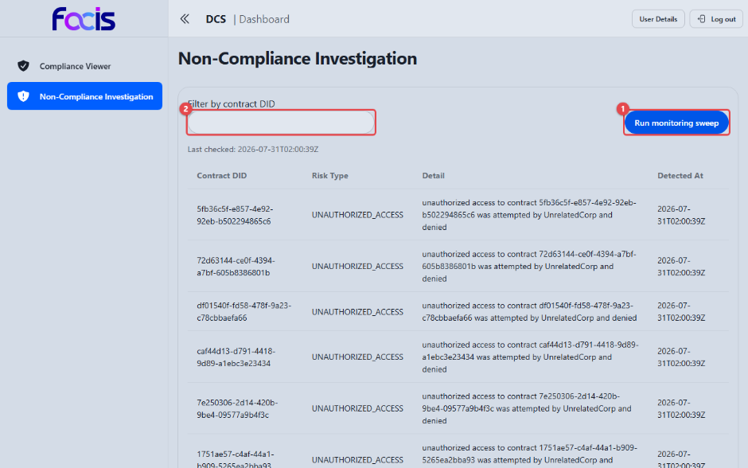
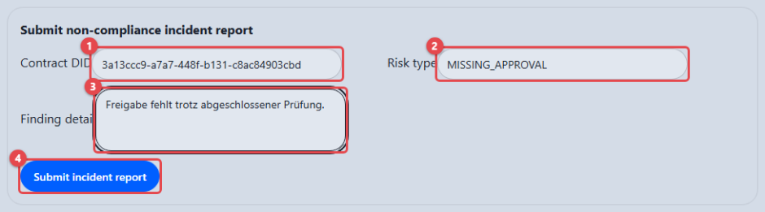
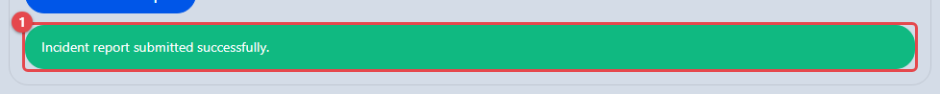

# Compliance überwachen (Compliance Officer)

Als Compliance Officer überwachen Sie das System auf Regelverstöße: Sie lassen
den DCS den Bestand auf Risiken durchsuchen, melden festgestellte Vorfälle als
formale Berichte und entscheiden über Vertragsübergänge, die zur manuellen
Prüfung zurückgestellt wurden.

Der Bereich **Non-Compliance Investigation** ist ausschließlich für Ihre Rolle
zugänglich; andere Rollen werden beim Aufruf automatisch umgeleitet.

**Voraussetzungen:** Sie sind mit der Rolle Compliance Officer angemeldet. In
der Seitennavigation sehen Sie **Non-Compliance Investigation** und
**Compliance Viewer**.

## Risiko-Überwachung ausführen

Öffnen Sie **Non-Compliance Investigation** in der Seitennavigation.

1. **Run monitoring sweep** **(1)** startet den Überwachungslauf über den
   gesamten Bestand. Währenddessen meldet die Ansicht „Running monitoring
   sweep…"; anschließend steht der Zeitpunkt des letzten Laufs darunter
   („Last checked: …").
2. Über **Filter by contract DID** **(2)** grenzen Sie die gefundenen Risiken
   auf einen bestimmten Vertrag ein.
3. Die Ergebnistabelle führt je Zeile **Contract DID**, **Risk Type**,
   **Detail** und **Detected At**. Die Abbildung zeigt mehrere Befunde der Art
   **UNAUTHORIZED_ACCESS**: Ein Fremdzugriff auf den Vertrag wurde versucht
   und abgewiesen; die Beschreibung nennt den abgewiesenen Akteur.

Der Überwachungslauf erkennt unter anderem folgende Risikoarten:

- **MISSING_APPROVAL:** einem Vertrag in Prüfung fehlt eine erforderliche
  Freigabe.
- **CONTRACT_UNDERPERFORMANCE:** ein in Kraft gesetzter Vertrag verfehlt eine
  vertraglich vereinbarte Kennzahl. Meldet das Zielsystem einen Messwert, der
  die im Vertrag maschinenlesbar hinterlegte Schwelle verletzt, erscheint der
  Verstoß als Alarm im Überwachungslauf und wird zusätzlich im Prüfprotokoll
  festgehalten. Die Zeile ist gelb hinterlegt und trägt vor der Risikoart das
  Abzeichen **Underperformance**.
- **UNAUTHORIZED_ACCESS:** eine am Vertrag unbeteiligte Partei hat versucht,
  auf den Vertrag zuzugreifen, und wurde abgewiesen. Die Abweisung wird
  dauerhaft festgehalten; der Überwachungslauf weist das Risiko dem
  betroffenen Vertrag zu und nennt den abgewiesenen Akteur.

Die Ansicht unterscheidet klar zwischen den möglichen Zuständen und behauptet
nie „keine Risiken", bevor sie geprüft hat:

- **Noch nicht gelaufen:** „Run a monitoring sweep to check for compliance
  risks."
- **Lauf ohne Befund:** „Monitoring sweep completed. No compliance risks were
  found."
- **Filter ohne Treffer:** „No compliance risks match the current filter."
- **Technischer Fehler:** eine rote Fehlermeldung mit dem Grund. Eine leere
  Ergebnisliste wird dabei nicht vorgetäuscht.

<!-- Screenshot fehlt: Überwachungslauf mit der Risikoart CONTRACT_UNDERPERFORMANCE. Grund: diese Risikoart setzt einen in Kraft gesetzten Vertrag voraus, zu dem ein Zielsystem einen Messwert gemeldet hat. Auf der bereitgestellten Instanz erreicht kein Vertrag diesen Zustand: Die automatische Regelprüfung weist dort jeden Schritt ab dem Einreichen ab („workflow gate blocked: immutable workflow snapshot has no effective shapes"). Die Risikoart ist durch die automatisierten Abnahmetests belegt. -->

## Einen Vorfall melden

Unterhalb der Überwachung melden Sie festgestellte Verstöße im Abschnitt
**Submit non-compliance incident report** als formalen Vorfallbericht.

1. Tragen Sie unter **Contract DID** **(1)** die Kennung des betroffenen
   Vertrags ein. Der Befund wird fest mit diesem Vertrag verknüpft.
2. Geben Sie unter **Risk type** **(2)** die Risikoart an (z. B.
   `MISSING_APPROVAL`).
3. Beschreiben Sie den Befund unter **Finding detail** **(3)** in eigenen
   Worten.
4. **Submit incident report** **(4)** reicht die Meldung ein; die Schaltfläche
   ist erst aktiv, wenn alle Felder ausgefüllt sind.

Nach erfolgreicher Übermittlung bestätigt die Ansicht die Meldung **(1)**
(„Incident report submitted successfully."). Der Bericht ist damit dauerhaft
dem Vertrag zugeordnet und für Prüfungen nachvollziehbar.

## Zurückgestellte Vertragsübergänge entscheiden

Ergibt die automatische Prüfung bei einem Vertragsübergang (Einreichen,
Anbieten, Freigeben, Signieren, Bereitstellen) das Ergebnis „manuelle Prüfung
erforderlich", bleibt der Vertrag im bisherigen Zustand stehen und wartet auf
Ihre Entscheidung.

- Sie sehen den gespeicherten Prüflauf und entscheiden mit einer Begründung:
  **genehmigen** oder **verwerfen**.
- Nach einer Genehmigung wird genau der zurückgestellte Übergang fortgesetzt;
  der Prüfdienst wird dafür nicht erneut aufgerufen.
- Solange die Prüfung offen ist, darf der Vertrag weder inhaltlich noch im
  Zustand geändert werden. Wurde er dennoch geändert, wird die Fortsetzung
  abgelehnt, weil die frühere Genehmigung nicht für den geänderten Vertrag
  gilt. Der Übergang muss dann für den aktuellen Stand neu angefordert werden.
- Eine zweite Genehmigung startet keine parallele Fortsetzung.

## Signaturprüfungen

Zusätzlich haben Sie Zugriff auf den **Compliance Viewer**, um die Signaturen
signierter Verträge einzusehen (siehe
[Verträge verwalten](contract-manager.md)). Für Sie ist dort der Reiter
**Audit Reports** bedienbar: **Load Audit Report** zeigt die Prüfhistorie der
Signaturen eines Vertrags. Die Aktionen **Validate**, **Run Compliance** und
**Revoke** sind dem Contract Manager vorbehalten; ein Hinweis daneben nennt
jeweils die fehlende Rolle.
