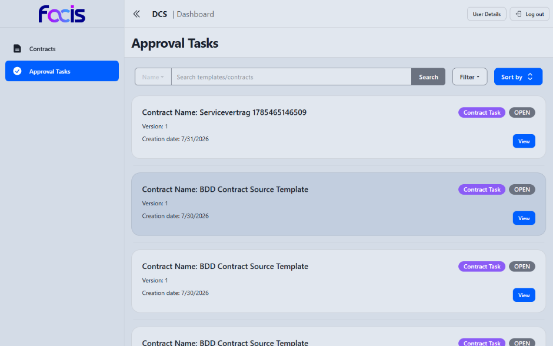
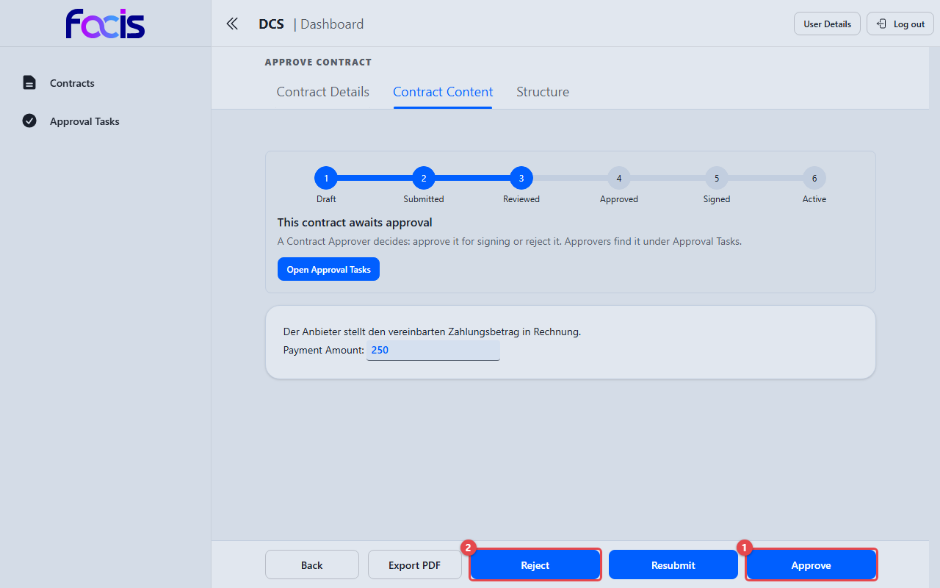

# Verträge freigeben (Contract Approver)

Als Contract Approver geben Sie geprüfte Verträge zur Signatur frei. Erst Ihre
Freigabe (Status APPROVED) öffnet den Vertrag für die Unterzeichnung — vorher
lässt das System keine Signatur zu, und der Vertrag erscheint in keiner
Signierliste.

**Voraussetzungen:** Sie sind mit der Rolle Contract Approver angemeldet. In
der Seitennavigation sehen Sie **Contracts** und **Approval Tasks**.

## Offene Freigaben finden

Öffnen Sie **Approval Tasks** in der Seitennavigation.

Die Liste zeigt die Verträge im Status REVIEWED, die auf Ihre Entscheidung
warten, mit Suchfeld, **Filter** und Sortierung. **View** öffnet die
Freigabeansicht.

## Einen Vertrag freigeben oder ablehnen

Die Ansicht **Approve Contract** zeigt den Vertrag schreibgeschützt mit
Fortschrittsleiste (Station **Reviewed**) und dem Hinweis „This contract
awaits approval". Unter **Contract Content** lesen Sie das vollständige
Dokument, unter **Contract Details** die Stammdaten.

1. **Approve** **(1)** gibt den Vertrag zur Signatur frei (Status REVIEWED →
   APPROVED). Der Vertrag erscheint anschließend in der Signierliste der
   Contract Signer.
2. **Reject** **(2)** lehnt die Freigabe ab.

Daneben stehen **Resubmit** (den Vertrag zur erneuten Prüfung zurückgeben),
**Export PDF** und **Back**.

Beide Aktionen öffnen einen Bestätigungsdialog, in dem Sie einen Kommentar
hinterlegen können; erst **Confirm** im Dialog führt die Entscheidung aus,
**Cancel** bricht ab.

Wird ein Vertrag zwischen zwei Organisationen verhandelt, gibt jede Seite
ihren eigenen Vertragsstand über die eigenen Rollen frei — die Freigabe der
einen Organisation ersetzt nicht die der anderen.

## Nach der Freigabe

Der freigegebene Vertrag wandert zur Unterzeichnung (siehe
[Verträge unterzeichnen](contract-signer.md)). Ist er signiert, übernimmt der
Contract Manager Inkraftsetzung und Verwaltung (siehe
[Verträge verwalten](contract-manager.md)).

Prüfen Sie vor der Freigabe, ob das Zielsystem des Vertrags gesetzt ist: Ein
Vertrag ohne Zielsystem wird nach Abschluss der Signatur nicht ausgerollt.
Die Auswahl trifft der Contract Manager in der Vertragsansicht.
