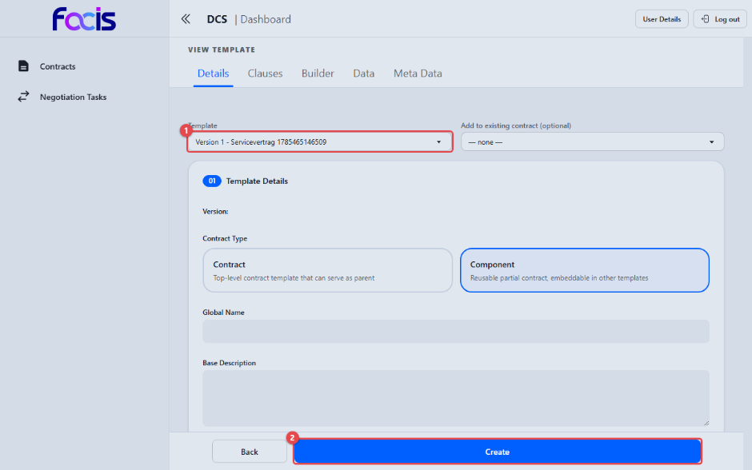
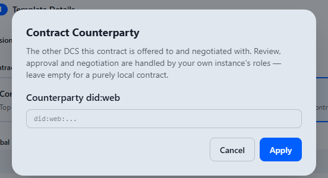
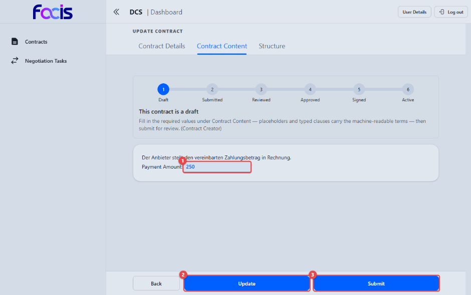
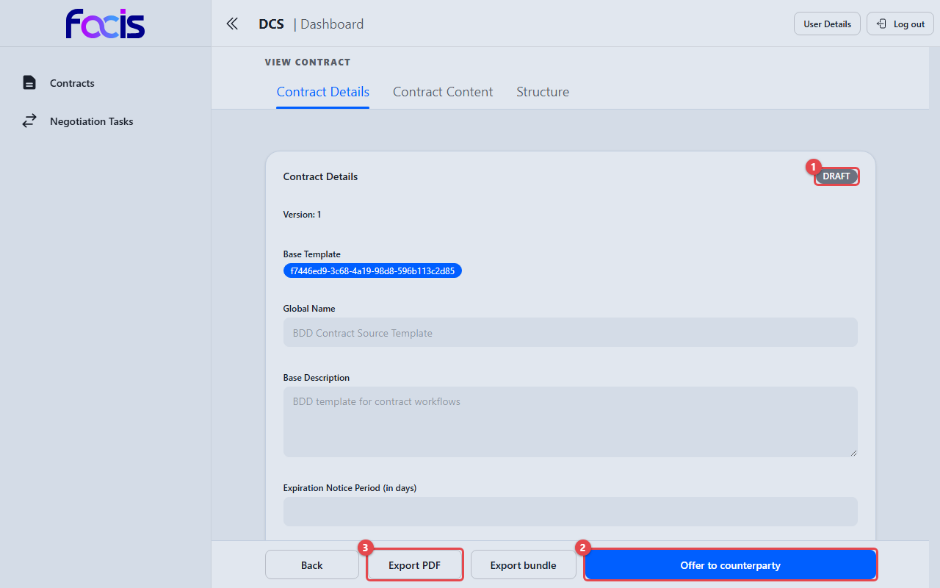
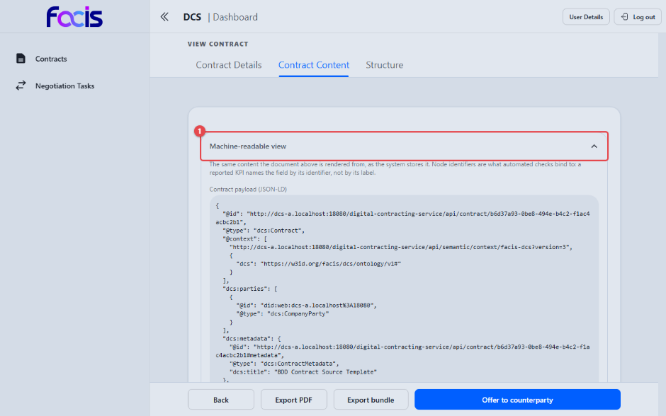
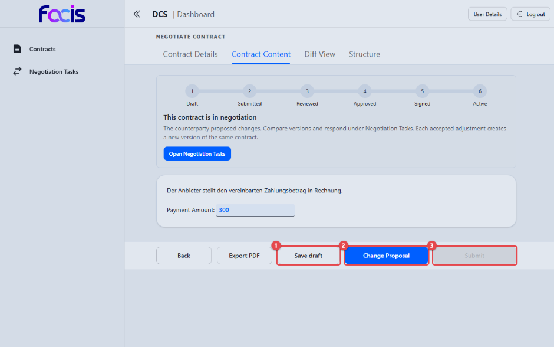
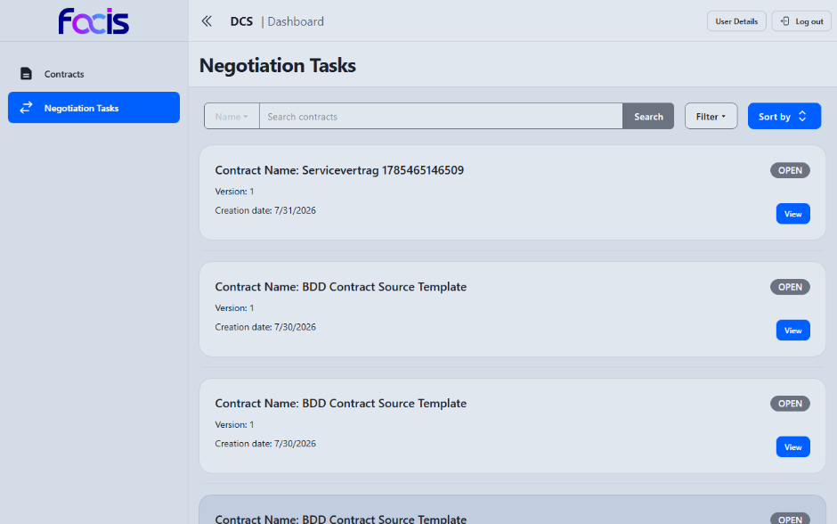

# Verträge erstellen und verhandeln (Contract Creator)

Als Contract Creator leiten Sie aus registrierten Vorlagen konkrete Verträge
ab, füllen die verhandelbaren Werte aus, bieten den Vertrag der Gegenseite an
und begleiten die Verhandlung bis zur Einigung.

**Voraussetzungen:** Sie sind mit der Rolle Contract Creator angemeldet. In
der Seitennavigation sehen Sie **Contracts** und **Negotiation Tasks**. Es
existiert mindestens eine registrierte Vertragsvorlage.

## Einen neuen Vertrag anlegen

Öffnen Sie **Contracts** und wählen Sie **New Contract**.

1. Wählen Sie unter **Template** **(1)** die registrierte Vorlage (mit
   Versionsangabe), aus der der Vertrag entstehen soll. Darunter zeigt die
   Ansicht die Vorlage mit ihren Reitern **Details**, **Clauses**,
   **Builder**, **Data** und **Meta Data** zur Kontrolle. Rechts daneben
   ordnen Sie den neuen Vertrag über **Add to existing contract (optional)**
   bei Bedarf einem bestehenden Vertrag als Untervertrag zu; **— none —**
   bedeutet „eigenständiger Vertrag".
2. **Create** **(2)** startet die Erstellung.

Erscheint die gewünschte Vorlage nicht in der Auswahl, ist sie noch nicht
registriert — Freigabe allein genügt nicht (siehe
[Vorlagen verwalten](template-manager.md)).

### Gegenpartei festlegen

Vor dem Anlegen fragt der Dialog **Contract Counterparty** nach der
Gegenseite:

1. Tragen Sie unter **Counterparty did:web** die eindeutige Kennung der
   Partnerorganisation ein, wenn der Vertrag mit einem anderen DCS verhandelt
   werden soll. Lassen Sie das Feld leer, entsteht ein rein interner Vertrag
   ohne Gegenseite — der Dialog sagt das ausdrücklich.
2. **Apply** legt den Vertrag an; er startet im Status **DRAFT**. Prüfung,
   Freigabe und Verhandlung übernehmen stets die Rollen der eigenen
   Organisation. **Cancel** bricht die Vertragsanlage ab.

## Vertragsinhalte ausfüllen

Öffnen Sie den Vertrag zum Bearbeiten (**Contracts** → **Edit**).

Die Bearbeitungsansicht führt durch die Reiter **Contract Details**,
**Contract Content** und **Structure**; die Fortschrittsleiste zeigt die
sechs Stationen Draft → Submitted → Reviewed → Approved → Signed → Active,
darunter einen Hinweis zum aktuellen Stand („This contract is a draft") und
zum nächsten Schritt.

1. Unter **Contract Content** sehen Sie das Vertragsdokument mit den
   Klauseltexten. Enthält die Vorlage ausfüllbare Platzhalter (z. B. einen
   Zahlungsbetrag), erscheinen sie hier als Eingabefelder **(1)** — füllen Sie
   alle Pflichtfelder aus.
2. **Update** **(2)** speichert den Entwurf, ohne den Status zu ändern.
3. **Submit** **(3)** speichert und reicht den Vertrag in die interne Prüfung
   ein; damit beginnt die Verhandlungsphase.

Führt die Vorlage strukturierte Datenobjekte mit (z. B. eine juristische
Person mit Anschrift, siehe [Vorlagen erstellen](template-creator.md)),
erscheinen diese ebenfalls unter **Contract Content**: Fest vorgegebene Werte
sind unveränderlich sichtbar, als verhandelbar gekennzeichnete Felder füllen
Sie hier wie die übrigen Eingabefelder aus.

## Vertrag anbieten (Übermittlung an die Gegenseite)

Öffnen Sie die Vertragsansicht (**Contracts** → **View**).

1. Das Statusabzeichen **(1)** zeigt den aktuellen Stand (hier **DRAFT**).
2. **Offer to counterparty** **(2)** übermittelt den Entwurf erstmals an die
   eingetragene Gegenseite (Status DRAFT → OFFERED). Die Gegenseite erhält
   dabei das vollständige Vertragsdokument als PDF mit eingebetteter Herkunfts-
   und Änderungshistorie.

   **Wichtig:** Solange ein Pflichtfeld des Vertrags nicht ausgefüllt ist,
   bleibt die Schaltfläche ausgegraut; ein Hinweis am Mauszeiger nennt das
   fehlende Feld („required field … amount"). Ein Angebot muss vollständig
   sein, bevor es das Haus verlässt. Nach dem Anbieten verschwindet die
   Schaltfläche — ein Angebot wird genau einmal abgegeben.
3. **Export PDF** **(3)** lädt das aktuelle Vertragsdokument als PDF herunter;
   **Export bundle** erzeugt ein Gesamtpaket des Vertrags.

### Die maschinenlesbare Seite des Vertrags

Im Reiter **Contract Content** steht unterhalb des lesbaren Dokuments der
zugeklappte Bereich **Machine-readable view**. Ein Klick auf die Überschrift
klappt ihn auf.

Der aufgeklappte Bereich **(1)** zeigt unter **Contract payload (JSON-LD)**
den vollständigen Vertragsinhalt, wie das System ihn speichert. Trägt der
Vertrag ausfüllbare Felder, steht darüber zusätzlich eine Tabelle mit
Bezeichnung (**Field**), Wert (**Value**) und technischer Kennung
(**Identifier**) je Feld. Beide Darstellungen — Dokument und maschinenlesbare
Ansicht — entstehen aus demselben Vertragsinhalt und können daher nicht
voneinander abweichen. Die Kennungen benötigen Sie im Alltag nicht: Sie sind
das, worauf automatische Prüfungen und später gemeldete Kennzahlen Bezug
nehmen.

## Verhandeln

Nach dem Einreichen (bzw. nach Änderungsvorschlägen der Gegenseite) findet die
Verhandlung in der Ansicht **Negotiate Contract** statt — erreichbar über
**Negotiation Tasks** oder direkt aus der Vertragsansicht.

Die Ansicht zeigt die Fortschrittsleiste, einen Hinweistext zum aktuellen
Stand („This contract is in negotiation") und die Reiter **Contract
Details**, **Contract Content**, **Diff View** und **Structure**. Unter **Diff
View** vergleichen Sie Vertragsversionen; unter **Contract Content** ändern
Sie verhandelbare Werte.

1. **Save draft** **(1)** speichert geänderte Werte als **privaten
   Verhandlungsentwurf**: Die Gegenseite sieht davon nichts, und der Entwurf
   bleibt erhalten, auch wenn Sie die Ansicht verlassen. Beim nächsten Öffnen
   sind die Werte wiederhergestellt.
2. **Change Proposal** **(2)** macht die Änderung verbindlich: Sie wird als
   Änderungsvorschlag an die Gegenseite übermittelt. Ein gespeicherter Entwurf
   wird dabei aufgebraucht — danach gibt es nichts mehr zu verwerfen. Jede
   angenommene Änderung erzeugt eine neue Version desselben Vertrags.
3. **Submit** **(3)** schließt die Verhandlungsrunde ab und übergibt den
   geeinten Stand in die interne Prüfung. Die Schaltfläche ist gesperrt,
   solange noch unbeantwortete Änderungsvorschläge offen sind — eine Einigung
   erfordert, dass beide Seiten alle offenen Vorschläge entschieden haben.

Solange ein privater Entwurf gespeichert ist, tritt in derselben Aktionsleiste
zwischen **Save draft** und **Change Proposal** die Schaltfläche **Discard
draft** hinzu und verwirft den Entwurf auf Wunsch. Sie verschwindet wieder,
sobald der Entwurf verworfen oder als Änderungsvorschlag übermittelt wurde.

### Auf Änderungsvorschläge antworten

Offene Vorschläge der Gegenseite erscheinen in der Verhandlungsansicht als
Liste. **Show** öffnet den Versionsvergleich des Vorschlags; dort nehmen Sie
ihn mit **Accept** an oder lehnen ihn ab — jeweils mit Bestätigungsdialog, den
Sie mit **Confirm** abschließen. Einen eigenen Vorschlag können Sie nicht
selbst annehmen; er wartet auf die Entscheidung der Gegenseite.

Der Bereich **Negotiation Tasks** sammelt alle Verträge mit laufender
Verhandlung als Aufgabenliste — je Eintrag Name, Version, Erstellungsdatum
und der Aufgabenzustand (**OPEN**). **View** öffnet die Verhandlungsansicht;
Suchfeld, **Filter** und **Sort by** grenzen die Liste ein.

## Nach der Verhandlung

Mit **Submit** wandert der Vertrag zur Prüfung (Contract Reviewer) und
anschließend zur Freigabe (Contract Approver) — siehe die Kapitel
[Verträge prüfen](contract-reviewer.md) und
[Verträge freigeben](contract-approver.md). Verhandelt jede Seite mit einem
eigenen DCS, durchläuft jede Organisation ihre eigene Prüfung und Freigabe;
die Freigabe der einen ersetzt nicht die der anderen.
