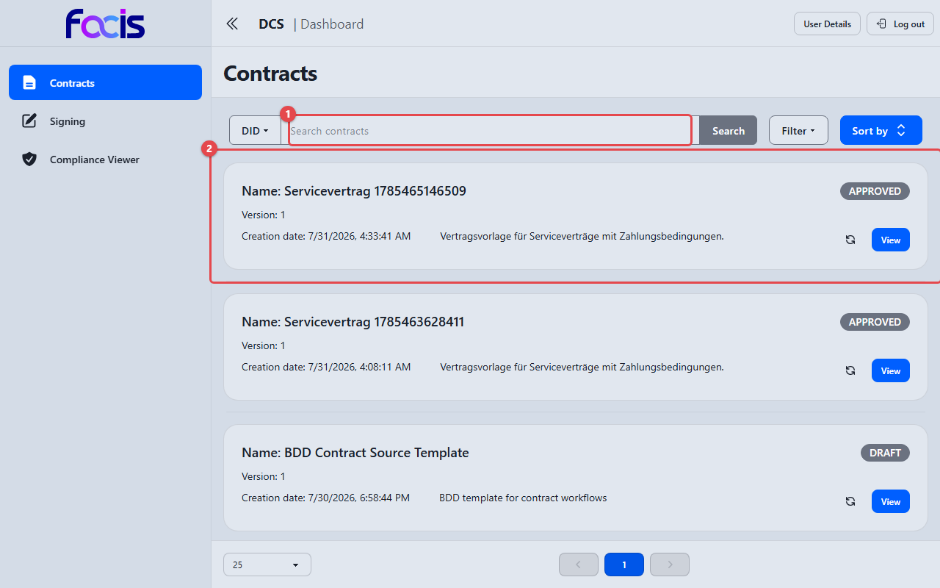
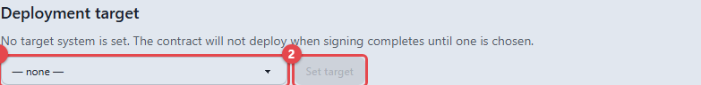
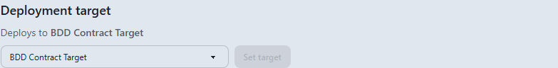
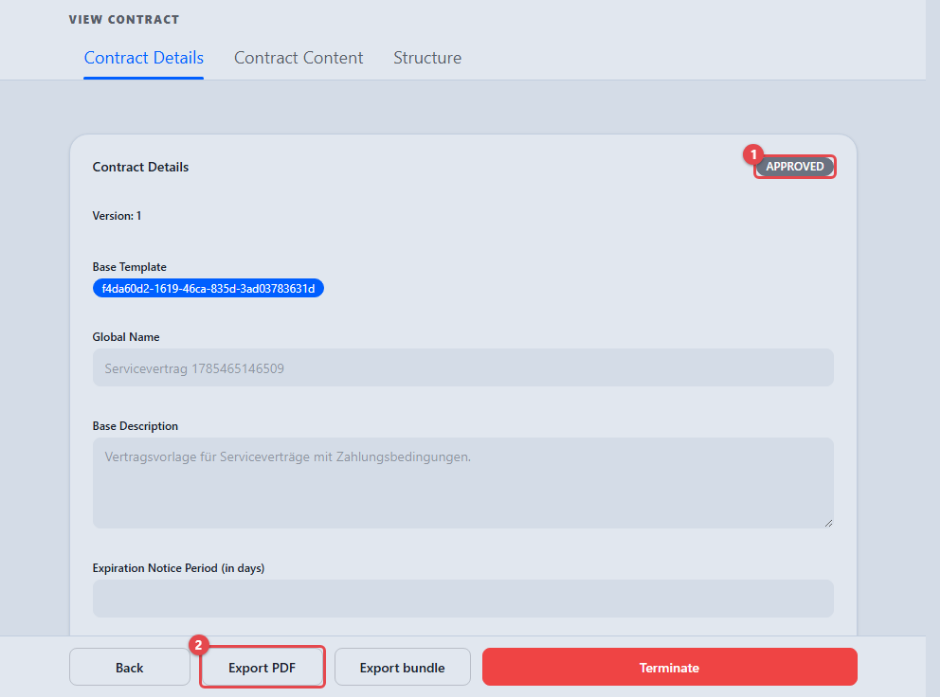
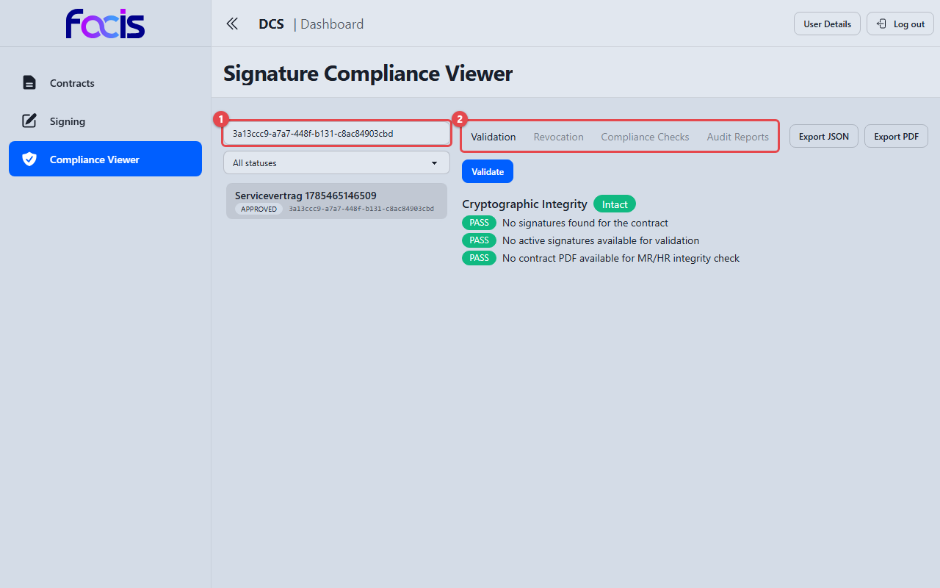
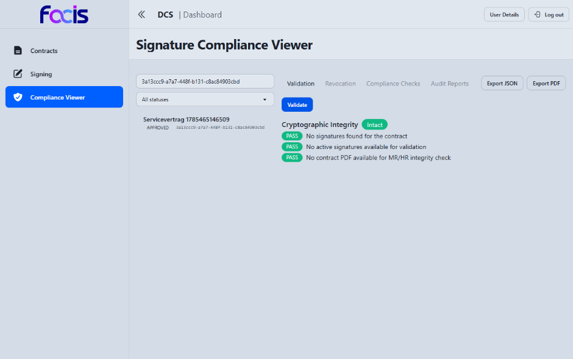
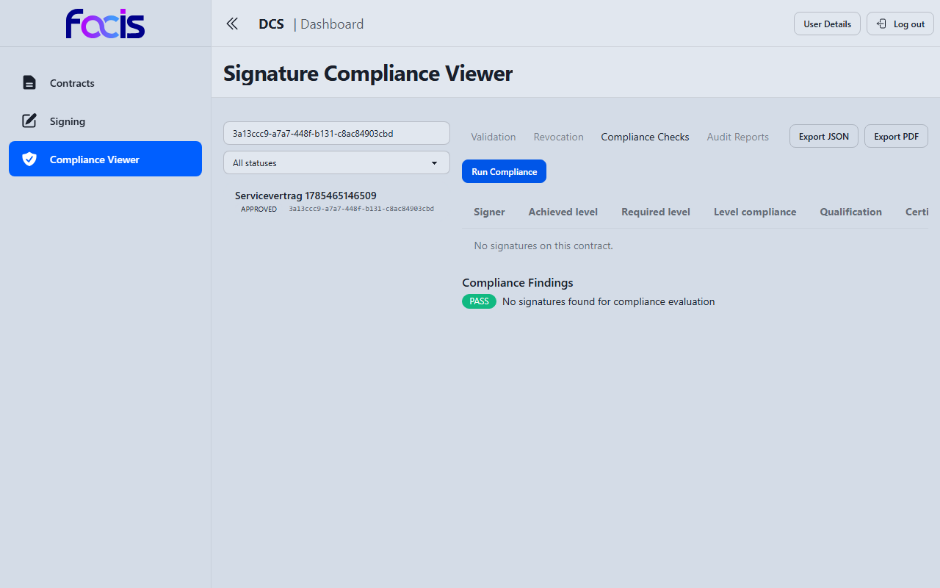
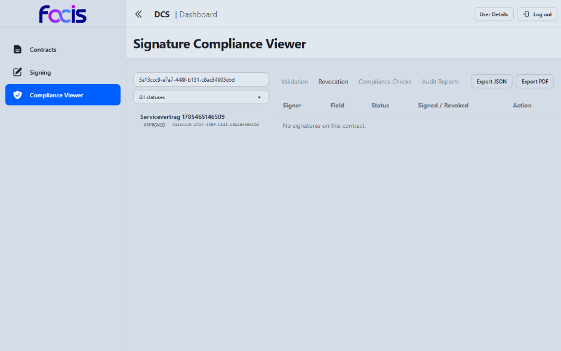

# Verträge verwalten (Contract Manager)

Als Contract Manager behalten Sie den gesamten Vertragsbestand im Blick,
exportieren Vertragsdokumente, legen fest, an welches Zielsystem ein Vertrag
bei der Inkraftsetzung übergeben wird, setzen vollständig signierte Verträge
in Kraft, prüfen Signaturen im Signature Compliance Viewer und beenden
Verträge.

**Voraussetzungen:** Sie sind mit der Rolle Contract Manager angemeldet. In
der Seitennavigation sehen Sie **Contracts**, **Signing** und **Compliance
Viewer**.

## Die Vertragsübersicht

Öffnen Sie **Contracts** in der Seitennavigation.

1. Über das Suchfeld **(1)** finden Sie einen Vertrag. Voreingestellt ist die
   Suche nach der Kennung (**DID**); über den Umschalter davor suchen Sie
   nach dem **Namen**. **Search** löst die Suche aus, **Filter** grenzt nach
   Status ein (z. B. nur **DRAFT** oder nur **APPROVED**).
2. Jeder Eintrag **(2)** zeigt Vertragsnamen, Version, Erstellungsdatum und
   das Statusabzeichen (**DRAFT**, **OFFERED**, **NEGOTIATION**,
   **SUBMITTED**, **REVIEWED**, **APPROVED**, **SIGNED**, **ACTIVE**,
   **TERMINATED**, **REVOKED**). **View** öffnet die Detailansicht. Läuft ein
   Vertrag auf ein Fristende zu, weist ein farbiges Abzeichen darauf hin.

## Vertragsdetails und PDF-Export

Die Detailansicht (**View**) zeigt den Vertrag mit den Reitern **Contract
Details**, **Contract Content** und **Structure**. Unter **Contract Content**
sehen Sie das vollständige, aus den maschinenlesbaren Vertragsdaten erzeugte
lesbare Dokument; darunter klappt der Bereich **Machine-readable view**
dieselben Inhalte in Feldform auf: **Field** (Bezeichnung), **Value** (Wert)
und **Identifier** (technische Kennung). Beide Darstellungen entstehen aus
demselben Vertragsinhalt und können daher nicht voneinander abweichen. Die
Kennungen sind das, worauf automatische Prüfungen und die vom Zielsystem
gemeldeten Kennzahlen Bezug nehmen: Eine gemeldete Kennzahl benennt das Feld
über seine Kennung, nicht über seine Beschriftung.

- **Export PDF** lädt das aktuelle Vertragsdokument als Archiv-PDF herunter.
  Das PDF trägt den maschinenlesbaren Vertragsinhalt und die vollständige
  Herkunftskette in sich — es ist dasselbe Dokument, das bei
  organisationsübergreifenden Verträgen zwischen den Systemen ausgetauscht
  wird. Unmittelbar nach einer Änderung kann der Export kurz warten, bis das
  Dokument neu erzeugt wurde.
- **Export bundle** erzeugt ein Gesamtpaket des Vertrags.

## Das Zielsystem eines Vertrags festlegen

Jeder Vertrag benennt selbst das Zielsystem, an das er bei der Inkraftsetzung
übergeben wird. Die Auswahl treffen Sie in der Detailansicht, im Reiter
**Contract Details**, in der Karte **Deployment target**.

1. Wählen Sie im markierten Auswahlfeld eines der registrierten Zielsysteme.
   Die Liste stammt aus der Zielsystem-Verwaltung (siehe
   [Systemverwaltung](systemadministrator.md)); der Eintrag **— none —**
   bedeutet „kein Ziel".
2. **Set target** **(2)** speichert die Auswahl. Die Schaltfläche bleibt
   gesperrt, solange die Auswahl unverändert ist.

Legen Sie das Ziel **vor der Signatur** fest: Mit Abschluss der Signatur wird
der Vertrag automatisch an sein Zielsystem übergeben — ein Vertrag ohne
festgelegtes Ziel wird dabei nicht bereitgestellt. Die Karte weist darauf
ausdrücklich hin: „No target system is set. The contract will not deploy when
signing completes until one is chosen."

Nach dem Speichern lädt die Ansicht den Vertrag neu und zeigt das festgelegte
Ziel als „Deploys to *Name*" an. Das Ziel bleibt änderbar, solange der Vertrag
nicht beendet, abgelaufen oder widerrufen ist — eine falsche Auswahl lässt
sich also bis zur Signatur korrigieren. Schlägt das Speichern fehl, erscheint
eine rote Fehlermeldung direkt in der Karte.

## Einen signierten Vertrag in Kraft setzen

Die Inkraftsetzung übergibt den Vertrag an sein festgelegtes Zielsystem, das
die vereinbarten Kennzahlen gegen die maschinenlesbaren Vertragsregeln misst.
Sie geschieht auf zwei Wegen:

- **Automatisch:** Sobald alle vorgesehenen Signaturen nachweisbar vorliegen,
  wird der Vertrag ohne weiteres Zutun an sein Zielsystem übermittelt.
  Bestätigt das Zielsystem den Empfang, wechselt der Status von **SIGNED** auf
  **ACTIVE**.
- **Manuell:** Bei einem Vertrag im Status **SIGNED** bietet die Detailansicht
  die Aktion **Deploy** an. Ein Vertrag, der noch nicht vollständig signiert
  ist, wird für die Inkraftsetzung abgelehnt.

Die Detailansicht eines Vertrags: das Statusabzeichen **(1)** und die
Aktionsleiste mit **Export PDF** **(2)** und **Export bundle**. Sobald der
Vertrag signiert ist, treten dort **Deploy** (bei einem aktiven Vertrag:
**Redeploy**) und **Terminate** hinzu.

<!-- Screenshot fehlt: Aktionsleiste eines SIGNED/ACTIVE-Vertrags mit Deploy bzw. Redeploy und Terminate — Grund: auf der bereitgestellten Instanz existiert kein signierter Vertrag. Die automatische Regelprüfung weist dort sowohl das Einreichen eines Entwurfs als auch das Hochladen des signierten Dokuments ab („workflow gate blocked: immutable workflow snapshot has no effective shapes"), weil ein Vertrag beim Speichern den bei seiner Erzeugung hinterlegten Regelstand verliert. Die Aktionen sind durch die End-to-End-Tests belegt. -->

### Erneut bereitstellen (Redeploy)

Bei einem aktiven Vertrag heißt die Aktion **Redeploy**: Sie übermittelt den
Vertrag erneut an sein Zielsystem — etwa wenn das Zielsystem zeitweise nicht
erreichbar war oder den Vertrag erneut erhalten muss. Der Vertragsstatus
bleibt dabei **ACTIVE**.

### Gemeldete Kennzahlen (KPIs)

Meldet das Zielsystem Kennzahlen zu einem aktiven Vertrag, erscheinen sie in
der Detailansicht im Reiter **Contract Details** im Bereich **KPIs** — jeweils
mit Kennung, gemeldetem Wert und Meldezeitpunkt. Verletzt ein gemeldeter Wert
eine im Vertrag vereinbarte Grenze, trägt der Eintrag das rote Abzeichen
**Violation**; der Verstoß erscheint außerdem in der Compliance-Überwachung
(siehe [Compliance überwachen](compliance-officer.md)).

<!-- Screenshot fehlt: Bereich KPIs mit gemeldetem Wert und Violation-Abzeichen — Grund: Kennzahlen setzen einen in Kraft gesetzten Vertrag voraus, an den ein Zielsystem Messwerte meldet. Auf der bereitgestellten Instanz erreicht kein Vertrag diesen Zustand, weil die automatische Regelprüfung jeden Schritt ab dem Einreichen abweist (siehe oben). Das Verhalten ist durch die automatisierten Abnahmetests belegt. -->

## Einen Vertrag beenden

**Terminate** beendet einen Vertrag. Der Bestätigungsdialog verlangt eine
**Reason** — ohne Begründung bleibt **Submit** wirkungslos. Nach dem Beenden
kehrt die Ansicht in die Vertragsübersicht zurück; der Vertrag trägt dort und
in der Detailansicht den Status **TERMINATED**.

Verlängerung, Kündigung und Auslauf verwalten Sie ebenfalls aus der
Vertragsübersicht.

## Signature Compliance Viewer

Der Bereich **Compliance Viewer** prüft die Signaturen signierter Verträge
nach den europäischen Prüfstandards.

Links listet die Ansicht alle Verträge mit Status; über das Suchfeld **(1)**
finden Sie einen Vertrag nach Name oder Kennung, ein Statusfilter grenzt die
Liste ein. Ein Klick auf einen Eintrag öffnet rechts die Prüfansicht mit vier
Reitern **(2)**:

- **Validation** — **Validate** startet die Signaturprüfung nach dem
  EU-Prüfverfahren. Angezeigt werden die Identität des Unterzeichners, das
  Signaturniveau, der Zeitstempel sowie die kryptographischen
  Integritätsprüfungen mit PASS/FAIL-Bewertung.
- **Compliance Checks** — **Run Compliance** bewertet je Signatur das
  erreichte gegen das geforderte Signaturniveau und den Status des zugrunde
  liegenden Berechtigungsnachweises. Über **Export JSON** und **Export PDF**
  exportieren Sie den Prüfbericht; beide sind erst nach einer erfolgreichen
  Prüfung des aktuell gewählten Vertrags verfügbar.
- **Audit Reports** — lädt die Prüfhistorie der Signaturen (siehe
  [Audits durchführen](auditor.md)).
- **Revocation** — listet die geleisteten Signaturen mit Status.

Solange Daten geladen werden, sagt die Ansicht das ausdrücklich („Loading
contracts", „Loading signature data") — eine leere Liste wird nie als „keine
Treffer" ausgegeben, bevor geladen wurde.

Der Reiter **Validation** nach **Validate**: unter **Cryptographic Integrity**
steht das Gesamturteil (hier **Intact**), darunter die einzelnen Befunde mit
**PASS**/**FAIL**. Bei einem signierten Vertrag nennen sie zusätzlich die
Identität des Unterzeichners, das Signaturniveau und den Zeitstempel; das
Beispiel zeigt einen noch nicht signierten Vertrag, für den die Prüfung
ausdrücklich „No signatures found for the contract" ausweist.

Der Reiter **Compliance Checks** nach **Run Compliance**: eine Tabelle je
Signatur mit **Signer**, **Achieved level**, **Required level**, **Level
compliance**, **Qualification** und dem Zertifikatsstatus, darunter die
zusammengefassten **Compliance Findings**.

<!-- Screenshot fehlt: Validation und Compliance Checks mit tatsächlichen Signaturbefunden — Grund: auf der bereitgestellten Instanz existiert kein signierter Vertrag (siehe oben); beide Reiter sind dort nur im Zustand „keine Signaturen" darstellbar. Die Befunde sind durch die End-to-End-Tests belegt. -->

### Eine Signatur widerrufen

Der Reiter **Revocation** listet die geleisteten Signaturen mit **Signer**,
**Field**, **Status**, **Signed / Revoked** und der Spalte **Action**; trägt
der Vertrag keine Signatur, sagt die Ansicht das ausdrücklich. Über **Revoke**
in der Spalte **Action** widerrufen Sie eine geleistete Signatur. Der Bestätigungsdialog verlangt einen **Reason for revocation**;
erst **Submit** führt den Widerruf aus, **Cancel** bricht folgenlos ab. Ein
leerer Grund wird nicht angenommen.

Nach dem Widerruf steht die Signatur auf **REVOKED**. Auch der Vertrag selbst
wird als **REVOKED** geführt; er bleibt in der Signierliste der Unterzeichner
sichtbar, dort mit dem Widerrufszeitpunkt in den Signaturdetails. Bei einem
Vertrag mit einer Partnerorganisation wird der Widerruf automatisch an die
Gegenseite übermittelt.

### Lebenszyklus und Sperrstatus auseinanderhalten

Beim Verifizieren eines exportierten Vertrags werden zwei Angaben getrennt
ausgewiesen:

- der **Lebenszyklusstatus** des Vertrags — z. B. `active`, `suspended` oder
  `terminated`;
- der **abgefragte Sperrstatus** — `active` oder `revoked` — zusammen mit dem
  Ergebnis dieser Abfrage (`passed` / `failed`) und gegebenenfalls einem
  Fehlergrund.

So bleibt „beendet" als Vertragszustand sichtbar, während der Sperrstatus
zugleich „gesperrt" melden kann. Eine bestätigte Sperre oder Aussetzung wird
innerhalb weniger Minuten bei einer frischen Prüfung berücksichtigt. Ist der
Statusdienst nicht erreichbar, meldet die Verifikation den Sperrstatus als
`unavailable` und die Statusprüfung als `failed`; das Gesamtergebnis ist dann
nicht erfolgreich, und der Vertrag wird ausdrücklich nicht als aktiv
ausgewiesen.
