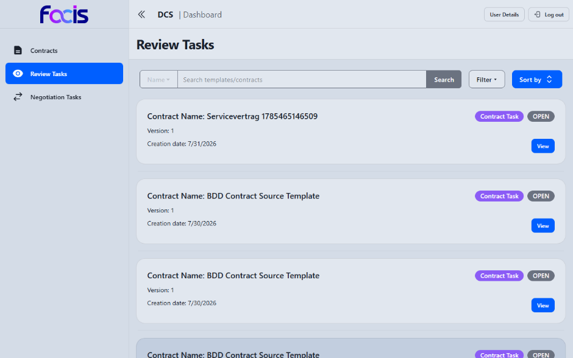
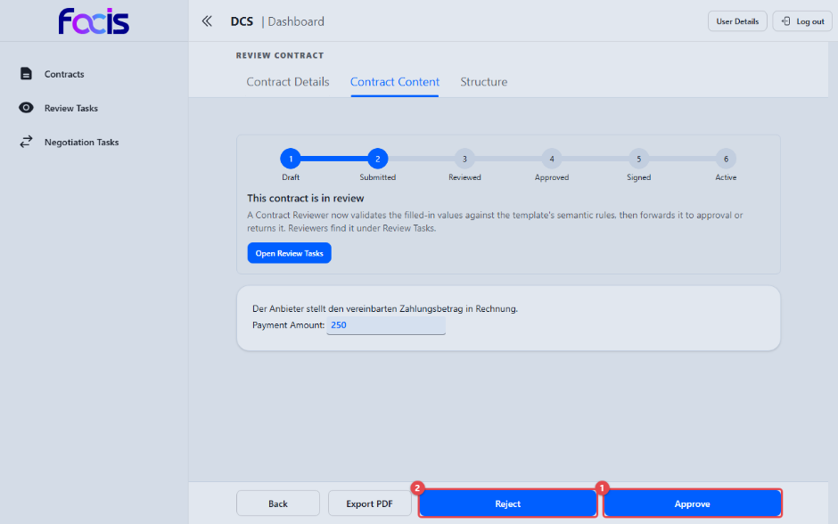
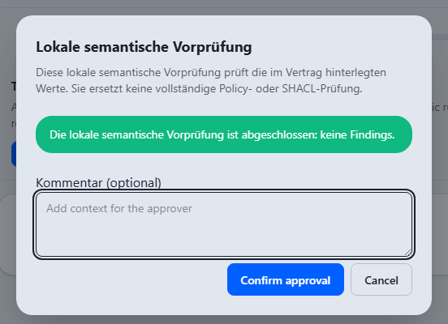

# Verträge prüfen (Contract Reviewer)

Als Contract Reviewer prüfen Sie verhandelte Verträge, bevor sie zur Freigabe
weitergehen. Sie sehen den vollständigen, geeinten Vertragsstand und
entscheiden, ob er in die Freigabe geht oder zur Überarbeitung zurückkehrt.

**Voraussetzungen:** Sie sind mit der Rolle Contract Reviewer angemeldet. In
der Seitennavigation sehen Sie **Contracts**, **Review Tasks** und
**Negotiation Tasks**.

## Offene Prüfaufgaben finden

Öffnen Sie **Review Tasks** in der Seitennavigation.

Die Liste zeigt die Verträge im Status SUBMITTED, die auf Ihre Prüfung warten,
je Eintrag mit Name, Version, Erstellungsdatum, einem Abzeichen für die Art
der Aufgabe und ihrem Zustand (**OPEN**). Über Suchfeld, **Filter** und
**Sort by** grenzen Sie die Liste ein; **View** öffnet die Prüfansicht.
Tragen Sie zusätzlich die Rolle Template Reviewer, führt dieselbe Liste auch
die Vorlagenaufgaben.

## Einen Vertrag prüfen und weiterleiten

Die Ansicht **Review Contract** zeigt den Vertrag schreibgeschützt mit
Fortschrittsleiste (Station **Submitted**), dem Hinweis „This contract is in
review" und den Reitern **Contract Details**, **Contract Content** und
**Structure**. Unter **Contract Content** lesen Sie das vollständige
Vertragsdokument mit allen ausgefüllten Werten; darunter lässt sich die
maschinenlesbare Ansicht aufklappen.

1. **Approve** **(1)** prüft den Vertrag und leitet ihn zur Freigabe an den
   Contract Approver weiter (Status SUBMITTED → REVIEWED).
2. **Reject** **(2)** gibt den Vertrag in die Verhandlung zurück. Der Dialog
   **Comment findings** nimmt dabei Ihre Anmerkungen auf; ein Text ist
   freiwillig, **Submit** führt die Rückgabe aus.

Zusätzlich stehen **Export PDF** und **Back** zur Verfügung.

### Die semantische Vorprüfung

**Approve** startet zunächst eine Vorprüfung der im Vertrag hinterlegten
Werte. Das Ergebnis erscheint gesammelt in einem Dialog, damit Sie es vor der
Weiterleitung beurteilen können.

- **Keine Beanstandungen:** Der Dialog **Lokale semantische Vorprüfung**
  meldet „Die lokale semantische Vorprüfung ist abgeschlossen: keine
  Findings.". Unter **Kommentar (optional)** tragen Sie bei Bedarf
  einen Hinweis für die freigebende Person ein; **Confirm approval** leitet
  den Vertrag weiter.
- **Beanstandungen gefunden:** Der Dialog listet alle gefundenen Punkte auf
  und nennt ihre Zahl; eine Bestätigung ist dann nicht verfügbar. Lassen Sie
  die Punkte im Vertrag beheben und starten Sie die Freigabe erneut.
- **Vorprüfung technisch fehlgeschlagen:** Der Dialog zeigt einen Fehler und
  bietet **Retry verification** an. Der Vertrag wurde nicht weitergeleitet.
- **Weiterleitung fehlgeschlagen:** Die Vorprüfung war erfolgreich, aber die
  Übermittlung schlug fehl. Wählen Sie **Retry submission**; Ihr Kommentar
  bleibt im Dialog erhalten.

Mit **Cancel** oder der Escape-Taste schließen Sie den Dialog, ohne eine
Entscheidung zu übermitteln.

Die Vorprüfung ist eine frühe Hilfestellung. Sie ersetzt nicht die
vollständigen Richtlinien- und Strukturprüfungen, die beim Weiterleiten des
Vertrags serverseitig maßgeblich bleiben (siehe
[Störungen und häufige Fragen](troubleshooting-faq.md)).

## Wenn Approve nicht verfügbar ist

Steht **Approve** nicht bereit, prüfen Sie, ob Sie tatsächlich mit der Rolle
Contract Reviewer angemeldet sind und ob der Vertrag noch auf die Prüfung
wartet. Ein bereits weitergeleiteter Vertrag lässt sich nicht erneut prüfen.
