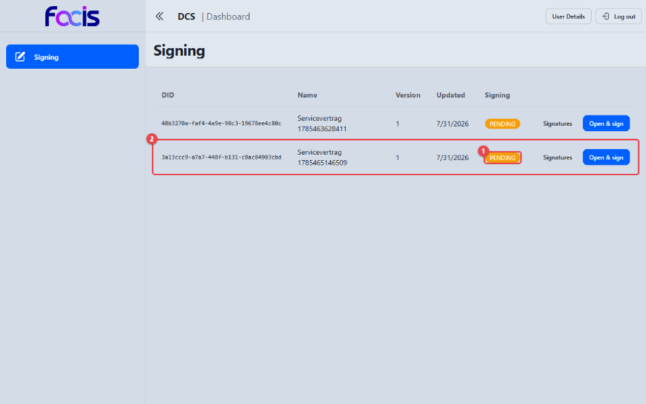
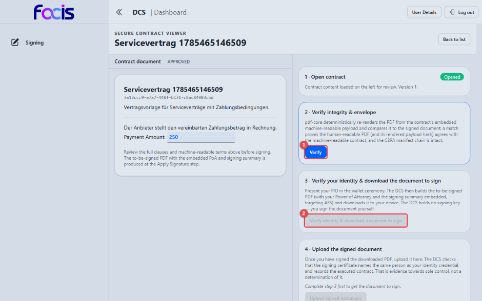
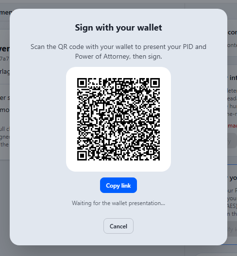

# Verträge unterzeichnen (Contract Signer)

Als Contract Signer unterzeichnen Sie freigegebene Verträge. Der DCS führt Sie
dabei Schritt für Schritt durch den **Secure Contract Viewer**: Sie prüfen den
Vertrag, weisen Ihre Identität und Ihre Zeichnungsvollmacht mit Ihrer Wallet
nach, laden das zu signierende Dokument herunter, signieren es mit Ihrem
**eigenen** Signaturschlüssel außerhalb des DCS und laden das signierte
Dokument wieder hoch. Der DCS selbst verwahrt keinen Signaturschlüssel für
Sie.

**Voraussetzungen:** Sie sind mit der Rolle Contract Signer angemeldet und
besitzen eine Wallet mit Ihrem Identitätsnachweis (PID) und Ihrer
Zeichnungsvollmacht (PoA) sowie ein eigenes Signaturmittel. In der
Seitennavigation sehen Sie **Signing**.

## Die Signierliste

Öffnen Sie **Signing** in der Seitennavigation.

Die Liste zeigt je Vertrag die Spalten **DID**, **Name**, **Version**,
**Updated** und **Signing**. Der Signierstatus **(1)** in der Spalte
**Signing** sagt Ihnen, was zu tun ist; die zugehörige Zeile **(2)** trägt
rechts die passenden Aktionen:

- **PENDING** — der Vertrag ist zur Signatur freigegeben und wartet auf Ihre
  Unterschrift. **Open & sign** öffnet ihn im Secure Contract Viewer.
- **SIGNED** — der Vertrag ist signiert und bleibt auch nach der
  Inkraftsetzung als signiert gelistet. Die Schaltfläche heißt hier **Open**.
- **REVOKED** — eine geleistete Signatur wurde widerrufen. Auch widerrufene
  Verträge bleiben in der Liste sichtbar, damit der Vorgang nachvollziehbar
  bleibt.

**Signatures** klappt je Zeile die Signaturdetails auf.

Ein noch nicht freigegebener Vertrag erscheint hier gar nicht und kann
folglich nicht unterzeichnet werden. Sind keine Verträge vorhanden, zeigt die
Ansicht den Hinweis „Nothing awaits your signature. Contracts appear here once
they are approved for signing."

### Signaturdetails einsehen

<!-- Screenshot fehlt: aufgeklappte Signaturdetails eines signierten Vertrags — Grund: auf der bereitgestellten Instanz existiert kein signierter Vertrag. Das Hochladen des signierten Dokuments wird dort von der automatischen Regelprüfung abgewiesen („workflow gate blocked: immutable workflow snapshot has no effective shapes"): Beim Speichern eines Vertragsentwurfs verliert der Vertrag den bei seiner Erzeugung hinterlegten Regelstand, und ohne diesen lässt die Prüfung keinen weiteren Schritt zu. Der Ablauf ist durch die End-to-End-Tests belegt. -->

Je geleisteter Signatur sehen Sie:

- das nachgewiesene Signaturniveau bzw. den verwendeten Berechtigungsnachweis
  (z. B. **AES**); wurde keines festgestellt, steht dort ausdrücklich **NOT
  ESTABLISHED**,
- den Status der Signatur (**SIGNED** oder **REVOKED**),
- die Kennung des Unterzeichners,
- die Zeitpunkte („Signed at: …", bei einem Widerruf zusätzlich „Revoked at:
  …").

Darunter fasst der Abschnitt **Validation** die Prüfergebnisse zusammen: das
Ergebnis der Signaturprüfung sowie einzelne Integritätsbefunde mit
PASS/FAIL-Bewertung. Wurde noch keine Signatur geleistet, erscheint der
Hinweis „No signature has been applied yet."

## Der Secure Contract Viewer

Links lesen Sie das vollständige Vertragsdokument mit allen Klauseln sowie die
Herkunftskette: die fälschungssicher im Dokument verankerte Historie aller
bisherigen Bearbeitungsschritte. Rechts führt eine Schrittfolge durch die
Signatur:

- **1 · Open contract** — der Vertragsinhalt ist geladen (Abzeichen
  **Opened**).
- **2 · Verify integrity & envelope** — mit **Verify** **(1)** prüfen Sie,
  dass das lesbare Dokument exakt dem maschinenlesbaren Vertragsinhalt
  entspricht und die Herkunftskette unversehrt ist.
- **3 · Verify your identity & download the document to sign** — die
  Schaltfläche **(2)** ist gesperrt, bis Schritt 2 erfolgreich war. Der Text
  darüber sagt zu, dass der DCS keinen Signaturschlüssel hält: Sie signieren
  selbst.
- **4 · Upload the signed document** — ebenfalls gesperrt; der Hinweis
  „Complete step 3 first to get the document to sign." erklärt die Reihenfolge.

## Signieren Schritt für Schritt

**1. Vertrag prüfen.** Klicken Sie **Verify**. Nach erfolgreicher Prüfung
zeigt Schritt 2 das Abzeichen **Verified** und darunter das Ergebnis des
Abgleichs zwischen lesbarem Dokument und maschinenlesbarem Vertragsinhalt.
Erst dann ist die Schaltfläche in Schritt 3 freigeschaltet; der Uploadbereich
in Schritt 4 bleibt gesperrt, bis das zu signierende Dokument bereitsteht.
Über **Re-verify** wiederholen Sie die Prüfung jederzeit.

<!-- Screenshot fehlt: Secure Contract Viewer nach erfolgreicher Verifikation — Grund: auf der bereitgestellten Instanz meldet die Prüfung „Human ↔ machine match: mismatch" und darunter „No contract PDF stored yet — no integrity check was performed". Ursache ist die Dokumentenablage der Instanz: Sie nimmt keine Dokumente mehr an, daher wurde zu keinem Vertrag ein Vertragsdokument hinterlegt, gegen das der Abgleich laufen könnte. Ein Bild dieses Zustands würde den beschriebenen Ablauf falsch darstellen. Der Ablauf ist durch die End-to-End-Tests belegt. -->

**2. Identität und Vollmacht nachweisen.** Klicken Sie **Verify identity &
download document to sign**. Es öffnet sich der Wallet-Dialog.

Der Dialog **Sign with your wallet** fordert dazu auf, den QR-Code mit der
Wallet zu scannen und dort Identitätsnachweis und Zeichnungsvollmacht
vorzulegen. Alternativ überträgt **Copy link** denselben Link in die
Zwischenablage. Der Dialog wartet („Waiting for the wallet presentation…"),
bis die Wallet bestätigt hat; **Cancel** bricht ab.

Der DCS prüft dabei, ob die Vollmacht auf Sie persönlich und auf die
unterzeichnende Organisation lautet, ob sie derzeit gültig ist und ob sie auf
einen für Ihre Umgebung zugelassenen Vertrauensanker zurückführt. Nur wenn
alle vier Punkte zutreffen, geht es weiter. Bei einem Vertrag mit einer
Partnerorganisation wiederholt deren System diese Prüfung, bevor es Ihre
Signatur annimmt.

Anschließend stellt der DCS das zu signierende PDF bereit — mit eingebetteter
Vollmacht und Signaturübersicht — und lädt es auf Ihr Gerät herunter.

**3. Dokument signieren.** Signieren Sie das heruntergeladene PDF mit Ihrem
eigenen Signaturmittel außerhalb des DCS. Das Dokument enthält bereits das
für Sie vorgesehene Signaturfeld.

**4. Signiertes Dokument hochladen.** Laden Sie das signierte PDF unter
**Upload the signed document** wieder hoch. Der DCS validiert die Signatur —
insbesondere, dass allein Sie den Signaturschlüssel kontrolliert haben — und
setzt den Vertrag auf **SIGNED**.

<!-- Screenshot fehlt: Secure Contract Viewer mit Status SIGNED nach dem Upload — Grund: auf der bereitgestellten Instanz endet der Upload mit „The signed contract was rejected: workflow gate blocked: immutable workflow snapshot has no effective shapes"; der Vertrag erreicht dort nie den Status SIGNED. Der Ablauf ist durch die End-to-End-Tests belegt. -->

Der Vertrag trägt anschließend den Status **SIGNED**. Bei einem
Vertrag mit einer Partnerorganisation wird das signierte Dokument automatisch
an die Gegenseite übermittelt; deren Unterzeichner leistet seine Signatur
zusätzlich auf demselben Dokument. Erst wenn alle vorgesehenen Unterschriften
nachweisbar vorliegen, gilt der Vertrag als vollständig unterzeichnet.

## Wenn eine Signatur abgelehnt wird

Der DCS nimmt nur Signaturen an, die zweifelsfrei von der Person stammen, die
sich zuvor mit der Wallet ausgewiesen hat. Diese Fälle können Ihnen begegnen:

- **Das Signaturzertifikat passt nicht zu Ihrem Identitätsnachweis.** Lautet
  das Zertifikat, mit dem das PDF unterschrieben wurde, auf einen anderen
  Namen als den in der Wallet nachgewiesenen, weist der DCS den Upload ab. Die
  Ansicht nennt die konkrete Begründung (das Zertifikat „does not identify the
  verified signatory"); der Vertrag wird nicht auf **SIGNED** gesetzt.
  Verwenden Sie ein Signaturmittel, dessen Zertifikat auf Ihren eigenen Namen
  ausgestellt ist, und laden Sie erneut hoch.
- **Die Vollmacht führt nicht auf einen zugelassenen Vertrauensanker
  zurück.** Die Vollmacht wird abgelehnt, der Signaturvorgang bleibt
  unverifiziert. Wenden Sie sich an die Stelle, die Ihre Vollmacht ausgestellt
  hat.
- **Die Vollmacht ist widerrufen oder ausgesetzt.** Die Signatur wird nicht
  fortgesetzt. Lassen Sie sich eine gültige Vollmacht ausstellen.
- **Vollmacht ohne prüfbaren Statusnachweis.** Fehlt der Statusnachweis oder
  ist er unbekannt bzw. ungültig, weist der DCS die Prüfung aus
  Sicherheitsgründen ab.
- **Die Frist des Signaturvorgangs ist abgelaufen.** Für jeden
  Signaturvorgang gilt eine zeitliche Frist. Bestätigt Ihre Wallet den
  Identitätsnachweis erst nach Ablauf, wird die Vorlage abgelehnt. Starten Sie
  die Signatur neu über **Open & sign**.

## Sichtbare Schutzmechanismen

- Die Schritte sind strikt nacheinander freigeschaltet; Überspringen ist nicht
  möglich.
- Ein Vertrag, der nicht freigegeben ist, taucht in der Signierliste gar nicht
  erst auf.
- Schlägt die Integritätsprüfung fehl, bleibt der Download gesperrt —
  unterschrieben wird nur, was nachweislich dem verhandelten Inhalt entspricht.
- Wird eine hochgeladene Signatur abgelehnt, nennt die Ansicht stets den
  konkreten Grund; der Vertrag bleibt unsigniert.
