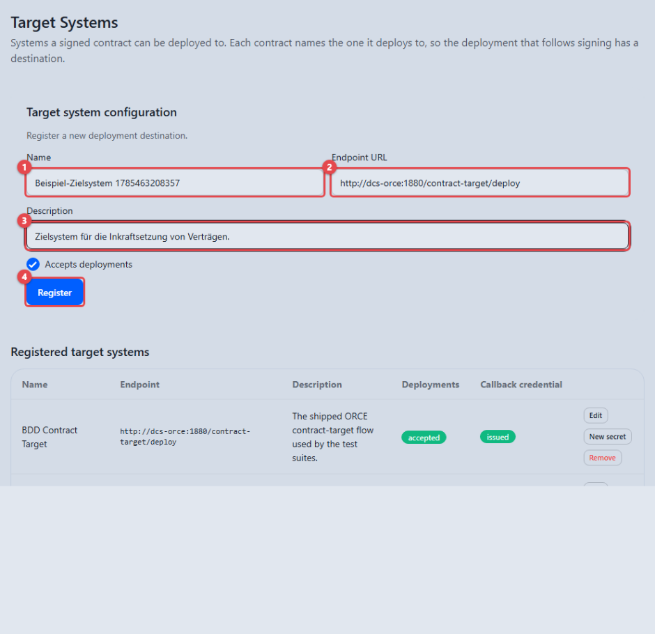
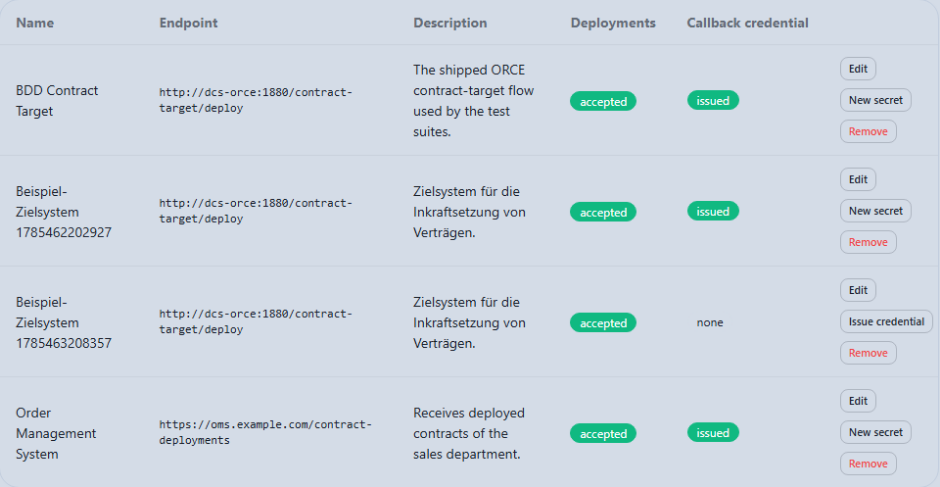
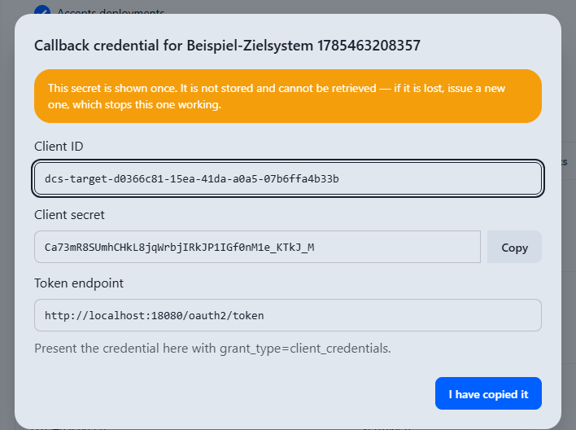
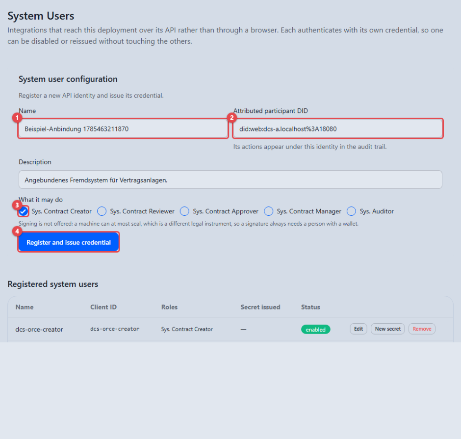
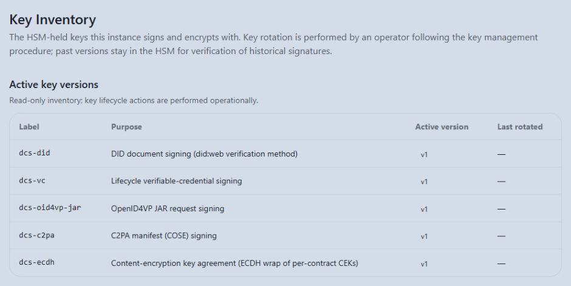

# Systemverwaltung (Sys. Administrator)

Als Sys. Administrator pflegen Sie drei Verzeichnisse: die **Zielsysteme**,
an die signierte Verträge bei der Inkraftsetzung übergeben werden, die
**Systembenutzer**, mit denen angebundene Fremdsysteme am DCS arbeiten, und
das **Schlüsselverzeichnis**, das die kryptographischen Schlüssel der Instanz
sichtbar macht.

**Voraussetzungen:** Sie sind mit der Rolle Sys. Administrator angemeldet. In
der Seitennavigation sehen Sie **Target Systems**, **System Users** und **Key
Inventory**. Ein **Integration Manager** sieht ausschließlich **Target
Systems**.

---

## Zielsysteme (Target Systems)

Öffnen Sie **Target Systems** in der Seitennavigation. Die Ansicht besteht aus
zwei Teilen: oben das Formular **Target system configuration** zum Anlegen
(beim Bearbeiten heißt es **Change target system**), darunter die Tabelle
**Registered target systems** mit den Spalten **Name**, **Endpoint**,
**Description**, **Deployments** und **Callback credential**.

Solange kein Zielsystem registriert ist, erklärt ein Hinweis die Ausgangslage:
Ein Vertrag kann nicht in Kraft gesetzt werden, bevor ein Zielsystem existiert
und der Vertrag es benennt.

### Ein Zielsystem registrieren

1. Tragen Sie unter **Name** **(1)** den Anzeigenamen ein, unter dem das
   Zielsystem später bei der Zielauswahl eines Vertrags erscheint.
2. Tragen Sie unter **Endpoint URL** **(2)** die Adresse ein, an die
   Bereitstellungen übermittelt werden.
3. Optional beschreibt **Description** **(3)** den Eintrag näher.
4. **Register** **(4)** legt das Zielsystem an; es erscheint sofort in der
   Tabelle.

Über den Schalter **Accepts deployments** steuern Sie, ob das Zielsystem
Bereitstellungen annimmt; der Zustand erscheint in der Spalte **Deployments**
als **accepted** bzw. **refused**.

In der Spalte **Callback credential** trägt ein neuer Eintrag zunächst den
Vermerk, dass noch keine Zugangsdaten ausgestellt sind — ohne sie kann das
Zielsystem keine Bereitstellung bestätigen.

### Zugangsdaten für Bestätigungen ausstellen

Wenn ein Zielsystem eine Bereitstellung erhält, bestätigt es den Empfang
gegenüber dem DCS und weist sich dabei mit eigenen Zugangsdaten aus. Jedes
Zielsystem erhält eigene Zugangsdaten, damit eine Bestätigung eindeutig von
dem Zielsystem stammt, an das die Bereitstellung ging.

1. Wählen Sie in der Zeile des Zielsystems **Issue credential**.
2. Ein Dialog zeigt die ausgestellten Zugangsdaten — **einmalig**.

Der Dialog **Callback credential for …** weist oben in einem gelben Hinweis
ausdrücklich darauf hin, dass das Geheimnis nur einmal angezeigt wird: „This
secret is shown once. It is not stored and cannot be retrieved — if it is
lost, issue a new one, which stops this one working." Darunter stehen
**Client ID**, **Client secret** (mit **Copy**) und **Token endpoint** — die
Adresse, an der sich das Zielsystem mit diesen Zugangsdaten ausweist.

Übergeben Sie Kennung und Geheimnis auf sicherem Weg an die Betreiber des
Zielsystems, bevor Sie den Dialog mit **I have copied it** schließen. Danach
ist das Geheimnis nirgends in der Anwendung mehr einsehbar — der DCS
speichert es nicht.

3. Nach dem Schließen zeigt die Spalte **Callback credential** den Vermerk,
   dass Zugangsdaten ausgestellt sind.

Über **New secret** stellen Sie später neue Zugangsdaten aus (etwa bei einem
Verdacht auf Kompromittierung): Das bisherige Geheimnis verliert sofort seine
Gültigkeit, nur das neue funktioniert weiter.

### Einträge bearbeiten und entfernen

- **Edit** übernimmt die Werte eines Eintrags in das Formular; **Save
  changes** speichert die Änderung, **Cancel** verwirft sie.
- **Remove** entfernt einen Eintrag aus dem Verzeichnis.

Wird eine Aktion vom System abgelehnt, erscheint die zugehörige Meldung als
roter Hinweis oberhalb des Formulars.

---

## Systembenutzer (System Users)

Öffnen Sie **System Users** in der Seitennavigation. Hier registrieren Sie die
technischen Benutzer, unter denen angebundene Fremdsysteme am DCS arbeiten —
etwa ein Vorsystem, das Verträge automatisch anlegt. Zugangsdaten werden in
der Anwendung ausgestellt und lassen sich jederzeit erneuern; dafür ist kein
Eingriff in die Installation nötig.

1. Tragen Sie unter **Name** **(1)** eine sprechende Bezeichnung der Anbindung
   ein.
2. Unter **Attributed participant DID** **(2)** geben Sie die Organisation an,
   in deren Namen der Systembenutzer handelt. Ein Hinweis erklärt: Seine
   Handlungen erscheinen unter dieser Identität im Prüfprotokoll.
3. Unter **What it may do** **(3)** wählen Sie, was der Systembenutzer darf.
   Angeboten werden nur die für automatische Konten vorgesehenen Rollen —
   **Sys. Contract Creator**, **Sys. Contract Reviewer**, **Sys. Contract
   Approver**, **Sys. Contract Manager** und **Sys. Auditor**. Ein Hinweis
   erklärt, warum das Signieren nicht dabei ist: Eine Maschine kann höchstens
   siegeln, unterschreiben muss stets eine Person mit Wallet.
4. **Register and issue credential** **(4)** legt den Systembenutzer an.

Unmittelbar danach erscheint derselbe Zugangsdaten-Dialog wie bei den
Zielsystemen: Kennung und Geheimnis werden **einmalig** angezeigt. Notieren
Sie das Geheimnis, bevor Sie den Dialog schließen — danach ist es nicht mehr
abrufbar.

Die Tabelle **Registered system users** darunter führt je Eintrag **Name**,
**Client ID**, **Roles**, **Secret issued** und **Status** (**enabled** bzw.
**disabled**). Weitere Aktionen je Zeile:

- **New secret** stellt ein neues Geheimnis aus. Das bisherige verliert sofort
  seine Gültigkeit; nur das neue funktioniert weiter.
- **Edit** öffnet den Eintrag zur Änderung. Über das Kontrollkästchen
  **Enabled** deaktivieren Sie einen Systembenutzer; die Zeile trägt danach
  den Vermerk **disabled**, und seine Zugangsdaten werden ab sofort abgewiesen.
- **Remove** entfernt den Eintrag.

---

## Schlüsselverzeichnis (Key Inventory)

Öffnen Sie **Key Inventory** in der Seitennavigation.

Die Tabelle **Active key versions** listet je Schlüssel die Bezeichnung
(**Label**), den Verwendungszweck (**Purpose**) im Klartext, die aktuell
aktive Version (**Active version**, z. B. **v1**, solange nie gewechselt
wurde) und den Zeitpunkt des letzten Wechsels (**Last rotated**).

Die Ansicht ist ausschließlich zum Lesen — der Hinweis darüber sagt es
ausdrücklich: Ein Schlüsselwechsel ist ein betrieblicher Vorgang und wird
nicht über die Oberfläche ausgelöst; frühere Versionen bleiben erhalten,
damit ältere Signaturen prüfbar bleiben. Die Ansicht dient dazu, jederzeit
belegen zu können, welches Schlüsselmaterial in welcher Version im Einsatz
ist.
