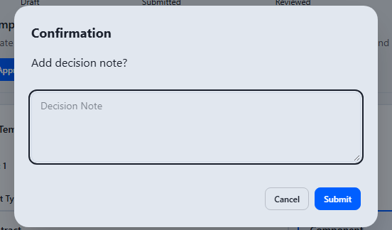

# Vorlagen freigeben (Template Approver)

Als Template Approver treffen Sie die abschließende Entscheidung über geprüfte
Vorlagen. Erst Ihre Freigabe macht eine Vorlage für die Registrierung und
damit für die Vertragserstellung verwendbar.

**Voraussetzungen:** Sie sind mit der Rolle Template Approver angemeldet. In
der Seitennavigation sehen Sie **Templates** und **Approval Tasks**.

## Offene Freigaben finden

Öffnen Sie **Approval Tasks** in der Seitennavigation.

Die Liste zeigt alle Vorlagen im Status REVIEWED, die auf Ihre Entscheidung
warten, mit Suchfeld, **Filter** und Sortierung. **View** öffnet die
Freigabeansicht.

## Eine Vorlage freigeben oder ablehnen

Die Ansicht **Approve Template** zeigt die vollständige, schreibgeschützte
Vorlage mit den Reitern **Details**, **Clauses**, **Builder**, **Data** und
**Meta Data**. Die Fortschrittsleiste steht auf **Reviewed**, der Hinweis
darunter lautet „This template awaits approval", und der erste Abschnitt trägt
rechts das Statusabzeichen **REVIEWED**.

1. **Approve** **(1)** gibt die Vorlage endgültig frei (Status APPROVED).
2. **Reject** **(2)** lehnt sie ab; die Vorlage geht zur Überarbeitung zurück.

In derselben Leiste stehen **Back** (zurück zur Aufgabenliste), **Export PDF**
(eine PDF-Fassung des Freigabestands), **Copy** (eine Kopie der Vorlage als
neuer Entwurf, für Sie gesperrt) und **Resubmit**, mit dem Sie die Vorlage
ohne Ablehnung erneut in die Prüfung geben.

## Die Entscheidung bestätigen

**Approve** und **Resubmit** öffnen den Dialog **Confirmation** mit der Frage
„Add decision note?". Der Vermerk unter **Decision Note** ist freiwillig.
**Submit** führt die Entscheidung aus, **Cancel** bricht ab.

Bei **Reject** verlangt derselbe Dialog unter „Add reason:" eine Begründung.
Ohne Text bleibt die Ablehnung aus, und die Ansicht weist darauf hin, dass ein
Grund erforderlich ist.

Nach der Freigabe kann der Template Manager die Vorlage registrieren; erst
dann steht sie der Vertragserstellung zur Verfügung (siehe
[Vorlagen verwalten](template-manager.md)).
