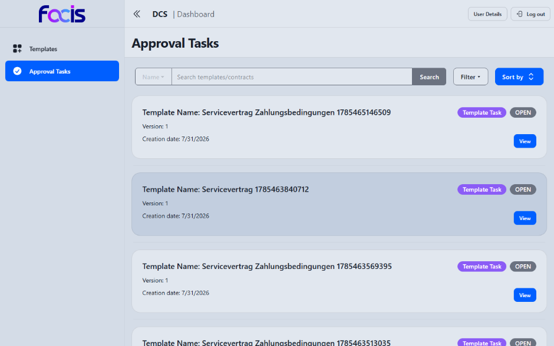
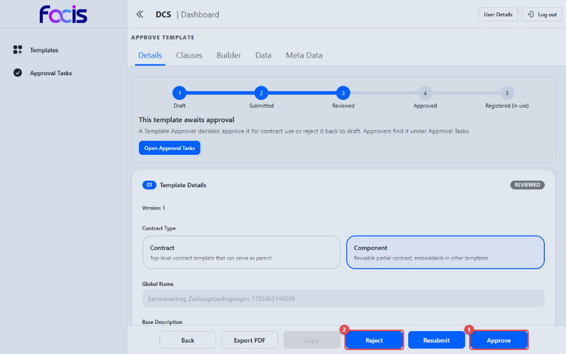

# Vorlagen freigeben (Template Approver)

Als Template Approver treffen Sie die abschließende Entscheidung über geprüfte
Vorlagen. Erst Ihre Freigabe macht eine Vorlage für die Registrierung — und
damit für die Vertragserstellung — verwendbar.

**Voraussetzungen:** Sie sind mit der Rolle Template Approver angemeldet. In
der Seitennavigation sehen Sie **Templates** und **Approval Tasks**.

## Offene Freigaben finden

Öffnen Sie **Approval Tasks** in der Seitennavigation.

Die Liste zeigt alle Vorlagen im Status REVIEWED, die auf Ihre Entscheidung
warten, mit Suchfeld, **Filter** und Sortierung. **View** öffnet die
Freigabeansicht.

## Eine Vorlage freigeben oder ablehnen

Die Ansicht **Approve Template** zeigt die vollständige, schreibgeschützte
Vorlage mit Fortschrittsleiste und Statusabzeichen **REVIEWED**.

1. **Approve** **(1)** gibt die Vorlage endgültig frei (Status APPROVED).
2. **Reject** **(2)** lehnt sie ab; die Vorlage geht zur Überarbeitung zurück.

Zusätzlich steht **Export PDF** für eine PDF-Fassung des Freigabestands zur
Verfügung, **Back** führt zurück zur Aufgabenliste.

Beide Entscheidungen bestätigen Sie in einem Dialog, in dem Sie einen
Kommentar hinterlegen können; erst **Submit** im Dialog führt die Entscheidung
aus, **Cancel** bricht ab.

Nach der Freigabe kann der Template Manager die Vorlage registrieren; erst
dann steht sie der Vertragserstellung zur Verfügung (siehe
[Vorlagen verwalten](template-manager.md)).
