# Vorlagen erstellen (Template Creator)

Als Template Creator entwerfen Sie die Bausteine des Vertragswesens:
wiederverwendbare **Komponenten** mit Klauseln und maschinenlesbaren Regeln
sowie **Vertragsvorlagen**, die diese Komponenten zu einem vollständigen
Vertragsdokument zusammensetzen. Ihre Entwürfe reichen Sie zur Prüfung ein;
erst nach Prüfung, Freigabe und Registrierung können daraus Verträge
abgeleitet werden.

**Voraussetzungen:** Sie sind mit der Rolle Template Creator angemeldet. In
der Seitennavigation sehen Sie den Bereich **Templates**.

## Die Vorlagenübersicht

Öffnen Sie **Templates** in der Seitennavigation.

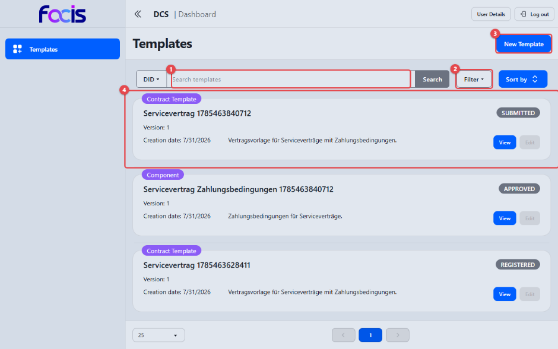

1. Über das Suchfeld **(1)** filtern Sie die Liste. Voreingestellt ist die
   Suche nach der eindeutigen Kennung (**DID**); über den Umschalter davor
   suchen Sie stattdessen nach dem **Namen**.
2. **Filter** **(2)** grenzt die Liste nach Status ein (z. B. nur DRAFT oder
   SUBMITTED).
3. **New Template** **(3)** startet eine neue Vorlage.
4. Jeder Eintrag **(4)** zeigt Name, Version, Erstellungsdatum, Beschreibung
   und Status. **View** öffnet die Detailansicht; **Edit** ist nur bei
   Entwürfen (DRAFT) verfügbar.

Unter der Liste stellen Sie die Seitengröße ein und blättern durch die Seiten.

## Eine neue Vorlage anlegen: Typ wählen

Nach **New Template** wählen Sie zunächst den Vorlagentyp.

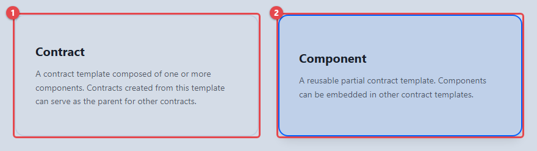

1. **Contract** **(1)** — eine vollständige Vertragsvorlage, aus der später
   Verträge abgeleitet werden. Sie wird aus Komponenten zusammengesetzt und
   kann selbst Elternvorlage weiterer Verträge sein.
2. **Component** **(2)** — ein wiederverwendbarer Teilbaustein (z. B.
   Zahlungsbedingungen), der in Vertragsvorlagen eingebettet wird.

## Grunddaten erfassen (Reiter „Details")

Die Bearbeitungsansicht gliedert sich in die Reiter **Details**, **Clauses**,
**Builder**, **Data** und **Meta Data**. Am unteren Rand steht dauerhaft die
Aktionsleiste mit **Cancel** und **Create**.

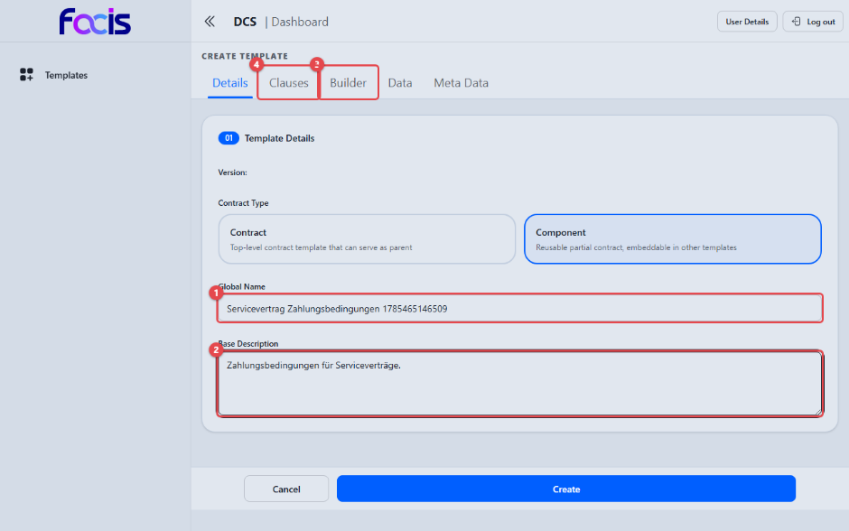

1. Vergeben Sie unter **Global Name** **(1)** einen eindeutigen Namen.
2. Beschreiben Sie unter **Base Description** **(2)** den Zweck der Vorlage.
3. Über den Reiter **Builder** **(3)** bearbeiten Sie die Dokumentgliederung,
   über **Clauses** **(4)** die Klauseln (siehe unten). Unter **Contract
   Type** sehen Sie zur Kontrolle, welchen Typ Sie gewählt haben.

Bleiben Name oder Beschreibung leer, bricht **Create** ab: Die Ansicht springt
in das erste unvollständige Feld und meldet dort „Global Name is required."
bzw. „Base Description is required." — es wird nichts gespeichert.

Ein Statusfeld gibt es bewusst nicht: Der Status einer Vorlage ändert sich
ausschließlich über die Arbeitsschritte Einreichen, Prüfen, Freigeben und
Registrieren.

## Klauseln verfassen (Reiter „Clauses")

Im Klausel-Editor entsteht jede Klausel zweisprachig: als **lesbarer Text**
für Menschen und als **maschinenlesbare Regel**, die das System später
automatisch prüfen und durchsetzen kann. Beide Hälften stehen nebeneinander.

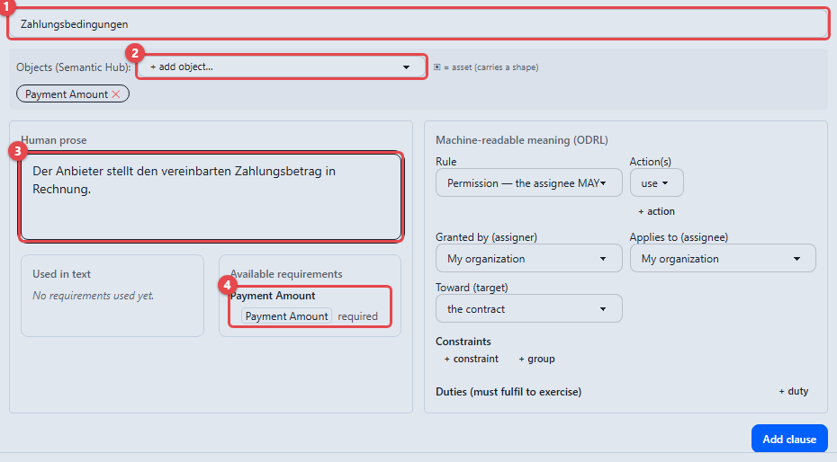

1. Geben Sie der Klausel im Feld **(1)** einen Titel (z. B.
   „Zahlungsbedingungen").
2. Über **Objects (Semantic Hub)** **(2)** — die Auswahl **+ add object…** —
   wählen Sie die Fachbegriffe, auf die sich die Klausel bezieht, etwa
   **Payment Amount**. Die gewählten Begriffe erscheinen darunter als Marken,
   die sich mit **✕** wieder entfernen lassen. Die Begriffe stammen aus dem
   zentralen Fachkatalog (Semantic Hub) und werden gewählt, nie frei getippt;
   so bleiben alle Vorlagen einheitlich.
3. Schreiben Sie unter **Human prose** **(3)** den Klauseltext.
4. Das Feld **Available requirements** **(4)** listet die gewählten
   Fachbegriffe als einsetzbare Bausteine, jeweils mit dem Vermerk
   **required** bei Pflichtfeldern. Ein Klick auf einen Eintrag fügt an der
   Schreibmarke einen ausfüllbaren Platzhalter in den Klauseltext ein.

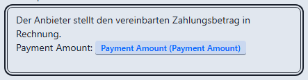

Der eingesetzte Platzhalter erscheint im Klauseltext als eigene Marke. Genau
dieses Feld füllt der Contract Creator später im abgeleiteten Vertrag aus; bei
Pflichtfeldern erzwingt das System die Eingabe, bevor der Vertrag angeboten
werden kann. Das Feld **Used in text** zeigt, welche Bausteine bereits
verwendet wurden.

### Die maschinenlesbare Regel

Rechts neben dem Klauseltext legen Sie unter **Machine-readable meaning
(ODRL)** die formale Bedeutung der Klausel fest.

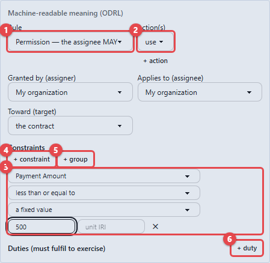

1. **Rule** **(1)** bestimmt die Regelart: **Permission — the assignee MAY**
   (Erlaubnis), **Prohibition — the assignee MUST NOT** (Verbot) oder
   **Obligation — the assignee MUST** (Pflicht).
2. **Action(s)** **(2)** benennt die Handlung (z. B. **use**); **+ action**
   ergänzt weitere Handlungen. Mit **Granted by (assigner)**, **Applies to
   (assignee)** und **Toward (target)** legen Sie fest, wer die Regel
   einräumt, für wen sie gilt und worauf sie sich bezieht — die Auswahl bietet
   dafür klare Begriffe wie **My organization**, **The counterparty** und
   **the contract** an.
3. Eine Bedingungszeile **(3)** grenzt die Regel ein: links die Eigenschaft
   (z. B. **Payment Amount**), dann der Vergleich (z. B. **less than or equal
   to**), dann die Grenze — entweder **a fixed value** mit einem festen Wert
   oder eines der gewählten Fachfelder, dessen Wert erst bei der
   Vertragsverhandlung feststeht. Das **✕** am Zeilenende entfernt die
   Bedingung.
4. **+ constraint** **(4)** fügt eine weitere Bedingung hinzu. Mehrere
   Bedingungen müssen standardmäßig gemeinsam erfüllt sein.
5. **+ group** **(5)** öffnet eine verschachtelte Bedingungsgruppe mit eigener
   Kombinationslogik — so lassen sich Ausdrücke wie „Zweck ist Forschung
   **und** (Region ist Deutschland **oder** Österreich)" abbilden.
6. **+ duty** **(6)** unter **Duties (must fulfil to exercise)** hängt der
   Erlaubnis eine Pflicht an, die zu ihrer Ausübung erfüllt sein muss (z. B.
   „muss anschließend löschen"). Eine Pflicht kann eigene Bedingungen und eine
   **+ consequence** tragen — eine Folgepflicht für den Fall, dass die Pflicht
   nicht erfüllt wird.

**Add clause** übernimmt die fertige Klausel in die Vorlage; das Formular
leert sich für die nächste Klausel.

### Räumliche Bedingungen mit Länderlisten

Mit der Eigenschaft **access region (spatial)** legen Sie fest, für welche
Länder oder Regionen eine Regel gilt.

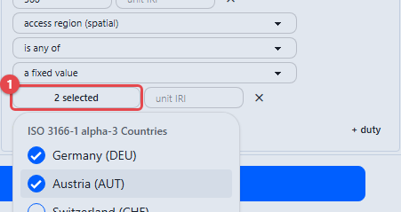

Der Vergleich bestimmt, wie ausgewählt wird:

- **equal to** erlaubt genau ein Land; solange keines gewählt ist, zeigt die
  Auswahl **choose value**.
- **is any of**, **is none of** und **is all of** öffnen eine
  Mehrfachauswahl **(1)**: Ein Klick auf das Feld klappt die Liste auf, die
  Einträge werden angehakt. Die Zusammenfassung zeigt die Anzahl der
  gewählten Einträge (z. B. „2 selected").

Die Liste stammt aus dem hinterlegten Fachkatalog und ist gruppiert: unter
**ISO 3166-1 alpha-3 Countries** stehen Länder mit ihrem dreistelligen Code
(**Germany (DEU)**, **Austria (AUT)**, **Switzerland (CHE)**, **United States
(USA)**), unter **FACIS Service Regions** zusammengefasste Regionen (**Europe,
Middle East and Africa (EMEA)**, **Americas (AMER)**).

Bereits getroffene Auswahlen bleiben beim Wechsel des Vergleichs erhalten —
prüfen Sie nach einem Wechsel auf **equal to**, welches Land ausgewählt ist.
Fehlt ein erwarteter Eintrag, kann er hier nicht als freier Text ergänzt
werden; die Liste pflegt der Template Manager zentral über den Semantic Hub.

Auch andere kataloggestützte Eigenschaften (z. B. **purpose**) bieten ihre
Werte auf dieselbe Weise gruppiert zur Auswahl an.

### Klausel im Dokument platzieren

Erstellte Klauseln erscheinen erst im Vertragsdokument, wenn Sie sie in die
Gliederung aufnehmen. Wählen Sie dazu **Place in document**.

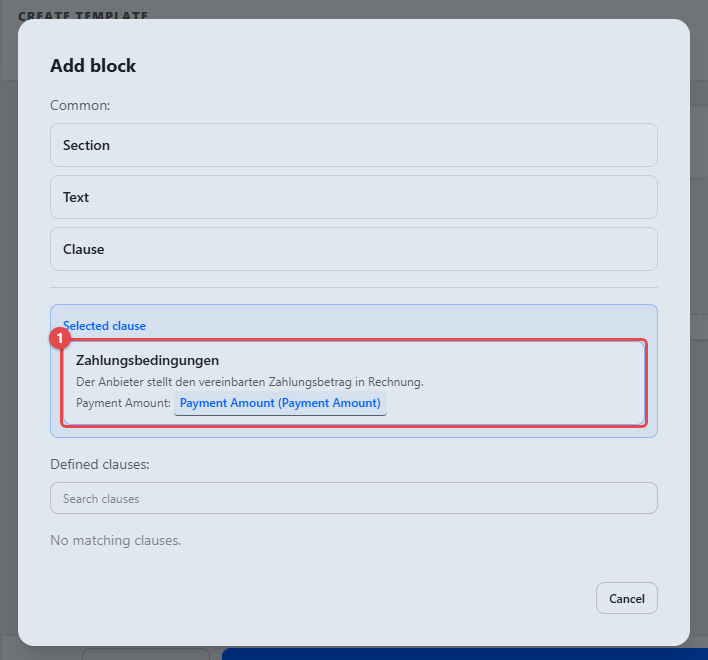

Der Dialog **Add block** bietet unter „Common" allgemeine Blocktypen
(**Section**, **Text**, **Clause**) und listet darunter unter „Selected
clause" die soeben erstellte Klausel. Ein Klick auf die Klausel **(1)**
übernimmt sie als Block in die Dokumentgliederung; über „Defined clauses"
finden Sie bereits vorhandene Klauseln per Suche.

## Semantische Datenobjekte (Reiter „Data")

Neben Klauseln und Platzhaltern kann eine Vorlage strukturierte
**Datenobjekte** mitführen — etwa eine juristische Person mit ihrer Anschrift.
Welche Objektarten zur Verfügung stehen, bestimmen die im Semantic Hub
hinterlegten Formbibliotheken; die Objekte werden gewählt und
zusammengeklickt, nie frei modelliert.

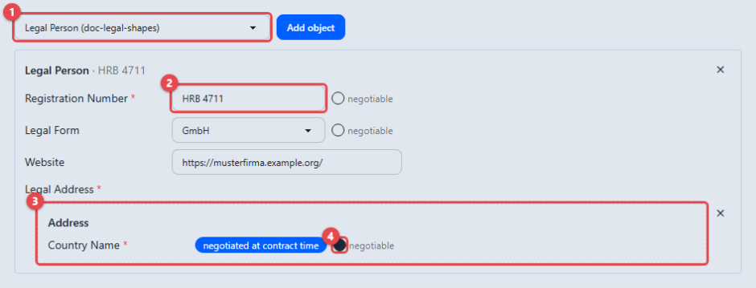

1. Wählen Sie in der Auswahl **(1)** eine Objektart aus der Bibliothek (z. B.
   eine juristische Person) und übernehmen Sie sie mit **Add object** in die
   Vorlage.
2. Das Objekt erscheint mit allen Feldern, die seine Form vorgibt. Feste Werte
   (z. B. eine Registernummer) **(2)** tragen Sie direkt ein — sie gelten dann
   unveränderlich für alle aus der Vorlage abgeleiteten Verträge. Felder mit
   fest vorgegebener Werteliste erscheinen als Auswahl, Felder für eine
   externe Adresse als Verweisfeld.
3. Verweist ein Feld auf ein weiteres Objekt (z. B. die Anschrift der Person),
   fügen Sie dieses über die zugehörige **Add …**-Schaltfläche als
   verschachteltes Objekt **(3)** hinzu und füllen es ebenso aus.
4. Mit dem Kontrollkästchen **negotiable** **(4)** kennzeichnen Sie ein Feld
   als verhandelbar: Sein Wert wird nicht in der Vorlage festgelegt, sondern
   erst im abgeleiteten Vertrag ausgefüllt — dort erscheint das Feld als
   Eingabefeld im Vertragsinhalt und wird wie die übrigen Vertragsfelder
   behandelt.

Sind im Semantic Hub keine Formbibliotheken über die Dokumenthülle hinaus
registriert, weist der Reiter darauf hin: „No shape libraries are registered
in the Semantic Hub beyond the document envelope …". Die Bibliotheken pflegt
der Template Manager (siehe [Vorlagen verwalten](template-manager.md)).

## Eine Vertragsvorlage aus Komponenten zusammensetzen

Legen Sie eine neue Vorlage vom Typ **Contract** an, erfassen Sie Name und
Beschreibung und wechseln Sie in den Reiter **Builder**. Über **Add block**
fügen Sie Inhalte hinzu.

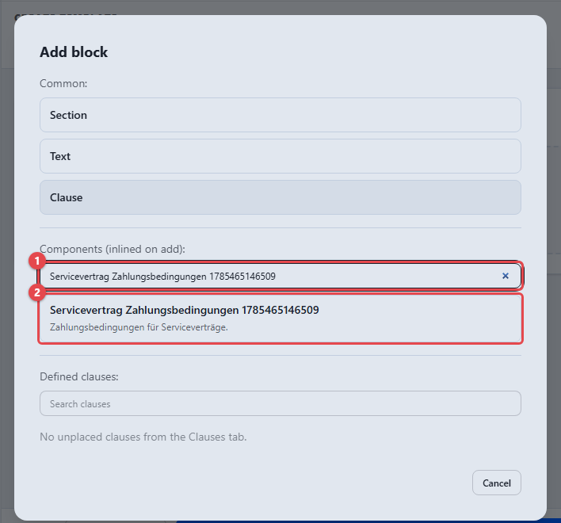

1. Suchen Sie im Dialog unter „Components (inlined on add)" über das Suchfeld
   **(1)** die gewünschte, bereits freigegebene Komponente.
2. Ein Klick auf die Komponente **(2)** übernimmt ihre Blöcke, Platzhalter und
   Regeln vollständig in die Vertragsvorlage. Daneben stehen einfache
   Blocktypen (z. B. **Text**) für eigene Abschnitte zur Verfügung; ein
   Textblock wird im Dialog mit **Confirm** übernommen.

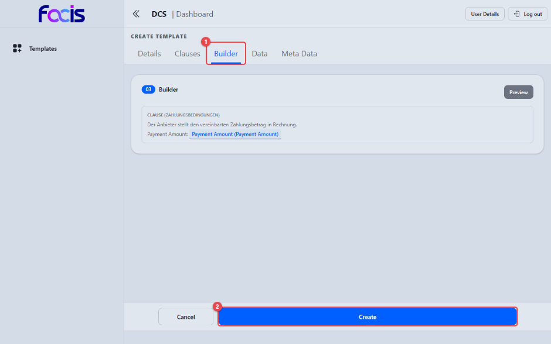

Der Reiter **Builder** **(1)** zeigt die Gliederung des Dokuments mit allen
aufgenommenen Blöcken — je Klausel Titel, Text und die enthaltenen
Platzhalter. Über **Preview** kontrollieren Sie das spätere Erscheinungsbild.
**Create** **(2)** legt die Vorlage an; **Cancel** verwirft sie. Schlägt das
Anlegen fehl, erscheint eine rote Fehlermeldung; Ihre Eingaben bleiben
erhalten.

## Entwurf einreichen

Öffnen Sie die Vorlage über **View** in der Übersicht.

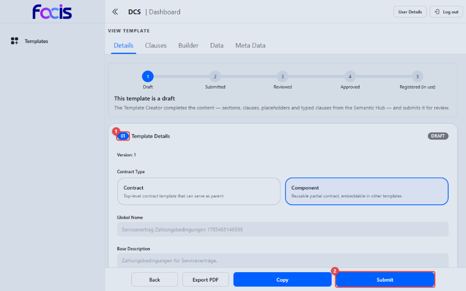

Die Detailansicht zeigt eine Fortschrittsleiste über die Stationen Draft →
Submitted → Reviewed → Approved → Registered (in use), darunter den Hinweis
„This template is a draft" mit einer Erläuterung des nächsten Schritts. Die
Abschnitte der Vorlage sind durchnummeriert — **01 Template Details** **(1)**
ist der erste; rechts daneben steht das Statusabzeichen **DRAFT**.

Mit **Submit** **(2)** reichen Sie den Entwurf zur Prüfung ein; die Vorlage
wechselt nach SUBMITTED und erscheint beim Template Reviewer unter **Review
Tasks**. Ab diesem Zeitpunkt ist sie für Sie nicht mehr bearbeitbar, solange
die Prüfung läuft. Über **Export PDF** erzeugen Sie jederzeit eine PDF-Fassung
des aktuellen Stands.

Solange eine Vorlage im Status DRAFT ist, können Sie sie über **Edit** weiter
bearbeiten und mit **Update** speichern — der Status bleibt dabei unverändert.
**Copy** legt eine Kopie der Vorlage als neuen Entwurf an, wenn Sie eine
Variante brauchen, statt die vorhandene zu verändern.
