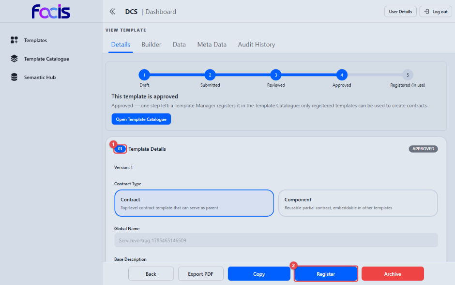
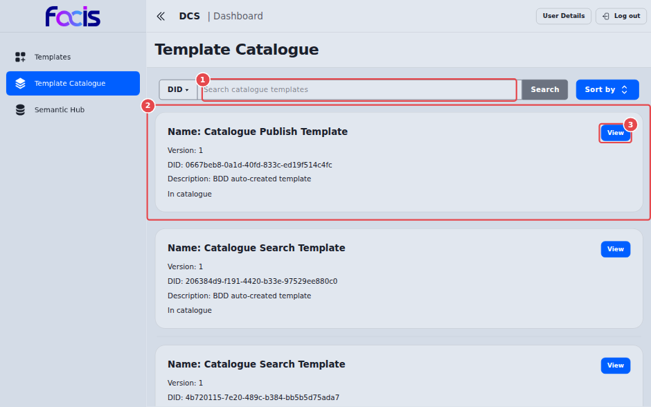
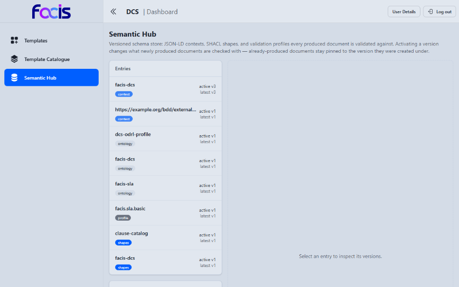
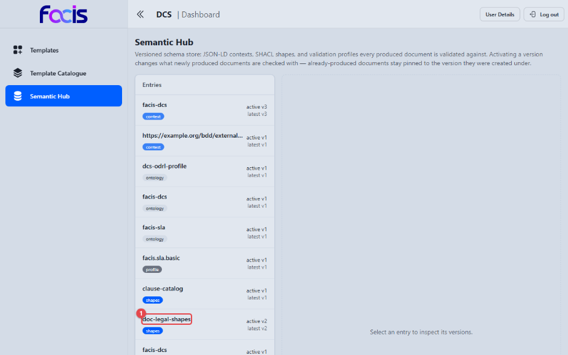

# Vorlagen verwalten (Template Manager)

Als Template Manager machen Sie freigegebene Vorlagen produktiv nutzbar: Sie
registrieren sie im Vorlagenkatalog, behalten den Katalog im Blick und pflegen
über den Semantic Hub den zentralen Fachwortschatz, auf dem alle Vorlagen
aufbauen.

**Voraussetzungen:** Sie sind mit der Rolle Template Manager angemeldet. In
der Seitennavigation sehen Sie **Templates**, **Template Catalogue** und
**Semantic Hub**.

## Eine freigegebene Vorlage registrieren

Öffnen Sie die Vorlage über **Templates** → **View**.

Die Fortschrittsleiste steht auf **Approved**. Die Überschrift darunter lautet
„This template is approved", und der Erläuterungstext nennt den verbleibenden
Schritt: Ein Template Manager registriert die Vorlage im Template Catalogue,
und nur registrierte Vorlagen lassen sich für Verträge verwenden. Der erste
Abschnitt der Vorlage **(1)** trägt rechts das Statusabzeichen **APPROVED**.

Mit **Register** **(2)** veröffentlichen Sie die Vorlage im Vorlagenkatalog;
ein Bestätigungsdialog fragt vor der Ausführung nach („Proceed with
registration?"), den Sie mit **Confirm** abschließen. Daneben stehen **Copy**
(die Vorlage als neuen Entwurf kopieren), **Archive** (die Vorlage aus dem
aktiven Bestand nehmen), **Export PDF** und **Back**. Als Template Manager
sehen Sie zusätzlich den Reiter **Audit History** mit der protokollierten
Geschichte der Vorlage.

Nach der Registrierung trägt die Vorlage den Status REGISTERED (in use) und
kann von Contract Creators als Grundlage neuer Verträge gewählt werden. Erst
ab diesem Zeitpunkt erscheint sie in deren Vorlagenauswahl.

**Register** steht nur bei Vorlagen vom Typ Contract zur Verfügung. Eine
Komponente wird nicht registriert; sie gelangt über die Vertragsvorlage in
Gebrauch, die sie einbettet.

An einer registrierten Vorlage tritt die Schaltfläche **Publish** hinzu. Sie
stellt die Vorlage in den Verbundkatalog, sodass andere Organisationen sie
finden können; auch hier bestätigen Sie mit **Confirm**.

## Vorlagenkatalog

Der Bereich **Template Catalogue** listet die im Verbundkatalog
veröffentlichten Vorlagen.

Über das Suchfeld **(1)** finden Sie eine Vorlage; der Umschalter davor
stellt zwischen der Suche nach **DID** und nach **Name** um, **Sort by**
ändert die Sortierung. Jeder Eintrag **(2)** nennt Name, Version, Kennung und
Beschreibung. Die letzte Zeile eines Eintrags sagt, woher die Vorlage stammt:
**In catalogue** bedeutet, dass sie im Verbundkatalog liegt, aber nicht in
Ihrem eigenen Bestand; **In local repository** bedeutet, dass sie Ihnen
bereits vorliegt.

**View** **(3)** öffnet die Detailansicht mit den Reitern **Details**, **Meta
Data** und **Preview**. Unter **Preview** lesen Sie das Dokument der
Katalogfassung, bevor Sie sie übernehmen. **Register** übernimmt eine fremde
Vorlage in Ihren eigenen Bestand; nach der Bestätigung mit **Confirm** legt
der DCS daraus eine lokale Vorlage an, die eine eigene Kennung erhält.

Ist in Ihrer Installation kein Verbundkatalog eingerichtet, bleibt der Bereich
leer, und Veröffentlichen wie Katalogsuche stehen nicht zur Verfügung. Ob und
wie ein Katalog betrieben wird, entscheidet der Betreiber Ihrer Installation.
Weist der Katalog den Abruf ab, erscheint statt der Liste eine Fehlermeldung;
wenden Sie sich dann an den Betrieb.

## Semantic Hub: Fachwortschatz pflegen

Der Semantic Hub ist das zentrale Verzeichnis der Fachbegriffe, Regelwerke und
Prüfschemata, aus denen der Klausel-Editor seine Auswahllisten bezieht: von
den Länderlisten räumlicher Bedingungen bis zu den Formbibliotheken für
semantische Datenobjekte. Neue Einträge lassen sich im laufenden Betrieb
veröffentlichen, ohne Softwareänderung.

Links unter **Entries** listet die Ansicht die registrierten Einträge mit
ihrer Art (**context**, **ontology**, **shapes**, **profile**) und ihrem
Versionsstand, etwa „active v1" und „latest v1"; ohne freigeschaltete Version
steht dort „no active version". Ein Klick auf einen Eintrag zeigt rechts seine
Versionen. Solange nichts gewählt ist, steht dort „Select an entry to inspect
its versions."

Unterhalb der Liste veröffentlichen Sie unter **Publish new entry** neue
Einträge:

1. Vergeben Sie unter **Name** einen eindeutigen Namen.
2. Wählen Sie unter **Kind** die Art des Eintrags (z. B. **shapes** für eine
   Formbibliothek, aus der Template Creators Datenobjekte zusammenklicken).
3. Bringen Sie den Inhalt ein. Der Reiter **Paste / upload** nimmt ihn im
   Feld **Content** direkt entgegen; über **Upload file** daneben laden Sie
   stattdessen eine Datei. Der Reiter **From URL** holt den Inhalt unter
   **Source URL** von einer Adresse und legt ihn als Version ab.
4. Unter **Version (optional)** tragen Sie eine feste Versionsnummer ein,
   wenn Sie eine anderswo veröffentlichte Bibliothek genau in der Version
   installieren, auf die deren Vorlagen verweisen. Ohne Angabe entsteht die
   nächste Version.
5. **Activate immediately** legt fest, ob die neue Version sofort aktiv wird.
6. **Publish entry** veröffentlicht den Eintrag.

Der neue Eintrag **(1)** erscheint anschließend in der Liste mit dem Vermerk
**active** und steht ab sofort systemweit zur Verfügung. Im Beispiel ist es
eine Formbibliothek, aus der Template Creators im Reiter **Data**
Datenobjekte zusammenklicken können. Eine bereits veröffentlichte Version
bleibt erhalten; ein erneutes Veröffentlichen legt eine weitere Version an.
Bereits erzeugte Dokumente bleiben an die Version gebunden, unter der sie
entstanden sind.
