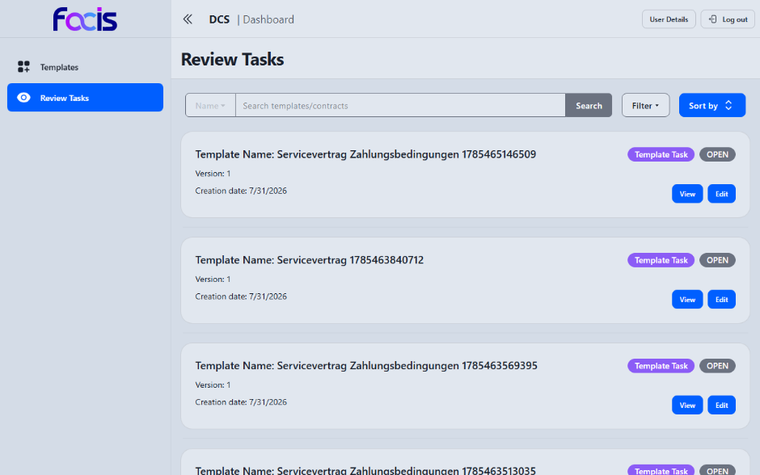
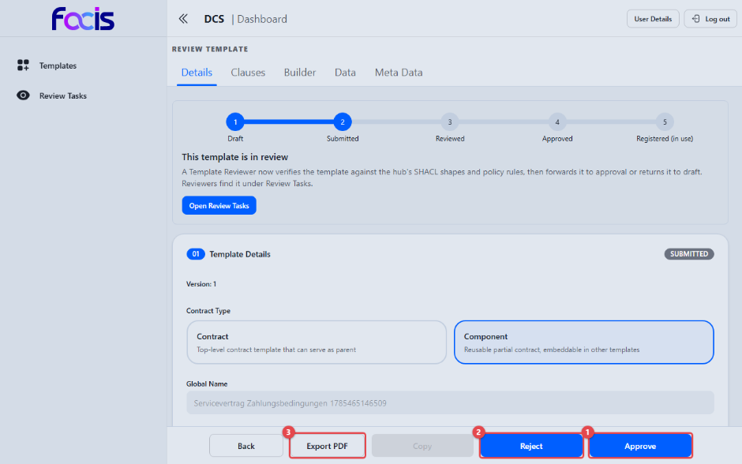
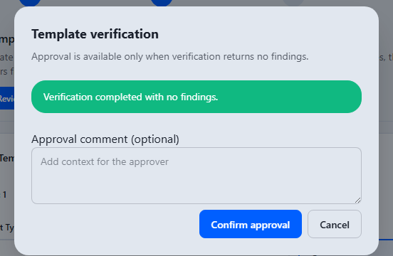

# Vorlagen prüfen (Template Reviewer)

Als Template Reviewer prüfen Sie eingereichte Vorlagen fachlich und formal,
bevor sie zur Freigabe weitergehen. Die fachliche Verifikation gegen die
hinterlegten Regelwerke führt das System dabei zwingend selbst aus;
überspringen lässt sie sich nicht.

**Voraussetzungen:** Sie sind mit der Rolle Template Reviewer angemeldet. In
der Seitennavigation sehen Sie **Templates** und **Review Tasks**.

## Offene Prüfaufgaben finden

Öffnen Sie **Review Tasks** in der Seitennavigation.

Die Liste zeigt alle offenen Prüfaufgaben mit Vorlagenname, Version und
Erstellungsdatum. Rechts kennzeichnet ein Abzeichen die Art der Aufgabe
(**Template Task**) und daneben ihr Zustand (**OPEN**). Dieselbe Liste führt
für einen Contract Reviewer auch die Vertragsaufgaben. Über Suchfeld,
**Filter** und **Sort by** grenzen Sie die Liste ein. **View** öffnet die
Prüfansicht.

## Eine Vorlage prüfen

Die Prüfansicht **Review Template** zeigt die Vorlage vollständig und
schreibgeschützt: die Reiter **Details**, **Clauses**, **Builder** und **Meta
Data**, die Fortschrittsleiste mit dem aktuellen Status **SUBMITTED** und
einen Hinweis auf den nächsten Schritt.

1. **Approve** **(1)** startet die Prüfung und leitet die Vorlage nach
   erfolgreicher Verifikation an den Template Approver weiter.
2. **Reject** **(2)** weist die Vorlage zurück; sie geht zur Überarbeitung an
   den Template Creator.
3. **Export PDF** **(3)** erzeugt eine PDF-Fassung des Prüfstands. Daneben
   stehen **Back** (zurück zur Aufgabenliste) und **Copy** (eine Kopie der
   Vorlage als neuer Entwurf; für eine in Prüfung befindliche Vorlage
   gesperrt).

Eine eigene Schaltfläche zum Verifizieren gibt es nicht. Die Verifikation ist
Teil von **Approve** und wird bei jedem Freigabeversuch genau einmal
ausgeführt.

## Das Verifikationsergebnis

Nach **Approve** öffnet sich der Dialog **Template verification**. Sein
Untertitel nennt die Bedingung: „Approval is available only when verification
returns no findings."

- **Keine Beanstandungen:** Ein grüner Balken meldet „Verification completed
  with no findings.". Unter **Approval comment
  (optional)** können Sie einen Kommentar für die freigebende Person
  hinterlassen; **Confirm approval** löst die Weiterleitung aus.
- **Beanstandungen gefunden:** Der Dialog listet jede gefundene Abweichung
  auf (z. B. „Missing semantic classification") und fordert dazu auf, sie vor
  einer erneuten Freigabe zu beheben. Eine Bestätigungsschaltfläche erscheint
  dann nicht. Schließen Sie den Dialog, lassen Sie die Vorlage überarbeiten
  und starten Sie die Freigabe erneut.
- **Verifikation technisch fehlgeschlagen:** Der Dialog meldet
  „Verification could not be completed. Retry the verification before
  approving." und bietet **Retry** an. Die Vorlage wurde nicht weitergeleitet.

**Cancel** und die Escape-Taste schließen den Dialog, ohne etwas zu
übermitteln; die Schreibmarke kehrt anschließend auf **Approve** zurück.

## Eine Vorlage zurückweisen

**Reject** öffnet den Dialog **Confirmation** mit der Frage „Add comment?".
Der Kommentar ist freiwillig und wird mit der Rückgabe dauerhaft im
Prüfprotokoll der Vorlage festgehalten. **Submit** führt die Rückgabe aus,
**Cancel** bricht ab. Die Vorlage trägt danach den Status **REJECTED** und
kann vom Template Creator erneut eingereicht werden.

Nach der Weiterleitung wechselt die Vorlage in den Status REVIEWED und
erscheint beim Template Approver unter **Approval Tasks**.
